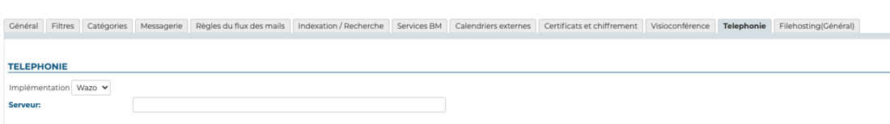

# Configuration du plugin Wazo


## Présentation

Le présent document présente l'installation et la configuration des plugins BlueMind permettant une interconnexion avec le produit Wazo.


## Procedure

1. Installer les paquets:
**Debian/Ubuntu**

```
 aptitude install bm-plugin-core-cti-wazo
```

Redémarrer BlueMind 

2. 

```
# bmctl restart
```


## Configuration dans BlueMind

### Configuration du domaine

Toujours connecté en tant qu'administrateur global admin0 :

- Aller dans Gestion du système > Domaines supervisés
- Sélectionner le domaine à configurer pour utiliser Wazo
- Dans l'onglet «Téléphonie», modifier le serveur Wazo :

- Enregistrer la configuration.


## Utilisation et intégration

Pour en savoir plus sur l'utilisation et l'intégration de la téléphonie au sein de BlueMind, consultez les pages dédiées du guide de l'utilisateur :

- [La téléphonie](/Guide_de_l_utilisateur/La_téléphonie/)
- [Instant Messaging](https://forge.bluemind.net/confluence/display/LATEST/La+messagerie+instantanee)


Une page détaillée décrit la configuration et l'admnistration du plugin Wazo : [Documentation Wazo](/Base_de_connaissance/Documentation_Wazo/)


