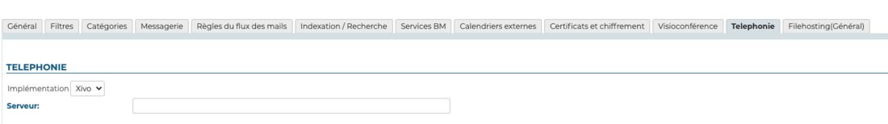

# Configuration du plugin Xivo/Avencall


## Présentation

Le présent document présente l'installation et la configuration des plugins BlueMind permettant une interconnexion avec le produit XiVO d'Avencall.


## Configuration de Xivo

- créer un utilisateur *Xuc* dans *Services -> IPBX -> Users*
- lui activer le Xivo client et renseigner :
    - login : *xuc*
    - password : *0000*
- créer un *Web Services user* dans *Configuration > Web Services Access* avec les paramètres suivants :

    - Login : *xivows*
    - Password : *xivows*
    - Host : *vide*
- S'assurer que *Multiqueues call stats sharing *est activé dans *Services > Ipbx > Advanced configuration* > *Queues*


## Installation du plugin Xivo pour BlueMind

### Prérequis

Le service XUC doit être installé côté Avencall et joignable sur le port 8090.

Créer le fichier `/etc/xuc/xuc.conf` :


```
XivoWs {
    enabled=true
}
 
api {
    eventUrl = "http://<bluemind.srv.ip:9091/xivo/1.0/event/domain.tld/dropbox/"
}
 
xucami {
    enabled = false
}
```


### Procédure

1. Installer les paquets nécessaires :
**Debian/Ubuntu**

```
 aptitude install bm-plugin-core-cti-xivo bm-xivobridge bm-plugin-core-cti bm-plugin-webserver-cti
```

**RedHat/CentOS**

```
yum install bm-plugin-core-cti-xivo bm-xivobridge bm-plugin-core-cti bm-plugin-webserver-cti
```


:::info

Dans le cas d'une installation répartie sur plusieurs serveurs, le paquet `bm-plugin-webserver-cti` devra être installé sur le serveur hébergeant le service `bm-webserver`

:::

2. Redémarrer BlueMind après l'installation :


```
# bmctl restart
```


3. Créer le fichier `/etc/bm/xivo.ini` et indiquer les informations suivantes :


```
xuc.host=<xuc\_host>:8090
```

*NB : Le port par défaut de XUC est le 8090 mais il se peut que d'anciennes versions du serveur XUC écoutent sur le port 9000*


## Configuration dans BlueMind

### Configuration du domaine

Toujours connecté en tant qu'administrateur global admin0 :

- Aller dans Gestion du système > Domaines supervisés
- Sélectionner le domaine à configurer pour utiliser Xivo
- Dans l'onglet «Téléphonie», modifier le serveur Xivo :

- Enregistrer la configuration.


## Test de fonctionnement

On peut tester le bon fonctionnement en simulant un événement XIVO via CURL :


```
curl -X POST -H 'Content-Type: application/json' http://#BLUEMIND:9091/xivo/1.0/event/#DOMAIN/dropbox/ -d '{"username":"#LOGIN","status":#STATUS}'
```


avec :

- #BLUEMIND : url BlueMind
- #DOMAIN : le domaine concerné (par exemple blue-mind.net)
- #LOGIN : login de l'utilisateur (sans le domaine)
- #STATUS : le statut téléphonique


Les statuts supportés sont :

- 0 : disponible (vert)
- 2 : au téléphone (rouge)
- 8 : le téléphone sonne (rouge clignotant)


## Utilisation et intégration

Pour en savoir plus sur l'utilisation et l'intégration de la téléphonie au sein de BlueMind, consultez les pages dédiées du guide de l'utilisateur :

- [La téléphonie](/Guide_de_l_utilisateur/La_téléphonie/)
- [La messagerie instantanée](/Guide_de_l_utilisateur/La_messagerie_instantanée/)


