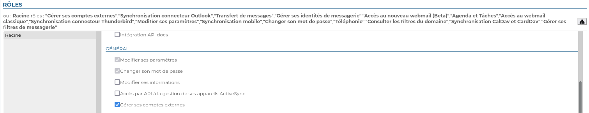
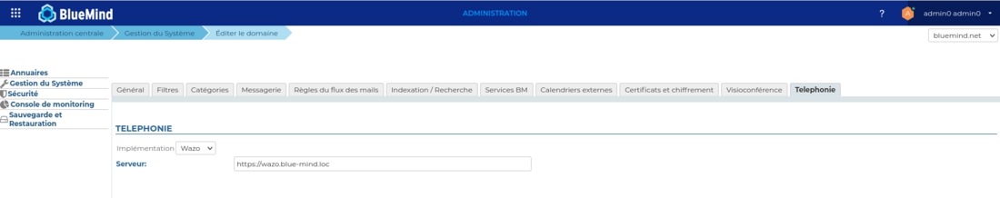
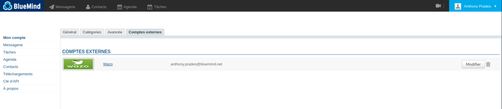
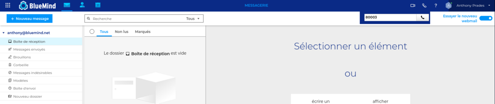
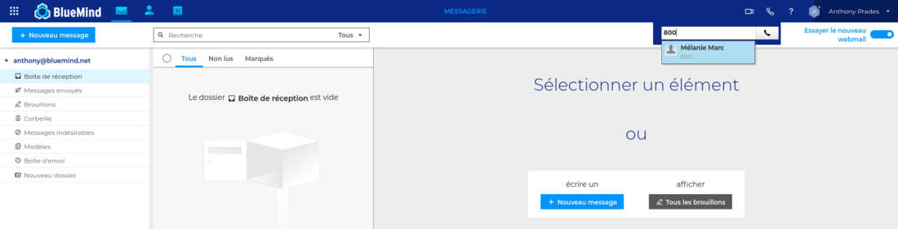
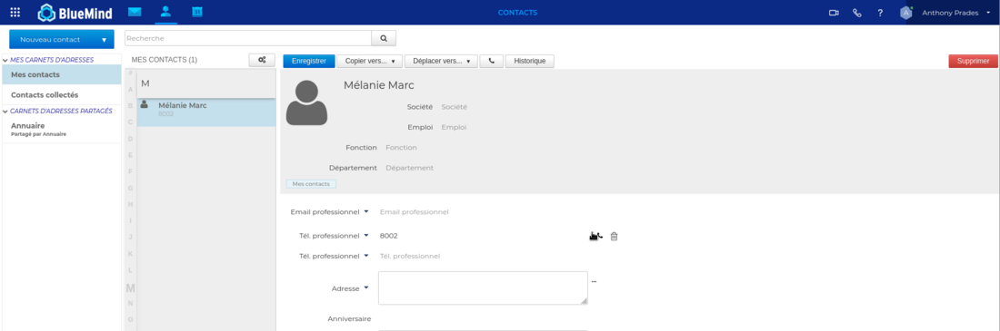

# Documentation Wazo


## Prérequis

Installation du plugin wazo : [Configuration du plugin Wazo](/Base_de_connaissance/Configuration_du_plugin_Wazo/)


## Administration

### Configuration utilisateur

- Se connecter à BlueMind en tant qu'administrateur système admin0
- Se rendre sur la page Annuaires > Entrées d'Annuaire
- Sélectionner l'utilisateur à paramétrer
- Cocher le rôle "Gérer ses comptes externes", dans l'onglet "Général"
- Enregistrer les modifications





### Configuration de domaine

- Se connecter à BlueMind en tant qu'administrateur système admin0
- Se rendre sur la page Gestion du Système > Domaines supervisés
- Sélectionner le domaine à paramétrer
- Cliquer sur l'onglet "Téléphonie"
- Sélectionner l'implémentation à utiliser, ici Wazo
- Saisir l'adresse https du serveur Wazo
- Enregistrer les modifications




### Configuration des utilisateurs

Une commande bm-cli permet de faire une correspondance entre les utilisateurs BlueMind et ceux de Wazo, et de créér les comptes externes dans Bluemind associés à des utilisateurs existants.


```
# bm-cli wazo populate [-s] -d=<domain> -u=<userLogin>
```


- -d : le nom de domaine bluemind
- -u : le login d'un utilisateur BlueMind possédant un compte externe Wazo (compte Admin Wazo nécessaire), celui ci devra être configuré manuellement au préalable (cf:  Utilisateur/Configurer un compte externe)


### Utilisateur

#### Configurer un compte externe

- Se connecter à BlueMind en tant qu'utilisateur à paramétrer
- Se rendre sur la page Mon compte > Comptes externes
- Configurer un compte externe
- Saisir l'email et le mot de passe utilisés dans Wazo, et valider
- Enregistrer les modifications




#### Passer un appel à partir du webmail

Cliquer sur l'icone de téléphonie et saisir un numéro de téléphone d'un utilisateur à contacter.




Si le numéro de l'utilisateur est renseigné dans sa fiche contact, l'auto-complétion permet de le retrouver



#### Passer un appel à partir d'un contact

- Se rendre sur la fiche du contact
- Cliquer sur l'icone de téléphonie à coté du numéro de téléphone de l'utilisateur à contacter.





