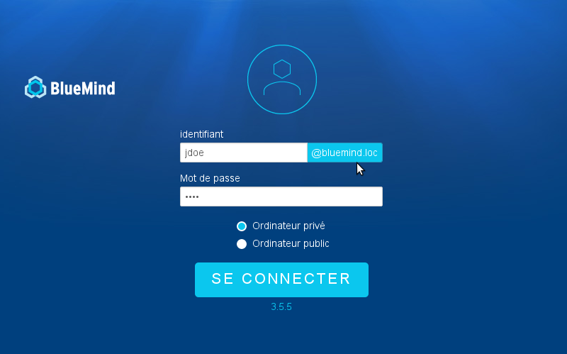

# Identifiant de connexion simplifié


# Présentation

Afin de permettre aux utilisateurs de saisir simplement leur nom d'utilisateur, sans la partie domaine, lors de la connexion à BlueMind (par exemple "jdoe" au lieu de "jdoe@bluemind.loc") il suffit de configurer un domaine par défaut sur le serveur.
:::important

Autres domaines

Lorsque cette configuration est en place, il est toujours possible de se connecter sur un autre domaine. Il faut alors indiquer le domaine complet (exemple : jdoe@yellowmind.loc).

:::

# Mise en œuvre

- 
éditer le fichier `/etc/bm/bm.ini` et rajouter à la fin la ligne suivante :


```
default-domain=bluemind.loc
```


*NB : remplacer bluemind.loc** par le nom du domaine concerné*

- 
redémarrer le service bm-hps :


```
service bm-hps restart
```


La page d'identification se présente alors ainsi :

Enregistrer

Enregistrer

Enregistrer

