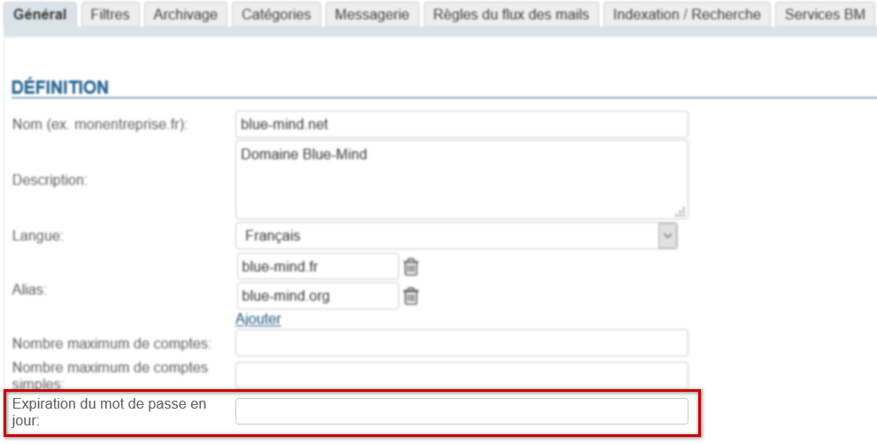
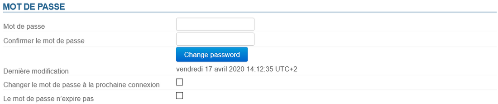

# Mettre en place une politique d'expiration des mots de passe

:::important

Connexion avec un AD ou LDAP

La politique d'expiration ne sera pas appliquée aux utilisateurs importés d'un annuaire AD ou LDAP.

:::

# Politique globale

L'administrateur peut mettre en place une politique de gestion automatique de l'expiration des mots de passe pour un domaine : tous les utilisateurs devront modifier leur mot de passe à une fréquence donnée.

Cette politique se paramètre depuis la console d'administration au niveau du domaine : Gestion du système > Domaines supervisés > choisir votre domaine > onglet Général

- Remplir le nombre de jours souhaité et cliquer sur le bouton "Enregistrer" en bas de page.

Les utilisateurs se verront dès lors contraints de changer leur mot de passe :

- ** **Après le délai indiqué selon la date de dernier changement, si celle-ci est connue.****Par exemple si l'administrateur saisit 100 jours et que l'utilisateur a changé son mot de passe 75 jours auparavant, il devra le changer dans 25 jours.
- ** **Dès sa prochaine connexion si aucune date de dernière modification n'est connue.****Cela peut être le cas si l'utilisateur a été créé avant le passage en 3.5.14 et qu'il n'a jamais modifié son mot de passe.

# Gestion individuelle

Qu'une politique globale soit définie ou non, les administrateurs ont la possibilité de forcer l'expiration du mot de passe d'un utilisateur, par exemple lorsque l'on soupçonne que celui-ci a été corrompu.

L'administrateur peut aussi exclure l'utilisateur de la politique globale définie.

Dans les deux cas, l'administrateur doit se rendre dans la [fiche d'administration de l'utilisateur](/Guide_de_l_administrateur/Gestion_des_entités/Utilisateurs/) dans la console d'administration : Annuaires > Entrées d'annuaires > sélectionner l'utilisateur > onglet Maintenance :

- Cocher la case "**Changer le mot de passe à la prochaine connexion**" et cliquer sur "Enregistrer" en bas de page pour faire expirer le mot de passe et forcer l'utilisateur à le changer.
- Cocher la case "**Le mot de passe n'expire pas**" pour exclure l'utilisateur de la politique globale d'expiration du domaine.

# Effets pour les utilisateurs

Que le mot de passe ait expiré suite à la politique globale ou par un forçage de la part d'un administrateur, la demande de modification pour les utilisateurs intervient de la même façon : lorsque l'utilisateur essaie de se connecter avec son ancien mot de passe, le formulaire suivant lui est présenté :

Une fois ce formulaire rempli et validé, l'utilisateur est alors redirigé vers la page de connexion de BlueMind et il peut dès lors se connecter avec le nouveau mot de passe.

