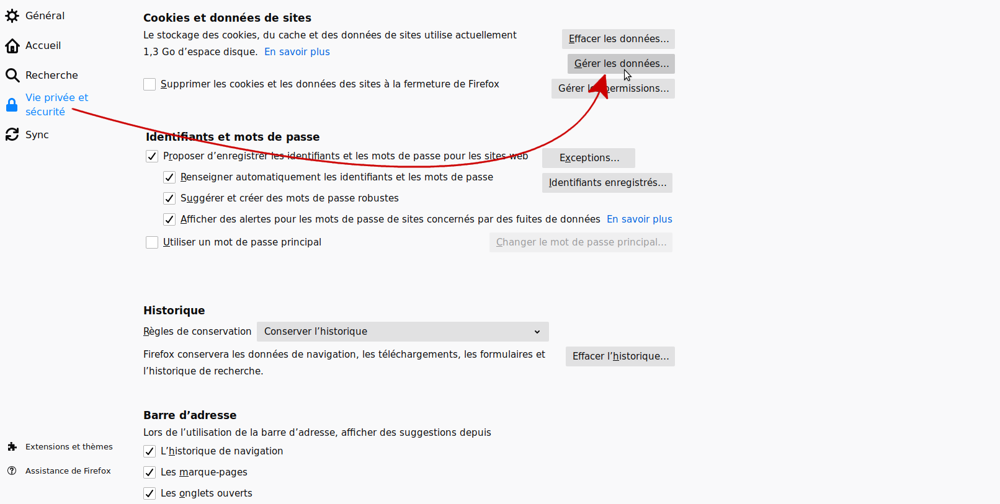
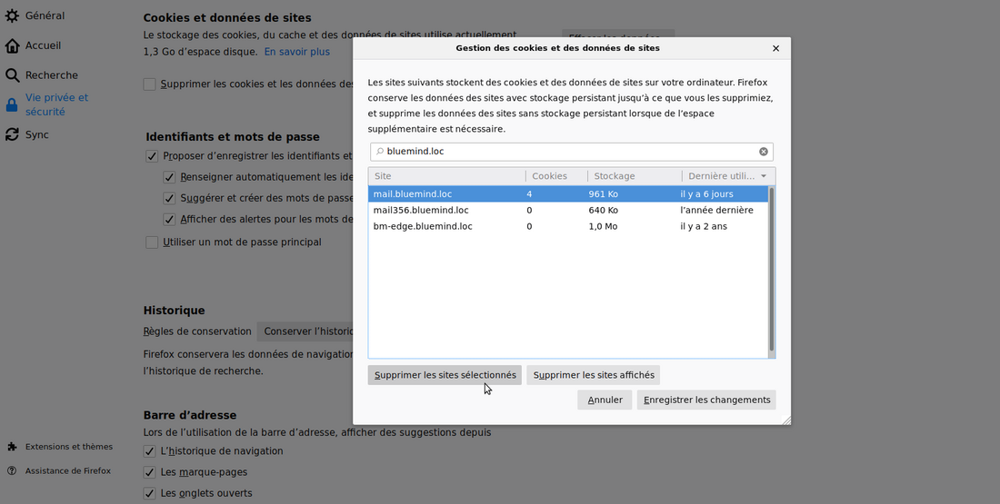
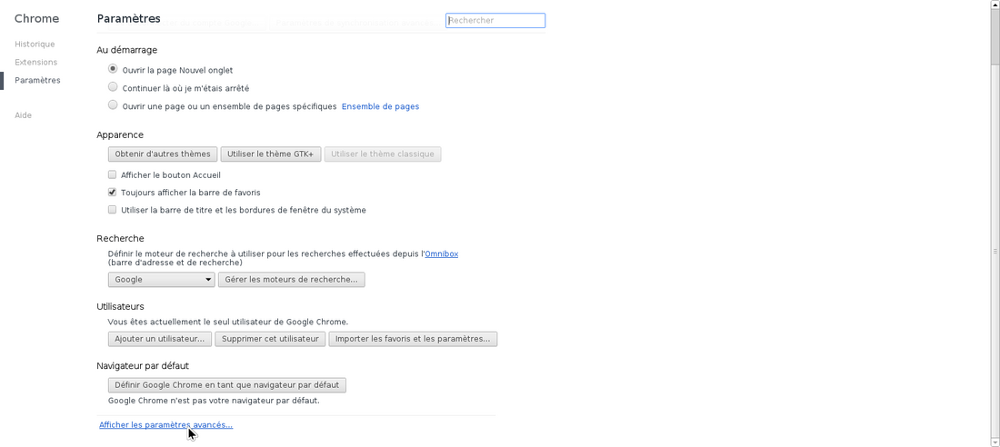
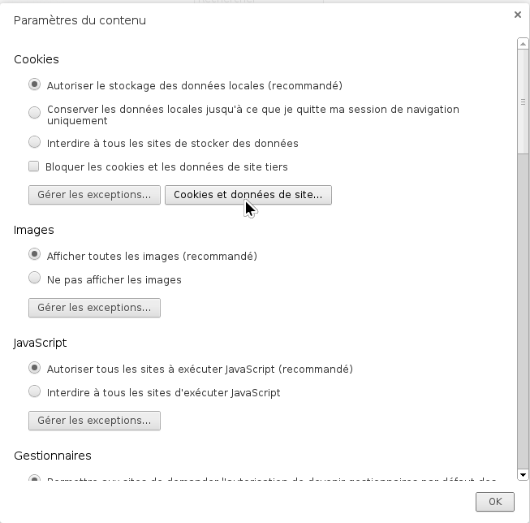
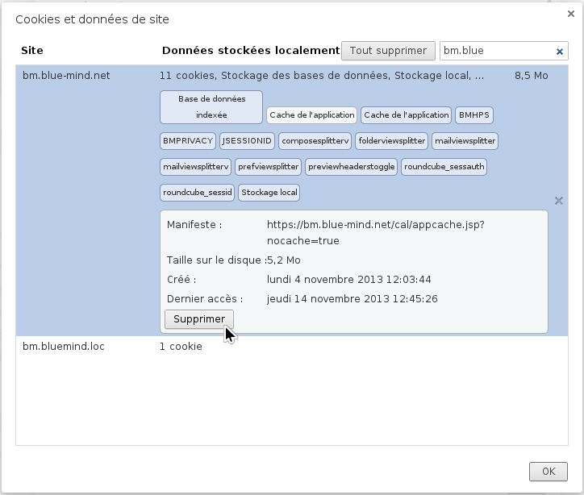
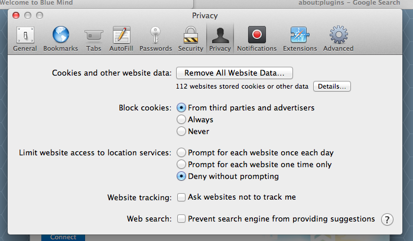
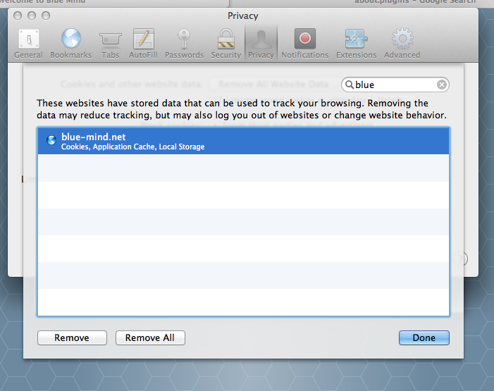
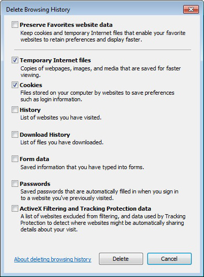

# Nettoyage du cache du navigateur client

:::important

Cette opération est à réaliser dans le navigateur de l'utilisateur.

Elle peut donc être réalisée par l'utilisateur lui-même.

:::

# Présentation

Les applications clientes BlueMind telles que l'application de calendrier, de contact, sont enregistrées dans le cache du navigateur client pour permettre le lancement de l'application dans un mode *offline*.

Cette opération est réalisée par la fonctionnalité *appcache HTML* si présente dans le navigateur web. Ce cache est automatiquement rafraîchi, mais il peut éventuellement être corrompu par le navigateur et il peut être important de pouvoir nettoyer ce cache pour le forcer à télécharger une version récente des applications.

# Mozilla Firefox

- Aller dans les préférences de Firefox :
  - sous Windows : Outils > Options
  - sous Linux : Édition > Préférences
  - sous Mac OS : Firefox > Préférences
- Aller dans la section "Vie privée et Sécurité" et faire défiler jusqu'à "Cookies et données de sites"
- Cliquer sur le bouton "Gérer les données" : 
- Rechercher et sélectionner le site souhaité et cliquer sur le bouton "Supprimer les sites sélectionnés" : 

# Google Chrome

- Aller dans les paramètres de Google Chrome
- Cliquer sur *Afficher les paramètres avancés*

*   *

- Dans la section *Confidentialité*, cliquer sur le bouton *Paramètres de contenu... *
- Cliquer sur le bouton *Cookies et données de site... * *  * *  *
- Sélectionner l'URL du serveur BlueMind dans la colonne *Site*
- Cliquer sur chaque étiquette *Cache de l'application*, puis sur le bouton * *Supprimer * *
*  *

# Apple Safari

- Accéder aux préférences de Safari en naviguant dans le menu *Safari > Préférences*
- Cliquer sur la section * *Vie privée * *

- Cliquer sur le bouton *Détails*
- Sélectionner le domaine BlueMind du serveur concerné dans la liste et cliquer sur le bouton * *Supprimer * *
*  *

# Microsoft Internet Explorer

Uniquement disponible à partir de Microsoft IE 10.

- Naviguer dans le menu *Outils > Sécurité > Supprimer l'historique de navigation* (ou effectuer la combinaison de touches *Ctrl + Shift + Del*)

- Cocher les cases *Fichiers temporaires* et *Cookies*
- Cliquer sur le bouton *Supprimer*

