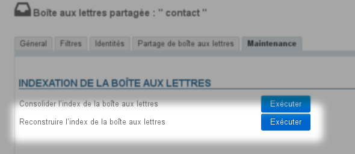

# Restauration manuelle d'une boîte utilisateur ou partagée


# Présentation

Cette page vous guide afin de restaurer le contenu d'une boîte de messagerie (d'utilisateur ou partagée) à partir d'un répertoire de sauvegarde.

La [Restauration unitaire DataProtect](/Guide_de_l_administrateur/Sauvegarde_et_restauration/Restauration_unitaire_Navigation_DataProtect/) est à privilégier, ou encore [la restauration par script](/Base_de_connaissance/Restauration_du_contenu_d_une_boîte_utilisateur_ou_partagée/), le présent guide n'est à utiliser que dans des cas particuliers où celles-ci échouent.


# Notions

Afin de restaurer correctement la boite de messagerie souhaitée, il va falloir reconstruire les arborescences des *data* et *metadata* qui se trouvent respectivement aux emplacements suivants :

- `/var/spool/cyrus/data/`
- `/var/spool/cyrus/meta/`


Par exemple sur le domaine `bluemind.loc` on a :

- `/var/spool/cyrus/**data**/bluemind_loc/domain/b/bluemind.loc/`
- `/var/spool/cyrus/**meta**/bluemind_loc/domain/b/bluemind.loc/`


Les données de sauvegarde se trouvent dans des sous-répertoires correspondant, dans le répertoire `/var/backups/`.

Le *spool* de la sauvegarde correspondante est alors le suivant (ici pour la 1234ème sauvegarde) :

- `/var/backups/bluemind/dp_spool/rsync/192.168.122.56/mail/imap/1234/var/spool/cyrus/**data**/bluemind_loc/domain/b/bluemind.loc/`
- `/var/backups/bluemind/dp_spool/rsync/192.168.122.56/mail/imap/1234/var/spool/cyrus/**meta**/bluemind_loc/domain/b/bluemind.loc/`


# Restauration d'un utilisateur

## Données utilisateurs

Les données (mails) d'un utilisateur sont stockées sur le serveur dans le répertoire `/var/spool/cyrus/**data**/domain_loc/[...]/[n]/user/nom_user/` (où [n] est la 1ère lettre du login, ici *n*om_user)

Les méta-données sont stockées sur le serveur dans le répertoire `/var/spool/cyrus/**meta**/domain_loc/[...]/[n]/user/nom_user/`. Il s'agit des données relatives aux mails : statut de lecture, drapeaux, indicateur de réponse ou transfert, etc.

Autant que possible, il est préférable d'effectuer une sauvegarde des méta-données. Cependant, en l'absence de celle-ci, la restauration des messages reste possible, ils seront alors présents dans leur état d'origine : ils seront considérés comme non lus, non répondus, sans statut particulier.

## Pré-requis et données exemples

- le serveur sur lequel sont restaurées les données, s'il n'est pas le serveur d'origine, doit avoir les mêmes caractéristiques que celui-ci : même nom de domaine, même adresse IP, même url, même version de BlueMind, etc.
- **le nom d'utilisateur doit être identique à celui d'origine**


Pour la procédure, nous utiliserons l'utilisateur suivant :

- domaine `bluemind.loc`
- nom d'utilisateur `jdoe`


Les données :** **

- les données de messagerie (voir ci-dessus) sont déposées sur le serveur cible dans les répertoires suivants :
  - données : `/var/backups/jdoe/`
  - méta-données : `/var/backups/jdoe-meta/`
- la restauration de ses données se fera dans un sous-dossier de sa messagerie nommé `restore_dir` (ce nom est libre, on pourra par exemple utiliser la date du jour ou autre convention)


## Procédure
:::important

Dans les chemins de répertoires ou certaines lignes de commandes, le point '.' du nom de domaine est remplacé par un underscore '_'.

Veillez à bien effectuer ce remplacement lors de l'adaptation des commandes à votre domaine.

:::

### Cas de la restauration dans une autre boîte que celle de l'utilisateur

Pour restaurer les messages d'un utilisateur dans une autre boîte que celle d'origine, on pourra au choix :

- effectuer une restauration sans les méta-données (voir ci-dessous)
- effectuer une restauration avec les méta-données (voir ci-dessous) puis :
  - se connecter avec le login de l'utilisateur cible
  - se rendre dans la gestion des paramètres > Messagerie > onglet Gestion des partages > cliquer sur « Enregistrer »Il n'est pas ici nécessaire d'effectuer une modification, il faut juste forcer le ré-enregistrement des partages.


### Restauration avec les méta-données

Connecté au serveur en tant que `root` :

- se placer dans `/var/spool/cyrus/**data**/bluemind_loc/domain/b/bluemind.loc/j/user/jdoe/`
- 
copier les données a restaurer et donner les droits adéquats au répertoire ainsi créé :


```
mv /var/backups/jdoe/ restore\_dir
chown -R cyrus:mail restore\_dir
chmod -R u+rwx restore\_dir
```


- se placer dans ``/var/spool/cyrus/**meta**/bluemind_loc/domain/b/bluemind.loc/j/user/jdoe/`` 
- 
copier les méta-données a restaurer dans un sous répertoire qui porte le même nom que celui utilisé pour les données :


```
mv /var/backups/jdoe-meta/ restore\_dir
chown -R cyrus:mail restore\_dir
chmod -R u+rwx restore\_dir
```


- 
exécuter la commande cyrus de reconstruction de la boîte :


```
/usr/lib/cyrus/bin/reconstruct -r -f user/jdoe@bluemind.loc
```


### Restauration en l'absence des méta-données
:::important

Dans les chemins de répertoires ou certaines lignes de commandes, le point '.' du nom de domaine est remplacé par un underscore '_'.

Veillez à bien effectuer ce remplacement lors de l'adaptation des commandes à votre domaine.

:::

Connecté au serveur en tant que `root` :

- se placer dans `/var/spool/cyrus/**data**/bluemind_loc/domain/b/bluemind.loc/j/user/jdoe/`
- 
copier les données a restaurer et donner les droits adéquats au répertoire ainsi créé :


```
mv /var/backups/jdoe/ restore\_dir
chown -R cyrus:mail restore\_dir
chmod -R u+rwx restore\_dir
```


- 
reproduire l'arborescence pour les méta-données :


```
find restore\_dir/ -type d -exec mkdir /var/spool/cyrus/meta/bluemind\_loc/domain/b/bluemind.loc/j/user/jdoe/{} \;
```


- 
se placer dans le dossier des méta-données de l'utilisateur, créer les fichiers cyrus.header et positionner les droits adéquats :


```
cd /var/spool/cyrus/meta/bluemind\_loc/domain/b/bluemind.loc/j/user/jdoe/
find restore\_dir -type d -exec touch {}/cyrus.header \;
chown -R cyrus:mail restore\_dir
```


- 
exécuter la commande cyrus de reconstruction de la boîte :


```
/usr/lib/cyrus/bin/reconstruct -p bluemind\_loc -r -f user/jdoe/restore\_dir@bluemind.loc
```


### Finalisation - dans tous les cas

1 
exécuter la commande d'application du quota :


```
/usr/lib/cyrus/bin/quota -f -d bluemind.loc user.jdoe
```


1 
À ce stade, les mails doivent-être visibles depuis le webmail. Si ce n'est pas le cas, s'assurer de bien rafraîchir le cache de l'arborescence de la façon suivante :

  - connecté à BlueMind en tant que l'utilisateur, cliquer sur les engrenages en bas à gauche de la liste des dossiers > « Organiser les dossiers » :
  - le dossier `restore_dir` et son arborescence doivent être visibles dans l'arborescence
  - revenir dans le webmail sans faire d'action particulière
  - le dossier et les mails restaurés doivent-être alors être visibles
1 
Pour terminer : 

  - si il y a un quota sur la boîte, s'assurer qu'il n'est pas atteint ; le cas échéant, augmenter temporairement ce dernier.
  - dans la console d'administration, connecté en tant qu'admin0 :
    - se rendre dans la gestion de l'utilisateur > onglet maintenance
    - cocher « Réparer l'indexation de la boîte »
    - cliquer sur Enregistrer


# Restauration d'une boîte partagée

## Données de la boîte

Contrairement aux arborescences des dossiers d'utilisateurs, les sous-répertoires des boîtes partagées ne sont pas situés dans le répertoire principal de la boîte mais dans un sous-répertoire correspondant à leur première lettre.

Ainsi, le sous-répertoire nommé "restore-20171003" de la boîte partagée *contact* ne se situe pas dans `/var/spool/cyrus/data/bluemind_loc/domain/b/bluemind.loc/c/contact` de la boîte mais dans le répertoire `/var/spool/cyrus/data/bluemind_loc/domain/b/bluemind.loc/**r**/contact`

Veillez donc à porter une attention particulière à l'arborescence en recopiant ou écrivant les lignes de codes données ci-après.

## Procédure

1 Recréer la boîte via la console d'administration : Entrées d'annuaire > Nouveau > Boîte aux lettres partagée
1 
Créer le répertoire de restauration *data* de la boîte :


```
mkdir -p /var/spool/cyrus/data/bluemind\_loc/domain/b/bluemind.loc/r/contact/restored-20171003
chown cyrus:mail /var/spool/cyrus/data/bluemind\_loc/domain/b/bluemind.loc/r/
chown -R cyrus:mail /var/spool/cyrus/data/bluemind\_loc/domain/b/bluemind.loc/r/contact
```


1 
Créer le répertoire de restauration *meta* de la boîte :


```
mkdir -p /var/spool/cyrus/meta/bluemind\_loc/domain/b/bluemind.loc/r/contact/restored-20171003
chown cyrus:mail /var/spool/cyrus/meta/bluemind\_loc/domain/b/bluemind.loc/r/
chown -R cyrus:mail /var/spool/cyrus/meta/bluemind\_loc/domain/b/bluemind.loc/r/contact
```


1 
Créer le fichier *header* dans le répertoire de restauration *meta* :


```
touch /var/spool/cyrus/meta/bluemind\_loc/domain/b/bluemind.loc/r/contact/restored-20171003/cyrus.header
chown cyrus:mail /var/spool/cyrus/meta/bluemind\_loc/domain/b/bluemind.loc/r/contact/restored-20171003/cyrus.header
```


1 
Restaurer les données (emails) dans le répertoire *data* :


```
cd /var/backups/bluemind/dp\_spool/rsync/192.168.122.56/mail/imap/1/var/spool/cyrus/data/bluemind\_loc/domain/b/bluemind.loc
#copie des emails situés à la racine de la boîte (boîte de réception)
cp c/contact/* /var/spool/cyrus/data/bluemind\_loc/domain/b/bluemind.loc/r/contact/restored-20171003/
#recherche et copie des sous-dossiers
find ./ -maxdepth 3 -type d -wholename "*/contact/*" -exec cp -a -r {} /var/spool/cyrus/data/bluemind\_loc/domain/b/bluemind.loc/r/contact/restored-20171003/ \;
#positionnement des droits sur les fichiers ainsi copiés
chown -R cyrus:mail /var/spool/cyrus/data/bluemind\_loc/domain/b/bluemind.loc/r/contact/restored-20171003
```


1 
Restaurer les métadonnées dans le répertoire *meta* :


```
cd /var/backups/bluemind/dp\_spool/rsync/192.168.122.56/mail/imap/1/var/spool/cyrus/meta/bluemind\_loc/domain/b/bluemind.loc
#recherche et copie des sous-dossiers
find ./ -maxdepth 3 -type d -wholename "*/contact/*" -exec cp -a -r {} /var/spool/cyrus/meta/bluemind\_loc/domain/b/bluemind.loc/r/contact/restored-20171003/ \;
#positionnement des droits sur les fichiers ainsi copiés
chown -R cyrus:mail /var/spool/cyrus/meta/bluemind\_loc/domain/b/bluemind.loc/r/contact/restored-20171003/
```


*NB : ici, il n'y a pas de fichiers à copier depuis la racine*

1 Reconstruire l'index de la boîte.Pour cela, 2 façons de procéder :
  2 
En ligne de commande :


```
/usr/lib/cyrus/bin/reconstruct -f -r -p bluemind\_loc "contact/restored-20171003@bluemind.loc"
```


  2 Dans la console d'administration, se rendre dans la gestion de la boîte partagée, onglet Maintenance et lancer une reconstruction de l'index de la boîte :


