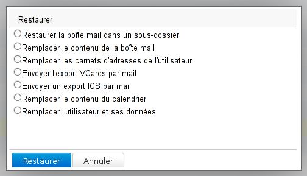

# Restaurer l'agenda d'un utilisateur

## Présentation

Cette page vous présente les différentes étapes pour pouvoir restaurer un agenda précédemment sauvegardé par le système automatisé, que les sauvegardes soient externalisées ou non.

## Procédure

### Remonter la sauvegarde

Dans le cas où les sauvegardes sont externalisées, il convient dans un premier temps de restaurer la sauvegarde voulue : [Restauration d'une sauvegarde depuis un emplacement externe](/Guide_de_l_administrateur/Sauvegarde_et_restauration/Restauration_unitaire_Navigation_DataProtect/Restauration_d_une_sauvegarde_depuis_un_emplacement_externe/)

### Restauration DataProtect

Une fois la sauvegarde souhaitée en place, se rendre dans la console d'administration de BlueMind > Sauvegarde et Restauration > Navigation DataProtect afin de procéder à une [restauration unitaire](/Guide_de_l_administrateur/Sauvegarde_et_restauration/Restauration_unitaire_Navigation_DataProtect/).

La sauvegarde doit apparaître dans la page, si ce n'est pas le cas cliquer sur le bouton de rafraichissement en haut de page.

Pour restaurer l'agenda :

1. Cliquer sur la sauvegarde souhaitée, le système lance alors une restauration temporaire des données, permettant de naviguer dans la sauvegarde
2. Cliquer sur Fermer pour accéder aux données
3. Rechercher l'utilisateur souhaité soit en naviguant directement soit au moins des boutons et champ de recherche
4. Cliquer sur le bouton "Restaurer" de la ligne correspondante
5. La popup des actions possibles est alors affichée :2 choix correspondent à la restauration d'agenda :
    1. ****Envoyer un export ICS par mail**** : effectue un export au [format ICS](http://fr.wikipedia.org/wiki/.ics) de l'agenda de l'utilisateur et le lui envoie par mail. À moins de procéder au préalable à une [réinitialisation manuelle](/Guide_de_l_utilisateur/L_agenda/Préférences_de_l_agenda/) de l'agenda cible, l'import du fichier **ajoutera** les événements : les modifications et créations postérieures à la sauvegarde seront conservées mais il y aura un risque de doublons.
    2. ****Remplacer le contenu du calendrier**** : restaure l'intégralité du calendrier à la date de la sauvegarde. Toutes les modifications (nouveaux événements, suppressions, déplacements, etc.) effectuées depuis seront perdues.
6. Cocher l'option souhaitée et cliquer sur "Restaurer"
7. Le déroulement s'affiche en temps réel dans la popup, lorsque l'opération est terminée un bouton "Fermer" est disponible pour quitter.

