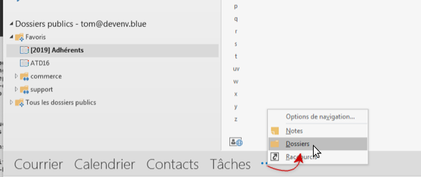
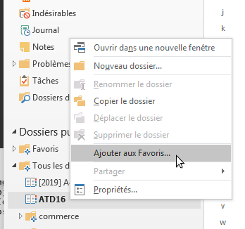
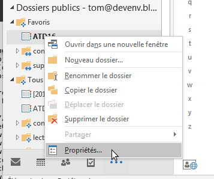
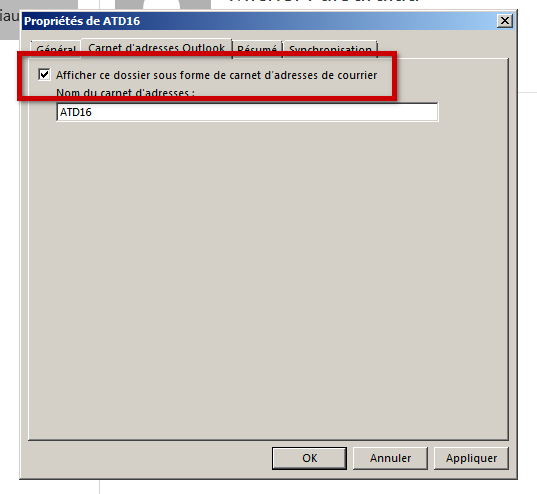
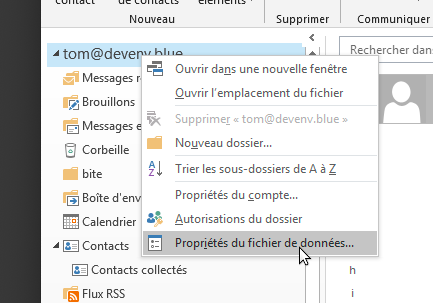
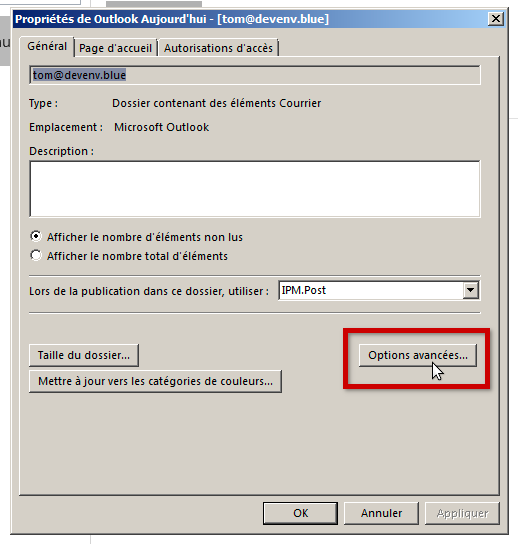
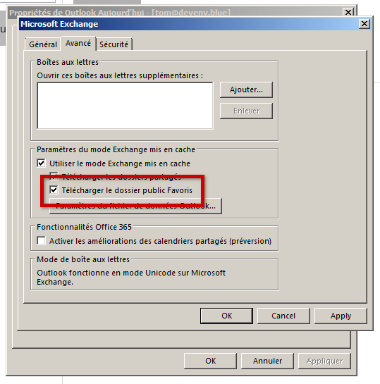
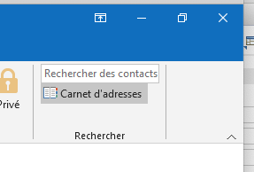
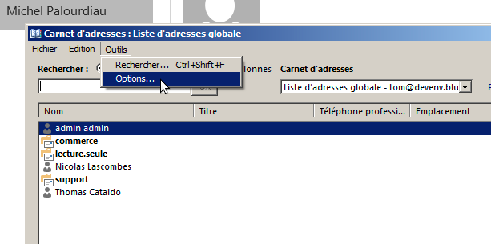
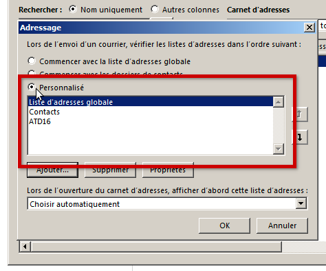

# Retrouver les carnets de domaine dans Outlook

## Présentation

Les carnets de domainen'apparaissent pas par défaut dans Outlook connecté en mapi, il convient de procéder à une configuration particulière sur le poste pour les voir apparaître dans l'interface et pouvoir les utiliser lors de la rédaction de messages.

## Procédure

##### 1ère partie : Rattacher les carnets de domaine en tant que carnets d'adresses

Déplier l'arborescence *Dossiers publics* > *Tous les dossiers* : sont ici visibles les carnets

:::tip

Les dossiers publics ne sont visibles que depuis la vue Dossiers, celle-ci est accessible par le bouton "..." en bas de la fenêtre Outlook :

:::

Faire un clic droit sur le carnet et choisir "**Ajouter aux Favoris...**" :

Faire alors un clic droit **sur le dossier mis en favori** et choisir "**Propriétés...**" :

Dans la fenêtre qui s'ouvre, aller à l'onglet "*Carnet d'adresses Outlook*" et cocher la case "**Afficher ce dossier sous forme de carnet d'adresses de courrier**" :

 **À ce stade, les contacts sont désormais bien considérés par Outlook comme des contacts.**

Cliquer sur **OK** pour prendre en compte le paramétrage et quitter.

###### **Répéter l'opération pour chaque carnet**

##### 2ème partie : Utiliser les carnets de domaine dans la complétion

De retour à la vue principale, effectuer un clic droit sur le nom du compte et choisir "**Propriétés du fichier de données...**" :

Dans la fenêtre qui s'ouvre, cliquer sur le bouton "**Options avancées...**" :

Dans la nouvelle fenêtre, cocher la case "**Télécharger le dossier public Favoris**", qui permettra que le contenu du dossier, désormais considéré comme des contacts, soit synchronisé sur le poste :

Cliquer sur **OK** pour valider chaque fenêtre et quitter.

De retour dans la vue principale, se rendre dans la gestion des carnets d'adresses en cherchant le bouton ci-dessous en haut à droite du bandeau principal :

*NB : Selon l'endroit où vous vous trouvez dans la vue (accueil, message, sous-dossier...) il se peut qu'il soit entouré d'autres éléments de menus.*

Dans la gestion, ouvrir le menu *Outils* et cliquer sur "**Options...**"

Dans la fenêtre des options, cocher le bouton radio "Personnalisé" 

Cliquer sur **OK** pour prendre en compte le paramétrage et quitter.

Ce sont dès lors les carnets listés dans le champs qui seront pris en compte lors de la recherche pour complétion des adresses. La liste comporte par défaut la totalité des carnets, les carnets créés par la suite y seront automatiquement ajoutés par Outlook, il ne sera donc pas nécessaire de refaire la manipulation pour chaque carnet de domaine ajouté en suivant la procédure de la 1ère partie.

###### Le paramétrage est terminé : les contacts doivent remonter lorsque vous lancer la complétion des noms lors de la rédaction d'un message.

