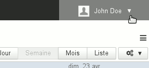
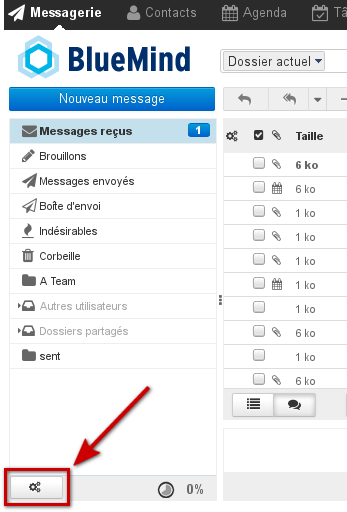

# FAQ (Foire aux questions)

## Général

### Comment connaître ma version de BlueMind ?

La version de BlueMind est indiquée sur la page d'accueil de l'application, en passant la version sur le numéro de version vous verrez apparaître le numéro de version technique :


Une fois connecté à BlueMind, passez votre souris sur le logo (logo BlueMind ou logo de votre organisation) en haut à gauche de l'application pour voir apparaître les 2 numéros (version publique et version technique) :


### Quels sont les navigateurs et leurs versions supportés par BlueMind ?

La page [Compatibilité](/FAQ_Foire_aux_questions_/Compatibilité/) de la documentation vous indique les versions des navigateurs mais aussi des clients lourds, appareils mobiles, etc. ainsi que les limitations connues.

### Quels sont les caractères autorisés dans les mots de passe ?

Les mots de passe peuvent être constitués des lettres majuscules et minuscules, de chiffres, ainsi que de certains caractères spéciaux. Sont exclus notamment les caractères accentués.

Les caractères autorisés sont les [caractères de la table ASCII](https://fr.wikipedia.org/wiki/American_Standard_Code_for_Information_Interchange#Table_des_128_caract.C3.A8res_ASCII), exceptés les caractères de contrôles.

### Comment fonctionne le mode déconnecté ?

#### Qu'est-ce que le mode déconnecté ?

Le mode déconnecté vous permet de continuer à travailler avec BlueMind lors d'une perte de connexion internet volontaire (par menu dans les navigateurs le permettant ou par déconnexion de l'ordinateur à internet) ou involontaire (coupure réseau, câble débranché, etc.). Ce qui est saisi (nouveau contact, rendez-vous, acceptation de réunion, etc.) est sauvegardé dans le navigateur et lorsque la connexion est rétablie, les données sont synchronisées avec le serveur et sauvegardées dans BlueMind.

#### Quelles applications le supportent ?

Ce mode concerne à l'heure actuelle les applications Contacts, Agenda et Tâches.

#### Comment l'activer ?

Le mode déconnecté est automatiquement activé lorsque le navigateur perd la connexion à internet, volontairement ou non.

Lorsque vous êtes déconnecté, le menu personnel de votre bandeau de navigation est grisé, en le dépliant vous voyez l'information *"Offline"* et les liens y sont inactifs :



#### Quels sont les navigateurs compatibles ?

Il est disponible pour les navigateurs Firefox, Chrome et Safari.

Cependant, le mode déconnecté reposant sur la capacité de stockage d'informations directement dans le navigateur, certains navigateurs ou versions des navigateurs ne supportant pas cette technologie ne permettent pas de le faire fonctionner (Firefox en Mode privé, Internet Explorer, Edge).

## Messagerie

### Comment faire de BlueMind mon gestionnaire par défaut pour les liens «mailto:» ?

Les liens «mailto:» sont les liens qui permettent d'ouvrir directement le composeur de nouveau message du logiciel de messagerie par défaut.

Pour faire en sorte qu'un clic sur ces liens, dans une page web ou un email par exemple, ouvre le composeur de BlueMind :

- se rendre dans les **préférences avancées de BlueMind** : dans la gestion des paramètres utilisateur > rubrique Messagerie > lien *"Paramètres avancés de la messagerie"*
- dans la 1ère rubrique, «**Interface utilisateur**», cliquer sur le lien *"Enregistrer le gestionnaire de protocole pour les liens mailto:"*
- valider l'autorisation demandée par le navigateur


Pour en savoir plus, consulter la page [Préférences avancées](/Guide_de_l_utilisateur/La_messagerie/Préférences_de_messagerie/Préférences_avancées/)

### Les messages non lus dans mes sous-dossiers ne sont indiqués que si je consulte le sous-dossier.

Pour modifier ce comportement et forcer BlueMind à relever les messages de tous les dossiers et sous-dossiers à chaque fois qu'il consulte le serveur :

- se rendre dans les **préférences avancées de BlueMind** : dans la gestion des paramètres utilisateur > rubrique Messagerie > lien *"Paramètres avancés de la messagerie"*
- dans la rubrique «**Vue du courrier**» cocher la case *"Vérifier tous les dossiers pour les nouveaux messages*"


Pour en savoir plus, consulter la page [Préférences avancées](/Guide_de_l_utilisateur/La_messagerie/Préférences_de_messagerie/Préférences_avancées/)

### Je préférerais répondre SOUS le message auquel je réponds

Par défaut, lors de la rédaction d'une réponse, la citation du message d'origine est placée dessous. Pour modifier ce comportement et placer le message d'origine en haut du mail et la rédaction en cours après :

- se rendre dans les **préférences avancées de BlueMind** : dans la gestion des paramètres utilisateur > rubrique Messagerie > lien *"Paramètres avancés de la messagerie"*
- dans la rubrique «**Écriture des messages**», section «Options principales», sélectionner le comportement souhaité avec la liste "En répondant" :
    - commencer le nouveau message au-dessus de l'original
    - commencer le nouveau message au-dessous de l'original


Pour en savoir plus, consulter la page [Préférences avancées](/Guide_de_l_utilisateur/La_messagerie/Préférences_de_messagerie/Préférences_avancées/)

### Éditer en tant que nouveau message

Cette option permet d'ouvrir un message dans le composeur tel qu'il est, sans qu'il apparaisse comme une réponse ou un transfert.

Pour éditer un message ainsi, il y a plusieurs façons de faire :

1. faire un clic droit sur le message dans la liste > "Plus d'actions" > "Éditer en tant que nouveau message"
2. sélectionner le message dans la liste et cliquer sur le menu "Plus d'actions" au dessus de la liste des messages puis choisir "Éditer en tant que nouveau message"


### Je voudrais utiliser des signatures différentes selon les destinataires auxquels j'écris

Il vous faut vous créer pour cela plusieurs «Identités», en paramétrant la signature souhaitée pour chacune. Lors de l'envoi d'un message vous n'aurez plus qu'à sélectionner en expéditeur celle que vous souhaitez et la signature correspondante sera ajoutée.

Les identités permettent en outre de personnaliser le nom affiché ainsi que l'alias de messagerie utilisé.

Pour en savoir plus, consulter la page [Les identités](/Guide_de_l_utilisateur/La_messagerie/Les_identités/)

### J'ai atteint mon quota de messagerie mais je n'arrive pas à supprimer des mails pour l'alléger

En effet, la suppression d'un mail via le bouton "supprimer" ou la touche "Suppr" du clavier déplace celui-ci à la corbeille et pour cela doit le copier dans un répertoire temporaire. Cette opération est donc impossible si le quota d'espace est déjà atteint.

Pour alléger une messagerie dont le quota est plein, il faut procéder à une suppression complète directe : sélectionner le ou les messages à supprimer et taper "Shift-Suppr" au clavier. Une alerte doit apparaître, vous demandant de confirmer la suppression.

Pour en savoir plus, consulter la page [La messagerie : l'ancien Webmail](/Guide_de_l_utilisateur/La_messagerie/)

### Je ne vois pas la priorité des mails que je reçois

Pour afficher la priorité des mails dans la liste des messages, une colonne est prévue mais non affichée par défaut. Pour afficher cette colonne :

- cliquer sur le bouton «Lister les options» en forme d'engrenages en haut à gauche de la liste des messages
- cocher la case «Priorité» dans la liste des colonnes
- cliquer sur Enregistrer pour valider


NB : La colonne est ajoutée en dernière position.

Pour en savoir plus sur l'organisation des colonnes, consulter la page [La messagerie : l'ancien Webmail](/Guide_de_l_utilisateur/La_messagerie/) > chapitre 4.1 - Colonnes et tri

### Mes boites partagées n'apparaissent pas dans la liste des dossiers

Après l'affectation des droits sur une boite partagée à un utilisateur, il peut arriver que la boite n'apparaisse pas dans la liste des dossiers de cet utilisateur. Ceci est dû à un bug d'affichage du moteur du webmail, Roundcube.

Pour faire apparaître les dossiers, il suffit de faire afficher le menu des actions de la liste des dossiers :



Le simple fait de faire apparaître le menu à l'écran doit suffire à faire apparaître la boite partagée dans la liste, aucune action n'est nécessaire à partir de ce menu.

### Qu'est-ce que le contenu distant d'un message et pourquoi BlueMind ne le charge-t-il pas ?

Le contenu distant d'un message est un contenu qui n'est pas intégré au message mais chargé via une connexion internet. Ce contenu peut être de différents types : images mais aussi vidéos, feuilles de styles ou scripts.

Par défaut, BlueMind ne charge pas ces contenus depuis les expéditeurs inconnus afin de protéger votre vie privée. En effet, ces contenus peuvent permettre à leur auteur d'accéder à diverses informations **directement reliées à votre adresse de messagerie** : à propos de la lecture du message elle-même (par exemple date et heure de lecture ainsi que nombre de lectures), à propos de votre environnement (OS, logiciel de messagerie, etc.) ou encore vous localiser par rapport à votre IP. Ces contenus peuvent aussi donner la simple mais précieuse indication que votre adresse de messagerie existe et est active, par le simple fait d'indiquer que l'image et donc le message a été chargé.

Par défaut, BlueMind fait cependant confiance aux expéditeurs se trouvant dans votre carnet d'adresses : les contenus distants des messages provenant de ces adresses sont chargé automatiquement lorsque le message est affiché.

Un bouton en haut d'un message dont les contenus ont été bloqués vous permet de les télécharger pour ce message seulement. Si vous souhaitez activer le téléchargement des contenus distants pour l'ensemble des messages, quel que soit l'expéditeur, rendez-vous dans la gestion des [Préférences avancées de la messagerie](/Guide_de_l_utilisateur/La_messagerie/Préférences_de_messagerie/Préférences_avancées/).

## Messagerie instantanée

### Je ne vois pas l'icône d'accès à la messagerie instantanée dans BlueMind

Les messagerie instantanée n'a pas dû être activée sur votre domaine ou l'administrateur a choisi de limiter l'accès à certains utilisateurs seulement.

Contactez votre administrateur ou, si vous êtes l'administrateur, consultez la [documentation de gestion du domaine](/Guide_de_l_administrateur/Présentation_du_produit/Messagerie_multi_domaines/) pour activer la messagerie instantanée.

### Je ne trouve pas comment vider l'historique de mes conversations

C'est normal : cette fonctionnalité n'est pas encore disponible dans la messagerie instantanée de BlueMind.

### J'ai une erreur SSL quand j'essaie de me connecter au serveur XMPP avec Thunderbird

Cela est dû aux paramètres DHE utilisés par Thunderbird à partir de la version 38.0

#### Résolution manuelle

Dans Préférences > Avancé > Editeur de configuration, positionner les paramètres suivants à 'true' :


```
security.ssl3.dhe\_rsa\_aes\_128\_sha
security.ssl3.dhe\_rsa\_aes\_256\_sha
```


Un message "L'autorité de délivrance du certificat du pair n'est pas reconnue." peut ensuite apparaître lors de la connexion, cela est dû au fait que le certificat SSL de BlueMind est auto-signé. Valider l'utilisation du certificat malgré cela.

#### Résolution par plugin

Installer l'add-on suivant qui désactive l'utilisation de clefs DHE [https://addons.mozilla.org/en-US/firefox/addon/disable-dhe/](https://addons.mozilla.org/en-US/firefox/addon/disable-dhe/)

## Mobilité

### La création du compte me répond "Nom d'utilisateur ou mot de passe incorrect"

Les informations de serveur et d'utilisateur saisies sont bonnes et pourtant ce message apparaît : cela signifie que votre administrateur n'a pas autorisé les connexions de périphériques externes.

Pour cela, 2 solutions :

1. l'administrateur global peut autoriser les synchronisations pour tout le domaine via la console d'administration > Gestion du système > Configuration système > onglet "Serveur EAS"
2. l'administrateur de domaine peut autoriser les synchronisations individuellement via la console d'administration > Entrées d'annuaire > choix de l'utilisateur > onglet "Périphérique"


Pour pouvoir vous connecter, il vous faut donc vous rapprocher d'un de vos administrateurs.

Pour en savoir plus, consulter le Guide de l'administrateur > [Utilisateurs](/Guide_de_l_administrateur/Gestion_des_entités/Utilisateurs/) ou [Configuration du serveur EAS](/Guide_de_l_administrateur/BlueMind_et_mobilité/Configuration_du_serveur_EAS/).

### Je ne vois pas les contacts de l'annuaire

En effet, en synchronisation avec le protocole Exchange ActiveSync, seuls les carnets d'adresses personnels sont synchronisés avec les contacts du smartphone. Cependant les adresses des autres carnets (Annuaire, Contacts collectés...) sont accessibles via les fonctions de recherche du smartphone (contacts, e-mails...)

Pour en savoir plus, consultez la page correspondant à votre appareil dans la section [Synchronisation des périphériques externes](/Guide_de_l_utilisateur/Configuration_des_périphériques_mobiles/).

### Je ne vois pas un de mes calendriers secondaires ou un calendrier partagé sur mon mobile Android

Android ne permettant pas de visualiser les différents calendriers au moyen de couleurs différenciées, l'affichage des calendriers autres que celui par défaut n'est pas possible, seul l'agenda de l'utilisateur apparaît et est fonctionnel.

Il est cependant possible d'activer la fonctionnalité afin de la coupler avec une application tierce : [Multi-calendrier sur les smartphones](/Base_de_connaissance/Multi_calendrier_sur_les_smartphones/) (voir les limitations connues sur cette même page). L'activation de cette fonctionnalité par les administrateurs permettra aux utilisateurs de voir leurs calendriers secondaires. Les agendas partagés (par des utilisateurs ou de domaine) resteront invisibles.

### Je ne vois pas sur mon mobile un dossier qui m'est partagé

Pour accéder aux dossiers partagés depuis un téléphone, il faut tout d'abord [s'abonner](/Guide_de_l_utilisateur/La_messagerie/Préférences_de_messagerie/#Preferencesdemessagerie-abonnements) aux dossiers. Cependant sur Android ils peuvent ne pas apparaître immédiatement.

Pour les faire apparaitre, il est possible de forcer la synchronisation des dossiers en suivant la procédure :

1. aller dans les paramètres **du téléphone** (et non les préférences de l'application mail)
2. aller dans la gestion des comptes.NB : Le nom de cette section varier d'un appareil à l'autre : "Comptes", "Comptes & utilisateurs", etc.
3. choisir le compte correspondant à la synchronisation BlueMind
4. aller dans les paramètres de synchronisation
5. appuyer sur "*Synchroniser maintenant*"NB : Selon les modèles, cette action peut se trouver en accès direct ou dans un menu *sandwich* (trois points ou trois traits en haut de l'écran)


Attendre la fin des synchronisations. Les dossiers auxquels vous êtes abonnés devraient à présent apparaitre dans l'application mail, sous *Dossier public* pour les dossiers partagés.

## Agenda

### Je ne vois pas un calendrier qui m'a été partagé

Par défaut, n'apparaissent dans la vue de l'agenda de l'utilisateur que :

- ses calendriers
- les calendriers de domaines


Pour faire apparaître un autre calendrier, l'utilisateur doit s'y abonner :

- se rendre dans la gestion des paramètres utilisateurs > Agenda > onglet "Abonnements"
- rechercher le calendrier désiré à l'aide du champs de saisie "Ajouter un calendrier"
- sélectionner le calendrier proposé par l'aucomplétion
- valider avec le bouton "Enregistrer"


Pour plus de détails, voir [Préférences de l'agenda](/Guide_de_l_utilisateur/L_agenda/Préférences_de_l_agenda/)

### Je ne vois que 2 couleurs sur le résumé alors que mon rendez-vous a plusieurs étiquettes

En effet, pour des raisons de lisibilité dans l'affichage, le rendez-vous dans l'agenda n'affiche que 2 couleurs maximum.
Néanmoins, en passant la souris au dessus de la vignette de couleur, toutes les étiquettes sont listées dans l'infobulle.

Pour plus de détails voir [Les étiquettes (tags)](/Guide_de_l_utilisateur/Les_catégories_tags_/)

## Ressources

### Général

#### Une ressource peut-elle avoir plusieurs réservations simultanées ?

En effet, si le(s) gestionnaire(s) valident plusieurs demandes de réservations pour un même créneau horaire, la ressource aura plusieurs réservations simultanées.

Au moment de la réservation, l'utilisateur est averti de la non disponibilité de la ressource mais il peut malgré tout effectuer une demande.

**La double réservation (le surbooking) est empêchée par défaut pour les ressources nouvellement créées :** si une ressource est disponible alors sa participation est automatiquement validée, si elle ne l'est pas alors l'événement est automatiquement refusé. Le gestionnaire de ressource garde cependant la main et peut toujours modifier les attributions ainsi que créer et modifier les événements du calendrier de la ressource directement.

Pour en savoir plus sur la configuration, veuillez consulter le chapitre dédié : [Guide de l'administrateur > Administration des ressources > Politique de réservation](/Guide_de_l_administrateur/Gestion_des_entités/Ressources/#Administrationdesressources-surbooking)

### Je suis utilisateur

#### La ressource n'est pas proposée par l'autocomplétion lorsque je la recherche

Vérifiez auprès de votre administrateur ou auprès du gestionnaire de ressource que des droits de réservation vous ont bien été affectés

### Je suis gestionnaire

#### L'alerte de demande de réservation n'apparaît pas

Vérifiez dans la partie gauche de votre agenda que le calendrier de la ressource est présent dans la liste des calendriers actuellement affichés.

#### J'ai une alerte de réservation mais je ne vois pas l'événement ni aucun autre dans ma vue

Vérifiez dans la partie gauche de votre agenda que le calendrier de la ressource n'est pas grisé : s'il est grisé, cela signifie qu'il est présent (donc l'alerte apparaît) mais non affiché (les rendez-vous sont masqués)

#### Je souhaite quitter la gestion d'une ressource

Si vous avez le droit de gestion des partages de la ressource, vous pouvez le supprimer vous-mêmes en vous rendant dans votre interface de gestion des paramètres utilisateur > Agenda > onglet "Gestion des Partages" :

- sélectionnez la ressource dans la liste déroulante
- modifiez ou supprimez le droit qui vous est affecté dans la liste des personnes et groupes autorisés


:::info
Si vous diminuez votre droit de partage, l'écran de modification des partages de la ressource est toujours accessible tant que vous ne quittez pas la gestion des paramètres. Néanmoins, la modification est immédiate et si vous essayez de modifier (pour remettre par exemple) le droit, cela sera sans effet et un message d'erreur «Opération interdite» vous informera que vous ne pouvez pas faire cela.
:::

Si vous n'avez pas ce droit de gestion, il faut alors vous adresser à un administrateur de BlueMind ou à un autre gestionnaire de la ressource.

## Contacts

### Je ne vois que 2 couleurs sur le résumé alors que mon contact a plusieurs étiquettes

En effet, pour des raisons de lisibilité dans l'affichage, le résumé de la fiche n'affiche que 2 couleurs maximum.
Néanmoins, en passant la souris au dessus de la vignette de couleur, toutes les étiquettes sont listées dans l'infobulle.

Pour plus de détails voir [Les étiquettes (tags)](/Guide_de_l_utilisateur/Les_catégories_tags_/)

## Administration

### J'ai perdu le mot de passe de l'assistant d'installation

Ce mot de passe est entre autres nécessaire pour effectuer la mise à jour de BlueMind via l'assistant d'installation (url http://&lt;[votre.serveur.com](http://votre.serveur.com)>/setup ) pour lequel le mot de passe a été fourni [lors de l'installation de BlueMind](/Guide_d_installation/Configuration_post_installation/).

En cas de perte, la modification du mot de passe de l'assistant d'installation peut être faite en passant par la console d'administration ou en ligne de commande :

1. Si vous accédez toujours à la console, connectez-vous en tant qu'administrateur global admin0 et rendez-vous dans Gestion du système > Configuration Système > onglet «Serveur Mandataire» :remplissez le nouveau mot de passe et enregistrez.
2. Si vous n'accédez plus à la console, faites en ligne de commande :
    - connectez-vous en tant que root au serveur principale et tapez la ligne suivante :


```
rm -f /etc/nginx/sw.htpasswd; htpasswd -b -c /etc/nginx/sw.htpasswd admin admin
```


    - connectez-vous à l'URL */setup* et utilisez le login et mot de passe admin/admin** **Cette étape est impérative, même si vous n'en êtes pas encore à l'étape de mise à jour de BlueMind.** **


### J'ai perdu le mot de passe du superadministrateur admin0

À partir de BlueMind 3.5.11 [l'outil d'administration en ligne de commande (CLI)](/Guide_de_l_administrateur/Administration_avancée/Client_CLI_pour_l_administration/) vous permet de paramétrer un mot de passe sans nécessairement connaître le mot de passe admin0.

Pour cela, une fois l'outil installé, taper la commande suivante :


```
bm-cli user update admin0@global.virt --password "NewPassword"
```


### Les tâches planifiées ne s'exécutent plus

Ce problème est symptomatique d'une mise à jour lors de laquelle le paquet bm-setup-wizard aurait été désinstallé.

Pour vérifier cela, la commande suivante ne doit rien renvoyer :


```
dpkg -l | grep bm-setup
```


Si le paquet n'apparaît effectivement pas, l'installer.

Si le paquet est bien présent, contacter le support BlueMind ou demandez de l'aide via le forum.

### L'identifiant saisi pour mon nouvel utilisateur est invalide

Les règles à respecter pour la constitution de l'identifiant d'un nouvel utilisateur sont les suivantes :

- la longueur maximale est de 64 caractères
- Les caractères autorisés sont :
    - les lettres minuscules de a à z
    - les chiffres de 0 à 9
    - les caractères spéciaux suivant : . (point), - (tiret), _ (underscore)
- Les caractères spéciaux ne peuvent être placés en 1ère position


## Thunderbird

### Je veux vider le cache du navigateur de Thunderbird

Lorsque la réinitialisation du connecteur ne suffit pas à résoudre des problèmes d'affichage, voire échoue avec une erreur visible dans les logs, il est possible de procéder à une réinitialisation manuelle du cache de la façon suivante :

- ouvrir l'onglet agenda de Thunderbird
- aller dans Outils > Supprimer l'historique récent
- choisir « Tout* »* dans le menu déroulant et cocher toutes les cases
- cliquer sur « Effacer maintenant »
- fermer puis rouvrir l'onglet agenda de Thunderbird


## Outlook


:::tip

Pour une investigation plus poussée et la résolution des problèmes rencontrés avec Outlook, nous vous invitons à suivre notre guide dédié [Résolution des problèmes avec Outlook](/Guide_de_l_administrateur/Résolution_de_problèmes/Résolution_des_problèmes_avec_Outlook/)

:::

### J'ai besoin de récupérer les logs d'Outlook

**Côté logiciel client**, les éventuels messages se trouvent directement dans l'interface d'Outlook, dans le dossier "Problèmes de synchronisation".

**Côté serveur**, 2 fichiers sont à consulter :

1. le log général `/var/log/bm-mapi/mapi.log`
2. le log d'activité `/var/log/bm-mapi/activities.log`


### Je ne vois pas mes boîtes partagées dans Outlook, dois-je m'y abonner ?

La version 4.3 de BlueMind permet, grâce à une fonctionnalité d'abonnements identique à celle des calendriers et carnets d'adresse, de faire apparaître les boîtes partagées dans les clients Outlook connectés en MAPI.

Pour voir une boite partagée dans Outlook, il faut donc dans un premier temps :

- se connecter à BlueMind en ligne
- se rendre dans Mon Compte > Messagerie > onglet Abonnements
- rechercher la boîte partagée grâce au champ de saisie et l'ajouter à ses abonnements :


*Pour plus de détails, consulter le paragraphe dédié sur la page [Les boites aux lettres partagées 5. Abonnements et logiciels tiers](/Guide_de_l_utilisateur/La_messagerie/Les_boites_aux_lettres_partagées/#Lesboitesauxlettrespartagees-abonnements)*

Les dossiers publics peuvent être trouvés en cliquant sur les points de suspension en bas de l'arborescence :


Enregistrer

Enregistrer

Enregistrer

Enregistrer

Enregistrer

Enregistrer

