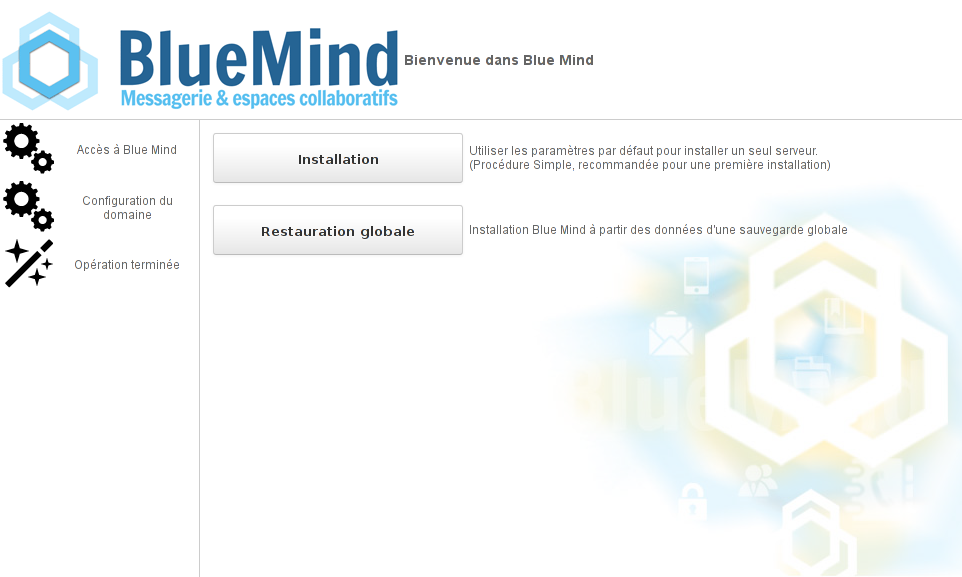
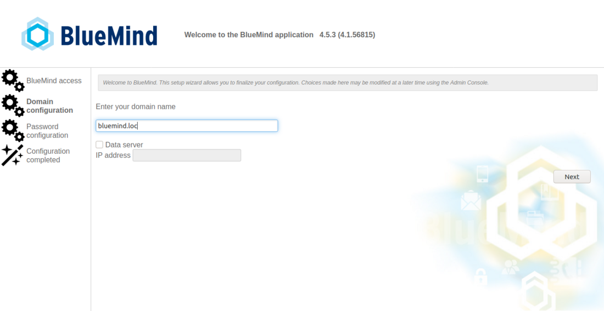
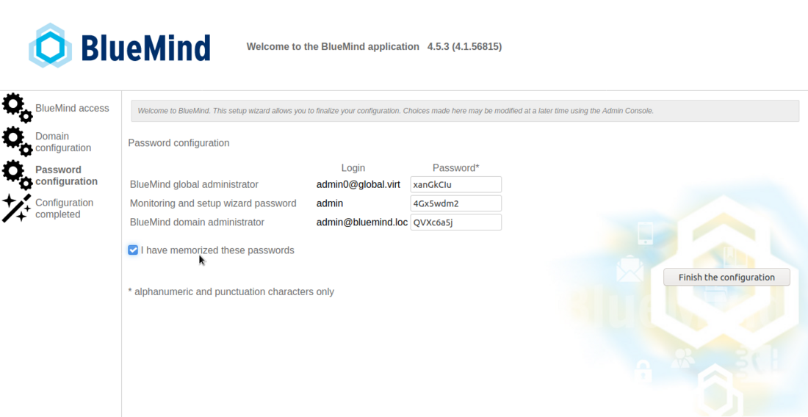
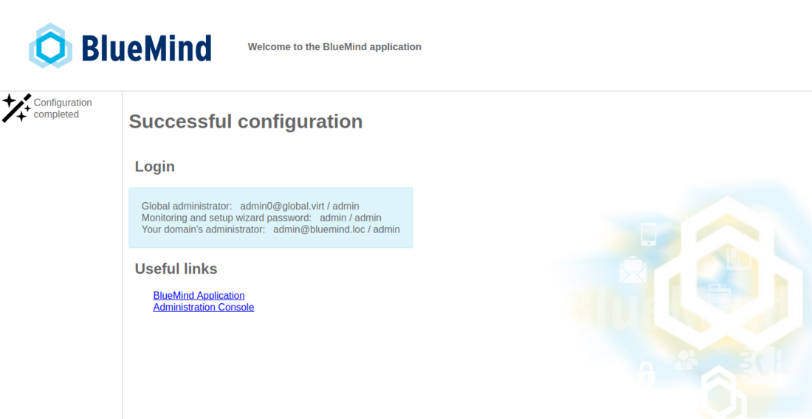
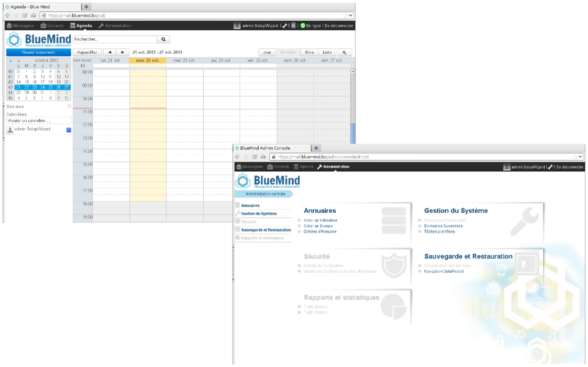

# Configuration post-installation


## Présentation


## Procédure

Une fois [BlueMind installé](/Guide_d_installation/Installation/) sur la distribution Linux, utiliser le navigateur web pour se rendre sur la page de configuration initiale de BlueMind : ** [https://votre.serveur.mail/setup](https://votre.serveur.mail/setup) ** (attention à bien saisir https et non http simple)

Puis se laisser guider par l’assistant d’installation :



1. ** **Vérification des pré-requis** : **


:::info

Une alerte peut apparaître dans le cas où le minimum de mémoire nécessaire a été affecté au serveur, il s'agit d'une simple alerte non bloquante et il est possible de continuer.

Si un problème est bloquant pour l'installation un message d'erreur apparaît en rouge et le bouton "Continuer" est indisponible.

:::

2. **** URL d’accès a votre BlueMind ** :** saisir l'url publique d'accès à BlueMind et cliquer sur "Tester l'accès" afin de valider, le bouton "suivant" s'active alors si tous les tests sont réussis** :** 
3. ** **Nom de domaine de messagerie** ** ** :** vérifier et corriger si besoin le nom de domaine de la messagerie puis cliquer sur "Next"Si un [serveur de données est utilisé pour la répartition des données](/Guide_d_installation/Installation/Installation_avec_répartition_des_données_sur_plusieurs_serveurs/), cocher la case "Data server" et renseigner son adresse IP.
4. ** **Mots de passe** :** à partir de la version 4.5.3, le système vous permet de personnaliser les mots de passe définis par l'installeur.De plus, une sécurité permet de ne plus les perdre par inattention : tant que la case "I have memorized these passwords" (en Français "J'ai mémorisé ces mots de passe") n'est pas cochée, le bouton "Finish the configuration" ("Finir la configuration") n'est pas disponible. 
5. **L'installation se termine** puis affiche les informations de connexion à l'application :

6. Redémarrer le service BlueMind en ligne de commande :


```
bmctl restart
```


:::info

Sécuriser les mots de passe !

Pour les versions antérieures à 4.5.3, dans lesquelles l'installeur ne permet pas de vérifier et personnaliser les mots de passe, ceux pour l'admin ([admin@bluemind.lan](mailto:admin@bluemind.lan) ici) et l'admin0 ([admin0@global.virt](mailto:admin0@global.virt)) doivent absolument être changés sur une installation en production.

Des mots de passe non sécurisés pourraient en particulier être utilisés pour accéder à l'**ensemble des données de votre serveur** ou, via le service SMTP **pour envoyer du SPAM** depuis votre serveur.

:::



## Souscription

Si vous possédez une [souscription BlueMind](/Guide_de_l_administrateur/La_souscription_BlueMind/), vous devez maintenant [l'installer](/Guide_d_installation/Mise_en_œuvre_de_la_souscription/) pour bénéficier des outils associés et de la [connexion des postes Outlook](/Guide_de_l_administrateur/La_souscription_BlueMind/Mise_en_œuvre_de_MAPI_pour_Outlook/).


:::tip

Pour que des personnes dédiées puissent voir les informations de dépassement du nombre d'utilisateur ou d'approche de la date d'échéance de la souscription, ne pas oublier de leur [attribuer le rôle de gestion](/Guide_d_installation/Mise_en_œuvre_de_la_souscription/#Miseenoeuvredelasouscription-attr-role) idoine.

:::

## Composants additionnels

Certains composants additionnels ne sont pas inclus par défaut dans l'installation de BlueMind et nécessitent l'installation de paquets supplémentaires.

### Détachement des pièces jointes

BlueMind propose la possibilité de [détacher les pièces jointes](/Guide_de_l_utilisateur/La_messagerie/Fichiers_volumineux_et_détachement_des_pièces_jointes/) des messages afin de les présenter sous forme de lien de téléchargement aux destinataires.

Pour en savoir plus sur l'installation et la configuration, consultez la page [Administration du détachement des pièces jointes](/Guide_de_l_administrateur/Configuration/Detachement_des_pieces_jointes/).

### Import LDAP

Pour mettre en œuvre l'import des utilisateurs et groupes depuis un annuaire LDAP, consultez la page [Synchronisation LDAP](/Guide_de_l_administrateur/Gestion_des_entites/Synchronisation_LDAP/)

### Composants disponibles avec une souscription

La souscription BlueMind permet d'accéder à des outils et fonctionnalités supplémentaires :

- l'outil d'import ActiveDirectory


Pour en savoir plus, consultez la page [Mise en œuvre de la souscription](/Guide_d_installation/Mise_en_œuvre_de_la_souscription/)

## Dimensionnement

Une fois l'installation réalisée, afin d'optimiser le bon fonctionnement de BlueMind, il convient de régler certains paramètres en fonction de votre matériel et du nombre d'utilisateurs, notamment :

- le nombre de process IMAP : se paramètre dans la console d'administration, voir la page dédiée à la [Configuration système](/Guide_de_l_administrateur/Configuration/Configuration_système/) - chapitre 1.2 : Cyrus
- le nombre de *workers* nginx : se paramètre dans la console d'administration, voir la page dédiée à la [Configuration système](/Guide_de_l_administrateur/Configuration/Configuration_système/) - chapitre 2 : Serveur mandataire


## Reprise des données

Afin de vous assurer d'une reprise de données complète et réussie, la reprise de données doit s'effectuer de serveurs à serveurs avec des exports / imports et des outils de reprise de données.

Toute reprise de données effectuées par les utilisateurs ou depuis des clients lourds (Outlook, Thunderbird) peut être problématique en terme de volume de données manipulé par ces clients lourds, et peut mener à des incohérences des données de l'utilisateur sur la nouvelle instance BlueMind.

Nous conseillons donc :

- Contacts : exports et imports VCard
- Événements : exports / imports ICS
- Mails : selon le serveur source, imapSync, outil de reprise Exchange ou Domino.


Adressez-vous à BlueMind ou à votre partenaire BlueMind pour vous faire accompagner sur ces reprises de données.


:::info

Import PST

Rappel : en 4.0, comme en 3.5, une reprise de données par import PST depuis Outlook est à proscrire impérativement.

:::


