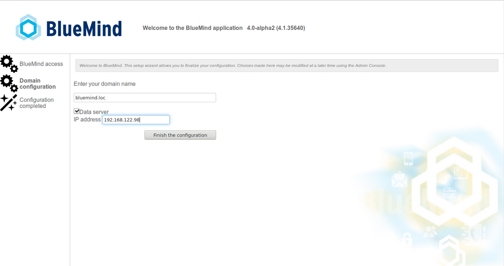
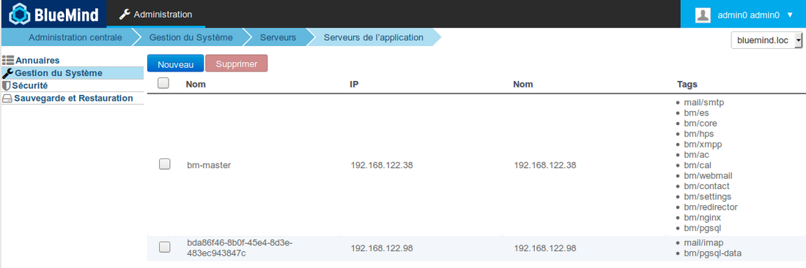
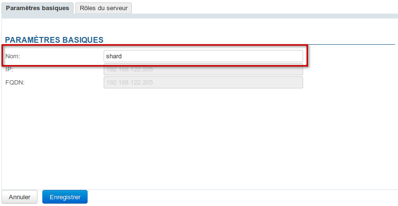
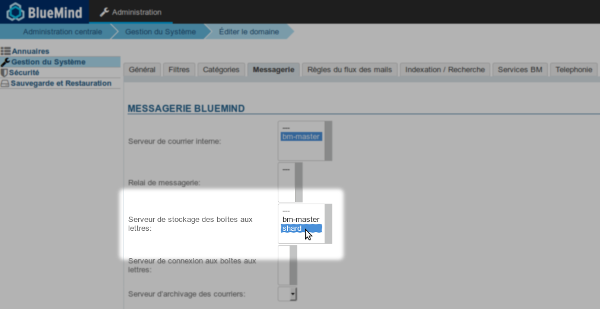

# Installation avec répartition des données sur plusieurs serveurs


## Présentation

BlueMind 4.0 permet, en plus de la répartition des emails des utilisateurs, de répartir l'ensemble des données des utilisateurs sur plusieurs serveurs qui contiennent à présent une base de données en plus de cyrus.

Ainsi, lorsque l'administrateur choisit de placer les données d'un utilisateur sur un serveur, ce ne sont plus seulement ses messages qui seront placés sur celui-ci mais aussi toutes les données de cet utilisateur qui seront placées dans la base de données de ce serveur (contacts, rendez-vous, paramètres, etc.).


## Installation

### Pré-requis

Avoir 2 machines [installées et à jour](/Guide_d_installation/Prérequis_à_l_installation/) dans un OS supporté :

- machine principale qui va recevoir BlueMind
- machine secondaire qui servira de serveur de stockage des données utilisateurs


:::tip

Il est possible de répartir les données sur plusieurs serveurs de stockage, il suffira de répéter la préparation du serveur de stockage sur chacun d'entre eux.

Cela pourra être fait avant ou après l'installation du serveur principal, l'ordre n'a pas d'importance.

:::

### Procédure

#### Préparation du serveur de stockage

Sur le serveur secondaire, destiné à recevoir les données :

1. déposer la souscription dans `/etc/apt/sources.list.d/bm.list`
2. installer le paquet `bm-mailbox-role` :


```
aptitude install bm-mailbox-role
```

Le message suivant peut apparaître selon les paquets déjà installés ou non sur votre système :


****
 Expand source


```
root@shard:~# aptitude install bm-mailbox-role
The following NEW packages will be installed: 
  bm-conf{a} bm-cyrus{a} bm-cyrus-imapd{a} bm-jdk{a} bm-lmtpd{a} bm-mailbox-role bm-maintenance-snzip{a} bm-maintenance-tools{a} bm-milter{a} bm-node{a} bm-pimp{a} bm-postfix{ab} 
  bm-postgresql{a} bm-tika{a} bm-ysnp{a} db-util{a} db5.3-util{a} emacs25-bin-common{a} emacs25-common{a} emacs25-el{a} emacs25-nox{a} emacsen-common{a} iftop{a} keyutils{a} 
  libasound2{a} libasound2-data{a} libgnutls-openssl27{a} libgpgme11{a} libjansson4{a} liblockfile-bin{a} liblockfile1{a} libnfsidmap2{a} libpq5{a} libsensors4{a} libtirpc1{a} 
  libtokyocabinet9{a} libxi6{a} libxrender1{a} libxtst6{a} mutt{a} nfs-common{a} pgdg-keyring{a} postfix{ab} postgresql-9.6{a} postgresql-client-9.6{a} postgresql-client-common{a} 
  postgresql-common{a} postgresql-contrib-9.6{a} rpcbind{a} sasl2-bin{a} ssl-cert{a} ssmtp{ab} sysstat{a} x11-common{a} 
0 packages upgraded, 54 newly installed, 0 to remove and 0 not upgraded.
Need to get 356 MB of archives. After unpacking 706 MB will be used.
The following packages have unmet dependencies:
 ssmtp : Est en conflit avec: mail-transport-agent which is a virtual package, provided by:
                              - postfix (3.3.0-1ubuntu0.2), but 3.3.0-1ubuntu0.2 is to be installed
                              - exim4-daemon-light (4.90.1-1ubuntu1.1), but it is not going to be installed
                              - exim4-daemon-heavy (4.90.1-1ubuntu1.1), but it is not going to be installed
                              - ssmtp (2.64-8ubuntu2), but 2.64-8ubuntu2 is to be installed
                              - sendmail-bin (8.15.2-10), but it is not going to be installed
                              - qmail-run (2.0.2+nmu1), but it is not going to be installed
                              - opensmtpd (6.0.3p1-1build1), but it is not going to be installed
                              - nullmailer (1:2.1-5), but it is not going to be installed
                              - msmtp-mta (1.6.6-1), but it is not going to be installed
                              - masqmail (0.3.4-1build1), but it is not going to be installed
                              - lsb-invalid-mta (9.20170808ubuntu1), but it is not going to be installed
                              - esmtp-run (1.2-15), but it is not going to be installed
                              - dma (0.11-1build1), but it is not going to be installed
                              - courier-mta (0.78.0-2ubuntu2), but it is not going to be installed
                              - citadel-server (917-2), but it is not going to be installed
                              - postfix (3.3.0-1), but 3.3.0-1ubuntu0.2 is to be installed
                              - exim4-daemon-light (4.90.1-1ubuntu1), but it is not going to be installed
                              - exim4-daemon-heavy (4.90.1-1ubuntu1), but it is not going to be installed

 postfix : Est en conflit avec: mail-transport-agent which is a virtual package, provided by:
                                - postfix (3.3.0-1ubuntu0.2), but 3.3.0-1ubuntu0.2 is to be installed
                                - exim4-daemon-light (4.90.1-1ubuntu1.1), but it is not going to be installed
                                - exim4-daemon-heavy (4.90.1-1ubuntu1.1), but it is not going to be installed
                                - ssmtp (2.64-8ubuntu2), but 2.64-8ubuntu2 is to be installed
                                - sendmail-bin (8.15.2-10), but it is not going to be installed
                                - qmail-run (2.0.2+nmu1), but it is not going to be installed
                                - opensmtpd (6.0.3p1-1build1), but it is not going to be installed
                                - nullmailer (1:2.1-5), but it is not going to be installed
                                - msmtp-mta (1.6.6-1), but it is not going to be installed
                                - masqmail (0.3.4-1build1), but it is not going to be installed
                                - lsb-invalid-mta (9.20170808ubuntu1), but it is not going to be installed
                                - esmtp-run (1.2-15), but it is not going to be installed
                                - dma (0.11-1build1), but it is not going to be installed
                                - courier-mta (0.78.0-2ubuntu2), but it is not going to be installed
                                - citadel-server (917-2), but it is not going to be installed
                                - postfix (3.3.0-1), but 3.3.0-1ubuntu0.2 is to be installed
                                - exim4-daemon-light (4.90.1-1ubuntu1), but it is not going to be installed
                                - exim4-daemon-heavy (4.90.1-1ubuntu1), but it is not going to be installed

 bm-postfix : Est en conflit avec: ssmtp but 2.64-8ubuntu2 is to be installed
The following actions will resolve these dependencies:

     Keep the following packages at their current version:
1)     ssmtp [Not Installed]                              


Accept this solution? [Y/n/q/?] Y
```


 Taper "Y" puis &lt;Entrée> pour accepter la solution qui consiste à conserver ssmtp non installé afin de pouvoir installer Postfix dont BlueMind a besoin


#### Installation et configuration de BlueMind

Sur la machine principale :

1. [installer BlueMind](/Guide_d_installation/Installation/)
2. lors du [déroulement du Setup Wizard](/Guide_d_installation/Configuration_post_installation/), à l'étape de configuration du domaine, cocher la case "Data Server" et renseigner l'IP du serveur de stockage : 
3. Poursuivre l'installation
4. Se connecter à BlueMind en tant que superadministrateur admin0
5. Se rendre dans Gestion du système > Serveurs de l'application : le serveur secondaire doit apparaître et avoir les tags mail/imap et bm/pgsql-data :
 


:::tip

À ce stade, le nom du serveur est un nom généré, vous pouvez le modifier simplement dans sa fiche de gestion, accessible en cliquant sur la ligne correspondante :



:::
Dans la fiche de gestion du serveur, dans l'onglet Rôles, le rôle "Données d'utilisateurs" est bien coché.

6. Se rendre dans Gestion du système > Domaines supervisés > sélectionner le domaine > onglet Messagerie : le serveur est bien sélectionné comme serveur de stockage : 


Le serveur est prêt à recevoir les données.


