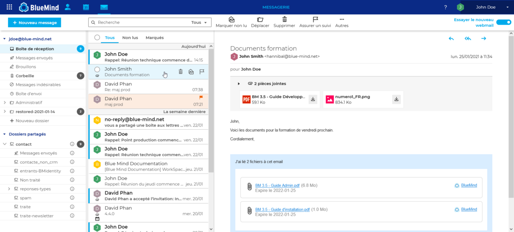
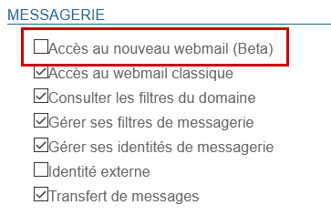
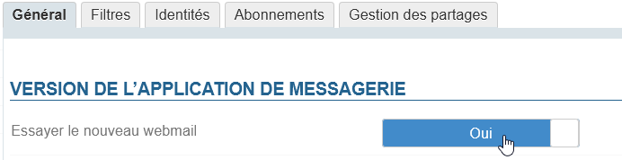

# Installation du nouveau client de messagerie


## Présentation

A partir de la version 4.4 de BlueMind, vous avez la possibilité d'installer le nouveau webmail BlueMind afin de le proposer en test à vos utilisateurs.




## Installation

Le client de messagerie BlueMind n'est pas installé par défaut, il faut installer les 2 paquets dédiés :


**
Debian/Ubuntu


**
RedHat/CentOS


```
apt install bm-plugin-core-mailapp bm-mail-app
```


```
yum install bm-plugin-core-mailapp bm-mail-app
```


Le service *core* doit être redémarré :


```
service bm-core restart
```


:::info

Attention, cette opération coupe momentanément l'accès à BlueMind et peut déconnecter les utilisateurs, qui sont alors susceptibles de perdre leur travail en cours. Le service doit donc être redémarré à un moment ne risquant pas d'avoir d'impact sur les utilisateurs.

:::

## Mise à disposition

L'accès au test du webmail est régi par [un rôle](/Guide_de_l_administrateur/Gestion_des_entités/Utilisateurs/Les_rôles_droits_d_accès_et_d_administration/), de ce fait il peut être donné à l'ensemble des utilisateurs ou seulement certains via la gestion des rôles d'utilisateurs ou de groupes.

Une fois les paquets dédiés installés, un nouveau rôle est disponible dans la section Messagerie :



Grâce à ce rôle et au rôle suivant "Accès au webmail classique", l'administrateur peut forcer l'utilisation de l'un ou l'autre des clients de messagerie ou au contraire laisser le choix à l'utilisateur en cochant les deux.

Dans ce dernier cas, l'utilisateur aura dans son interface un bouton lui permettant de basculer d'un client à l'autre :


L'utilisateur a aussi la possibilité de basculer depuis la gestion de ses paramètres, rubrique messagerie :




:::tip

En cas de problème rencontré par l'utilisateur qui n'arriverait plus à basculer sur le client de messagerie classique, l'administrateur peut ici le désactiver en désactivant le rôle : à sa prochaine connexion, l'utilisateur sera automatiquement dirigé sur le webmail classique.

:::


