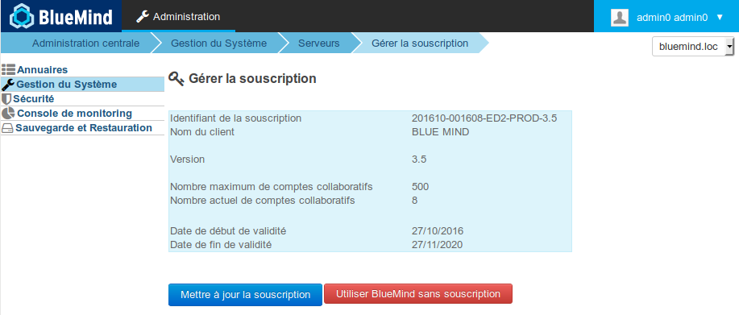
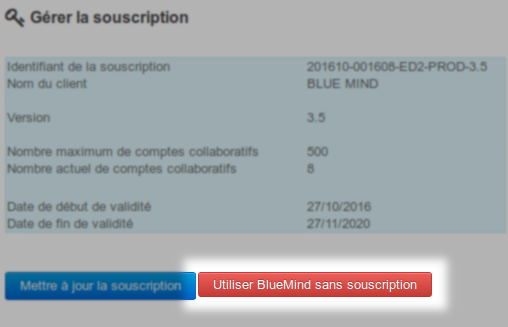

# Mise en œuvre de la souscription


## Présentation

### La souscription

Le logiciel BlueMind est Open Source. La souscription à BlueMind est une offre professionnelle visant à simplifier et garantir une utilisation en production et apportant une meilleure connectivité avec Outlook et ActiveDirectory.

### Le fichier de souscription

[La souscription BlueMind](/Guide_de_l_administrateur/La_souscription_BlueMind/) se présente sous la forme d'un ensemble de fichiers textes lisibles (pour chaque distribution), compressés dans une archive .tgz, qui constitue une clé, intégrant les caractéristiques du client pour lequel il est émis, en particulier :

- le nombre d'utilisateurs (pour les offres SAAS, une notion de profil utilisateurs est aussi prise en compte)
- le type de souscription :
    - production (Prod ou Host)
    - évaluation (Trial)
    - particuliers et associations OpenSource (Free)
- la date d'expiration.


Le fichier de souscription est valable pour tous les systèmes hôte supportés (voir [Pré-requis à l'installation](/Guide_d_installation/Prérequis_à_l_installation/) pour connaître les systèmes supportés)


**Ce fichier est lisible et signé.**

Les informations concernant la souscription sont visibles.

Le fichier est signé au niveaux des en-têtes / informations client, aussi il ne doit pas être modifié, sous peine d'invalidité.

Dans le cas d'une souscription d'évaluation, il est possible de modifier les url d'accès aux dépôts pour changer de distribution.  

Pour des souscriptions de type Prod, Host, Trial et Free,  vous ne devez pas modifier le fichier de souscription. Si vous souhaitez mettre à jour votre version de BlueMind, il est nécessaire de nous faire la demande d'une nouvelle souscription. Nous vous fournirons une nouvelle souscription valable pour la version de BlueMind cible. Par ailleurs, une souscription Prod ou Free ne peut être installée que sur un **unique serveur**.

**Vous ne devez pas diffuser ou donner ce fichier à un tiers.** Les accès au dépôt sont nominatifs et tracés.

## Mise à jour système et migration BlueMind

Le fichier de souscription contient les adresses des dépôts BlueMind et permet leur accès par le système en fonction de sa version. Ce fichier doit donc être mis à jour lors d'un changement de version de BlueMind afin d'installer les versions correspondantes des paquets BlueMind ainsi que les nouveaux paquets de la nouvelle version.

** **La procédure à suivre est donc la même que pour une installation et non une simple mise à jour.** **

## Installation de la souscription


:::info

BlueMind doit avoir été installé au préalable avec l'[installeur disponible en téléchargement](http://pkg.blue-mind.net/bm-download/) sur le site de BlueMind.

:::

Pour activer la souscription et les modules complémentaires, la démarche (détaillée ci-après) se résume en :

1. installer le fichier de souscription
2. effectuer une mise à jour des paquets pour obtenir les nouveaux composants
3. configurer BlueMind via le nouvel outil de mise à jour


:::info

Effectuer une sauvegarde de l'ensemble du système

BlueMind porte beaucoup d'efforts pour assurer la fiabilité des mises à jour. Cependant nul n'est à l'abri de cas particuliers non testés, ou de facteurs externes pouvant conduire à des pertes de données. BlueMind n'est pas responsable en cas d'échec de mise à jour qui pourrait corrompre un système installé.

Il est de votre responsabilité de vous assurer de ce risque en effectuant une sauvegarde complète de votre système.

:::

### Installer le fichier de souscription

#### Installation automatisée

- Se connecter à la console d'administration BlueMind, en tant qu'admin0 (login : * [admin0@global.virt](mailto:admin0@global.virt) *)
- Aller dans Gestion du système > Gérer la souscription
- Au moyen du bouton "Mettre à jour la souscription", rechercher l'archive fournie par BlueMind et valider.
BlueMind installe la souscription.
**La prise en compte est immédiate et ne nécessite pas de redémarrage de BlueMind.**


:::tip

Le formulaire reste accessible pour une mise à jour de la souscription, à sa date d'expiration par exemple.

:::


#### Installation manuelle

- Extraire de l'archive fournie le fichier correspondant à la distribution utilisée
- Renommer le fichier en `bm.list`
- En tant que root, déposer le fichier sur le serveur dans le dossier `/etc/apt/sources.list.d/`
- En cas d'utilisation de serveurs secondaires (edge, archivage, etc.) déposer aussi le fichier sur ces serveurs-là dans le même dossier
- Redémarrer BlueMind pour faire prendre en compte la nouvelle souscription


### Mettre à jour les paquets logiciels

Le fichier de souscription contenant les adresses des dépôts BlueMind et permettant leur accès par le système, celui-ci doit alors être mis à jour afin d'installer les dernières versions des paquets ainsi que les paquets supplémentaires.

Pour cela, se connecter root sur la machine concernée et taper les commandes suivantes :


:::info

Cette opération est à réaliser sur chaque serveur BlueMind concerné par cette souscription (production, test ou évaluation).

:::


**
Debian/Ubuntu


**
Redhat/CentOS


```
sudo aptitude update
sudo aptitude upgrade

```


```
yum makecache
yum upgrade
```


### Installer les nouveaux paquets

Les paquets suivants sont désormais disponibles :

- **bm-setup-wizard** : version spéciale de l'assistant d'installation et mise à jour
- bm-mapi* : connexion des postes Outlook
- bm-plugin-core-ad-import* : outil d'import ActiveDirectory


** paquets optionnels, à installer suivant vos besoins*

Sur la machine principale (celle où a été réalisée l'installation de BlueMind) installer les nouveaux paquets et redémarrer le service BlueMind :


**
Debian/Ubuntu


**
Redhat/CentOS


```
sudo aptitude install bm-setup-wizard bm-mapi bm-plugin-admin-console-ad-import bm-plugin-core-ad-import
sudo bmctl restart
```


```
rpm -e --nodeps bm-installation-wizard
yum install bm-setup-wizard bm-mapi bm-plugin-admin-console-ad-import bm-plugin-core-ad-import
bmctl restart
```


### Configuration après mise à jour

L'outil de gestion des mises à jour, le Setup Wizard, est maintenant disponible.

S'y connecter avec un navigateur en allant à l'adresse **  [https://[ip_de_votre_serveur]/setup](#)  **

L'écran du Setup wizard apparaît après chargement et affiche l'état de vérification des pré-requis

- Si le Setup Wizard bloque l'installation, corriger les pré-requis puis relancer l'installation
- Si le Setup Wizard remonte des alertes :
    - Résoudre les alertes puis recharger la page /setup dans votre navigateur (accèder à nouveau à **  [https://[ip_de_votre_serveur]/setup](#)  **)
    - ou cliquer sur *«* *Continuer en ignorant les problèmes* *»*. (Ce choix n'est pas recommandé, à moins de maîtriser parfaitement ce que vous faîtes).


Si les paquets étaient déjà à jour, un message indiquant que le système est prêt à l'utilisation s'affiche. Sinon, continuez avec l'étape ci-dessous :

Cliquer sur *«* *Mise à jour* *»*.
A côté de ce bouton est affichée la version des données en cours, et la nouvelle version vers laquelle sera effectué la mise à jour.


:::info

Durant la mise à jour, il n'est plus possible d'accéder à l'application BlueMind et une page d'avertissement informe l'utilisateur qui tenterait d'y accéder.

:::

La mise à jour s'exécute et lorsqu'elle est terminée le Setup Wizard affiche une page *«* *Configuration réussie* *»* avec les liens vers BlueMind.

### Vérifier la bonne installation

Retourner dans l'interface d'administration afin de vérifier que les informations de la souscription apparaissent correctement :




:::tip

Être averti des mises à jour

La souscription vous permettant de mettre à jour BlueMind, n'oubliez pas de vous abonner à la newsletter dédiée afin de recevoir les informations de publication de versions, évolutives et correctives : [https://lists.bluemind.net/mailman/listinfo/bluemind](https://lists.bluemind.net/mailman/listinfo/bluemind)

:::

### Attribuer le rôle de gestion

Lorsque les seuils de nombre d'utilisateurs sont franchis (ou sur le point de l'être) ou à l'approche de la date d'échéance de la souscription, des bandeaux d'information apparaissent dans la console d'administration mais aussi dans l'application BlueMind elle-même et des emails d'alertes sont envoyés.

Pour voir ces bandeaux, un utilisateur doit avoir le rôle dédié à la gestion de la souscription ainsi que celui d'accès à la console d'administration. Pour cela, se rendre dans la fiche d'administration de l'utilisateur souhaité et lui [attribuer les rôles](/Guide_de_l_administrateur/Gestion_des_entités/Utilisateurs/#Administrationdesutilisateurs-user-roles) "**Gérer la souscription**" et "**Console d'administration**".

Les utilisateurs peuvent se trouver dans les 2 cas suivants :

1. si l'utilisateur **n'a pas accès** à la console d'administration, il recevra les emails d'information
2. si l'utilisateur **a accès** à la console d'administration, il verra les bandeaux d'information lorsqu'il se rendra dessus, recevra les emails d'information et accèdera à la page de gestion permettant d'installer et mettre à jour la souscription


Pour recevoir les alertes par email, les adresses doivent être déclarées dans l'écran de gestion de la souscription.

Retrouvez plus de détails sur les informations afficher sur la page dédiée : [La souscription BlueMind](/Guide_de_l_administrateur/La_souscription_BlueMind/)

## Connecter les postes Outlook

Une fois la souscription et les paquets installés, vous pouvez [mettre en œuvre MAPI pour Outlook](/Guide_de_l_administrateur/La_souscription_BlueMind/Mise_en_œuvre_de_MAPI_pour_Outlook/) afin de permettre aux utilisateurs d'utiliser leur logiciel avec leur compte BlueMind.

## Import ActiveDirectory

Si vous avez installé le paquet, vous bénéficiez aussi dès à présent de l'import AD. Vous pouvez vous référer à la documentation concernée du guide de l'administrateur pour de plus amples renseignements : [Synchronisation Active Directory](/Guide_de_l_administrateur/Gestion_des_entités/Synchronisation_Active_Directory/)

## Mise à jour d'une souscription

Hors changement de version système ou BlueMind, une souscription étant déjà installée et effective, il n'est pas nécessaire d'installer de nouveaux paquets, seul le nouveau fichier de souscription doit être installé.

### Mettre à jour le nouveau fichier de souscription

#### Mise à jour automatisée

- Se connecter à la console d'administration BlueMind, en tant qu'admin0 (login : * [admin0@global.virt](mailto:admin0@global.virt) * * *)
- Aller dans Gestion du système > Gérer la souscription
- Au moyen du bouton "Mettre à jour la souscription", rechercher l'archive fournie par BlueMind et valider.
BlueMind installe la souscription.
**La prise en compte est immédiate et ne nécessite pas de redémarrage de BlueMind.**


#### Mise à jour manuelle

- Extraire de l'archive fournie le fichier correspondant à la distribution utilisée
- Renommer le fichier en `bm.list`
- En tant que root, déposer le fichier sur le serveur dans le dossier `/etc/apt.sources.list.d/` à la place de l'ancien fichier de souscription
- En cas d'utilisation de serveurs secondaires (edge, archivage, etc.) déposer aussi le fichier sur ces serveurs-là dans le même dossier
- Redémarrer BlueMind pour faire prendre en compte la nouvelle souscription


## Supprimer une souscription

Parce que la souscription arrive à échéance ou pour tout autre raison et à tout moment, il est possible de supprimer une souscription et repasser à un usage simple de BlueMind :

- Se connecter à la console d'administration BlueMind, en tant qu'admin0 (login : * [admin0@global.virt](mailto:admin0@global.virt) * * *)
- Aller dans Gestion du système > Gérer la souscription
- Cliquer sur "Utiliser BlueMind sans souscription" :
- Valider la demande de confirmation après avoir lu les conditions
- Redémarrer BlueMind :


```
bmctl restart
```


