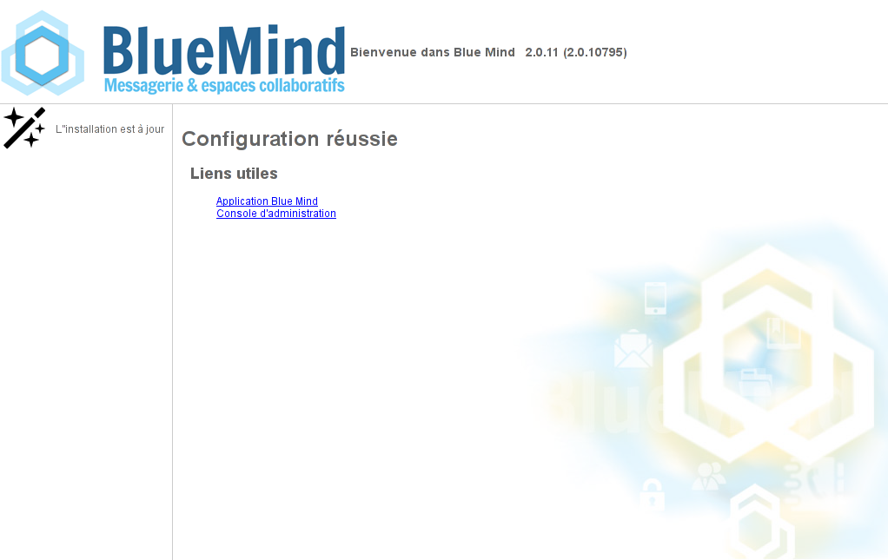

# Mise à jour de BlueMind


:::important

Effectuer une sauvegarde de l'ensemble du système

BlueMind porte beaucoup d'efforts pour assurer la fiabilité des mises à jour. Cependant nul n'est à l'abri de cas particuliers non testés, ou de facteurs externes pouvant conduire à des pertes de données. BlueMind n'est pas responsable en cas d'échec de mise à jour qui pourrait corrompre un système installé.

Il est de votre responsabilité de vous assurer de ce risque en effectuant une sauvegarde complète de votre système.

:::
:::important

Mise à jour de la distribution Linux

**La mise à jour de votre distribution Linux vers une version majeure supérieure (Debian 7 vers Debian 8, etc) ne doit pas être réalisée avec les mécanismes automatiques de mise à jour des distributions (changement des sources de paquet et utilisation de la commande aptitude dist-upgrade). En effet, les dépendances de BlueMind peuvent être modifiées et le bon fonctionnement des services BlueMind risque d'être impacté.**

**Pour une mise à jour de version majeure de la distribution, veuillez contacter votre prestataire intégrateur ou nous contacter via notre plate-forme de tickets.**

:::


:::important

Nouveauté 4.1 : préparation de la mise à jour

À partir de BlueMind 4.1 il est nécessaire de préparer la mise à jour depuis la console d'administration (Gestion du système > Mise à jour de BlueMind) au préalable à la mise à jour des paquets avec aptitude. Cette étape additionnelle permet à l'administrateur de mettre à jour son système facilement sans forcément mettre à jour BlueMind.

Pour plus de détails, les administrateurs sont invités à porter une attention particulière au paragraphe [3.1 Préparer la mise à jour](#MiseajourdeBlueMind-prepare-install) ci-après.

:::

# Présentation

La souscription BlueMind apporte un système de mise à jour simplifié et testé.

La mise à jour de BlueMind vers une version supérieure corrective ou évolutive est alors simplifiée, plus sûre et plus rapide grâce à l'outil graphique d'administration.
:::important

Changement de version majeure : migration 3.5 vers 4.0

La mise à jour de BlueMind lors d'un changement de version majeure (par exemple de **v2.x en v3.x ou de v3.0.x en v3.5.x**) nécessite un changement des adresses des dépôts logiciels. Le fichier de souscription doit donc être mis à jour afin de pouvoir réaliser le changement de version.

:::

# Prérequis

## Souscription

Pour accéder aux outils de mise à jour de BlueMind, il est nécessaire de posséder et d'avoir installé une [souscription en cours de validité](/Guide_de_l_administrateur/La_souscription_BlueMind/).

## Accès à l'assistant d'installation

Afin d'effectuer la mise à jour, il est nécessaire d'accéder à l'assistant d'installation (url http://&lt;votre.serveur.com>/setup ) pour lequel le mot de passe a été fourni [lors de l'installation de BlueMind](/Guide_d_installation/Configuration_post_installation/).

En cas de perte, ce mot de passe peut être réinitialiser de 2 façons :

1 Avant toute opération d'installation, en accédant à la console d'administration en tant qu'administrateur global admin0 > Gestion du système > Configuration Système > onglet «Serveur Mandataire» :remplir le nouveau mot de passe et enregistrer.
1 La modification peut aussi se faire en ligne de commande :
  - 
se connecter au serveur BlueMind en tant que root et taper la ligne suivante :


```
rm -f /etc/nginx/sw.htpasswd; htpasswd -b -c /etc/nginx/sw.htpasswd admin admin
```


  - se connecter à l'URL */setup* et utiliser le login et mot de passe admin/admin** **Cette étape est impérative, même si vous n'en êtes pas encore à l'étape de mise à jour de BlueMind.** **


## Signature des dépôts

Les dépôts sont désormais signés pour toutes les distributions Ubuntu/Debian supportées.

Cette signature est obligatoire pour Ubuntu 18.04 et Debian 9 dont le support est apporté par BlueMind 3.5.9.

Il est possible, si nécessaire ou désiré, d'importer manuellement la clé sur l'ensemble de nos distributions supportées via la commande suivante :


```
curl https://pkg.bluemind.net/bluemind-deb.asc | apt-key add -
```


Sans cela, un warning peut survenir lors de la mise à jour de certaines versions précédentes sans que cela gêne pour autant la mise à jour.

## Points de vigilance

De même qu'avant une installation de BlueMind 4, nous conseillons la lecture attentive de la page [Déploiement BlueMind 4 : points de vigilance](/Guide_d_installation/Déploiement_BlueMind_4_points_de_vigilance/) avant une mise à jour de version importante.

### Mise à jour 4.0 vers 4.1

#### Dossiers sous la boîte de réception

Dans les versions 4.0.x de BlueMind (4.0.x), les dossiers créés sous la boîte de réception par Outlook ne sont pas des dossiers de messagerie mais des dossiers virtuels.** BlueMind 4.1 apporte le support des sous-dossiers de la boîte de réception (inbox)**.

 **Dans le cadre d'une mise à jour de BlueMind 4.0.x vers 4.1, les dossiers virtuels éventuellement créés par les utilisateurs ne seront pas migrés et seront supprimés.**  Pour se prémunir de cela, il est donc conseillé de déplacer ces dossiers virtuels en dehors de la boîte de réception avant la mise à jour de façon à les conserver, ils pourront ensuite y être remis et seront recréés en tant que dossiers de messagerie.

# Procédure

Les dépôts logiciels étant pris en compte par le système dès [installation de la souscription](/Guide_d_installation/Mise_en_œuvre_de_la_souscription/), BlueMind sera mis à jour automatiquement lors de la mise à jour du système.
:::important

Si vous avez modifié les fichiers de configuration manuellement, assurez-vous d'en faire une sauvegarde.
Pour en savoir plus, voir en Annexes : [note sur les fichiers de configuration](#MiseajourdeBlueMind-note-conf)

:::

## Préparer la mise à jour

 Pour une mise à jour d'un ** **BlueMind déjà en version 4.1 ou supérieure** **, le processus de mise à jour doit être initié. Cela permet une plus grande maîtrise des versions et limite le risque d'erreur : la version cible peut désormais être ouverte afin de toujours mettre à jour dans la dernière version publiée ou au contraire figée afin d'empêcher les mises à jour involontaires. Cela permet aussi de sécuriser le respect de la version majeure du serveur ainsi que l'installation des paquets additionnels : ils seront installés dans la version du serveur.

Cette préparation peut se faire via la console d'administration OU en ligne de commande :

- se rendre dans Gestion du système > Mise à jour de BlueMind
- Cliquer sur le bouton "Configurer" : **la dernière version disponible sera installée**.


## Mettre à jour

Le processus de mise à jour de BlueMind commence par la mise à jour des paquets sur tous les serveurs de l'installation, au moyen des commandes déjà utilisées lors de l'installation. Les **étapes 1 et 2** sont donc à appliquer sur **toutes les machines concernées**. Ensuite, la phase de mise à jour proprement dite sera jouée une seule fois, en se connectant à l'adresse /setup :
:::important

Administration avancée

Les opérations de mise à jour peuvent être réalisées entièrement en ligne de commande par des administrateurs avancés au moyen de l'outil bm-cli.

Pour en savoir plus, consulter la page dédiée au [Client CLI pour l'administration](/Guide_de_l_administrateur/Administration_avancée/Client_CLI_pour_l_administration/#ClientCLIpourl'administration-installation).

:::

1 **Se connecter en tant que root** sur chacun des serveurs de la plate-forme
1 
**Mettre à jour les paquets sur chacun d'eux :**
:::important

Si vous souhaitez limiter le temps d'interruption des services, vous pouvez passer la commande de mise à jour avec l'option "download-only" afin dans un premier temps de ne faire que télécharger l'ensemble des paquets.

N'entrainant pas d'interruption ni de ralentissement des services, cette action peut être réalisée à n'importe quel moment de la journée ou de la nuit.

On pourra ensuite lancer au moment le plus opportun la commande "upgrade" de mise à jour effective des paquets, qui entrainera donc une coupure de service plus réduite.

:::


**
Debian/Ubuntu


**
Redhat/CentOS


**Debian/Ubuntu**

```
## Opérations réalisables serveur en production
aptitude update
aptitude --download-only upgrade

## Opération passant le service en maintenance
aptitude upgrade

```


**RedHat**

```
## Opérations réalisables serveur en production
yum makecache
yum --downloadonly upgrade

## Opération passant le service en maintenance
yum upgrade
```


****Répéter ces commandes sur chaque serveur de la plate-forme.****
:::important

Un warning peut survenir lors de la mise à jour de certaines versions précédentes, concernant la signature des dépôts. Cela ne gêne pas la mise à jour, il s'agit d'un simple avertissement, cependant vous pouvez y remédier : voir ci-dessus le paragraphe [2.3.c : Signature des dépôts](#MiseajourdeBlueMind-signature-depot).

:::

1 
**Se rendre avec un navigateur sur l'interface de gestion** des mises à jour http://&lt;votre.serveur.com>/setup :

:::important

NB : cette étape nécessite le mot de passe d'accès à l'assistant d'installation - voir [chapitre 2.2](#MiseajourdeBlueMind-setup-passwd) ci-dessus

:::

1 
**Lancer la procédure automatique** de configuration de BlueMind en cliquant sur le bouton «Mise à jour»

1 
Une fois que cette procédure est finie, un message vous informe du bon déroulement de la procédure :


 L'accès à BlueMind est alors possible à son url habituelle


:::important

En cas de problèmes, les erreurs sont écrites dans les journaux de *bm-core* et *bm-webserver*.

:::

# Annexes

## Note sur les fichiers de configuration

**La configuration postfix** est écrasée uniquement lors de la phase d'installation. Par la suite, cette configuration est mise à jour via la commande `postconf`.
Il est possible de personnaliser les fichiers de configuration comme souhaité, à l'exception de :

- **enlever les maps de BlueMind** : des maps peuvent en revanche être **ajoutées**.
- **modifier *mynetwork* ** : il doit-être modifié depuis la console d'administration.
- **modifier *relayhost* ** : il doit-être modifié depuis la console d'administration.


**Concernant NGinx**, le virtual host est écrasé à chaque mise à jour.
L'ensemble des VHost sont désactivés lors d'une mise à jour et seuls ceux de BlueMind (*bm-client-acces* et *bm-webmail*) sont ré-activé. D'autres peuvent être ré-activés en suivant, mais cela doit faire partie de la procédure de mise à jour, qui complète celle prévue par BlueMind.
Il est aussi possible d'étendre le virtual host de BlueMind via les fichiers `/etc/nginx/bm-local.d/*.conf`


