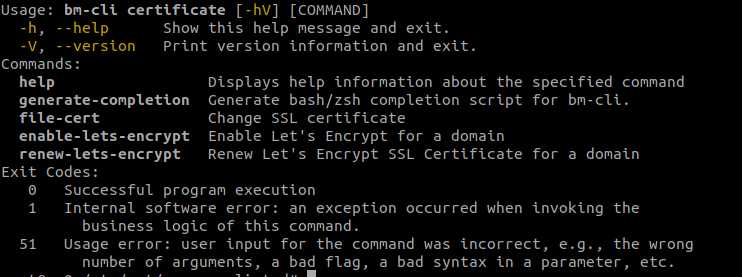

# Client CLI pour l'administration


## Présentation

Le client CLI (« Command Line Interface » = Interface de lignes de commandes) permettant d'effectuer des tâches d'administration de la plateforme BlueMind directement en ligne de commande, sans avoir à créer de scripts pour cela.

Couplé au système de monitoring bm-tick, il permet notamment des tâches d'administration de celui-ci.

## Installation

Le client bm-cli est installé par défaut dans BlueMind 4.

Un composant additionnel permettant des opération de gestion de mapi pour Outlook est, lui, optionnel et peut être installé simplement en installant le paquet correspondant :


```
$ aptitude install bm-plugin-cli-mapi
```


:::info

Aucun redémarrage de service n'est nécessaire, les commandes sont directement utilisables

:::


## Fonctionnement

### Les commandes

Les commandes sont passées via un terminal directement sur le serveur, connecté en ssh par exemple.

Par exemple, une commande permettant de connaître les carnets d'adresses d'un utilisateur :


```
root@mail:~# bm-cli contact list jdoe@bluemind.loc
{"owner":"05E25C2C-3643-4ED2-997C-4A4F39933D18","uid":"book:Contacts\_05E25C2C-3643-4ED2-997C-4A4F39933D18","name":"My contacts"}
{"owner":"05E25C2C-3643-4ED2-997C-4A4F39933D18","uid":"book:CollectedContacts\_05E25C2C-3643-4ED2-997C-4A4F39933D18","name":"Collected contacts"}
{"owner":"05E25C2C-3643-4ED2-997C-4A4F39933D18","uid":"408C741B-3FDC-44B6-B1FD-19E79404BFCF","name":"Perso"}
```


### Obtenir de l'aide


:::info

Les commandes sont enrichies au fur et à mesure des versions de BlueMind. Il se peut donc que vous ayez plus (ou moins) de commandes selon la version de votre installation.

**Il est donc important de se référer à la commande "bm-cli help" afin de savoir quelles sont celles que vous pouvez utiliser**.

Par exemple :


```
# bm-cli help
usage: bm-cli <command> [<args>]

The most commonly used bm-cli commands are:
    calendar      calendar task(s)
    contact       contact task(s)
    help          Display help information
    maintenance   maintenance task(s)
    tick          tick task(s)
    user          user task(s)

See 'bm-cli help <command>' for more information on a specific command.
```


L'installation, ici en 3.5.11, bénéficie ici des commandes calendar, contact et user qui n'étaient pas présentes sur les versions antérieures.

:::

À tout moment vous pouvez obtenir de l'aide sur une commande, une sous-commande, son usage et ses options au moyen de "help".

Par exemple "help maintenance" vous présente la commande maintenance et ses diverses actions possibles :


```
# bm-cli help maintenance
NAME
        bm-cli maintenance - maintenance task(s)

SYNOPSIS
        bm-cli maintenance
        bm-cli maintenance consolidateIndex [--workers <workers>]
        bm-cli maintenance list [--workers <workers>]
        bm-cli maintenance repair [--dry] [--workers <workers>]

COMMANDS
        With no arguments, List directory entries

        list
            List directory entries
...
```


Pour obtenir plus de détail sur une sous-commande, il vous suffit de taper la sous-commande à son tour, ici pour obtenir l'aide concernant l'opération de consolidation d'index :


```
# bm-cli help maintenance consolidateIndex
NAME
        bm-cli maintenance consolidateIndex - Consolidate a mailbox index

SYNOPSIS
        bm-cli maintenance consolidateIndex [--workers <workers>] [--] <target>

OPTIONS
        --workers <workers>
            run with X workers
...
```


:::info

BlueMind 4.4 supporte l'option `--help`, il est désormais possible d'obtenir de l'aide en ajoutant cette option à la suite d'une commande :


```
~# bm-cli maintenance --help
Usage: bm-cli maintenance [-hV] [COMMAND]
  -h, --help      Show this help message and exit.
  -V, --version   Print version information and exit.
Commands:
  help                 Displays help information about the specified command
  generate-completion  Generate bash/zsh completion script for bm-cli.
  consolidateIndex     Consolidate a mailbox index
  hsm-to-cyrus         Converts HSM snappy spool to a cyrus maildir folder
  list                 List directory entries
  repair               Run repair maintenance operation
  ops                  List available maintenance operations
Exit Codes:
   0   Successful program execution
   1   Internal software error: an exception occurred when invoking the
         business logic of this command.
  51   Usage error: user input for the command was incorrect, e.g., the wrong
         number of arguments, a bad flag, a bad syntax in a parameter, etc.


```


:::

### Exemples pratiques

#### Administration & Maintenance

##### Effectuer un *check&repair* global

La commande suivante permet d'effectuer l'opération "valider et réparer" sur l'ensemble des utilisateurs du domaine en utilisant 4 threads :


```
bm-cli maintenance repair domain.net --workers 4
```


##### Modifier le mot de passe admin0

Pour diverses raisons, techniques ou pratiques (en cas de perte, par exemple), il peut être utile de modifier le mot de passe de l'utilisateur admin0 sans avoir à se loguer dans BlueMind.

La commande suivante permet de le faire sans connaître l'ancien mot de passe :


```
bm-cli user update admin0@global.virt --password "NewPassword"
```


##### Mettre à jour la configuration tick

Lorsque [l'outil de monitoring Bm-Tick](/Guide_de_l_administrateur/Supervision/Monitoring_Bm_Tick/) est installé, il est possible d'effectuer des tâches d'administration sur celui-ci. Par exemple, vous pouvez redéployer la configuration sur l'ensemble des serveurs du domaine avec la commande suivante :


```
# bm-cli tick reconfigure
```


:::tip

L'option `--dry` permet de tester la commande : l'opération est juste simulée


```
# bm-cli tick reconfigure --dry
```


:::

##### Mettre à jour BlueMind

À partir de BlueMind 4.1, si la souscription le permet, la mise à jour de BlueMind peut se faire complètement en ligne de commande, sans passer par l'exécution de l'assistant via navigateur :


**
Debian/Ubuntu


**
Redhat/CentOS


```
aptitude update
aptitude upgrade && bm-cli setup upgrade
```


```
yum update
yum upgrade && bm-cli setup upgrade
```


#### Gestion des utilisateurs

##### Supprimer les utilisateurs archivés (suspendus) du domaine

Les commandes peuvent être couplées afin d'effectuer plusieurs opérations en une seule fois.

Par exemple, avec la commande ci-dessous on recherche les adresses emails des utilisateurs suspendus :


```
bm-cli user get domain.net --archived --display "email"
```


Il est alors possible de coupler le retour de cette commande avec une commande "delete" afin de supprimer les utilisateurs retournés :


```
bm-cli user get local.lan --display "email" | jq -r '.[].email' > /tmp/archived.txt
while read account; do bm-cli user delete --dry $account ;done < /tmp/archived.txt
```


##### Transférer des comptes d'un backend sur un autre


```


root@xfer-core:~# bm-cli maintenance xfer --help

Usage: bm-cli maintenance xfer [--dry] [--match=<match>]

                               [--source-backend=<sourceBackendId>]

                               --target-backend=<targetBackendId>

                               [--workers=<workers>] <target>

xfer users from one backend to another backend

      <target>              email address, domain name or 'all' for all domains

      --dry                 don't write antyhing, just print the todolist

      --match=<match>       regex that entity must match, for example : [a-c].\*

      --source-backend=<sourceBackendId>

                            xfer all matching users from specified backend only

                              (server uid, ip or name)

      --target-backend=<targetBackendId>

                            xfer all matching users to specified backend

                              (server uid, ip or name)

      --workers=<workers>   run with X workers
```


#### Opérations sur les calendriers

##### Partager les calendriers de tous les utilisateurs vers un utilisateur

Il peut s'avérer utile qu'un utilisateur ait des droits d'accès sur les calendriers de tous les autres utilisateurs sans pour autant qu'il soit désigné administrateur (par exemple une secrétaire devant pouvoir voir/créer des événements pour l'ensemble des collaborateurs). Afin d'éviter la tâche laborieuse de passer sur toutes les fiches d'administration des utilisateurs pour activer un partage, il est possible de réaliser cela en ligne de commande.

Cette opération n'est pas réalisable en une seule commande, néanmoins il est possible de réaliser une boucle récupérant l'ensemble des utilisateurs du domaine puis activant un partage pour chacun d'eux :


```
bm-cli users get domain.net > /tmp/allUser.domain.net
while read account; do bm-cli calendar share $account « default » toto@domain.net r;done < /tmp/allUser.domain.net
```


#### Opérations sur les contacts

Exemple de procédure pour nettoyer le carnet des collectés d'un utilisateur puis transférer les contacts vers son carnet personnel (en testant au préalable l'import) :


```
root@mail:~# bm-cli contact list jdoe@bluemind.loc
{"owner":"05E25C2C-3643-4ED2-997C-4A4F39933D18","uid":"book:Contacts\_05E25C2C-3643-4ED2-997C-4A4F39933D18","name":"My contacts"}
{"owner":"05E25C2C-3643-4ED2-997C-4A4F39933D18","uid":"book:CollectedContacts\_05E25C2C-3643-4ED2-997C-4A4F39933D18","name":"Collected contacts"}
{"owner":"05E25C2C-3643-4ED2-997C-4A4F39933D18","uid":"408C741B-3FDC-44B6-B1FD-19E79404BFCF","name":"Perso"}
root@mail:~# bm-cli contact deduplicate jdoe@bluemind.loc --addressbook-uid book:CollectedContacts\_05E25C2C-3643-4ED2-997C-4A4F39933D18
2 were removed out of 35
root@mail:~# bm-cli contact export jdoe@bluemind.loc --vcf-file-path /tmp/jdoe-collected.vcf --addressbook-uid book:CollectedContacts\_05E25C2C-3643-4ED2-997C-4A4F39933D18
addressbook book:CollectedContacts\_05E25C2C-3643-4ED2-997C-4A4F39933D18 of jdoe@bluemind.loc was exported
root@mail:~# bm-cli contact import jdoe@bluemind.loc --vcf-file-path /tmp/jdoe-collected.vcf --addressbook-uid 408C741B-3FDC-44B6-B1FD-19E79404BFCF --dry
DRY : AddressBook 408C741B-3FDC-44B6-B1FD-19E79404BFCF of jdoe@bluemind.loc was imported
root@mail:~# bm-cli contact import jdoe@bluemind.loc --vcf-file-path /tmp/jdoe-collected.vcf --addressbook-uid 408C741B-3FDC-44B6-B1FD-19E79404BFCF
AddressBook 408C741B-3FDC-44B6-B1FD-19E79404BFCF of jdoe@bluemind.loc was imported
root@mail:~# bm-cli contact reset jdoe@bluemind.loc --addressbook-uid book:CollectedContacts\_05E25C2C-3643-4ED2-997C-4A4F39933D18
Addressbook book:CollectedContacts\_05E25C2C-3643-4ED2-997C-4A4F39933D18 of jdoe@bluemind.loc was reset
```


### Maintenance

L'outil bm-cli permet d'effectuer des opérations de maintenance sur les utilisateurs, comme par exemple :


```
bm-cli maintenance repair user@domain.net			#réparer l'utilisateur user@domain.net
bm-cli maintenance repair domain.net --numworkers 4	#réparer l'ensemble des utilisateurs du domaine en utilisant 4 threads
bm-cli maintenance consolidateIndex user@domain.net	#consolider l'index de l'utilisateur user@domain.net
bm-cli maintenance consolidateIndex domain.net --from 0 --size 100 #traite les 100 premiers utilisateurs retournés
bm-cli maintenance consolidateIndex domain.net --from 101 --size 50 #traite les 50 utilisateurs suivants
bm-cli maintenance consolidateIndex domain.net --match '[a-c].\*' # traite les entités commencant par a, b ou c
```


### Installation et mise à jour

La souscription donnant accès aux mises à jour automatisées de BlueMind, elle donne aussi accès à des opérations supplémentaires du client bm-cli pour celles-ci.


:::info

Ces opérations étant sensibles et risquées, ce sont des commandes à réserver à une utilisation par des administrateurs avancés.

:::

Pour disposer de ces commandes, il est nécessaire d'installer le plugin dédié :


```
apt install bm-plugin-cli-setup

```


#### Commandes

La commande supplémentaire "`setup`" est disponible dès l'installation du plugin :


```
bm-cli help setup	#obtenir de l'aide sur les arguments disponibles et leur utilisation
bm-cli setup install --external-url bluemind.domain.net --domain domain.net --sw-pass Passw0rd
bm-cli setup install --external-url bluemind.domain.net --domain domain.net --sw-pass Passw0rd --set-contact admin@domain.net --reinstall
bm-cli setup upgrade #lance la procédure de mise à jour post-installation en lieu et place du déroulement de l'url https://<domain.net>/setup via un navigateur
```


- `--external-url` : url externe du BlueMind
- `--domain` : domaine
- `--set-contact` : permet de positionner l'adresse de messagerie par défaut pour les notifications de l'expiration de la souscription
- `--sw-pass` : permet de positionner le mot de passe de l'admin pour le *setupwizard*


#### Procédure de mise à jour

Pour réaliser une mise à jour de l'installation en ligne de commande au moyen de l'outil bm-cli, la procédure suit le même déroulement que pour une [mise à jour classique](/Guide_d_installation/Mise_à_jour_de_BlueMind/) :

1. **Préparation de la mise à jour :***NB : cette commande est disponible à partir de la version 3.5.14*****La commande "bm-cli setup" permet de paramétrer la version vers laquelle on souhaite mettre à jour.
    - saisir la commande suivante pour mettre à jour **dans la dernière version disponible** :


```
bm-cli setup version latest
```


    - pour mettre à jour **dans une version particulière**, passer le numéro de la version en paramètre :


```
bm-cli setup version 3.5.14-2
```

*NB : l'utilisation du numéro de version majeure ("3.5" ou "4" par exemple) aura les mêmes effets que l'option "latest" : la dernière version mineure disponible de celle-ci sera installée*

    - pour **bloquer la version et empêcher les mises à jour** dans une version supérieure :


```
bm-cli setup version current
```


2. **Mettre à jour les paquets :**


:::info

Si vous souhaitez limiter le temps d'interruption des services, vous pouvez passer la commande de mise à jour avec l'option "download-only" afin dans un premier temps de ne faire que télécharger l'ensemble des paquets.

N'entrainant pas d'interruption ni de ralentissement des services, cette action peut être réalisée à n'importe quel moment de la journée ou de la nuit.

On pourra ensuite lancer au moment le plus opportun la commande "upgrade" de mise à jour effective des paquets, qui entrainera donc une coupure de service plus réduite.

:::


**
Debian/Ubuntu


**
Redhat/CentOS


```
## Opérations réalisables serveur en production
aptitude update
aptitude --download-only upgrade

## Opération passant le service en maintenance
aptitude upgrade

```


```
## Opérations réalisables serveur en production
yum makecache
yum --downloadonly upgrade

## Opération passant le service en maintenance
yum upgrade
```


3. **Lancer la procédure de mise à jour :**


```
bm-cli setup upgrade
```


### Gestion des certificats SSL

Ces commandes sont disponibles à partir de la version 4.7.0.

Il y a 2 possibilités d'ajouter des certificats SSL, pour un domaine donné ou pour le système global:

- en les générant via Let's Encrypt
- important directement les fichiers.


```
# bm-cli help certificate
```




#### Commandes


```
bm-cli certificate file-cert --ca=certificate\_authority.pem --cert=cert.pem --key=private\_key.pem --domain=<domain>
bm-cli certificate enable-lets-encrypt --contact=no-reply@<default-domain> --domain=<domain>
bm-cli certificate renew-lets-encrypt --contact=no-reply@<default-domain> --domain=<domain>
```


#### Let's Encrypt

Il est possible d'utiliser Let's Encrypt pour générer le certificat pour un domaine donné ou pour le système global.

##### Activation

Afin de lancer une première génération de certificat avec Let's Encrypt, il faut jouer la commande suivante:

*bm-cli certificate enable-lets-encrypt --contact=no-reply@&lt;default-domain> --domain=&lt;domain>*

- --contact permet d'ajouter une adresse email qui permettra d'être informé lorsque l'expiration du certificat approchera. Si aucune n'est renseignée l'adresse no-reply@&lt;default-domain> sera utilisée (Pré-requis: le défault domain devra être renseigné au préalable).
- --domain: par défaut 'global.virt', si elle n'est pas renseignée


##### Renouvellement

Si le domaine possède déjà une certificat généré par Let's Encrypt, celui-ci pourra être mis à jour en jouant la commande suivante:

*bm-cli certificate renew-lets-encrypt --contact=no-reply@&lt;default-domain> --domain=&lt;domain>*

- --contact permet de modifier l'adresse email, si besoin, sinon l'adresse précédemment renseignée sera conservée.
- --domain: par défaut 'global.virt', si elle n'est pas renseignée


#### Manuelle

Il est possible d'importer manuellement un certificat SSL en ajoutant 3 fichiers obligatoires, grâce à la commande:

*bm-cli certificate file-cert --ca=certificate_authority.pem --cert=cert.pem --key=private_key.pem --domain=&lt;domain**>*

- --domain: par défaut 'global.virt', si elle n'est pas renseignée


