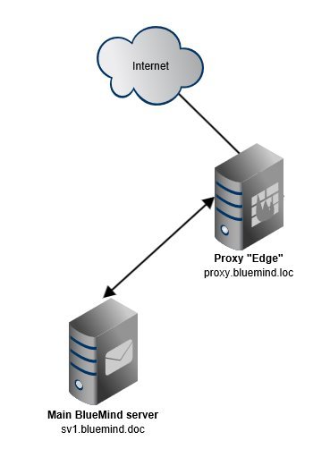
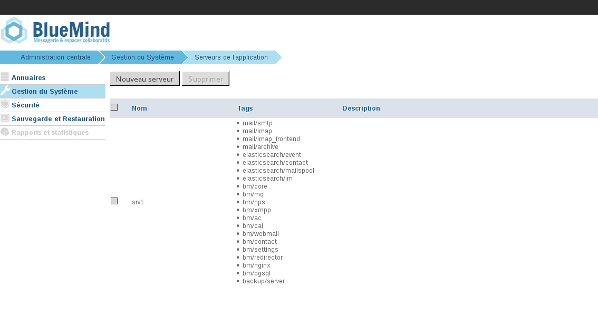
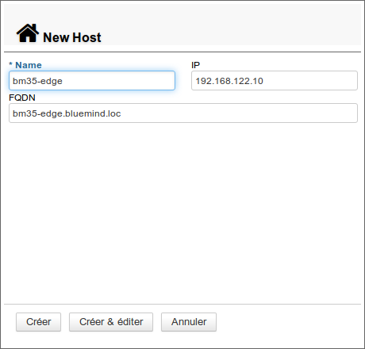
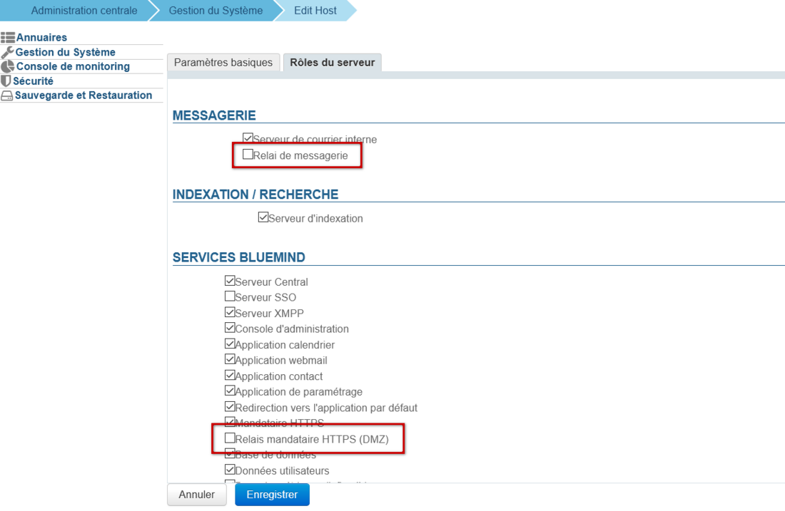
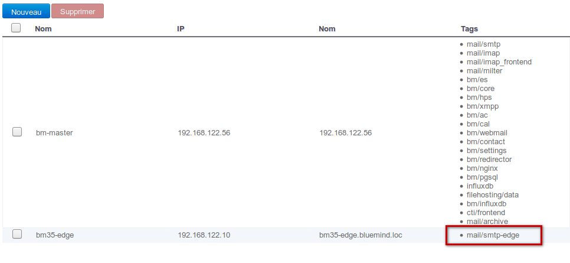
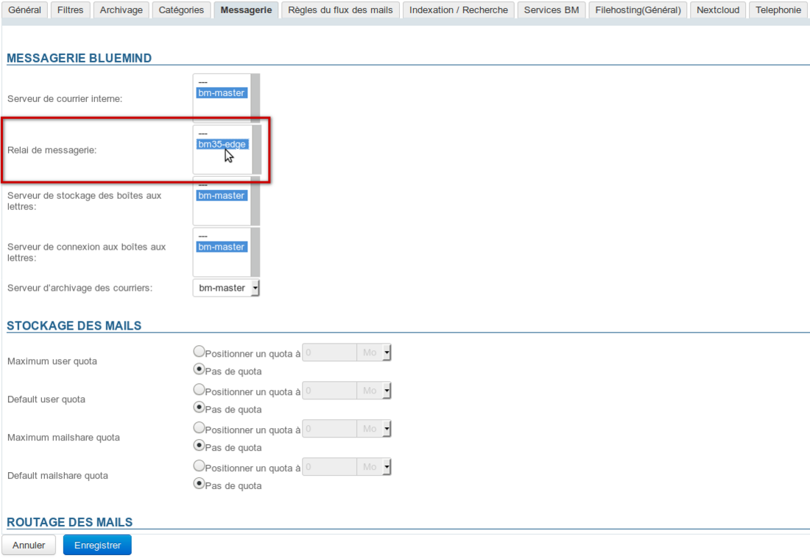
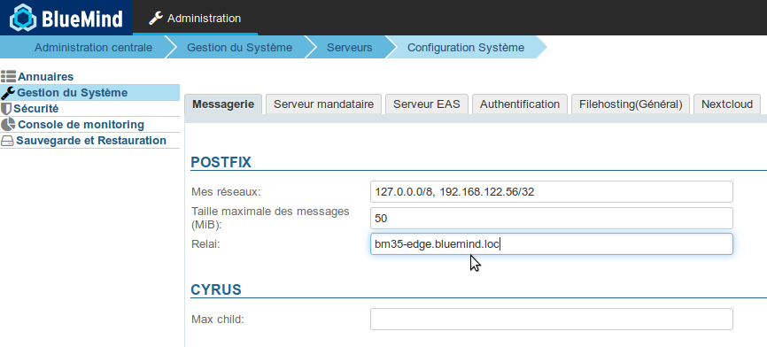

# Installation d'un serveur Edge : Nginx et Postfix


## Présentation

Le présent document a pour but de décrire la procédure de déploiement d'un serveur de type Edge BlueMind comme relai postfix et proxy.

## Principe

- BlueMind est installé sur le serveur principal
- le rôle *bm-edge-role* est installé sur le serveur dit "*Edge*"
- le serveur web nginx du serveur edge est configuré comme relai proxy servant le serveur principal


| 
 | 
| 
 |  | 
 |
 | 
 | 
 |  | 
 |
| 
 |  | 
 |


## Procédure de déploiement

1. Installer BlueMind sur le serveur principal [en suivant la procédure habituelle](https://forge.bluemind.net/confluence/display/LATEST/Guide+d%27installation)


:::info

L'espace de stockage des backups de BlueMind doit être accessible sur ce nouveau serveur sous */var/backups/bluemind*

:::

2. installer la souscription sur le serveur secondaire en tant que fichier


:::info

Rappel : le fichier texte correspondant à la souscription peut être installé manuellement sur un serveur

- pour Ubuntu / Debian en tant que `/etc/apt/sources.list.d/bm.list`
- pour RedHat / CentOS en tant que `/etc/yum.repos.d/bm.repo`


:::

3. installer le paquet `bm-edge-role` sur le serveur edge :


**
Debian/Ubuntu


**
RedHat/CentOS


```
bm35-edge.bluemind.loc:~$ sudo aptitude update
bm35-edge.bluemind.loc:~$ sudo aptitude install bm-edge-role
```


```
bm35-edge.bluemind.loc:~$ sudo yum makecache
bm35-edge.bluemind.loc:~$ sudo yum install bm-edge-role
```


4. ajouter le rôle de relai smtp au serveur edge dans le panneau d'administration du serveur principal :
    - se connecter à BlueMind sur le serveur principal avec l'utilisateur* admin0@global.virt *
    - naviguer dans *Gestion du système > Serveurs de l'application* 
    - cliquer sur le bouton *Nouveau > Serveur*
    - remplir les informations du nouveau serveur et cliquer sur *Créer* cliquer sur "Créer & éditer" ou sur "Créer" puis, une fois de retour à la liste des serveurs, cliquer sur la ligne correspondant à celui-ci
    - se rendre dans l'onglet *Rôles du serveur : * 
        - activer le rôle "Relai de messagerie"
        - **si vous utilisez le nginx de BlueMind** sur ce serveur, activer aussi le rôle "Relais mandataire HTTPS (DMZ)"
        - cliquer sur "**Enregistrer**"
    - dans la liste des serveurs, le serveur edge apparaît bien avec le tag lié au relai de messagerie *mail/smtp-edge* 
5. configurer le domaine pour utiliser ce serveur  comme relai de messagerie 
    - toujours en tant qu'utilisateur admin0@global.virt, naviguer dans *Gestion du Système > Domaines supervisés*
    - cliquer sur la ligne correspondant au domaine à configurer
    - dans l'onglet  *Messagerie*, sélectionner le serveur edge comme *Relai de messagerie* puis cliquer sur Enregistrer :
6. configurer le serveur pour envoyer les mails sortant à travers le relai :
    - toujours en tant que l'utilisateur admin0@global.virt, naviguer dans *Gestion du Système > Configuration Système*
    - dans l'onglet *Messagerie*, remplir le champ *Relai* avec l'adresse IP ou le nom d'hôte du serveur edge puis cliquer sur Enregistrer :




## Nginx

### Configuration de l'accès web


:::info

Si vous utilisez le nginx de BlueMind, et par conséquent avez activé le rôle "Relais mandataire" sur ce serveur (voir plus haut), alors cette section ne vous concerne pas, vous pouvez passer directement au point 4.2 ci-après.

:::

1. Se connecter en tant que root sur le serveur edge
2. naviguer jusqu'au dossier `/etc/nginx/sites-available`


```
bm35-edge.bluemind.loc:~# cd /etc/nginx/sites-available
```


3. créer un fichier de configuration `bm-proxy` et l'éditer, par exemple avec vim :


```
bm35-edge.bluemind.loc:/etc/nginx/sites-available# vim bm-proxy
```


4. ajouter les lignes suivantes :


```
server {
  listen 80;
  # <url\_externe\_bluemind> désigne l'url externe à laquelle les utilisateurs se connectent
  server\_name <url\_externe\_bluemind>;

  location / {
	return 301 https://<url\_externe\_bluemind>$request\_uri;
  }
}

server {
  listen 443 ssl http2;
  server\_name <url\_externe\_bluemind>;

  ssl\_certificate /etc/ssl/certs/bm\_cert.pem;
  ssl\_certificate\_key /etc/ssl/certs/bm\_cert.pem;
  ssl\_session\_timeout 5m;
  ssl\_prefer\_server\_ciphers on;

  ssl\_protocols TLSv1.2;
  ssl\_ciphers 'EDH+CAMELLIA:EDH+aRSA:EECDH+aRSA+AESGCM:EECDH+aRSA+SHA384:EECDH+aRSA+SHA256:EECDH:+CAMELLIA256:+AES256:+CAMELLIA128:+AES128:+SSLv3:!aNULL:!eNULL:!LOW:!3DES:!MD5:!EXP:!PSK:!DSS:!RC4:!SEED:!ECDSA:CAMELLIA256-SHA:AES256-SHA:CAMELLIA128-SHA:AES128-SHA';
  add\_header Strict-Transport-Security max-age=15768000; # six months

 proxy\_set\_header X-Forwarded-For $proxy\_add\_x\_forwarded\_for;

 location / {
	# <srv\_interne> est le serveur BlueMind principal
    proxy\_pass https://<srv\_interne>;
  }

  location /webmail/ {
    client\_max\_body\_size 0m;
    proxy\_pass https://<srv\_interne>/webmail/;
  }

  location /Microsoft-Server-ActiveSync {
    proxy\_pass https://<srv\_interne>/Microsoft-Server-ActiveSync;
    proxy\_read\_timeout 1200s;
    proxy\_headers\_hash\_bucket\_size 128;
    proxy\_headers\_hash\_max\_size 2048;
    client\_max\_body\_size 0m;
    proxy\_pass\_header Server;
  } 

  location /eventbus {
    proxy\_pass https://<srv\_interne>;
    proxy\_http\_version 1.1;
    proxy\_set\_header Upgrade $http\_upgrade;
    proxy\_set\_header Connection "upgrade";
  }

  location /api/filehosting/ {
    client\_max\_body\_size 0m;
    proxy\_pass https://<srv\_interne>$request\_uri;
    proxy\_set\_header        X-Real-IP       $remote\_addr;
    proxy\_set\_header        X-Forwarded-For $proxy\_add\_x\_forwarded\_for;
    proxy\_http\_version 1.1;
    proxy\_buffering off;
  }

  location /api/attachment/ {
    client\_max\_body\_size 0m;
    proxy\_pass https://<srv\_interne>$request\_uri;
    proxy\_set\_header        X-Real-IP       $remote\_addr;
    proxy\_set\_header        X-Forwarded-For $proxy\_add\_x\_forwarded\_for;
    proxy\_http\_version 1.1;
    proxy\_buffering off;
  }

  location /fh/ {
    proxy\_pass https://<srv\_interne>/fh/;
    proxy\_http\_version 1.1;
    proxy\_buffering off;
  }
}

```


5. sauvegarder le fichier et quitter l'éditeur
6. exécuter les commandes suivantes pour mettre en place la configuration :


```
bm35-edge.bluemind.loc:/etc/nginx/sites-available# ln -s /etc/nginx/sites-available/bm-proxy /etc/nginx/sites-enabled/
bm35-edge.bluemind.loc:/etc/nginx/sites-available# rm /etc/nginx/sites-enabled/default
```


7. recharger la configuration du serveur nginx :


```
bm35-edge.bluemind.loc:/etc/nginx/sites-available# service bm-nginx reload
```


### Configuration de la messagerie

1. Sur le serveur edge, copier le fichier de configuration du serveur principal situé à l'emplacement `/etc/nginx/global.d/bm-proxy-mail.conf`. Il est possible pour cela d'utiliser scp :


```
bm35-edge.bluemind.loc:~# scp root@srv1.bluemind.loc:/etc/nginx/global.d/bm-mail-proxy.conf /etc/nginx/global.d/
```


2. éditer le fichier `/etc/nginx/global.d/bm-mail-proxy.conf` sur le serveur edge et remplacer l'adresse IP de la ligne `auth_http` par l'adresse IP du serveur principal

3. recharger la configuration nginx :


```
bm35-edge.bluemind.loc:~# service bm-nginx reload
```


### Configuration XMPP

Pour que le serveur prenne en charge la gestion du flux XMPP :

1. créer le fichier `/etc/nginx/global.d/bm-xmpp-proxy.conf` avec le contenu suivant :


```
stream {
    upstream backend\_xmpp {
        least\_conn;

                server 1.2.3.4:5222;
                server 1.2.3.5:5222 backup;
    }

    server {
        listen 5222;
        proxy\_pass backend\_xmpp ;
    }
}
```

en remplaçant 1.2.3.4 par l'adresse IP du serveur principal, ou du serveur [ayant le rôle XMPP](/Guide_de_l_administrateur/Configuration/Gestion_des_domaines/#Gestiondesdomaines-ServicesBM) s'il y a lieu

2. Recharger la configuration nginx :


```
bm35-edge.bluemind.loc:~# service bm-nginx reload
```


## Proxy Apache


:::info

BlueMind déconseille d'utiliser Apache en tant que reverse proxy

:::

Il est aussi possible d'utiliser Apache comme proxy à la place de Nginx. Pour cela, il faudra utiliser une version >=2.4 d'Apache et activer les modules suivant :

- mod_ssl
- mod_proxy et mod_proxy_wstunnel
- mod_rewrite


Exemple de VirtualHost pour Apache :


```
<VirtualHost \*:80>
        Redirect / https://<url\_externe\_bluemind>/
</VirtualHost>

<VirtualHost \*:443>
        SSLEngine On

        SSLCertificateFile     "/etc/ssl/certs/bm\_cert.pem"
        SSLCertificateKeyFile  "/etc/ssl/certs/bm\_cert.pem"

        SSLProxyEngine On
        SSLProxyCheckPeerCN Off
        SSLProxyCheckPeerName Off
        SSLProxyVerify none

        # Websocket proxy
        RewriteEngine on
        RewriteCond %{HTTP:UPGRADE} ^WebSocket$ [NC]
        RewriteCond %{HTTP:CONNECTION} Upgrade$ [NC]
        RewriteRule .\* wss://<srv\_interne>%{REQUEST\_URI} [P]

        ProxyPreserveHost On
        <Location />
                ProxyPass https://<srv\_interne>/
                ProxyPassReverse https://<srv\_interne>/
        </Location>
</VirtualHost>
```


Enregistrer

Enregistrer

Enregistrer

Enregistrer

Enregistrer


