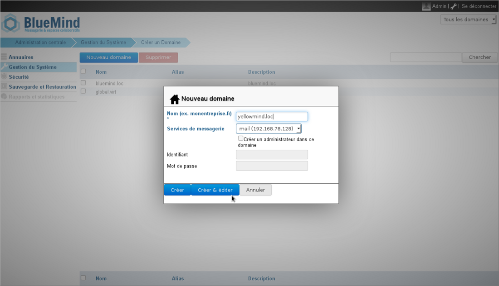
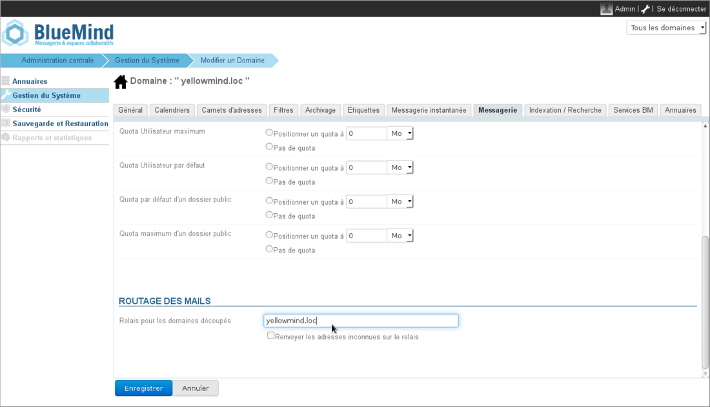
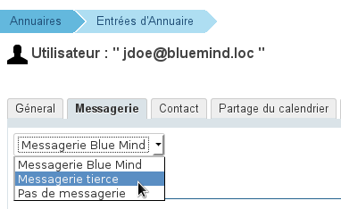
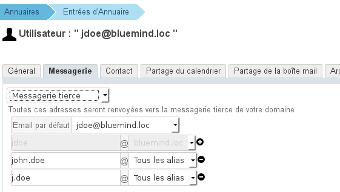
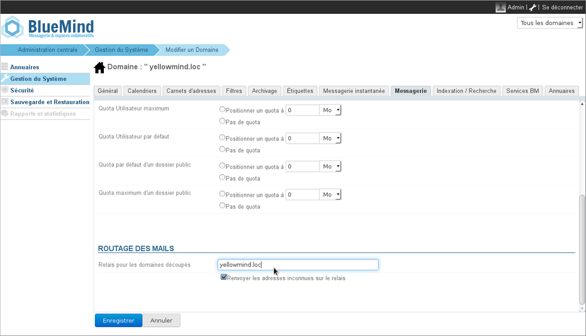

# Router directement les messages vers un autre domaine

# Introduction

Blue Mind doit être capable de ne gérer qu’une partie des utilisateurs d’un même domaine afin de s'intégrer au sein d'une architecture dans laquelle les utilisateurs d'un même domaine sont gérés par différents systèmes, et donc serveurs de messagerie.

Nous considérons que dans une architecture mail découpée (split domain), il y a un système Master ("maître" en français) et un système Slave ("esclave" en français), BlueMind pouvant être l'un ou l'autre des deux :

# Description

## Master

Le Master est le serveur qui connaît tous les utilisateurs et qui reçoit les mails depuis internet.

Si un mail est à destination du domaine mais d’un utilisateur qui n’est pas hébergé par lui il le transfère au serveur Slave.
:::important
Il ne faut pas créer de règle de forward “par défaut”, car c’est le serveur Master qui doit dire si la boite existe ou non ( “mailbox doesn’t exist” ).
:::

****Fonctionnement** **:**** on relaye explicitement un utilisateur sur un autre serveur SMTP

## Slave

Il ne connaît pas la totalité des utilisateurs, seulement ceux qu’il héberge.

Quand il envoie un mail pour le domaine, il doit être capable de le transférer au master, car il ne connaît pas tous les utilisateurs pour ce domaine.
:::important
Il faut une règle de redirection par défaut, car c’est le serveur maître qui connaît ou non l’existence de la bal ( “mailbox doesn’t exist” ).
:::

****Fonctionnement :**** on doit relayer pour tous les destinataires que l’on ne connaît pas, y compris de la partie du domaine que l’on gère.

# Mise en œuvre

## BlueMind en tant que serveur maître
:::important

Les utilisateurs doivent tous être connus de BlueMind.
Les utilisateurs non hébergés par Blue Mind ne doivent pas pouvoir se connecter ou utiliser BlueMind.
:::

### Configuration de BlueMind

Afin que BlueMind puisse rediriger directement (sans passer par le MX) les messages lui arrivant vers le domaine gérant les adresses destinataires :

- **Si le domaine de destination n'existe pas encore dans BlueMind**, le créer :
  - connecté en tant que superadministrateur admin0, aller dans Gestion du Système > Domaine supervisés
  - cliquer sur "Nouveau domaine" et saisissez le nom du domaine à créer :
  - cliquer sur «Créer et éditer» pour se rendre directement à la gestion du domaine.
- **Si le domaine existe déjà**, se rendre dans son espace de gestion :
  - connecté en tant que superadministrateur admin0, allez dans Gestion du Système > Domaine supervisés
  - cliquer sur le nom du domaine dans la liste
- **Enfin, dans tous les cas** se rendre dans l'onglet «Messagerie» > section «Routage des mails» et :
  - dans le champs "Relais pour les domaines découpés" renseigner le nom ou l'adresse IP du domaine cible
  - pour la case "Renvoyer les adresses inconnues sur le relais" :
    - soit tous les utilisateurs existent sur le serveur BlueMind et ceux qui ne sont pas migrés sont bien marqués en messagerie tierce alors il ne faut pas cocher cette case
    - soit seuls les utilisateurs BlueMind sont connus et il faut alors cocher la case pour que les mails à destination des utilisateurs non migrés soient reroutés vers l'ancien serveur
- Valider en cliquant sur «Enregistrer».

### Configuration des utilisateurs

Pour chaque utilisateur concerné, une fois l'utilisateur créé dans BlueMind il faut indiquer le type de messagerie. Pour cela :

- Se connecter au panneau d'administration en tant que superadministrateur admin0 ou un administrateur des utilisateurs
- Se rendre dans Annuaires > Entités d'annuaires
- Sélectionner l'utilisateur à configurer et aller dans l'onglet «Messagerie»
- Dans la liste déroulante en haut de page, sélectionner "Messagerie tierce" :
- Un nouveau formulaire est alors proposé, qui permet de sélectionner tout ou partie des adresses mails configurées pour l'utilisateur, sachant que tout courriel arrivant à destination de ces adresses sera renvoyé au système de messagerie tiers :
- Cliquer sur «Enregistrer» pour valider les modifications

## BlueMind en tant que serveur esclave
:::important

Il s'agit d'une redirection par domaine. Dans ce mode de fonctionnement, les adresses inconnues du domaine sont redirigées vers un serveur relais maître.

:::

Afin que BlueMind puisse rediriger directement (sans passer par le MX) les messages lui arrivant vers le serveur maître :

- **Si le domaine de destination n'existe pas encore dans BlueMind**, le créer :
  - connecté en tant que superadministrateur admin0, aller dans Gestion du Système > Domaine supervisés
  - cliquer sur "Nouveau domaine" et saisissez le nom du domaine à créer :
  - cliquer sur «Créer et éditer» pour se rendre directement à la gestion du domaine.
- **Si le domaine existe déjà**, se rendre dans son espace de gestion :
  - connecté en tant que superadministrateur admin0, allez dans Gestion du Système > Domaine supervisés
  - cliquer sur le nom du domaine dans la liste
- **Enfin, dans tous les cas** se rendre dans l'onglet «Messagerie» > section «Routage des mails» et :
  - dans le champs "Relais pour les domaines découpés" renseigner le nom ou l'adresse IP du domaine cible
  - **Cocher la case** "Renvoyer les adresses inconnues sur le relais"
- Valider en cliquant sur «Enregistrer».

