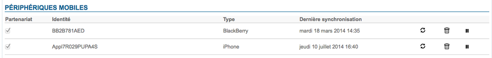

# MDM - Mobile Device Management

La synchronisation de mobile se réalise via le protocole ActiveSync, et permet une synchronisation native, sans installation de composant supplémentaire sur les smartphones pour les mail, contacts ou agendas.BlueMind intègre des services de MDM («Mobile Device Management») permettant de gérer la flotte de smartphones autorisés à se connecter à BlueMind.Par défaut un smartphone n’est pas autorisé à se connecter via ActiveSync.Via la console d’administration, l’administrateur de la plateforme peut autoriser un smartphone à se synchroniser. L’autorisation est seulement affectée à un smartphone en fonction d’un utilisateur, c’est un partenariat.Si le smartphone est réutilisé pour une autre collaborateur il faudra réapprouver le partenariat.Depuis la console d’administration s’offre alors plusieurs options de gestion :
- Réinitialiser la synchronisation des données, en cas de maintenance ou de dysfonctionnement du smartphone.Il n’est ainsi pas nécessaire de rapatrier le smartphone physiquement au service informatique, la manipulation de se réalise à distance.
- Supprimer le partenariat : le smartphone n’est plus autorisé à se synchroniser avec le compte utilisateur.
- Réinitialiser le smartphone à distance : cette fonctionnalité permet d’effacer complètement **toutes les données du smartphone** (reset usine) et ainsi prévenir toute perte d’informations en cas de vol.

Pour en savoir plus sur la configuration du serveur EAS et la gestion des périphériques, consulter la page [Configuration du serveur EAS](/Guide_de_l_administrateur/BlueMind_et_mobilite/Configuration_du_serveur_EAS/)

