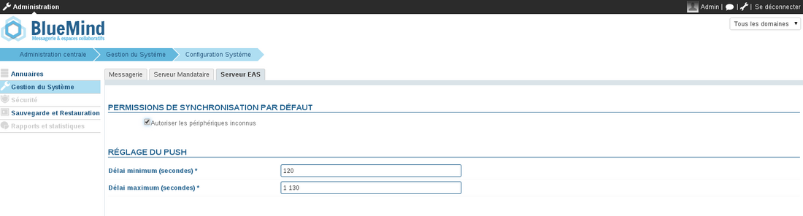
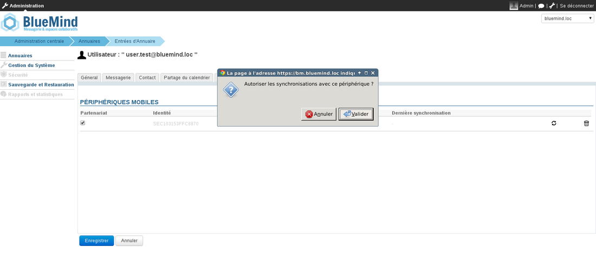
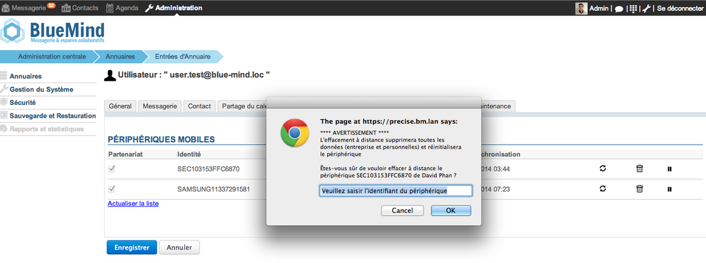
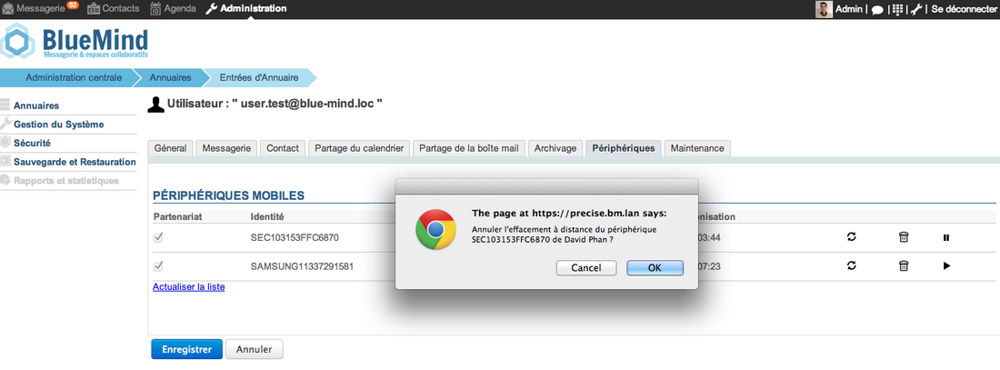

# Configuration du serveur EAS

## Présentation

Le serveur EAS (Exchange ActiveSync) permet la synchronisation des données présentes sur les serveurs BlueMind avec un terminal mobile.

Il existe quelques paramètres de configuration pour activer cette fonctionnalité, désactivée par défaut pour les terminaux inconnus, pour des raisons de sécurité.

:::info

Délai de première synchronisation

À partir de la version 3.5.10-3 de BlueMind, un système de cache a été mis en place pour des raisons de performances du serveur qui implique un délai pour la 1ère synchronisation des appareils.

Quel que soit le mode d'autorisation choisi (voir ci-après), la première synchronisation d'un périphérique se fera 10mn après son autorisation par le serveur (demande du périphérique dans le cas d'une autorisation générale, activation par l'administrateur dans le cas d'une autorisation unitaire).

De même, lorsqu'une autorisation est retirée à un périphérique, la synchronisation cessera sur l'appareil 10mn après.

Ce délai n'est ni paramétrable ni modifiable.

:::

## Autoriser la synchronisation de tous les périphériques

Pour permettre à n'importe quel périphérique de se connecter au serveur EAS et ne pas avoir à accepter chaque périphérique, il faut suivre les étapes suivantes :

1. Se connecter à la console d'administration du serveur BlueMind en tant qu'administrateur global
2. Aller dans le menu *Gestion du Système > Configuration Système*
3. Sélectionner l'onglet *Serveur EAS*
4. Cocher la case **Autoriser les périphériques inconnus**

5. Cliquer sur le bouton *Enregistrer*

## Autoriser un périphérique donné

Lorsque l'option d'autorisation de synchronisation de périphériques inconnus n'est pas activée, il est possible d'autoriser un périphérique spécifique lorsque celui-ci a déjà tenté de se synchroniser une première fois.

1. Se connecter à la console d'administration BlueMind en tant qu'administrateur global
2. Aller dans le menu *Annuaires > Entrées d'annuaire* pour gérer les utilisateurs
3. Cliquer sur l'utilisateur dont le périphérique doit être autorisé
4. Sélectionner l'onglet *Périphériques*
5. Cocher les périphériques mobiles de l'utilisateur à autoriser ou décocher ceux dont il faut supprimer l'accès

6. Cliquer sur *Enregistrer*

:::tip

Supprimer un périphérique

L'icône  permet de retirer l'autorisation donnée à un périphérique.

:::

## Effacement d'un périphérique à distance

En cas de perte ou de vol, il est possible d'effacer le contenu d'un périphérique à distance.

:::info

ATTENTION

L'effacement à distance supprime toutes les données présentes sur le téléphone, qu'elles soient liées au compte BlueMind ou d'ordre privées (photos, SMS, ....). **Cette opération est irréversible.**

:::

1. Se connecter à la console d'administration BlueMind en tant qu'administrateur
2. Aller dans le menu *Annuaires > Entrées d'annuaires*
3. Sélectionner l'utilisateur dont le périphérique doit être effacer
4. Sélectionner l'onglet *Périphériques*
5. Cliquer sur l'icône   "Effacement à distance"
6. Une popup de confirmation apparaît. Valider l'opération en saisissant l'identifiant du périphérique et cliquer sur *Valider*
**
7. Le téléphone se ré-initialise avec les paramètres d'usine

:::info

ATTENTION

Si le téléphone tente de se re-synchroniser avec BlueMind, celui-ci sera effacé de nouveau.

:::

Pour autoriser de nouveau un périphérique à se synchroniser avec BlueMind:

1. Se connecter à la console d'administration BlueMind en tant qu'administrateur
2. Aller dans le menu *Annuaires > Entrées d'annuaires*
3. Sélectionner l'utilisateur dont le périphérique doit être ré-autorisé
4. Sélectionner l'onglet *Périphériques*
5. Cliquer sur l'icône  "Annuler l'effacement du périphérique"
6. Valider la demande de confirmation
7. Le périphérique peut dès lors se synchroniser de nouveau avec BlueMind.

