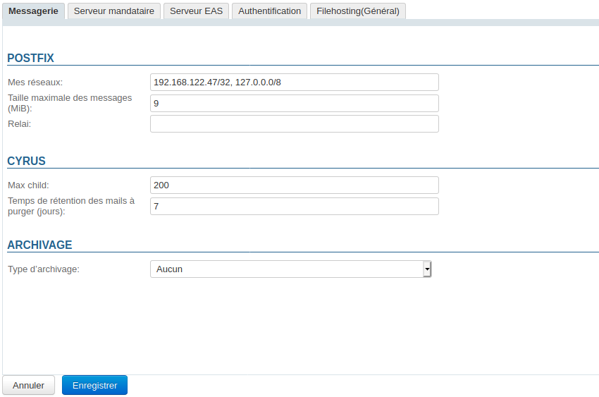
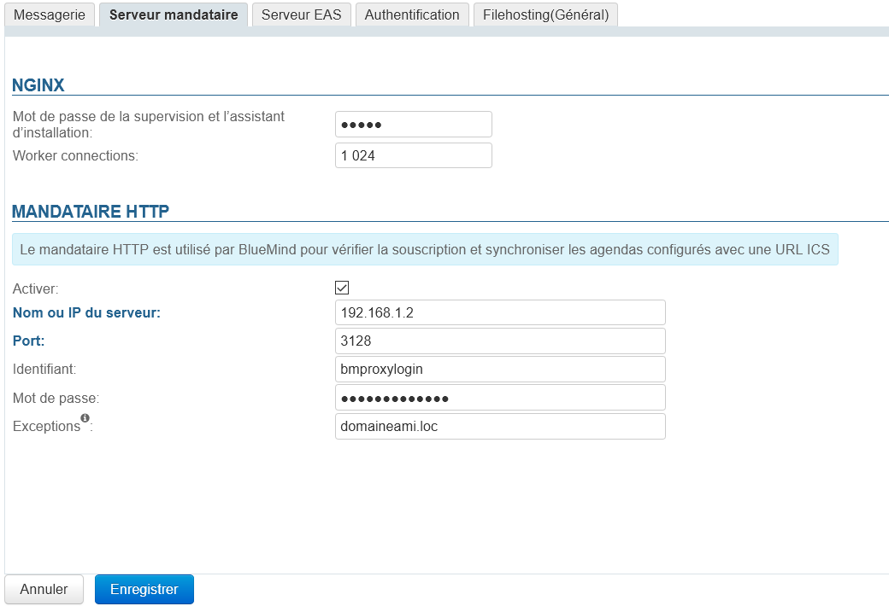
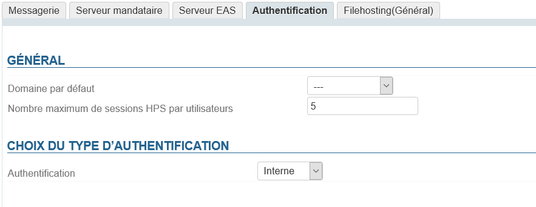
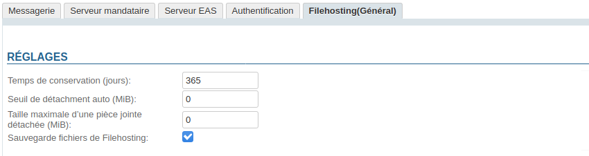

# Configuration système


# Messagerie

Ce premier onglet de la configuration système permet de positionner les paramètres postfix et Cyrus du système.



## Postfix

- 
**Mes réseaux** 
Liste des clients SMTP internes ayant des privilèges supérieurs aux clients SMTP externes.
Indiquez une liste d'expressions réseau/masque, séparé par des virgules et/ou des espaces, par exemple :


```
127.0.0.0/8, 192.168.198.0/24
```


Pour plus d'informations voir [http://postfix.traduc.org/index.php/postconf.5.html#mynetworks](http://postfix.traduc.org/index.php/postconf.5.html#mynetworks)

- 
**Taille maximale des messages**Taille maximale en MiB des messages que les utilisateurs sont autorisés à envoyer.
:::important

Attention, il s'agit de la taille des **messages** et non des pièces jointes que ceux-ci contiennent.

Après conversion pour inclusion dans un mail, la taille d'une pièce jointe augmente, il faut donc compter environ 50% de plus que souhaité.
Par exemple, si l'on souhaite autoriser les pièces jointes jusqu'à 10Mo, il faut régler la taille maximale des messages à 15Mo.

:::
:::important

Limite maximum

La taille maximale des messages pris en charge par BlueMind ne peut pas excéder 100Mo.

:::

- 
**Relai** 
Indiquez ici l'adresse du relais vers lequel doivent transiter les messages sortants.


:::important

L'unité MiB (MebiByte) est un multiple du byte (octet) à différencier du MB (megabyte, ou Mo méga-octet) : il représente 1024 kebibytes, lui-même représentant 1024 bytes (octets).

Ainsi 9 MiB sont équivalents à 9,43718 MB (Mo)

:::

## Cyrus

- **Max child** Ce champs définit le nombre max de processus IMAP que cyrus peut démarrer, par défaut il est de 200.Il peut s'avérer utile voire nécessaire de l'augmenter, notamment dans le cas où l'on rencontre des [problèmes d'identifications](/Guide_de_l_administrateur/Résolution_de_problèmes/Erreurs_d_identification_IMAP/).On compte habituellement environ 100 process pour 50 clients lourds démarrés en même temps, ou susceptibles de l'être.
- **Temps de rétention des mails à purger (jours)** Nombre de jours pendant lesquels les messages sont conservés sur le serveur après suppression par l'utilisateur (suppression complète directe ou corbeille vidée). Pendant cette durée, les emails supprimés par l'utilisateur peuvent toujours être restaurés.


## Archivage

Une liste déroulante permet ici de choisir le type d'archivage :

- Aucun
- Archive natif Cyrus
- Stockage objet S3


# Serveur Mandataire

L'onglet «Serveur Mandataire» permet à l'administrateur de paramétrer Ngninx ainsi qu'un serveur proxy.

## Nginx

- 
**le mot de passe de la supervision et de l'assistant d'installation** positionné automatiquement par BlueMind [lors de son installation](/Guide_d_installation/Configuration_post_installation/), il s'agit du mot de passe permettant d'accéder à [l'interface de mise à jour](/Guide_d_installation/Mise_à_jour_de_BlueMind/).
:::important

L'ancien mot de passe n'est pas demandé à l'administrateur connecté, il peut donc le modifier ici en cas de perte.

:::

- 
**worker connections** : le nombre maximum de connexions pouvant être ouvertes simultanément par un processus
Un *worker* travaille pour une connexion, on compte donc worker_connections = nombre de connexions actives (ou susceptibles de l'être) en même temps. Soit le plus souvent worker_connections = nombre d'utilisateurs.
:::important

Afin d'adapter au mieux la valeur de ce paramètre, on pourra passer la commande sur le serveur afin de connaître le nombre de connexions actives à un instant T, en journée et en semaine par exemple :


```
ss -p | grep nginx | grep -i estab | wc -l
```


:::


## Serveur mandataire HTTP (proxy)

 Dans divers scénarios, comme l'interrogation de calendriers externes, certaines installations nécessitent l'utilisation d'un serveur mandataire HTTP (proxy). A partir de la version 4.4 il est possible de configurer un tel serveur mandataire par lequel transiteront les requêtes externes passées par BlueMind.

- **Activer** : le serveur peut être désactivé en décochant cette case sans que le formulaire soit vidé, cela permet d'activer/désactiver le proxy au besoin sans avoir à saisir les informations de nouveau à chaque fois.
- **Nom ou IP du serveur**
- **Port**
- **Identifiant**
- **Mot de passe**
- **Exceptions** : les requêtes passées vers ces domaines ne passeront pas par le serveur proxy mais seront interrogées directement par BlueMind.Renseigner le champs sous forme d'une liste de noms et/ou IP séparés par des virgules.NB : le caractère "*" est supporté uniquement en préfixe


# Serveur EAS

L'onglet «Serveur EAS» donne accès aux options de configuration du serveur Exchange Active Sync permettant la synchronisation des appareils mobiles.


:::important

Si des problèmes de communication persistent, on pourra utiliser l'outil de diagnostic en ligne de Microsoft afin de s'assurer que le serveur est correctement configuré et joignable : [https://testconnectivity.microsoft.com/](https://testconnectivity.microsoft.com/)

:::

# Authentification



Cet onglet permet de définir :

- **Le domaine par défaut**, dans le cas d'une installation multi-domaines
- Le **nombre maximum de sessions HPS par utilisateurs** : le nombre de connexions simultanées à un même compte depuis plusieurs postes/navigateurs différents (les appareils mobiles se connectant par EAS ne comptent pas).Cette valeur est utile en particulier dans le cas de comptes de gestion partagés par plusieurs personnes (compte utilisateur de contact ou d'administration par exemple).
- **Le type d'authentification** des utilisateurs :
  - Interne
  - [Authentification SSO CAS](/Guide_de_l_administrateur/Configuration/Gestion_des_domaines/Les_méthodes_d_authentification/Mise_en_place_du_SSO_CAS/)
  - [Authentification SSO Kerberos](/Guide_de_l_administrateur/Configuration/Gestion_des_domaines/Les_méthodes_d_authentification/Mise_en_place_du_SSO_Kerberos/)


# Filehosting

Cet onglet définit les valeurs par défaut pour les **nouveaux domaines créés**, **il ne définit pas ni ne supplante les valeurs de l'ensemble des domaines**.



- **Temps de conservation (jours)** : le nombre de jours pendant lesquels les fichiers seront conservés sur le serveur, à partir de leur date d'envoi initiale
- **Seuil de détachement auto (MiB)** : taille à partir de laquelle un fichier ajouté à un message est automatiquement détaché de celui-ci
- 
**Taille maximale d'une pièce jointe détachée (MiB)** : taille maximale de fichier autorisée
Il s'agit de la taille autorisée **par fichier**, plusieurs fichiers dont la taille totale dépasse la limite peuvent donc être ajoutés et détachés à un seul et même message du moment que chacun d'eux respecte la limite.

- **Sauvegarde fichiers de Filehosting** : si cette case est cochée, le dossier de stockage sur le serveur sera inclus dans les tâches de [sauvegarde](https://forge.bluemind.net/confluence/display/BM4/Sauvegarde+et+restauration) de BlueMind

:::important

L'unité MiB (MebiByte) est un multiple du byte (octet) à différencier du MB (megabyte, ou Mo méga-octet) : il représente 1024 kebibytes, lui-même représentant 1024 bytes (octets).

Ainsi 9 MiB sont équivalents à 9,43718 MB (Mo)

:::


