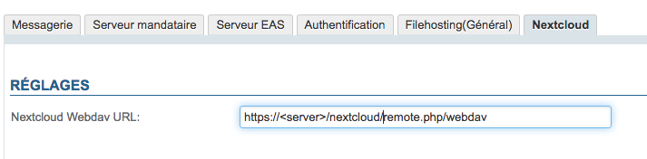
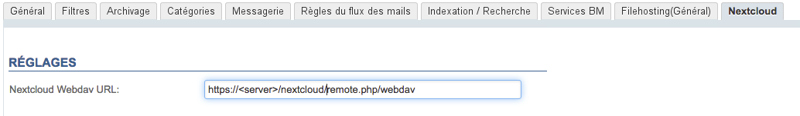
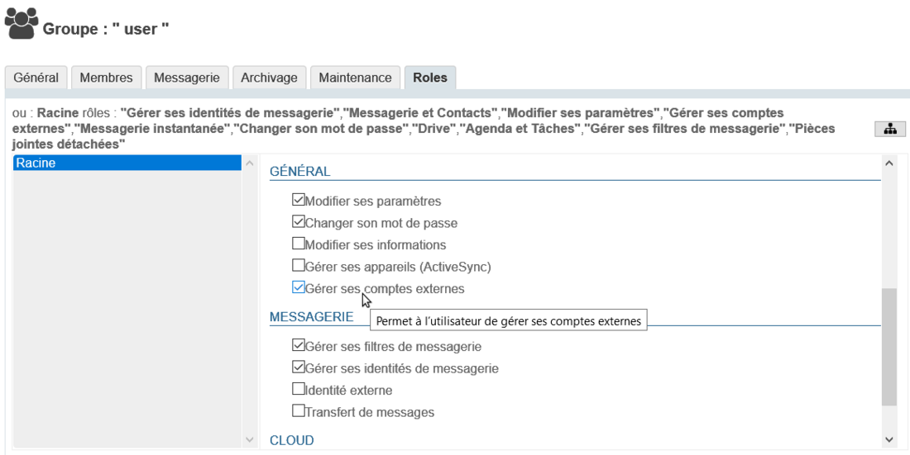

# Connecter avec Nextcloud


## Présentation

BlueMind offre la possibilité de connecter un dépôt de document (ou *drive*) externe Nextcloud.

Les utilisateurs ont la possibilité d'utiliser leur espace personnel Nextcloud pour gérer les fichiers qu'ils envoient par leur messagerie BlueMind et ainsi profiter des avantages offerts par leur dépôt : arborescence de fichiers, déplacement, suppression, sécurité, synchronisation avec leurs autres applications, etc.

Les administrateurs gagnent en maîtrise de l'outil : gestion plus fine et facilitée de l'espace disque, gestion par utilisateur, centralisation des données, contrôle de la sécurité et des sauvegardes.

##### Versions supportées

BlueMind supporte les versions 11 et supérieures de Nextcloud.
Les fichiers indiqués dans ce guide pour la version 12 sont compatibles avec les versions suivantes.


## Prérequis

### Installation de Nextcloud

Nextcloud doit être installé et fonctionnel.


:::info

Nextcloud est un produit indépendant de BlueMind, pour plus de renseignement sur l'obtention, l'installation et le fonctionnement de celui-ci, se reporter au site [https://Nextcloud.com/](https://nextcloud.com/)

:::


:::info

Lorsque Nextcloud est exécuté dans Apache + PHP-FPM, Nextcloud n'est pas capable de récupérer le contenu du fichier. Le fichier uploadé fait alors 0 octets sans que l'erreur ne soit remontée a BlueMind ni n'apparaisse dans les logs.

Référence du bug Apache : [https://bz.apache.org/bugzilla/show_bug.cgi?id=57087](https://bz.apache.org/bugzilla/show_bug.cgi?id=57087)

**Le plugin BlueMind pour Nextcloud ne fonctionnera donc pas si Nextcloud est déployé dans un PHP-FPM derrière Apache, il faut utiliser mod_php ou Nginx+PHP-FPM.**

:::

### Désinstallation du dépôt de document BlueMind

Nextcloud peut être utilisé :

1. ** **en cohabitation avec le dépôt interne à BlueMind** ** : si l'utilisateur ne renseigne pas d'identifiant de connexion à Nextcloud c'est BlueMind qui sera utilisé.Pour cela, procéder à l'installation telle que décrite au chapitre suivant.
2. ** **en remplacement du dépôt interne à BlueMind** ** : si l'utilisateur ne renseigne pas d'identifiant de connexion à BlueMind, il n'aura pas accès à la fonctionnalité de détachement des pièces jointes.
Pour cela, désinstaller le paquet dédié au filhosting BlueMind :


```
aptitude remove bm-plugin-core-filehosting-filesystem
bmctl restart
```


:::tip

Le redémarrage de BlueMind est nécessaire à la prise en compte de la désinstallation mais il peut être différé, vous pouvez procéder à l'installation ci-dessous et redémarrer plus tard.

:::
Puis procéder à l'installation telle que décrite au chapitre suivant.


## Installation

### À partir de BlueMind 4.2

Installer les paquets dédiés :


**
Debian/Ubuntu


**
Redhat/CentOS


```
aptitude install bm-nextcloud-common bm-nextcloudXX
```


yum install bm-nextcloud-common bm-nextcloudXX


où XX correspond à votre version de Nextcloud :


```
aptitude install bm-nextcloud-common bm-nextcloud12
```


- jusqu'à Nextcloud 11 renseigner le numéro exact
- **si la version est 12 ou supérieure alors utiliser le paquet bm-nextcloud12**


### Versions antérieures à BlueMind 4.2

- Télécharger l'archive sur le [marketplace de BlueMind](https://marketplace.bluemind.net/addons/80/) et la décompresser
- Récupérer les fichiers jar contenus :
    - dans le dossier `net.bluemind.filehosting.nextcloud`
    - dans le dossier `net.bluemind.filehosting.nextcloud*` correspondant à votre version de Nextcloud


:::tip

Pour les versions de Nextcloud supérieures à 12, prendre le fichier situé dans le répertoire `net.bluemind.filehosting.nextcloud12`

:::
- Déposer ces 2 fichiers sur le serveur dans le répertoire `/usr/share/bm-core/extensions/`
- Supprimer le répertoire `/var/lib/bm-core`
- Redémarrer le core :


```
service bm-core restart
```


- Déposer le fichier `net.bluemind.ui.adminconsole.nextcloud.settings-*.jar` sur le serveur dans le répertoire `/usr/share/bm-webserver/extensions`
- Supprimer le répertoire `/var/lib/bm-webserver`
- Redémarrer le webserver :


```
service bm-webserver restart
```


## Configuration


:::tip

Trouver l'url d'accès

L'url par défaut de l'accès WebDAV de Nextcloud peut être, selon les versions, de la forme :

- http(s)://&lt;server>/nextcloud/remote.php/dav/files
- http(s)://&lt;server>/remote.php/webdav/


Reportez-vous aux paramètres d'administration de votre serveur Nextcloud pour savoir quelle est exactement l'url d'accès WebDAV de celui-ci.

Pour plus d'information, vous pouvez aussi consulter [https://docs.nextcloud.com/server/12/user_manual/files/access_webdav.html](https://docs.nextcloud.com/server/12/user_manual/files/access_webdav.html)

:::

### Pour tous les domaines

La connexion de BlueMind à Nextcloud pour l'ensemble des domaines ne peut être faite que par le superadministrateur :

- se connecter à la console d'administration en tant qu'admin0
- se rendre dans Gestion du système > Configuration Système > Onglet Nextcloud
- renseigner l'url WebDav du Système Nextcloud :


### Pour un domaine particulier

La connexion de BlueMind à Nextcloud pour un domaine en particulier peut être paramétrée par toute personne ayant reçu [le rôle "Administrateur de domaine"](/Guide_de_l_administrateur/Gestion_des_entités/Utilisateurs/Les_rôles_droits_d_accès_et_d_administration/) pour le domaine souhaité.

- se connecter à la console d'administration en tant qu'administrateur de domaine
- se rendre dans Gestion du système > Domaines Supervisés > sélectionner le domaine > Onglet Nextcloud
- renseigner l'url WebDav du Système Nextcloud :


## Donner l'accès aux utilisateurs

### Activation

Afin que les utilisateurs puissent accéder à cette fonctionnalité, il est nécessaire de leur donner le rôle correspondant.

Cela peut être fait par groupe ou par utilisateur, il suffit de se rendre dans la fiche d'administration du groupe ou de l'utilisateur souhaité et d'activer le rôle "**Gérer ses comptes externes**" :



### Connexion

Une fois Nextcloud correctement installé et configuré, et le rôle attribué, les utilisateurs peuvent connecter leur compte Nextcloud avec leur compte BlueMind.

Pour en savoir plus sur la façon de procéder et l'utilisation, veuillez vous reporter à la page du manuel utilisateur [Fichiers volumineux et détachement des pièces jointes](/Guide_de_l_utilisateur/La_messagerie/Fichiers_volumineux_et_détachement_des_pièces_jointes/)


