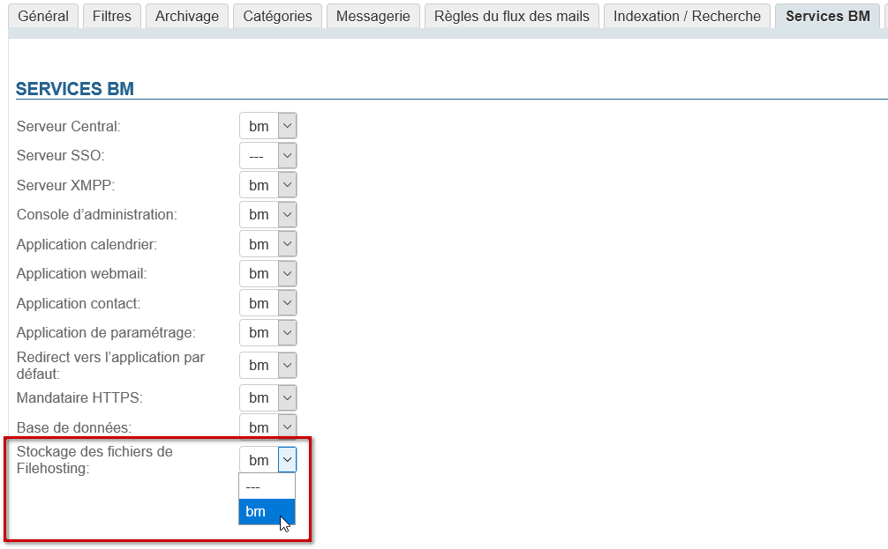
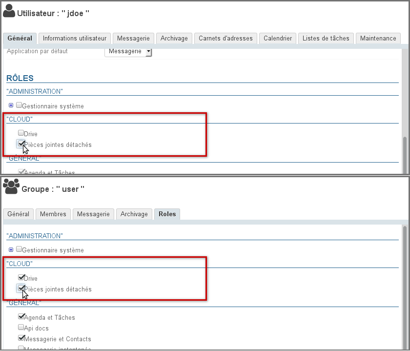
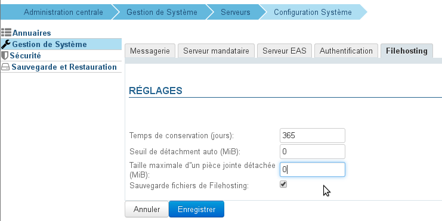

# Détachement des pièces jointes


## Présentation

BlueMind permet de [détacher les pièces jointes des messages](/Guide_de_l_utilisateur/La_messagerie/Fichiers_volumineux_et_détachement_des_pièces_jointes/) afin de les présenter sous forme de lien de téléchargement aux destinataires. Ceci permet d'alléger le message envoyé, et de ce fait les serveurs et réseaux de communication : le fichier n'est plus transmis avec l'email pour être stocké sur le serveur qui le reçoit en plus du serveur émetteur, en étant éventuellement dupliqué et multiplié au grès des transferts et réponses.


## Stockage des fichiers

Les fichiers sont stockés sur le serveur BlueMind lui-même dans le répertoire `/var/spool/bm-filehosting/<domaine>/`.


:::tip

Arborescence des dossiers

Les fichiers sont stockés dans des sous-dossiers par UID d'utilisateur, ils sont de la forme `/var/spool/bm-filehosting/<domaine>/**<initiale de l'UID>/<UID>**/Attachments`

Ainsi, les utilisateurs migrés depuis BlueMind 3.0 ont un dossier de la forme `/u/user_entity_XXX` et les utilisateurs créés en 3.5 ont un dossier de la forme `f/F149E21D-596B-49CF-AECC-AC354139A06B`.

:::

Les fichiers ainsi stockés ne sont pas comptabilisés dans les quotas des utilisateurs qui ne concernent que les emails, que la fonctionnalité *Drive* (possibilité de retrouver les fichiers par la suite) soit activée ou non.

Ainsi, suivant l'utilisation qui est faite et le nombre d'utilisateurs de l'installation, cet espace peut être amené à prendre beaucoup d'ampleur. Afin de prévenir une saturation de l'espace disque du serveur, il est donc recommandé de créer un montage permettant d'externaliser le stockage et de mettre en place une surveillance sur celui-ci.

## Mise en œuvre

### Installation des paquets


:::info

A partir de BlueMind 4.3 les paquets sont installés par défaut, il n'est pas nécessaire de procéder à leur installation manuelle.

:::

Par défaut lors d'une installation de BlueMind en version inférieure à 4.3, le détachement des pièces jointes n'est pas disponible pour les utilisateurs. Pour leur donner accès à cette fonctionnalité, l'administrateur doit procéder à l'installation des paquets nécessaires et au redémarrage du serveur :


**
Debian/Ubuntu


**
RedHat/CentOS


```
# sudo aptitude install bm-plugin-webserver-filehosting bm-plugin-core-filehosting-filesystem bm-plugin-admin-console-filehosting-settings
# bmctl restart
```


```
# yum install bm-plugin-webserver-filehosting bm-plugin-core-filehosting-filesystem bm-plugin-admin-console-filehosting-settings
# bmctl restart
```


:::info

Actuellement, les fichiers sont hébergés sur le serveur BlueMind lui-même. Une [connexion avec le service Nextcloud](/Guide_de_l_administrateur/Configuration/Détachement_des_pièces_jointes/Connecter_avec_Nextcloud/) est aussi possible.

À l'avenir BlueMind permettra une interconnexion avec d'autres services externes de partage de fichiers tels que Dropbox, ownCloud, Pydio, etc.

:::

### Définition du serveur

Il faut indiquer à BlueMind le serveur qui doit être utilisé pour stocker les fichiers détachés en attribuant le rôle "Fichier de Filehosting" au serveur souhaité, y compris dans le cas d'une architecture mono-serveur.

- connecté en tant qu'admin0
- se rendre dans Gestion du Système > Serveurs de l'application > [choisir le serveur] > onglet "Rôles du serveur"
- dans la section "Services BM", cocher la case "Fichiers de Filehosting" :


### Activation pour le domaine

Une fois le serveur défini, il faut activer le service pour le ou les domaines souhaités.

Pour cela, se rendre dans Gestion du système > Domaines supervisés > choisir un domaine > onglet "Services BM" et désigner au moyen de la liste déroulante le serveur sur lequel le rôle a été activé précédemment :



### Activation pour les utilisateurs

Une fois les paquets installés et le serveur défini, la fonctionnalité doit être activée pour les utilisateurs en leur affectant le rôle adéquat ; ainsi la fonctionnalité peut être activée pour l'ensemble des utilisateurs ou certains seulement, de façon nominative ou via les groupes.

2 droits complémentaires sont donc à présent disponibles :

- **Pièces jointes détachées** : permet aux utilisateurs de détacher et lier des fichiers
- **Drive** : permet l'accès au sélecteur de fichiers BlueMind. L'utilisateur peut parcourir ses fichiers précédemment envoyés et les lier à nouveau à des messages.
Cela permet d'économiser de l'espace disque en ne stockant pas sur le serveur plusieurs fois le même fichier.


:::tip

Couplé à une installation NextCloud, ce droit donne à l'utilisateur l'accès à son espace de stockage personnel sur celle-ci.

:::


Dans la console d'administration, se rendre dans la gestion des entités > Entrées d'annuaires :

- choisir le groupe ou l'utilisateur souhaité.
- Se rendre dans la gestion des rôles :
    - Pour un groupe, se rendre dans l'onglet « Rôles »
    - Pour un utilisateur, rester dans l'onglet « Général » et descendre à la section « Rôles »
- Dans la section « CLOUD », cocher la ou les fonctionnalités souhaitées :


## Configuration

La configuration peut se faire à plusieurs endroits de la console d'administration :

- dans Gestion du système > [Configuration système](/Guide_de_l_administrateur/Configuration/Configuration_système/) > onglet Filehosting : cet onglet définit les valeurs par défaut pour les **nouveaux domaines créés**, **il ne définit pas ni ne supplante les valeurs de l'ensemble des domaines**
- dans Gestion du système > Domaines supervisés > &lt;choisir un domaine> > onglet Filehosting : cet onglet définit les valeurs pour le domaine concerné


Une fois les paquets installés et les rôles donnés, la fonctionnalité de détachement des pièces est proposée aux utilisateurs avec une taille maximale autorisée de 5MiB par défaut.

Pour modifier cette limite et accéder à plus d'options de configuration :

- se connecter à BlueMind en tant qu'admin0
- se rendre dans Gestion du système > Domaines supervisés > choisir un domaine > onglet Filehosting :  
    - **Temps de conservation (jours)** : le nombre de jours pendant lesquels les fichiers seront conservés sur le serveur, à partir de leur date d'envoi initiale
    - **Seuil de détachement auto (MiB)** : taille à partir de laquelle un fichier ajouté à un message est automatiquement détaché de celui-ci
    - **Taille maximale d'une pièce jointe détachée (MiB)** : taille maximale de fichier autorisée
Il s'agit de la taille autorisée **par fichier**, plusieurs fichiers dont la taille totale dépasse la limite peuvent donc être ajoutés et détachés à un seul et même message du moment que chacun d'eux respecte la limite.

    - **Sauvegarde fichiers de Filehosting** : si cette case est cochée, le dossier de stockage sur le serveur sera inclus dans les tâches de [sauvegarde](/Guide_de_l_administrateur/Sauvegarde_et_restauration/) de BlueMind


:::info

L'unité MiB (MebiByte) est un multiple du byte (octet) à différencier du MB (megabyte, ou Mo méga-octet) : il représente 1024 kebibytes, lui-même représentant 1024 bytes (octets).

Ainsi 9 MiB sont équivalents à 9,43718 MB (Mo)

:::


