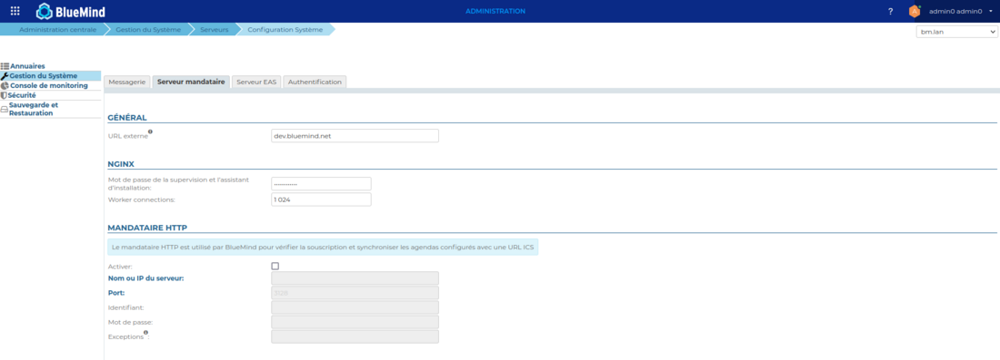
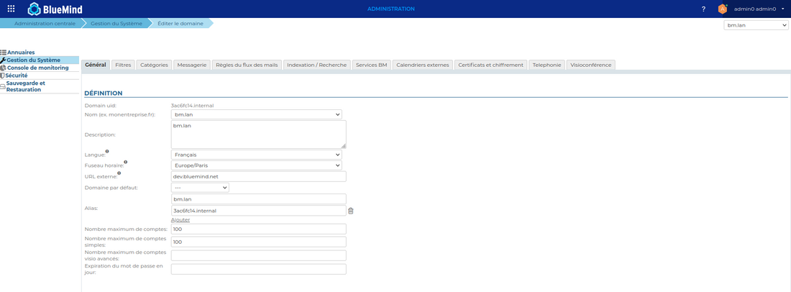

# Configuration des url externes

Les URL externes dans BlueMind sont les adresses URL auxquelles l'utilisateur accède au serveur BlueMind et à ses domaines de messagerie. Ainsi, dans une installation multi-domaines (voir ...), il est possible depuis la version 4.7 de BlueMind de définir pour chacun d'eux une URL externe propre.

Cette page décrit la configuration des URL externes pour chacun des domaines d'une part et de façon globale, au niveau serveur, d'autre part.

:::info

Opération sensible !

Attention, la modification de l'url externe d'un serveur déjà en production a plusieurs conséquences sur les utilisateurs :

- L'adresse à laquelle les utilisateurs se connectent à BlueMind change, bien évidemment, mais cela impacte potentiellement la configuration des accès via le navigateur et les clients lourds. La configuration des clients lourds doit ainsi être modifiée.
- Le certificat pour cette nouvelle url externe doit aussi être changé et configuré
- Les liens générés pré-existants (liens visio en particulier, pièces jointes détachées) peuvent être inaccessibles ou générer des alertes (certificats changé).

:::

## Configuration globale

Il s'agit de la configuration pour le serveur BlueMind. Cette configuration est aussi la configuration des domaines BlueMind du serveur qui n'ont pas de configuration propre de leur URL externe.

### Mode opératoire :

- Se connecter à BlueMind en tant qu'administrateur système admin0
- Se rendre sur la page Gestion du Système > Configuration Système
- Cliquer sur l'onglet "Serveur mandataire"
- Saisir une URL externe
- Enregistrer les modifications

## Configuration de domaine

- Se connecter à BlueMind en tant qu'administrateur système admin0
- Se rendre sur la page Gestion du Système > Domaines Supervisés
- Saisir une URL externe, dans l'onglet "Général"
- Enregistrer les modifications

## Conséquences du changement d'URL externe

### Message d'erreur dans les navigateurs

Suite au changement de l'URL externe, le navigateur affiche un message d'erreur sur le certificat lorsqu'on se connecte à BlueMind

L'URL externe ne correspond plus au CN du certificat. Vous devez vous en procurer un nouveau qui aura comme CN la nouvelle URL externe puis suivre la procédure de [mise à jour du certificat SSL](https://forge.bluemind.net/confluence/display/DA/.Certificats+SSL+vBM-4).

### Liens générés de BlueMind

Les liens, en particulier les liens [BlueMind Vidéo](/Guide_de_l_administrateur/Configuration/Visioconférence_intégrée/Visioconférences_avec_BlueMind_Video/) générés automatiquement, doivent être modifiés pour toutes les réunions dans le futur. Il est nécessaire d'aller modifier ces événements pour re-générer l'URL du lien.

Note : cette opération ne peut être faite automatiquement car il est nécessaire que l'événement soit aussi modifié sur les messages tierces externes des autres participants. Une mise à jour de l'événement est donc nécessaire.

