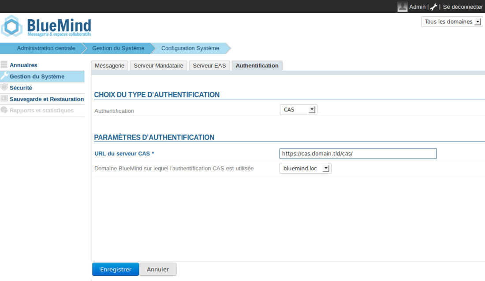

# Mise en place du SSO CAS


Ce document a pour but de décrire la mise en place de la reconnaissance par BlueMind de l'authentification CAS.


:::info

Dans la suite de ce document, nous considérerons l’URL du serveur CAS *cas.domain.tld* et le domaine BlueMind *domain.tld* situé sur le serveur *bm.domain.tld*

:::


:::info

L'authentification CAS est adaptée pour une installation BlueMind en mono-domaine.

:::


## Fonctionnement de l'authentification CAS

1. Le client demande l'accès à une ressource protégée (par exemple BlueMind). Il n'est pas authentifié sur le CAS.
2. Le serveur le redirige vers le serveur CAS pour qu'il **s'authentifie**.
3. Une fois authentifié, **un cookie CAS **est posé dans le navigateur du client et il est redirigé vers la ressource protégée avec un **ticket à valider**.
4. Le serveur BlueMind voit ce ticket, **demande au serveur CAS s'il est valide**, et si c'est le cas laisse passer le client et le connecte en tant que **login_cas**. Il pose un **cookie** ** BlueMind** dans son navigateur.
5. Le client demande à nouveau l'accès au serveur BlueMind, comme il possède le cookie BlueMind il est automatiquement authentifié tant que ce cookie est valide.

Pour avoir plus d'informations
[http://aldian.developpez.com/tutoriels/javaee/authentification-centralisee-sso-cas/images/09_diagramme_full.png](http://aldian.developpez.com/tutoriels/javaee/authentification-centralisee-sso-cas/images/09_diagramme_full.png) 
 [http://www.jasig.org/cas/protocol](http://www.jasig.org/cas/protocol)

## Installation

Pour mettre en œuvre l'authentification CAS, installer le paquet nécessaire :
**Ubuntu/Debian**

```
aptitude install bm-plugin-hps-cas
```

**RedHat**

```
yum install bm-plugin-hps-cas
```


Puis redémarrer BlueMind :


```
bmctl restart
```


## Configuration

1. Connecté en tant qu'**admin0**, se rendre sur Gestion du système > Configuration système > onglet **Authentification**.
2. Sélectionner le mode d'authentification **CAS** dans le menu déroulant et renseigner les champs associés : 
3. Sauvegarder les modifications.
4. Redémarrer le service bm-hps.


:::info

Une fois l'authentification CAS activée, vous serez automatiquement redirigé vers le serveur CAS lors de l'accès à la page d'authentification. Si vous voulez vous connecter en **admin0** ou sur un autre domaine, allez sur la page : http://bm.domain.tld**/native**

**Cet accès reste toujours disponible en cas de problème de configuration, afin de vous permettre d'accéder à la console pour corriger celle-ci.


 **

:::

## Erreurs connues

### Erreur 403 : Your user account does not exist in this BlueMind.


Ce message d'erreur signifie que le login avec lequel l'utilisateur s'est authentifié sur le CAS n'existe pas dans le domaine *domain.tld*. Deux solutions se présentent à vous :

- Créer l'utilisateur associé au **login** CAS qui ne passe pas dans le domaine *domain.tld*
- Ignorer l'erreur. Ce cas pourra se présenter si certains utilisateurs de votre base CAS n'ont pas accès à votre BlueMind.


### Erreur 500 : Internal Server Error

Ce message d'erreur peut provenir de plusieurs sources. Le plus simple est d'aller voir sur votre serveur les **logs** **de HPS**, en utilisant par exemple la commande suivante :


```
cat /var/log/bm-hps/hps.log | grep CAS
```


### Utilisation d'un certificat auto-signé ou d'une autorité de certification inconnue

Si vous utilisez un certificat auto-signé pour votre serveur CAS, ou que l'autorité de certification de votre serveur CAS n'est pas répertoriée, vous allez sûrement connaître une erreur lors de l'établissement de la connexion https vers le serveur CAS.

Pour résoudre cette erreur, le plus simple est d'importer le certificat en question dans le keystore de la jvm qu'utilise BlueMind.
**Importer l'autorité de certification racine ou un certificat auto-signé**

```
keytool -import -trustcacerts -alias cas -file cert\_racine.crt -keystore /usr/lib/jvm/bm-jdk/jre/lib/security/cacerts
Enter keystore password: changeit
```

Pour avoir plus d'informations
[http://www.sslshopper.com/article-most-common-java-keytool-keystore-commands.html](http://www.sslshopper.com/article-most-common-java-keytool-keystore-commands.html)


