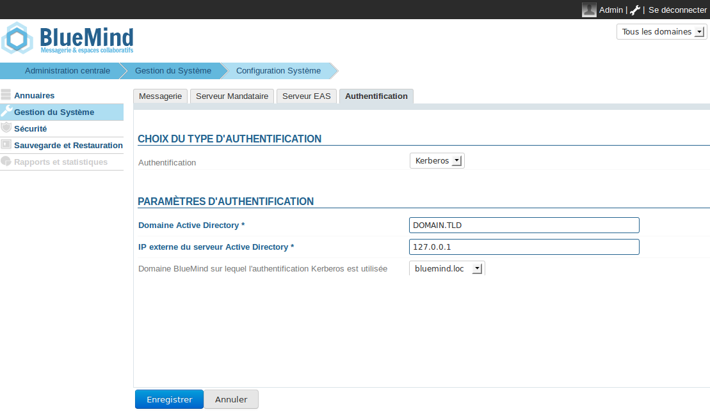
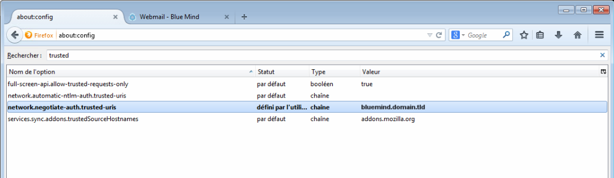
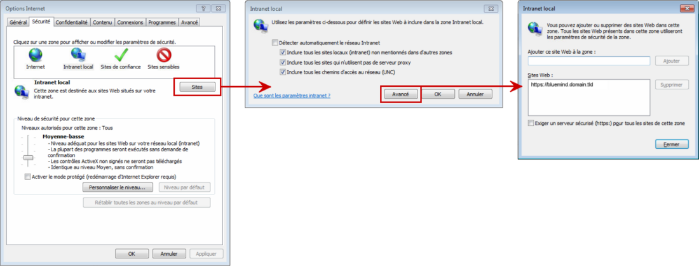

# Mise en place du SSO Kerberos


## Présentation

Ce document a pour but de décrire la mise en place de la reconnaissance par BlueMind de l'authentification Kerberos dans une infrastructure Windows.

Cette authentification est possible à partir de la version 3.0.12 de BlueMind.


:::info

Dans la suite de ce document, nous considérerons l'url externe de BlueMind accessible par les utilisateurs *bluemind.domain.tld* et le serveur ActiveDirectory *ad.domain.tld*.

Le domaine dans lequel se trouve ces machines est *DOMAIN.TLD*.

:::


## Prérequis d'installation

Installer le paquet dédié sur le serveur :


**
Ubuntu/Debian


**
RedHat/CentOS


aptitude install bm-plugin-hps-kerberos


yum install bm-plugin-hps-kerberos


## Préparation des informations de connexion

1. Créer dans l'ActiveDirectory un utilisateur de service pour l'authentification Kerberos. Par exemple *bmkrb* avec comme mot de passe "krbpwd"
2. Lancer une console "cmd.exe" et lancer la commande suivante :


```
setspn -A HTTP/bluemind.domain.tld bmkrb
```


3. La commande devrait retourner un résultat équivalent aux lignes suivantes : 


```
Registering ServicePrincipalNames for CN=bmkrb,CN=Users,DC=domain,DC=tld
		HTTP/bluemind.domain.tld
Updated object
```


4. Lancer ensuite la commande suivante :


```
ktpass /out C:\hps.keytab /mapuser bmkrb@DOMAIN.TLD /princ HTTP/bluemind.domain.tld@DOMAIN.TLD /pass krbpwd /kvno 0 /ptype KRB5\_NT\_PRINCIPAL
```


5. Le résultat devrait ressembler aux lignes suivantes :


```
Targeting domain controller: AD.domain.tld
Using legacy password setting method
Successfully mapped HTTP/bluemind.domain.tld to bmkrb.
Output keytab to C:\hps.keytab
```


## Depuis l'interface d'administration

1. Naviguez **en admin0 **jusqu'à la page : Gestion du système -> Configuration système -> onglet **Authentification**.
2. Sélectionnez le mode d'authentification **Kerberos** dans le menu déroulant et renseignez les champs associés (le fichier keytab demandé est : C:\hps.keytab exporté précédemment sur le serveur Kerberos)
3. Sauvegardez les modifications. Vous serez amené à redémarrer le service bm-hps.


:::info

Une fois l'authentification Kerberos activée, vous serez automatiquement authentifié si votre navigateur est bien configuré. Si vous voulez vous connecter en **admin0** ou sur un autre domaine, allez sur la page : bm.domain.tld**/native.**

:::

Les chapitres suivants permettent de configurer l'authentification Kerberos "à la main". Toutefois [ce paragraphe](#MiseenplaceduSSOKerberos-Configurationclient) peut vous intéresser si le nom de votre domaine Kerberos est différent de celui du domaine BlueMind.

## Configuration de BlueMind à la main

1. Copier le fichier `C:\hps.keytab` du serveur Kerberos sur le serveur BlueMind dans `/etc/bm-hps/`
2. Copier le fichier `/etc/bm/default/bm-hps.ini` vers `/etc/bm/local/bm-hps.ini`
3. Aller sur la page web [https://github.com/bluemind-net/hps-kerberos-sample](https://github.com/bluemind-net/hps-kerberos-sample) pour y télécharger les fichiers exemples `bm-hps.ini`, `jaas.conf` et `krb5.ini`
4. 
    1. Copier les fichiers `jaas.conf` et `krb5.ini` dans le répertoire `/etc/bm-hps` du serveur BlueMind
    2. Copier le contenu du fichier `bm-hps.ini` dans le fichier précédemment copié `/etc/bm/local/bm-hps.ini`

5. Dans `jaas.conf`, modifier les informations suivantes :
    1. `principal="HTTP/bluemind.domain.tld@DOMAIN.TLD"`
6. Dans `krb5.ini`, modifier les informations suivantes :
    1. `default_realm = DOMAIN.TLD`
    2. Dans `[ realms ]`, `DOMAIN.TLD = { kdc = <ip_ad_server>:88 }`
    3. Dans `[ domain_realm ]`, `domain.tld = DOMAIN.TLD` et `.domain.tld = DOMAIN.TLD`


:::info

IMPORTANT

Le nom du domaine ActiveDirectory doit impérativement être **écrit en MAJUSCULES dans la configuration**, sans quoi celle-ci ne fonctionnera pas.

:::

## Cas du domaine Kerberos différent du domaine BlueMind

Depuis la version 3.0.7 de BlueMind, il est possible de mettre en place la reconnaissance de l'identification avec un domaine Kerberos différent du domaine BlueMind.

Pour cela, créer un nouveau fichier de configuration `/etc/bm-hps/mappings.ini` sur le serveur avec le contenu suivant :


```
[bm\_mappings]
DOMAINEAD.LAN=domaineBM.vmw
```


Où `DOMAINEAD.LAN` est mon domaine AD, `domaineBM.vmw` mon domaine BlueMind.

Une fois le fichier créé, redémarrer BlueMind :


```
# bmctl restart
```


## Configuration client

Le navigateur client peut considérer que le domaine BlueMind n'est pas de confiance. Il faut alors ajouter l'URL d'accès à BlueMind comme site de confiance dans le navigateur.

### Firefox

La configuration du site de confiance se fait dans la configuration des paramètres du navigateur. Pour cela :

- dans la barre d'adresse du navigateur, taper :


```
about:config
```


- Valider l'avertissement en cliquant sur «Je ferai attention»
- Dans le champs de recherche, taper :


```
trusted
```


- Faire un double-clic sur le paramètres «network.negotiate-auth.trusted-uris» ou faire clic-droit > Modifier
- Saisir l'adresse du domaine BlueMind, ici *bluemind.domain.tld* et valider.Le paramètre apparaît alors en gras, cela signifie qu'il s'agit d'un paramètre modifié, qui n'a plus sa valeur par défaut :
- Relancer Firefox pour que la modification soit prise en compte.


### Internet Explorer

La configuration du site de confiance se fait dans la configuration des options Internet :

- Aller dans le menu Outils > Options internet
- Se placer sur Intranet Local et cliquer sur le bouton «Sites»
- Cliquer sur le bouton «Avancé» de la nouvelle boite de dialogue
- Remplir le champs «Ajouter ce site Web à la zone» puis cliquer sur «Ajouter». Le site devrait être ajouté à la liste des sites web au dessous.
- Cliquer sur «Fermer» pour quitter puis sur «OK» dans la 2ème boite de dialogue et enfin «OK» dans la première.
- Relancer le navigateur pour que la modification soit prise en compte.


### Chrome

Chrome est basé sur la configuration d'Internet Explorer, il suffit donc sous Windows de faire la manipulation précédente afin que le site soit pris en compte.

Cependant, et sur les autres systèmes d'exploitation, il est possible de faire prendre en compte le site par la ligne de commande suivante :


```
google-chrome --auth-server-whitelist="\*bluemind.domain.tld"

```


### Références

Pour plus d'informations, vous pouvez consulter les pages suivantes :

[http://sammoffatt.com.au/jauthtools/Kerberos/Browser_Support](http://sammoffatt.com.au/jauthtools/Kerberos/Browser_Support)

[http://support.microsoft.com/kb/303650](http://support.microsoft.com/kb/303650)


