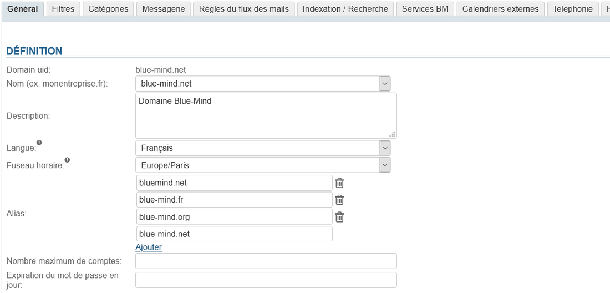
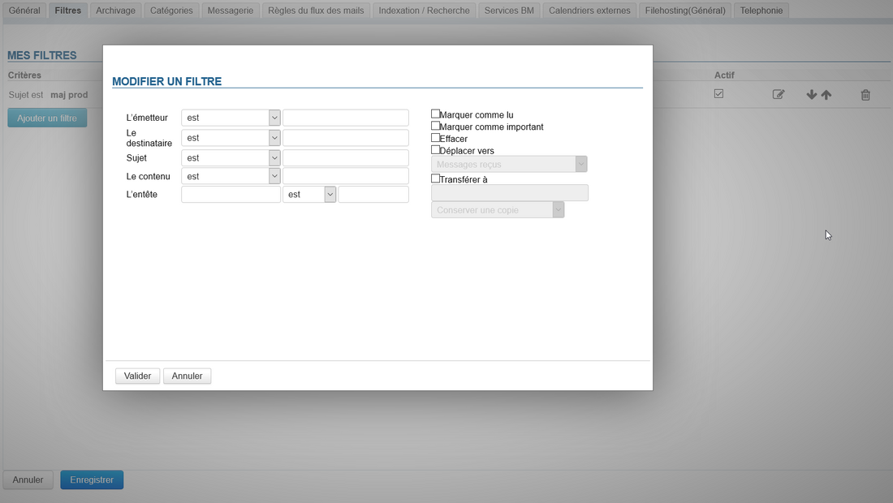
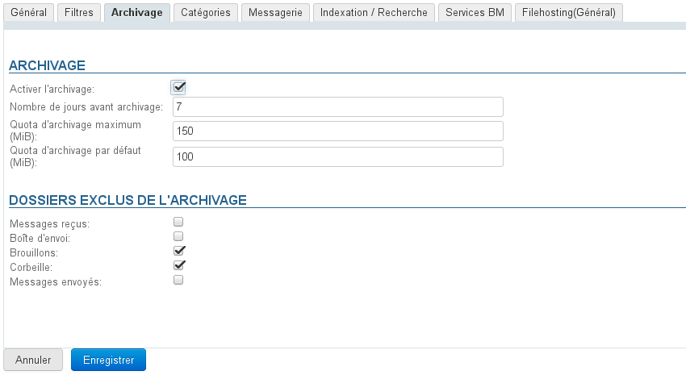
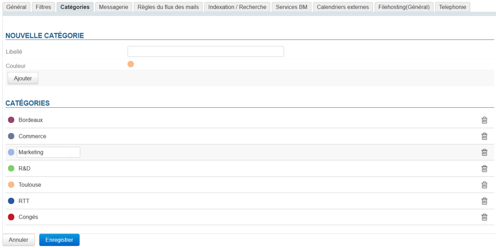
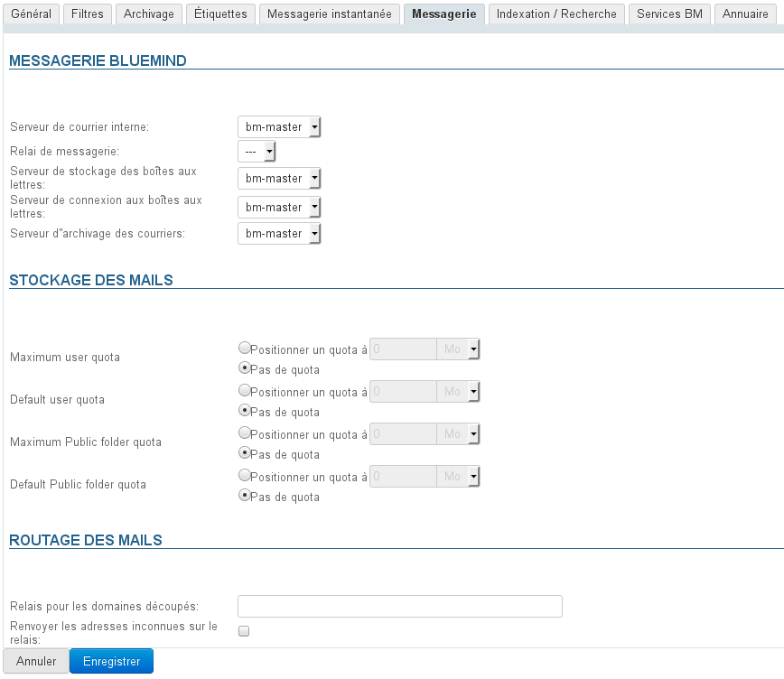
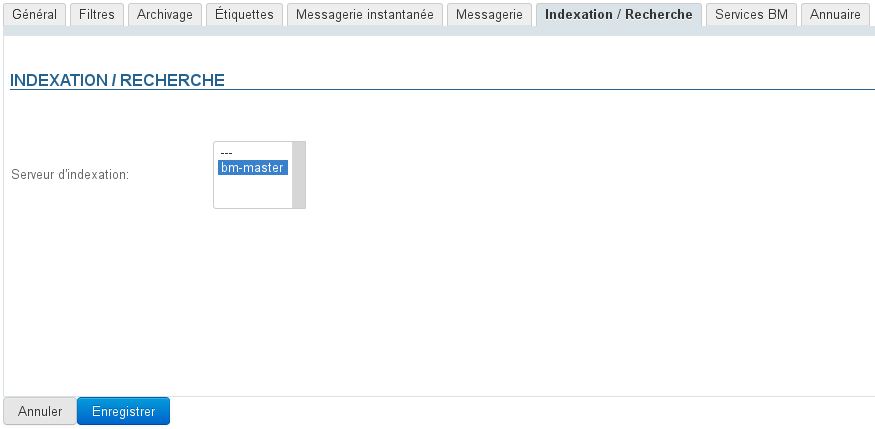
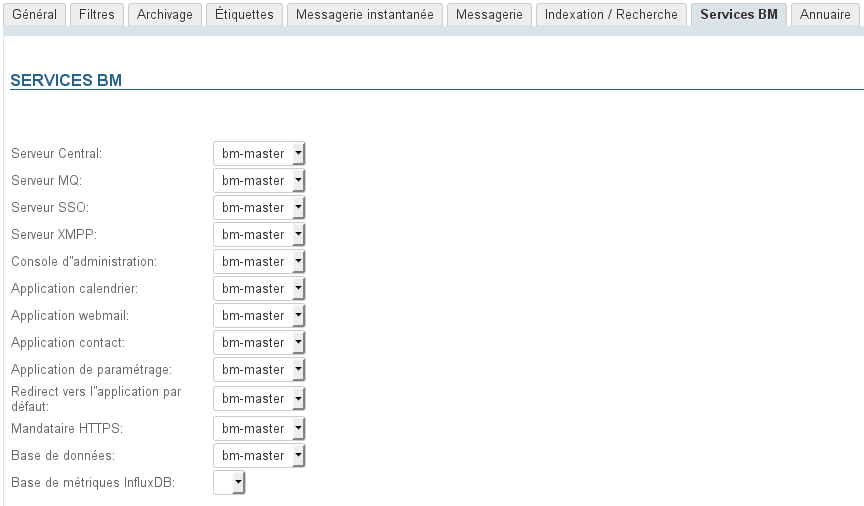

# Gestion des domaines

## Présentation

L'espace d'administration des domaines permet à l'administrateur d'accéder aux paramétrages techniques des domaines (adresses des serveurs, alias de domaines, etc.) ainsi qu'aux paramétrages commun et par défaut des utilisateurs (carnets d'adresses, filtres de messages, quotas de stockage, archivage, etc.).

Enregistrer

## Onglet Général

Ce premier onglet présente les informations et options générales du domaine sélectionné :

L'UID du domaine lui sert d'identifiant, il est unique dans BlueMind et n'est pas modifiable, en revanche peuvent être positionnés :

- **Nom** : le nom d'usage du domaine, à choisir parmi les alias de celui-ci
- **Description** : une description du domaine, est utile en particulier dans le cas où l'installation est composée de plusieurs domaines, surtout lorsque ceux-ci se ressemblent.
- **Langue** : la langue par défaut des utilisateurs du domaine
- **Fuseau horaire** : le fuseau horaire par défaut pour les utilisateurs du domaine (à partir de BlueMind 4.4)

:::info

Modification de la langue ou du fuseau horaire

NB : lorsque la valeur des champs "Langue" ou "Fuseau horaire" est modifiée, elle l'est aussi chez les utilisateurs qui utilisaient l'ancienne valeur, et chez eux seulement.
Par exemple on change la valeur de "Europe/Paris" pour "America/Toronto" :

- les utilisateurs qui avaient "Europe/Paris" passent automatiquement sur "America/Toronto"
- les utilisateurs qui avaient modifié la valeur de départ pour une autre conservent cette autre valeur
- les utilisateurs créés après cette modification auront "America/Toronto"

:::

- **Alias** : on peut ajouter autant d'alias que désiré
    - cliquer sur "Ajouter" pour faire apparaître un nouveau champ et saisir un nouvel alias
    - cliquer sur l'icône poubelle en face d'un alias pour le supprimer
- **Nombre maximum de comptes** : le nombre maximum d'utilisateurs qui pourront être créés sur ce domaine.Cette option est utilisée afin de répartir sur les domaines et limiter le nombre de comptes autorisés par une souscription.
- **Expiration du mot de passe en jour** : définit le nombre de jours pendant lequel un mot de passe utilisateur est valide après qu'il a été attribué ou changé.
Cette option, disponible à partir de la version 4.3, est commune à tous les utilisateurs du domaine. Il est possible de modifier cette valeur ou forcer l'expiration du mot de passe pour un utilisateur en se rendant sur sa fiche d'administration, pour en savoir plus, consulter la page [Gestion des entités](/Guide_de_l_administrateur/Gestion_des_entités/) > [Utilisateurs](/Guide_de_l_administrateur/Gestion_des_entités/Utilisateurs/)

:::info

Connexion avec un AD ou LDAP

La politique d'expiration ne sera pas appliquée aux utilisateurs importés d'un annuaire AD ou LDAP.

:::

:::info

Mise en oeuvre de MAPI

La mise en oeuvre de MAPI (Outlook Natif) sur un domaine nécessite une configuration particulière qui peut toucher l'ensemble des domaines d'un serveur.

Dans ce cas, il est indispensable de prendre connaissance de cette page : [Mise en œuvre de MAPI pour Outlook](/Guide_de_l_administrateur/La_souscription_BlueMind/Mise_en_œuvre_de_MAPI_pour_Outlook/)

:::

## Filtres

Cet onglet permet de définir des filtres communs aux utilisateurs du domaines : les filtres présents ici s'appliqueront au courrier de tous les utilisateurs du domaine.

Les filtres définis globalement permettent par exemple de déplacer automatiquement des messages marqués comme "SPAM" par analyse des en-têtes de message.

:::info

Les filtres de domaine sont exécutés par le serveur AVANT les filtres des utilisateurs, il se peut donc que leurs actions empêchent un filtre utilisateur de fonctionner (déplacement dans un dossier, marquage ou encore transfert)

:::

La gestion des filtres de domaine est identique à celle des filtres individuels d'utilisateurs :

Pour des informations détaillées sur la création et les options des filtres, vous pouvez consulter la page [Les filtres de messages](/Guide_de_l_utilisateur/La_messagerie/Les_filtres_de_messages/).

## Archivage

Cet onglet permet de mettre en œuvre une politique d'archivage globale pour le domaine concerné.

Pour en savoir plus, voir [Archivage - 2.3 Activer l'archivage du courrier des utilisateur - a) Archivage global](/Guide_de_l_administrateur/Configuration/Archivage/)

## Catégories

Cet onglet permet de gérer les catégories de domaines, qui seront partagées par tous les utilisateurs :

Le fonctionnement est similaire à la [gestion des catégories des utilisateurs](/Guide_de_l_utilisateur/Les_catégories_tags_/).

## Messagerie

Cet onglet permet de paramétrer les serveurs gérant la messagerie BlueMind pour le domaine :

- Serveur de courrier interne
- Relais de messagerie
- Serveur de stockage des boîtes aux lettres
- Serveur de connexion aux boîtes aux lettres
- Serveur d''archivage des courriers
- Relais de routage

C'est ici que sont définis les quotas imposés à tous les utilisateurs du domaine.

:::info

Les quotas associés aux "public folders" sont appliqués aux boîtes partagées.

:::

## Indexation/Recherche

Cet onglet permet de définir l'adresse du serveur d'indexation commun aux applications de BlueMind (messagerie, contacts, calendrier et messagerie instantanée).

## Services BM

Cet onglet permet de définir l'adresse du serveur concerné pour chaque service BlueMind du domaine :

- Serveurs :
    - Central
    - MQ
    - SSO
    - XMPP
- Console d'administration
- Applications :
    - Calendrier
    - Webmail
    - Contact
    - Paramétrage (gestion des paramètres personnels)
- Redirection vers l'application par défaut
- Mandataire HTTPS
- Base de données
- Base de métriques InfluxDB

## Annuaire

L'onglet «Annuaire» permet de paramétrer et administrer la synchronisation avec des annuaires AD (*ActiveDirectory*) ou LDAP.

Pour plus d'information sur la mise en œuvre de la synchronisation avec des annuaires externes, voir [Administration Système > Synchronisation Active Directory](/Guide_de_l_administrateur/Gestion_des_entités/Synchronisation_Active_Directory/) et [Administration Système > Synchronisation LDAP](/Guide_de_l_administrateur/Gestion_des_entités/Synchronisation_LDAP/)

