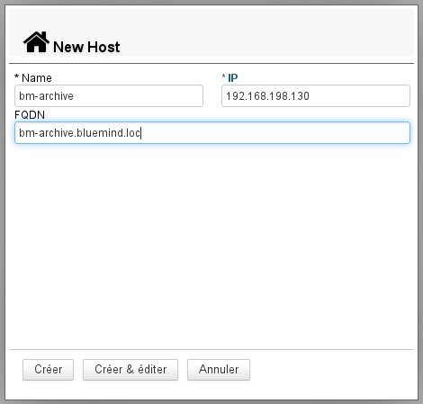
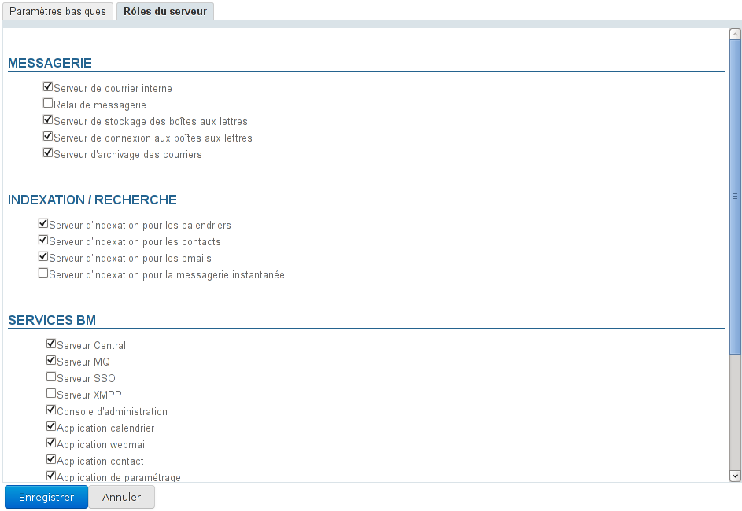

# Gestion des serveurs

## Présentation

La page "Serveurs" de la console d'administration de BlueMind permet d'administrer les serveurs de l'installation BlueMind et les services qu'ils hébergent.

## Ajouter un serveur

Pour ajouter un nouveau serveur, depuis la page Gestion du système > Serveurs de l'application :

1. ****Ajouter le serveur dans BlueMind**** : cliquer sur le bouton "Nouveau serveur" et renseigner les informations du serveur sur lequel ont été installé le ou les services :
    - **Nom** : le nom donné au serveur peut être différent du nom de la machine dans le réseau, il est choisi librement par l'administrateur
    - **IP** : l'adresse IP du serveur
    - **FQDN** : «*Fully Qualified Domain Name*» il s'agit du nom complet de la machine dans le domaine.
Le bouton "Créer" (touche &lt;Entrée>) procède à la création rapide du serveur, il est ajouté dans BlueMind mais sans rôle défini. Le bouton "Créer & éditer" (touche &lt;Ctrl-Entrée>) procède à la création du serveur et redirige vers son administration afin de lui affecter un ou des rôles.

:::info

Les services doivent être installés et accessible au moment de leur paramétrage, sinon un message de type "Can't connect to Node Server..." apparaitra et le serveur ne pourra être ajouté.

:::
2. ****A********ctiver le rôle ou les rôles du serveur**** : se rendre dans l'administration du serveur (bouton «Créer & éditer» ci-dessus ou le sélectionner dans la liste des serveurs)
    - Aller à l'onglet "Rôles du serveur" qui présente tous les rôles attribuables.
    - Cocher les rôles correspondant au(x) service(s) installé(s).
    - Valider avec le bouton "Enregistrer" en bas d'écran afin que les changements soient pris en compte. 

Le nouveau serveur est à présent disponible et peut être affecté aux services correspondant dans [l'administration des domaines](/Guide_de_l_administrateur/Présentation_du_produit/Messagerie_multi_domaines/).

## Administration d'un serveur

En cliquant dans la liste des serveurs sur la ligne correspondant au serveur voulu, on accède à l'administration de ce serveur.

Le premier onglet, «**Paramètres basiques**», présente les paramètres de localisation du serveur, seul le nom et la description sont modifiables, l'adresse IP et le FQDN ([Fully qualified domain name](http://fr.wikipedia.org/wiki/Fully_qualified_domain_name)) ne le sont pas :

L'onglet «**Rôles du serveur**» permet de définir les différents rôles de messagerie, indexation et services que le serveur peut effectuer :

