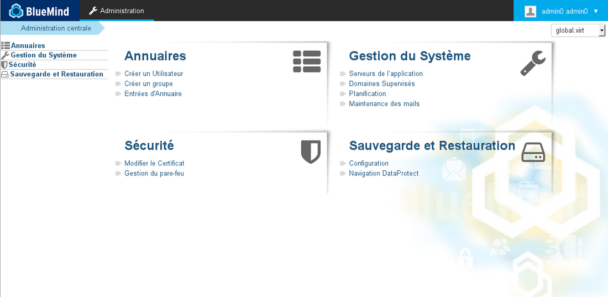

# La console d'administration

La console d'administration est la partie permettant à l'administrateur global et aux administrateurs de domaines d'accéder aux fonctions de la configuration du système et de la gestion des serveurs, domaines, tâches planifiées et de la documentation.

 

 

 

