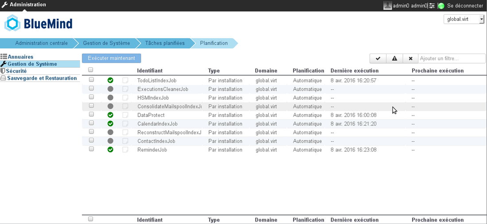
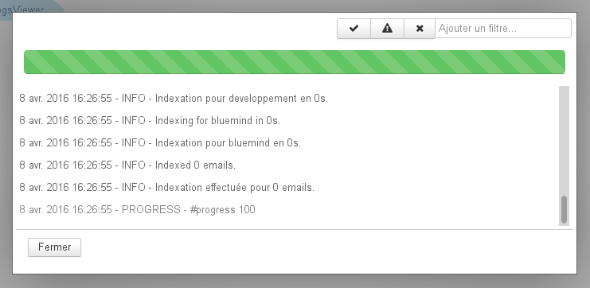
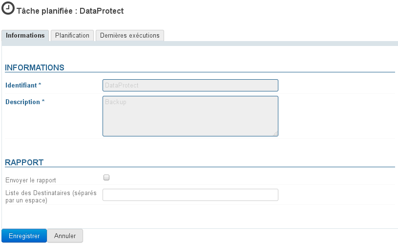
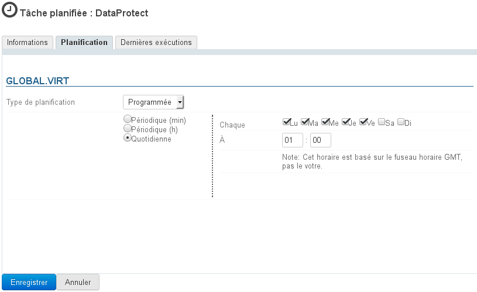
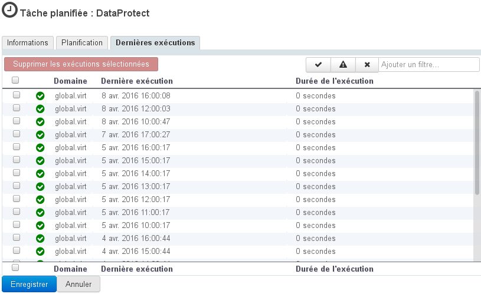
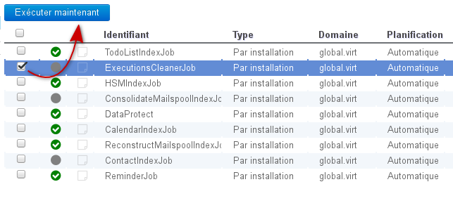

# Les tâches planifiées

## Présentation

Les tâches planifiées permettent de programmer l'exécution automatique de tâches.

Tous les administrateurs n'ont pas accès aux mêmes tâches : l'administrateur système voit toutes les tâches des domaines supervisés, l'administrateur du domaine n'a accès qu'aux tâches propres à son domaine.

## Administration

L'administration des tâches planifiées se fait dans la section Gestion du système > Tâches planifiées.

Tâches planifiées de l'administrateur système.

La page d'accueil présente la liste des tâches supervisées avec les informations principales permettant d'identifier leur état :

- icône de statut de la dernière exécution (succès, échec...) :
    - un rond gris clignotant lorsque la tâche est en cours d'exécution
    - une coche verte lorsque la dernière exécution a réussi
    - un panneau "attention" lorsqu'elle a réussi mais en émettant des messages d'erreurs (warning)
    - une croix lorsqu'elle a échoué.
- icône d'état des logs : elle est noire lorsqu'il y a des logs non lus, soit pendant ou après une exécution. Un clic sur l'icône ouvre la popup de visualisation, les messages y sont affichés en temps réel lorsque la tâche est en cours d'exécution :
- identifiant de la tâche
- type d'exécution
- domaine d'exécution
- type de planification
- date de la dernière exécution
- date de la prochaine exécution planifiée

Des outils de filtres sont disponibles en haut à droite de la liste afin de visualiser les tâches selon leur état (cliquer sur les icônes d'état pour activer et désactiver leur affichage) ou en filtrant sur un mot ou une partie d'un mot avec le champs de texte libre.

### Gestion d'une tâche

Un clic sur la ligne de la tâche dans la liste permet d'accéder à son administration, présentée en 3 onglets :

#### Informations générales

Par mesure de protection, l'identifiant et la description de la tâche ne sont pas modifiables.

L'administrateur peut choisir de faire envoyer automatiquement le rapport d'exécution à une ou plusieurs adresses personnes.
Pour cela, cocher la case correspondante et renseigner les adresses mails des destinataires souhaités.

#### Planification

La planification peut être :

- ** automatique** : en fonction de critères qui lui sont propres et ont été définis lors du développement, c'est le comportement par défaut d'une tâche planifiée.
- **programmée** : c'est l'administrateur qui définit la périodicité de l'exécution. En choisissant l'option "Quotidienne", l'administrateur peut alors définir les jours et heures d'exécution dans la semaine.

#### Dernières exécutions

Le dernier onglet permet de visualiser les dernières exécutions de la tâche. Un clic sur une exécution dans la liste ouvre la popup d'affichage des logs.

Ici aussi les outils de filtres sont disponibles afin de visualiser seulement certaines tâches. Par exemple ci-dessus seules sont affichées les tâches échouées.

### Exécution manuelle

Depuis la liste des tâches :

- sélectionner les tâches souhaitées en cochant la case correspondante en début de ligne
- cliquer sur le bouton "Exécuter maintenant"

