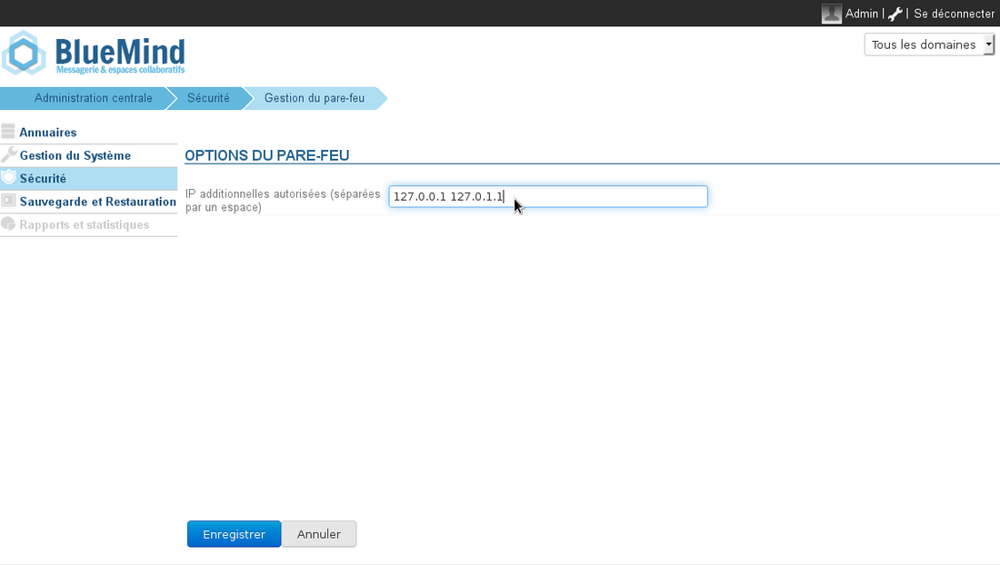

# Pare-feu

## Présentation

BlueMind embarque un pare-feu qui, par défaut, limite l'accès des services internes aux adresses IP des serveurs de l'installation, à savoir les serveurs définis dans la section Gestion du domaine > Serveurs de l'application.

ElasticSearch, par exemple, qui n'est utilisé que par d'autres composants de BlueMind, est donc inaccessible en dehors des services BlueMind, sauf modification du pare-feu.

## Personnalisation

L'accès aux services peut être étendu à d'autres adresses IP en se rendant dans la section Sécurité > Gestion du pare-feu

Pour autoriser une ou plusieurs adresses IP, les ajouter dans le champs proposé et cliquer sur «Enregistrer».

:::tip

Le redémarrage de BlueMind n'est pas nécessaire, les modifications sont prises en compte immédiatement.

:::

 

 

