# Signatures d'entreprise


## Présentation

La nouvelle application de gestion des signatures d'entreprise vous permet de définir des signatures automatiques communes à tout ou partie des utilisateurs en fonction de divers critères.

Elle permet aussi de mettre en place un message de limitation de responsabilité, généralement connu sous le nom anglais de *disclaimer* : ce message qui s'ajoute à tous les messages sans condition, en plus de la signature, permet d'ajouter des informations (commerciales, juridiques, écologiques, etc.) à tous les messages électroniques émis par les utilisateurs du domaine.


:::info

Les signatures d'entreprises ne sont pas compatibles avec S/MIME. Aucune signature ou disclaimer ne sera ajoutée aux emails signés ou chiffrés.

:::


La vue principale de l'application se présente en 3 parties :

1. en haut de page, les boutons d'action principaux permettant de créer, ordonner et tester les signatures
2. la liste des signatures présentées avec leurs caractéristiques principales :
    - leur label
    - leur statut : activée, désactivée, programmée
    - les expéditeurs auxquels elles s'appliquent
    - les destinataires concernés
    - les boutons d'édition/suppression
3. Le *disclaimer* : il présente les mêmes caractéristiques que les signatures mais ne peut être supprimé.Un *disclaimer* est présent par défaut lors de l'installation du module, mais il reste vide et inactif tant qu'il n'est pas paramétré.


:::info

Qui verra la signature ?

La signature est ajoutée au message lui-même et donc **pour l'ensemble des destinataires de ce message**.

Ainsi, il suffit qu'un seul des couples expéditeur/destinataire remplissent les conditions d'application de la signature pour que celle-ci soit visible de tous les destinataires.

Par exemple, une signature est créée avec pour critères :

- **Expéditeur** : est membre de "commerce"
- **Destinataires** : externes


La responsable commerciale Christiane (christiane@bluemind.loc) écrit un email avec plusieurs destinataires :

- À :
    - Client : [client@domaine.swe](mailto:client@domaine.swe)
    - Collaborateur : [bernard@bluemind.loc](mailto:bernard@bluemind.loc)
- Copie :
    - Comptable : [jean-claude@bluemind.loc](mailto:jean-claude@bluemind.loc)


 l'expéditrice est membre du groupe commerce et le client a une adresse externe  la signature est ajoutée au message, tous les destinataires du messages la voient : le client, Bernard et Jean-Claude.

:::

## Installation et mise à disposition

### Installation de l'application

Pour installer la nouvelle application, installer sur le serveur BlueMind les paquets nécessaires puis redémarrer BlueMind :


**
Debian/Ubuntu


**
RedHat


```
aptitude install bm-plugin-core-signature bm-signature bm-plugin-hps-signature
bmctl restart
```


```
yum install bm-plugin-core-signature bm-signature bm-plugin-hps-signature
bmctl restart
```


### Accès à l'application

#### Droit d'accès

La gestion des signatures se fait depuis une application BlueMind dédiée et non depuis la console d'administration directement. Ainsi, le superadministrateur admin0 doit désigner des utilisateurs ou administrateurs pouvant accéder (ou déléguer l'accès) à l'application pour gérer les signatures du domaine.

Pour cela, il suffit de donner le nouveau rôle "Gérer les signatures d'entreprise" à un utilisateur ou un groupe d'utilisateur de la façon habituelle (voir   [Utilisateurs - Les rôles](https://forge.bluemind.net/confluence/display/BM35/Administration+des+utilisateurs#Administrationdesutilisateurs-user-roles)  ) : 

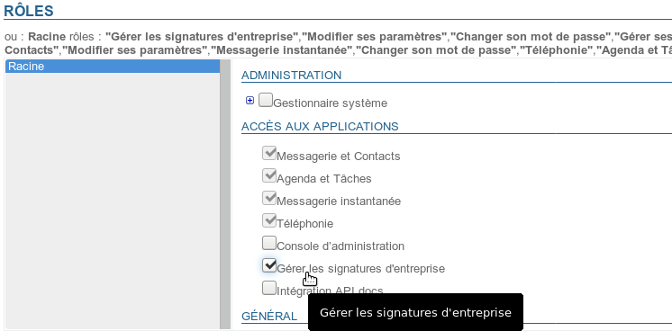

#### Accès

Une fois le rôle assigné et après s'être reconnecté si besoin, l'utilisateurs a accès à l'application de la même façon qu'aux autres applications BlueMind, depuis son bandeau principal :

  

## Gestion des signatures

### Créer une signature

Pour ajouter une signature, cliquer sur le bouton « Ajouter une signature » en haut à gauche de la page : 

Le formulaire de création/édition est alors proposé :

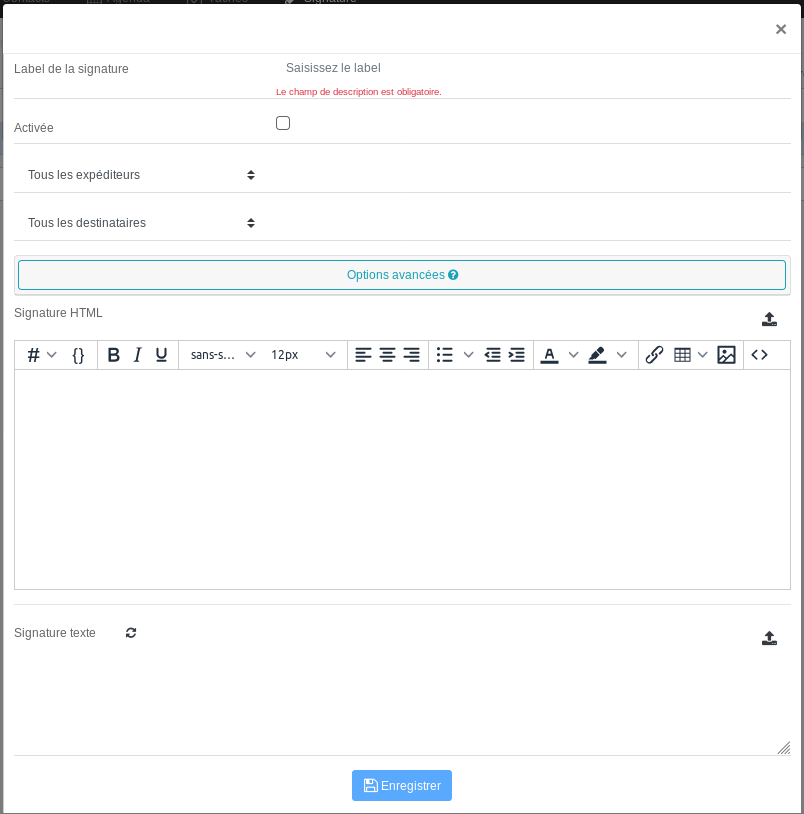

- ** **Label de la signature** :** nom affecté à la signature, permettant de l'identifier dans la liste. Ce champs est obligatoire.
- ** **Activée** :** case à cocher permettant d'activer ou désactiver la signature
- ** **Expéditeurs** :** la signature s'appliquera aux messages sortant émis par les personnes désignées :
    - **Tous les expéditeurs** : tous les utilisateurs du domaine BlueMind
    - **L'expéditeur est** : un champs de saisie est ajouté, renseigner alors avec l'aide de l'autocomplétion une ou plusieurs entités : utilisateurs ou boîtes partagées.** Cette option est disponible à partir de BlueMind 4.1**
    - **L'expéditeur est membre de** : un champs de saisie est ajouté, renseigner alors avec l'aide de l'autocomplétion un ou plusieurs groupes. La signature sera ajoutée aux utilisateurs membres d'**un ou plusieurs de ces groupes**.Exemple : une signature spécifique pour les membres du groupe "support" répondant à des demandes d'aide, une signature commune aux membres des groupes "commerce" et "communication" répondant à des demandes clients
    - **L'expéditeur n'est pas membre de** : un champs de saisie est ajouté, renseigner alors avec l'aide de l'autocomplétion un ou plusieurs groupes. La signature sera ajoutée aux utilisateurs qui n'appartiennent à **aucun de ces groupes**.Exemple : une signature pour tous les utilisateurs ne faisant pas partie de la direction, une signature pour tous les utilisateurs non techniques, c'est-à-dire ne faisant pas partie des groupes "support" et "développement"
- ** **Destinataires** :** la signature s'appliquera aux messages à destination des personnes désignées :
    - **Tous les destinataires** : s'appliquera à tous les messages
    - **Destinataires internes uniquement** : ne sera ajoutée qu'aux messages émis à destination d'utilisateurs du domaine
    - **Au moins un destinataire externe** : sera ajouté aux messages dont au moins une des adresses de destinataires (à ou cc) est extérieure au domaine
- ****Options avancées**** : en cliquant sur cette zone un encadré s'ouvre, donnant accès à des options supplémentaires :** **
    - ****Période de validité de la signature** ** : période durant laquelle la signature sera activée, cela permet de programmer en avance des signatures et/ou de les rendre temporaires :
        - **Permanente** : la signature s'applique tant qu'elle est activée
        - **À partir du** : la signature s'appliquera à partir de la date indiquée **incluse** jusqu'à désactivation
        - **Jusqu'au** : la signature s'appliquera à partir de son activation jusqu'à la date indiquée **incluse**
        - **Période** : la signature s'appliquera à partir de la première date indiquée jusqu'à la seconde. **Ces dates sont incluses dans la période d'application**.
    - ****Autoriser l'utilisateur à placer la signature**** : permet à l'utilisateur de choisir de placer la signature où il le souhaite (avant ou après le message auquel il répond).
Pour ce faire, l'utilisateur doit placer la chaîne `--X-BM-SIGNATURE--` là où il souhaite :

        - dans le webmail, BlueMind facilite cela en plaçant la chaîne en lieu et place de la signature habituelle de l'utilisateur en fonction de l'option définie par l'utilisateur dans ses [Préférences avancées](https://forge.bluemind.net/confluence/display/DA/.Preferences+avancees+vBM-3.5).
L'utilisateur peut alors déplacer ce tag à l'emplacement voulu.

        - dans les logiciels clients tiers (Thunderbird, mobiles, etc.) l'utilisateur doit placer lui-même manuellement ce tag, par exemple à la place de sa signature habituelle s'il veut que celle-ci soit remplacée.
Cela peut-être facilité en définissant le tag comme signature par défaut dans son logiciel.

**Si le tag n'est pas trouvé dans l'email alors la signature d'entreprise sera automatiquement placée en bas du message.**    - ****Supprimer les occurrences précédentes**** : lors d'une réponse à un fil de messages, supprime les occurrences précédentes de la signature de l'utilisateur
- ** **Signature HTML** :** signature qui sera ajoutée aux messages envoyés dans ce format.
    - L'éditeur [WYSIWYG ](https://fr.wikipedia.org/wiki/What_you_see_is_what_you_get)vous permet de créer une signature ou l'importer par copier/coller depuis une autre source (logiciel de création web, copie depuis une page html ou un email, etc.)
        - le bouton  vous permet de basculer en mode d'édition du code HTML
        - le menu déroulant  vous permet d'insérer des variables (voir encadré ci-après)
    - L'icône  en fin de ligne permet d'importer le code HTML contenu dans un fichier (fichier texte, page html...)


:::tip

Lors de l'import d'un fichier HTML, la signature texte est générée automatiquement **si celle-ci est vide**.

:::

- ** **Signature texte** :** signature simple qui sera ajoutée aux messages envoyés au format texte
    - L'icône  permet de générer la signature texte à partir de la signature HTML

    - L'icône  en fin de ligne permet d'importer le texte contenu dans un fichier


Cliquer sur le bouton  pour sauvegarder la signature et quitter le formulaire.


:::tip

En cas de fermeture de la popup sans avoir enregistré (croix en haut à droite ou clic en dehors de la popup), une fenêtre de confirmation demande si vous souhaitez quitter et perdre les modifications ou revenir sur la popup d'édition.

:::

### Les variables

Il est possible d'utiliser des variables afin de personnaliser la signature en fonction de l'expéditeur, par exemple pour que la signature ait une présentation identique pour chaque utilisateur mais qu'apparaissent dans le message le nom, le numéro de téléphone et l'adresse de la personne envoyant l'email.

#### Utilisation

Deux façons permettent d'ajouter une variable :

1. écrire le code correspondant en commençant par "#{", l'autocomplétion vous propose alors les variables possibles au cours de la frappe :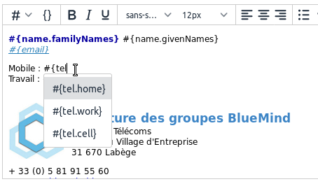
2. utiliser la liste déroulante  et sélectionner la variable souhaitée :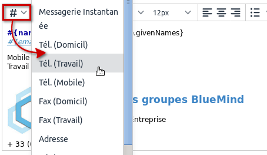


#### Blocs conditionnels

Si une variable n'est pas renseignée dans la fiche de l'utilisateur, alors un espace vide est affiché à cet endroit.

Pour éviter cela, il est possible de placer un bloc conditionnel : si la variable n'est pas renseignée dans la fiche de l'utilisateur alors l'ensemble du bloc n'apparaîtra pas dans la signature.
Pour ajouter un bloc conditionnel : sélectionner le texte souhaité puis cliquer sur le bouton  :


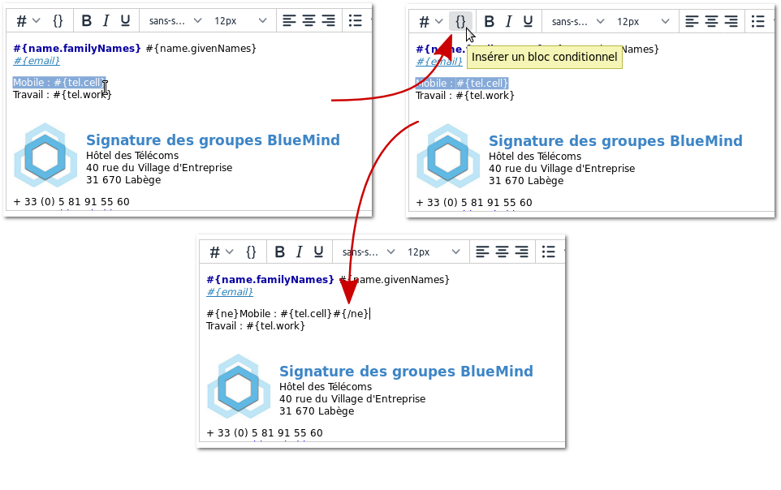


Dans cet exemple, seule la ligne "Travail" apparaitra si l'utilisateur n'a pas de numéro de téléphone mobile.


:::tip

Les blocs conditionnels, au même titre que les variables, sont aussi utilisables dans les signatures texte.

Ainsi, la version texte générée à partir de la signature HTML ci-dessus :

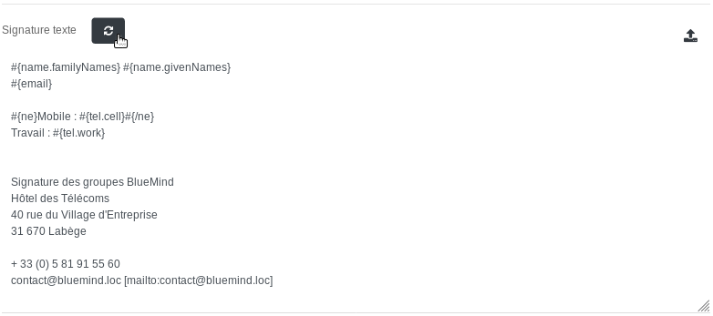

:::

#### Les variables disponibles

Les variables **correspondent aux champs de la fiche d'information de l'utilisateur** (renseignées par l'administrateur ou par synchronisation AD/LDAP). Ce sont les informations que l'on retrouve dans la fiche contacts lorsque l'on consulte l'annuaire du domaine :

- #{formattedName} : nom complet, formé de préfixe+prénom+autre nom+nom+suffixe
- #{gender} : genre
- #{name.prefixes} : préfixe
- #{name.suffixes} : suffixe
- #{name.givenNames} : prénom
- #{name.familyNames} : nom
- #{name.additionalNames} : autre nom
- #{email} : adresse email
- #{impp} : messagerie instantanéeNB : lorsque plusieurs champs de messagerie instantanée sont renseignés dans la [fiche de l'utilisateur](/Guide_de_l_administrateur/Gestion_des_entites/Utilisateurs/), la première de la liste sera utilisée.
- #{tel.home} : téléphone personnel
- #{tel.work} : téléphone professionnel
- #{tel.cell} : téléphone mobile
- #{streetAddress} : rue
- #{region} : région
- #{postOfficeBox} : boîte postale
- #{postalCode} : code postal
- #{locality} : ville
- #{extendedAddress} : complément d'adresse
- #{countryName} : pays
- #{url} : site internet
- #{role} : fonction/emploi
- #{title} : titre
- #{division} : division (dans la société
- #{department} : département (dans la société)
- #{company} : société
- #{assistant} : nom de l'assistant
- #{manager} : nom du responsable
- #{fax.work} : numéro de fax professionnel
- #{fax.home} : numéro de fax personnel


### Ordonner les signatures

** **Les signatures s'appliquent dans l'ordre dans lequel elles sont listées****. Il peut donc s'avérer important de les placer dans un ordre précis car dans le cas où un message pourrait correspondre à plusieurs cas, **c'est le 1er trouvé qui s'appliquera**.


:::info

Exemple

Par exemple, en reprenant notre capture d'écran ci-dessus, nous avons :

- Direction : active
- Marketing : active (et périodique)
- Technique : inactive
- Employés : inactive
- Entreprise : active


Si le Directeur Général veut écrire, il correspond aux 2 filtres "Direction" (il est membre du groupe) et "Entreprise" (Tous les expéditeurs) : comme "Direction" vient avant, sa signature sera celle de la direction.

Si un technicien support veut écrire, il correspond aux 3 filtres "Technique", "Employés" et "Entreprise" : "Technique" est rencontré en premier mais il est désactivé, vient ensuite "Employés" qui est désactivé aussi, c'est donc la signature globale "Entreprise" qui est apposée à ses emails.

:::

Pour ordonner la liste :

- cliquer sur une signature
- utiliser les flèches 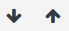 en haut de page pour la faire monter ou descendre


### Activation

Une signature ne s'applique que lorsqu'elle est activée.


:::tip

Par défaut, une nouvelle signature est créée désactivée, elle ne s'appliquera que lorsqu'elle aura été explicitement activée.

:::

Pour activer une signature :

- Ouvrir le formulaire d'édition
- Cocher la case « Activée » : 
- Enregistrer


Les statuts d'activation visibles depuis la page d'accueil de l'application sont :

-  signature inactive
-  signature active
-  signature active avec période définie et en cours d'application
-  signature active avec période définie mais non en cours (période passée ou à venir)


### Édition

Sur la page principale de l'application, cliquer sur l'icône crayon  de la ligne de la signature à éditer pour afficher le formulaire d'édition. Ce formulaire est identique au formulaire de création (voir ci-dessus).

Une fois les modifications réalisées, cliquer sur « Enregistrer » pour les sauvegarder.

### Suppression

Pour supprimer une signature :

- cliquer sur l'icône poubelle  de la ligne correspondant à la signature à supprimer
- valider la demande de confirmation


### Copie

Une signature peut être copiée afin de servir de modèle pour une autre signature.

Pour cela :

- sélectionner la signature souhaitée
- cliquer sur le bouton 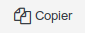 en haut de page


 Une nouvelle signature est aussitôt créée avec pour nom "Copie de..." suivi du nom de la signature d'origine.

### Tester le rendu

Il est possible de tester une signature afin de voir le résultat réel des différentes versions (HTML ou texte) au sein d'un message.

Pour cela, dans la page principale de l'application Signature :

- Sélectionner la signature souhaitée dans la liste
- Cliquer sur le bouton 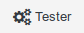 en haut de page un email est envoyé à l'utilisateur lui-même, comportant la signature dans les 2 formats (HTML et texte), suivi du *disclaimer* s'il y a lieu.


Prenons par exemple, la signature d'entreprise créée ci-dessus, l'email reçu est le suivant :


## Le disclaimer

Ce message, si activé, s'ajoute, **en plus de la signature** personnelle ou d'entreprise, au message quel que soit l'expéditeur.

Il peut s'agir d'un message d'information juridique (sur le caractère confidentiel des informations), commerciale (coordonnées de l'entreprise ou promotion en cours) ou encore à destination écologique (message incitant à ne pas imprimer l'email).

Un *disclaimer* est présent par défaut lors de l'installation du module, mais il reste vide et inactif tant qu'il n'est pas paramétré.

- Le formulaire d'édition s'affiche, de même que pour les signatures, en cliquant sur l'icône crayon  correspondante :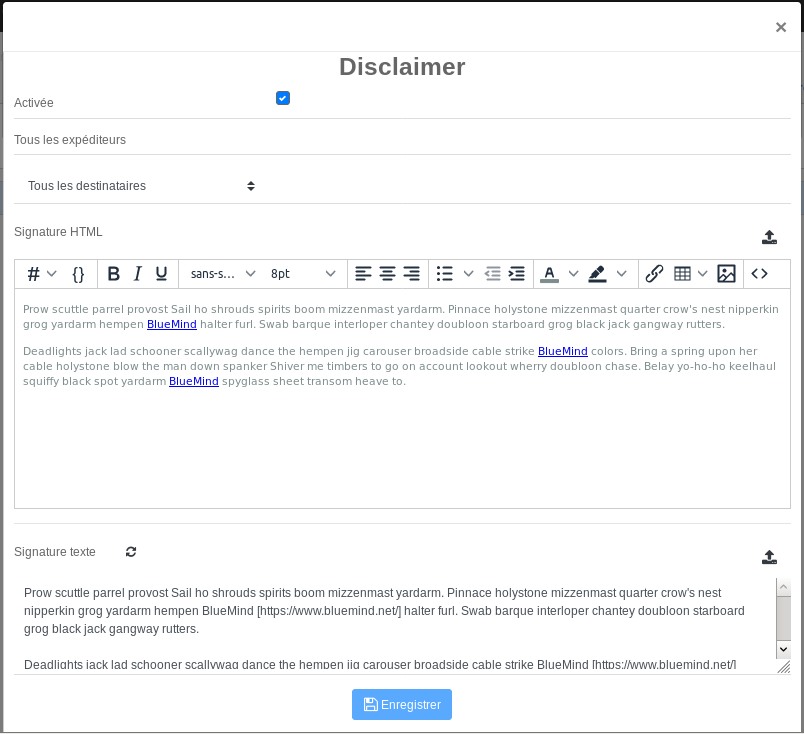
Le formulaire est identique à celui des signatures, à quelques différences près :

    - le label et les expéditeurs ne sont pas modifiables, il se nomme toujours "disclaimer" et s'applique à tous les expéditeurs
    - il n'y a pas de période de validité, il est appliqué tant qu'il est actif
- ****Destinataires****** :** 3 choix sont possibles :
    - Tous les destinataires
    - Destinataires internes uniquement
    - Au moins un destinataire externe
- ** **Signature HTML** :** code HTML de la signature qui sera ajoutée aux messages envoyés au format HTML.
    - Le même éditeur [WYSIWYG ](https://fr.wikipedia.org/wiki/What_you_see_is_what_you_get)que pour les signatures est proposé, il est donc possible de créer un *disclaimer* au format riche.
    - L'icône  en fin de ligne permet là aussi d'importer le code HTML contenu dans un fichier


:::tip

Lors de l'import d'un fichier HTML, la signature texte est générée automatiquement **si celle-ci est vide**.

:::

- ** **Signature texte** :** signature simple qui sera ajoutée aux messages envoyés au format texte.L'icône  en fin de ligne permet là aussi d'importer le code HTML contenu dans un fichier.


## Utilisation

Les utilisateurs voient apparaître la signature dans leur fenêtre de composition de message et peuvent décider de son placement :

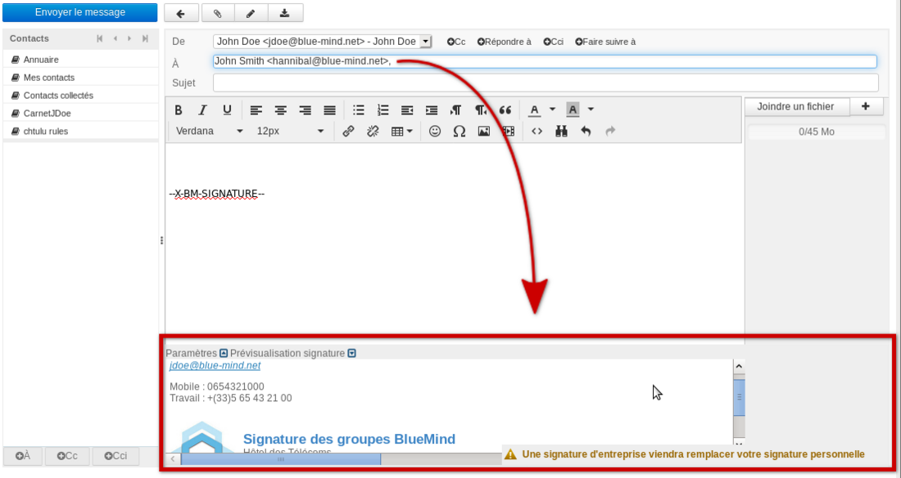

Pour en savoir plus sur le fonctionnement côté utilisateur, consulter le paragraphe dédié de la documentation utilisateur :

- [Le composeur - Signature d'entreprise](/Guide_de_l_utilisateur/La_messagerie/Le_composeur/#Lecomposeur-signature-corp)
- [Thunderbird - Signature d'entreprise](/Guide_de_l_utilisateur/Configuration_des_clients_lourds/Configuration_de_Thunderbird/#ConfigurationdeThunderbird-signature-corp)


