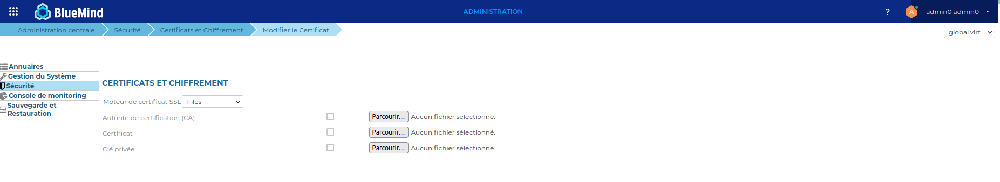
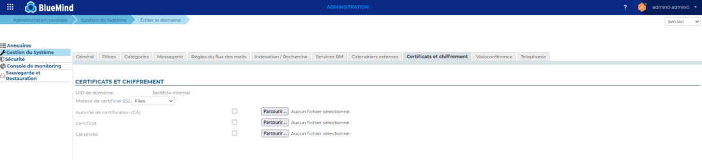
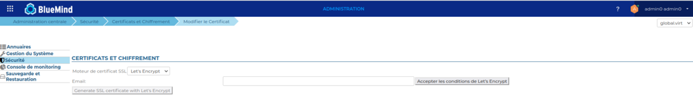
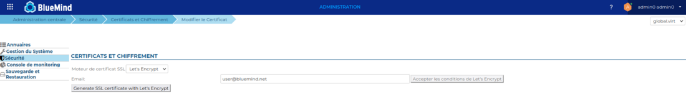
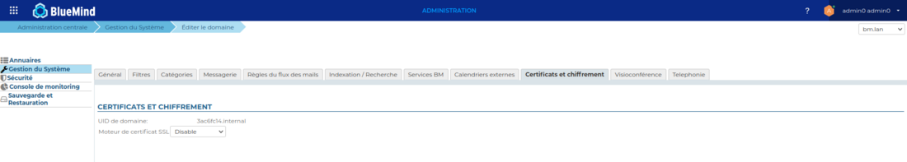

# Certificats SSL


## Présentation

Les serveurs BlueMind utilisent des connexions sécurisés par certificats. Il est possible de remplacer les certificats générés lors de l'installation de BlueMind par des certificats personnalisés sur une installation mono-serveur.

L'admin console de BlueMind met à disposition 2 procédures de mises à jour des certificats:

- En remplaçant les fichiers (nouveau certificat, clé privée et certificat de l'autorité de certification)
- En utilisant la génération par Let's Encrypt


:::info

La gestion des certificats n'est pas spécifique à la messagerie BlueMind. Les équipes BlueMind ne peuvent réaliser la gestion ou la configuration des certificats dans le cadre de son support.

:::


## Pré-requis

La messagerie dépend très fortement des certificats et de leur bonne gestion. Par exemple, elle ne fonctionnera plus si vos certificats expirent.
Il est indispensable de maîtriser parfaitement leur gestion (voir le chapitre [Liens Externes](#CertificatsSSL-liensexternes) si nécessaire).

## Installation du certificat

Vous devez vous assurer qu'une URL externe a été définie pour le système global ou le domaine concerné par cette installation de certificat (voir le chapitre [Configuration des url externes](/Guide_de_l_administrateur/Configuration/Gestion_des_domaines/Configuration_des_url_externes/) si nécessaire).

### Fichiers nécessaires

Vous devez vous assurer que les certificats correspondent à l'URL externe (*external-url*) de votre messagerie, sans quoi cette messagerie ne sera pas opérationnelle.

Afin de mettre en place un certificat SSL, il faut être en possession des 3 fichiers suivants :

1. un fichier contenant le nouveau certificat SSL
2. un fichier contenant la clé privée du nouveau certificat, elle ne doit pas être protégée par mot de passe
3. un fichier contenant le certificat de l'autorité de certification ayant servie à délivrer le nouveau certificat SSL. Dans le cas où cette autorité est une autorité intermédiaire, il faut concaténer au fichier le certificat racine de cette autorité.


Si votre certificat est au format P12, il vous faut générer le certificat et la clé privée au format PEM en utilisant les commandes :


```
openssl pkcs12  -nocerts -in cert.p12 -out privatekey.pem
openssl pkcs12 -clcerts  -nokeys -in cert.p12 -out cert.pem 
```


:::info

Attention, il faut bien vérifier que le CN ou une nom alternatif du certificat est bien l'external url du serveur bluemind, vous pouvez vérifier le CN avec la commande :


```
openssl x509 -noout -subject -in cert.pem
```


:::

### Installation du certificat pour le système global

- Se connecter à BlueMind en tant qu'administrateur système admin0
- Se rendre sur la page Sécurité > Modifier le certificat
- Choisir "Files" dans la liste déroulante
- Au moyen des 3 boutons «Parcourir» rechercher les fichiers correspondants afin de les envoyer sur le serveur :
- Cliquer sur «Enregistrer» afin de téléverser les fichiers et prendre en compte le nouveau certificat.


### Installation du certificat pour un domaine

- Se connecter à BlueMind en tant qu'administrateur système admin0
- Se rendre sur la page Gestion du Système > Domaines supervisés
- Selectionner le domaine concerné
- Cliquer sur l'onglet "Certificat et chiffrement"
- Choisir "Files" dans la liste déroulante
- Au moyen des 3 boutons «Parcourir» rechercher les fichiers correspondants afin de les envoyer sur le serveur :
- Cliquer sur «Enregistrer» afin de téléverser les fichiers et prendre en compte le nouveau certificat.


## Génération Let's Encrypt

- Se connecter à BlueMind en tant qu'administrateur système admin0
- Se rendre sur la page Sécurité > Modifier le certificat
- Choisir "Let's Encrypt" dans la liste déroulante


###  Accepter les conditions

Il est nécessaire d'accepter les conditions de Let's Encrypt avant de pouvoir générer le certificat.

L'action sur le bouton acceptera automatiquement les conditions et ouvrira un onglet les présentant. 



Une fois l'action effectuée, le bouton permettant la génération du certificat sera débloqué.

### Générer le certificat pour le système global

Il est possible de saisir une adresse email qui sera utilisée par Let's Encrypt pour communiquer à propos de l'expiration du certificat généré.

Si elle n'est pas renseignée une adresse par défaut *no-reply@&lt;default-domain>* sera utilisée (pour cela un domaine par défaut devra être défini au préalable).



### Générer le certificat pour un domaine

- Se connecter à BlueMind en tant qu'administrateur système admin0
- Se rendre sur la page Gestion du Système > Domaines supervisés
- Selectionner le domaine concerné
- Cliquer sur l'onglet "Certificat et chiffrement"
- Choisir "Let's Encrypt" dans la liste déroulante


Répéter les opérations décrites en 4.1 et 4.2

### Renouveler un certificat

Une tache programmée se chargera de renouveler automatiquement le certificat Let's Encrypt, si celui ci a déjà été généré une première fois.

Cependant il est possible de renouveler manuellement le certificat, en suivant la même procédure que le lors de la génération:

- 4.2 Générer le certificat pour le système global

- 4.3 Générer le certificat pour un domaine


## Supprimer un certificat de domaine

Cette opération aura pour effet de supprimer les certificats de domaine des serveurs.


- Se connecter à BlueMind en tant qu'administrateur système admin0
- Se rendre sur la page Gestion du Système > Domaines supervisés
- Selectionner le domaine concerné
- Cliquer sur l'onglet "Certificat et chiffrement"
- Choisir "Disable" dans la liste déroulante




- Cliquer sur «Enregistrer» afin de supprimer les fichiers du serveur.


:::info

Cette option "Disable" n'est possible que pour un domaine, pas pour le système global

:::


## Liens externes

- SSL & TLS : Guide du débutant pour tout savoir sur les certificats : [https://www.isicca.com/fr/certificat-ssl-tls-guide-debutant/](https://www.isicca.com/fr/certificat-ssl-tls-guide-debutant/)


