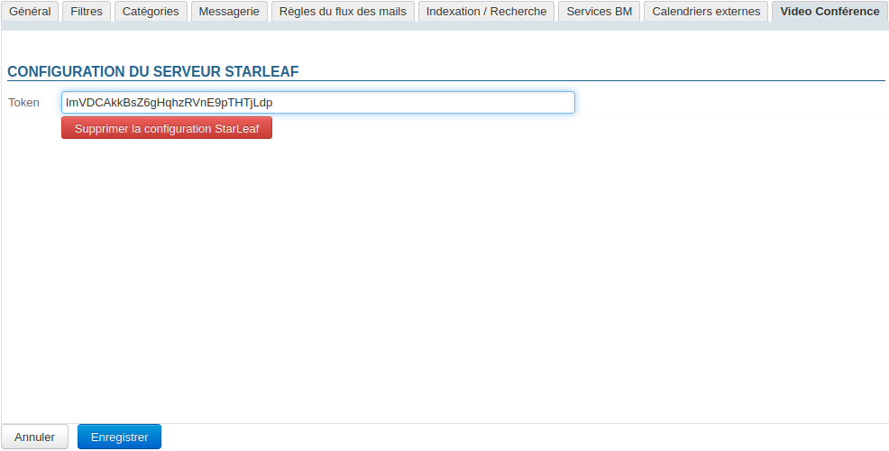
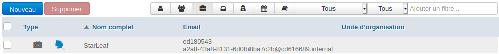
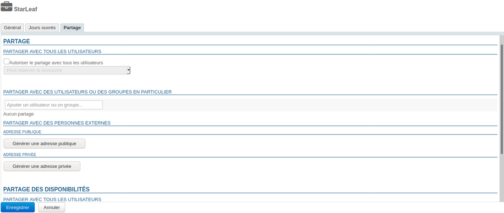
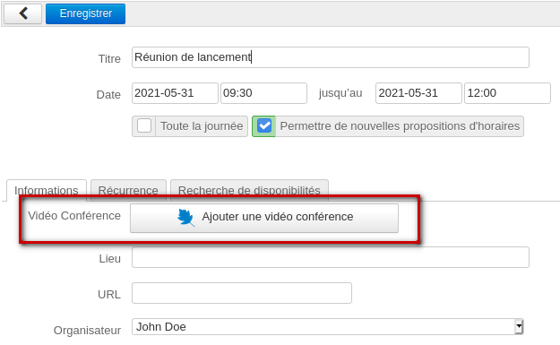

# Visioconferences avec StarLeaf


## Présentation

A partir de sa version 4.5.3, BlueMind peut être connecté à un serveur StarLeaf afin de proposer aux utilisateurs de facilement créer des conférences et les relier à leurs réunions d'agenda.


## Installation

Pour mettre à disposition des utilisateurs les nouvelles fonctionnalités, il convient d'installer le plugin en installant sur le serveur les paquets suivants et redémarrer BlueMind :


**
Debian/Ubuntu


**
Redhat/CentOS


```
aptitude install bm-plugin-admin-console-videoconferencing-starleaf bm-plugin-core-videoconferencing-starleaf
bmctl restart
```


```
yum install bm-plugin-admin-console-videoconferencing-starleaf bm-plugin-core-videoconferencing-starleaf
bmctl restart
```


## Administration

### Configuration du serveur

- Se rendre dans la console d'administration dans la Gestion du système > Domaines supervisés > choisir le domaine souhaité > onglet *Visioconférence* :
- Renseigner le *token* généré depuis le portail StarLeaf (voir [https://support.starleaf.com/integrating/cloud-api/authentication-using-authentication-header-method/](https://support.starleaf.com/integrating/cloud-api/authentication-using-authentication-header-method/) )
- Cliquer sur "Enregistrer"


 une ressource nommée "StarLeaf" est automatiquement créée et visible dans l'annuaire. C'est grâce à celle-ci que les utilisateurs vont pouvoir créer des visioconférences automatiquement. Pour en savoir plus , voir le paragraphe [4. Droits d'accès](#VisioconferencesavecStarLeaf-gestion)


:::info

Par défaut, la ressource n'est pas partagée, les utilisateurs ne peuvent pas lier de visioconférence.

:::

### Dissocier une installation StarLeaf

Pour dissocier un serveur StarLeaf du domaine :

- se rendre comme pour la configuration dans la Gestion du système > Domaines supervisés > choisir le domaine souhaité > onglet *Visioconférence*
- cliquer sur le bouton "Supprimer la configuration StarLeaf"

- valider la demande de confirmation


:::info
Il est inutile de cliquer sur le bouton "Enregistrer" en bas de page, la demande est effective dès la confirmation.
:::


 La ressource associée est automatiquement supprimée et les partages nettoyés, elle n'apparaît plus dans la gestion des entités et les utilisateurs ne peuvent plus la réserver.

### Patron de contenu
La configuration de patron de contenu se fait dans le serveur StarLeaf.


## Droits des accès

L'accès à la nouvelle fonctionnalité se fait au moyen de la ressource StarLeaf créée lors de la [configuration du serveur](http://forge.bluemind.net#configuration) :



Cette ressource s'administre comme toute autre [ressource](/Guide_de_l_administrateur/Gestion_des_entites/Ressources/), la gestion des partages ouvrant les droits à la réservation et, de fait, à la génération de liens de visioconférences. Ainsi il faut donner un droit de réservation aux utilisateurs ou groupes souhaités pour que ceux-ci puissent créer à la volée des visioconférences pour leurs événements :




:::tip

En tant que ressource, il est possible de lui attribuer des heures ouvrées ou encore une politique de réservation : le lien généré étant unique, cela n'aura pas d'incidence, la visioconférence sera malgré tout disponible et le lien actif.

:::

Un bouton est alors disponible dans l'interface de création des événements des ayant-droit :



Pour en savoir plus sur le fonctionnement, se reporter à la page de documentation du guide utilisateur : [Lier une visioconférence à un événement](../../../Guide_de_l_utilisateur/L_agenda/Organiser_une_reunion.md/#ajouter-une-visioconférence).

## Appareils mobiles et logiciels tiers

Les applications tierces telles qu'Outlook ou les applications mobiles n'affichent pas le bouton, cependant les utilisateurs peuvent tout de même réserver une ressource de visioconférence en l'invitant à un événement de la même façon que tout autre ressource.


