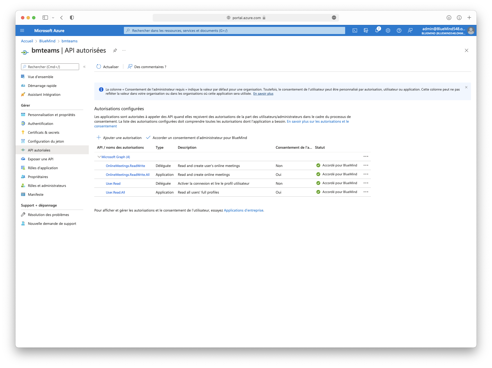
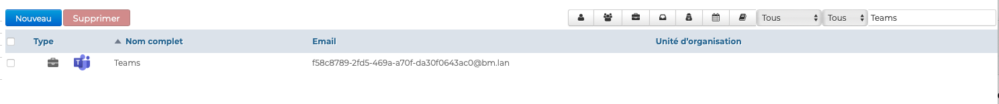

# Visioconférences avec Teams

## Présentation

Il est possible de créer facilement des conférences Teams et de les relier à une réunion BlueMind.

## Pré-requis

Une souscription Teams est nécessaire https://www.microsoft.com/fr-fr/microsoft-teams/compare-microsoft-teams-options

## Configuration Teams

### Déclarer l'application dans le portail Azure
 - Se connecter au portail Azure https://portal.azure.com/#home
 - Inscrire une nouvelle application dans Azure Active Directory > Inscription d'application -> Nouvelle Inscription
 - Renseigner le nom de l'application (ex BlueMindTeams)

    

### Générer un secret
 - Dans la vue d'ensemble de l'application > Ajouter un certificat ou un secret > Nouveau secret client
 - Saisir une description et une date d'expiration

    

### Récupérer les identifiants Teams
 - Dans la vue d'ensemble, récupérer
   - ID d'application (APPLICATION_ID)
   - ID de l'annuaire (TENANT)

    

### Autoriser l'application à accéder aux API de création de réunion Teams
 - Dans l'écran API Autorisées > Ajouter une autorisation > Microsoft Graph
 - Ajouter les API
   - Autorisations déléguées
     - Aucune
   - Autorisations de l'application
     - OnlineMeetings.ReadWrite.All
     - User.Read.All
 - Accorder le consentement de l'administrateur

    

### Ajout d'une politique d'accès

En Powershell

- Installer le module Teams si nécessaire

https://docs.microsoft.com/fr-FR/microsoftteams/teams-powershell-install

```
Install-Module -Name PowerShellGet -Force -AllowClobber
Install-Module -Name MicrosoftTeams -Force -AllowClobber
```

- Se connecter à Teams

```
Import-Module MicrosoftTeams
$userCredential = Get-Credential
Connect-MicrosoftTeams -Credential $userCredential
```

- Créer une politique d'accès

https://docs.microsoft.com/fr-fr/powershell/module/skype/grant-csapplicationaccesspolicy?view=skype-ps

```
New-CsApplicationAccessPolicy -Identity BlueMindTeams-policy -AppIds "APPLICATION_ID" -Description “bluemind teams”
```

- Assigner la politique d'accès
  - À tous les utilisateurs de l'annuaire

```
PS C:\> Grant-CsApplicationAccessPolicy -PolicyName "BlueMindTeams-policy" -Global
```

  - À un utilisateur 

```
PS C:\> Grant-CsApplicationAccessPolicy -Identity "USER_ID" -PolicyName "BlueMindTeams-policy"
```

## Configuration BlueMind

### Installation

Pour mettre à disposition des utilisateurs cette nouvelle fonctionnalité, il convient d'installer les plugins sur le serveur les paquets suivants et redémarrer BlueMind :


#### Debian/Ubuntu

```
aptitude install bm-plugin-admin-console-videoconferencing-teams bm-plugin-core-videoconferencing-teams
bmctl restart
```

#### Redhat/CentOS

```
yum install bm-plugin-admin-console-videoconferencing-teams bm-plugin-core-videoconferencing-teams
bmctl restart
```

### Configuration du serveur

- Se rendre dans la console d'administration dans la Gestion du système > Domaines supervisés > choisir le domaine souhaité > onglet *Visioconférence*
- Renseigner les informations récupérées depuis le portail Azure


- Cliquer sur "Enregistrer"

Une ressource nommée "Teams" est automatiquement créée et visible dans l'annuaire. C'est grâce à celle-ci que les utilisateurs vont pouvoir créer des visioconférences automatiquement. Pour en savoir plus , voir le paragraphe [Droits d'accès](#droits-daccès)


:::info
Par défaut, la ressource n'est pas partagée, les utilisateurs ne peuvent pas lier de visioconférence.
:::


### Dissocier une installation Teams

Pour dissocier un serveur Teams du domaine :

- Se rendre dans la console d'administration dans la Gestion du système > Domaines supervisés > choisir le domaine souhaité > onglet *Visioconférence*
- Cliquer sur le bouton "Supprimer la configuration Teams"
- valider la demande de confirmation


:::info
Il est inutile de cliquer sur le bouton "Enregistrer" en bas de page, la demande est effective dès la confirmation.
:::


### Compte externe Teams

Pour bénéficier de cette fonctionnalité, il sera nécessaire d'associer un compte externe Teams aux utiliateurs BlueMind

#### Provision depuis bm-cli

Un administrateur pourra provisionner les comptes externes, en important un fichier CSV depuis une commande bm-cli

```
bm-cli user externalaccountimport --domain=DOMAINE --file=FICHIER_CSV
```

Le fichier CSV doit être au format

```
Teams;emailBlueMind;emailTeams
```

Exemple

```
Teams;david@bluemind.lan;david@teams.com
```

#### Dans les paramètres BlueMind

Chaque utilisateur pourra renseigner son identifiant Teams dans les paramètres BlueMind
- Se rentre dans les Paramètres > Comptes externes > Teams


### Droits d'accès

L'accès à la nouvelle fonctionnalité se fait au moyen de la ressource Teams créée lors de la [Configuration du serveur](#configuration-du-serveur)



Cette ressource s'administre comme toute autre [ressource](/Guide_de_l_administrateur/Gestion_des_entites/Ressources/), la gestion des partages ouvrant les droits à la réservation et, de fait, à la génération de liens de visioconférences. Ainsi il faut donner un droit de réservation aux utilisateurs ou groupes souhaités pour que ceux-ci puissent créer à la volée des visioconférences pour leurs événements :


:::tip
En tant que ressource, il est possible de lui attribuer des heures ouvrées ou encore une politique de réservation : le lien généré étant unique, cela n'aura pas d'incidence, la visioconférence sera malgré tout disponible et le lien actif.
:::

Un bouton est alors disponible dans l'interface de création des événements des ayant-droit :


Pour en savoir plus sur le fonctionnement, se reporter à la page de documentation du guide utilisateur : [Lier une visioconférence à un événement](/Guide_de_l_utilisateur/La_visioconference/Créer_une_visioconférence/).

