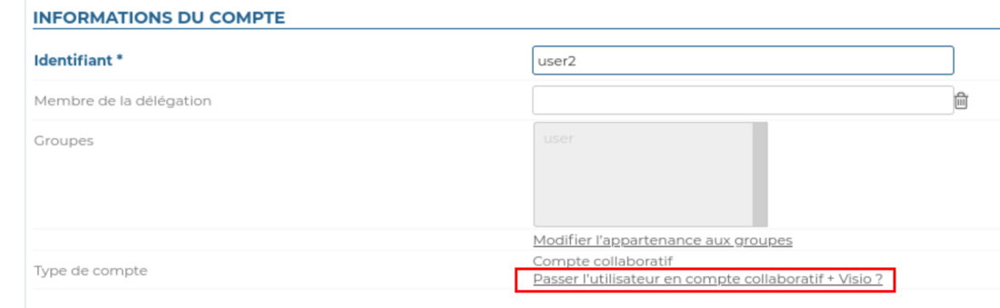

# Visioconférences avec BlueMind Video


## Présentation

BlueMind Video est un service SAAS de visioconférence basé sur Jitsi et intégré à BlueMind depuis la version 4.6.0 : il ne nécessite pas l'installation d'un service tiers.

L'activation de ce service est lié à votre souscription, vous pouvez contacter [notre équipe commerciale](mailto:commerce@bluemind.net) pour obtenir les tarifs du service. Sans souscription adaptée, les instructions ci-dessous n'auront pas d'effet.

Pour vérifier si votre souscription vous donne droit au service, rendez-vous sur la page "Gérer la souscription" dans la console d'administration :

- la ligne "Nombre maximum de comptes visio avancés" doit présenter une valeur supérieure à 0
- la ligne "Date de fin de validité de la souscription BlueMind.Video" doit comporter une date non expirée


## Concepts

- un nouveau type d'utilisateur "Collaboratif + Visio" devient disponible, le nombre d'utilisateurs de ce type dépend de ce que permet la souscription
- tous les utilisateurs d'un domaine disposent du service de visioconférence si au moins un utilisateur "Collaboratif + Visio" est disponible dans le domaine
- une visioconférence peut être instantanée (création immédiate d'un lien à partager) ou planifiée depuis l'agenda
- une visioconférence à laquelle participe un utilisateur "Collaboratif + Visio" n'est pas limitée dans le temps et permet jusqu'à 100 participants
- une visioconférence initiée par un utilisateur "Collaboratif" (sans visio avancée) est limitée à 45 min et deux participants


## Installation

Cette fonctionnalité est intégrée à BlueMind et ne nécessite pas l'installation de paquets supplémentaires.

## Administration

### Configuration de la visio pour un domaine

Se rendre dans la console d'administration dans la Gestion du système > Domaines supervisés > choisir le domaine souhaité > onglet Général :

- définir le nombre d'utilisateurs "Collaboratif + Visio" dont on souhaite disposer pour le domaine en éditant la ligne "Nombre maximum de comptes visio avancés"


Puis dans l'onglet Visioconférence, renseigner le patron d'une invitation à une visioconférence, par exemple :


```
${Organisateur} vous invite à une conférence.
Rejoindre : ${URL}
```


Ce patron peut être décliné dans plusieurs langues à l'aide de la liste déroulante.


 Une fois le patron sauvegardé, une ressource nommée "BlueMind.Video" est automatiquement créée et visible dans l'annuaire. C'est grâce à celle-ci que les utilisateurs vont pouvoir créer des visioconférences automatiquement. Pour en savoir plus , voir le paragraphe [5. Droits d'accès](#VisioconferencesavecBlueMindVideo-gestion) 


:::info

Par défaut, la ressource est partagée avec un droit de réservation simple, tous les utilisateurs peuvent lier une visioconférence.

:::


## Droits des accès (optionnel)

L'accès à la nouvelle fonctionnalité se fait au moyen de la ressource BlueMind.video créée lors de la [configuration du serveur](http://forge.bluemind.net#configuration). Si l'on souhaite changer les droits, cette ressource s'administre comme toute autre [ressource](/Guide_de_l_administrateur/Gestion_des_entités/Ressources/). Par défaut tous les utilisateurs du domaine peuvent créer une visio conférence.

Un bouton est disponible dans l'interface de création des événements des ayant-droit :


Pour en savoir plus sur le fonctionnement, se reporter à la page de documentation du guide utilisateur : [Lier une visioconférence à un événement](/Guide_de_l_utilisateur/L_agenda/Lier_une_visioconférence_à_un_événement/).

## Profil "Collaboratif + visio"

Ce profil peut être attribué aux utilisateurs du domaine (dans la limite de la valeur configurée dans "Nombre maximum de comptes visio avancés") en accédant à la fiche utilisateur, dans la partie "Informations du compte".



## Appareils mobiles et logiciels tiers

Les applications tierces telles qu'Outlook ou les applications mobiles n'affichent pas le bouton, cependant les utilisateurs peuvent tout de même réserver une ressource de visioconférence en l'invitant à un événement de la même façon que tout autre ressource.


