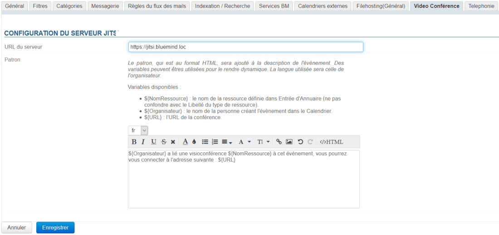
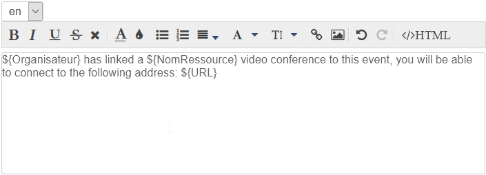
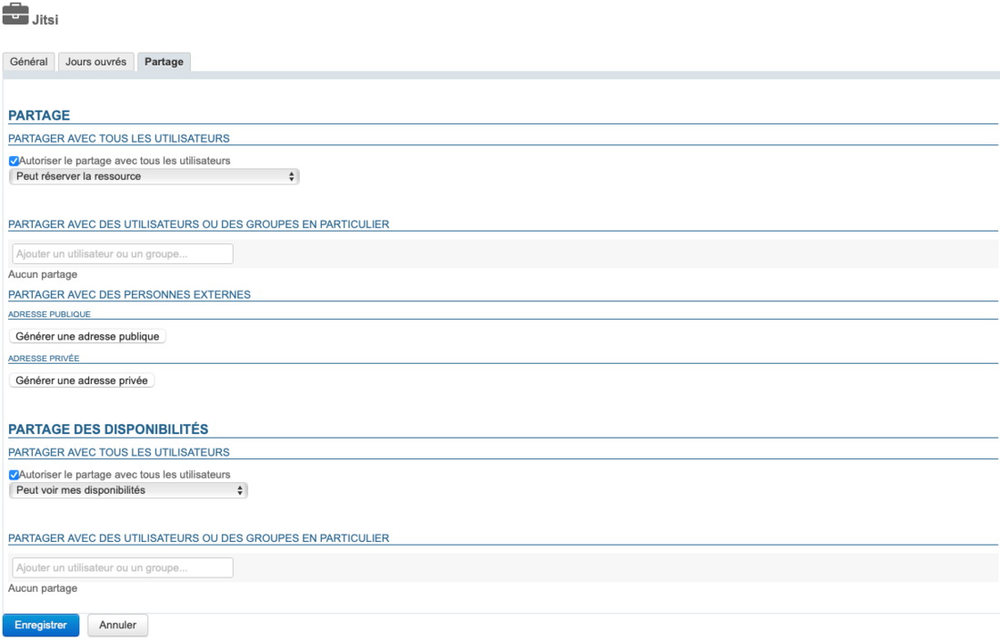

# Visioconférences avec Jitsi


## Présentation

A partir de sa version 4.5.0, BlueMind peut être connecté à un serveur Jitsi afin de proposer aux utilisateurs de facilement créer des conférences et les relier à leurs réunions d'agenda.


## Installation

Pour mettre à disposition des utilisateurs les nouvelles fonctionnalités, il convient d'installer le plugin en installant sur le serveur les paquets suivants et redémarrer BlueMind :


**
Debian/Ubuntu


**
Redhat/CentOS


```
aptitude install bm-plugin-core-videoconferencing-jitsi bm-plugin-admin-console-videoconferencing-jitsi
bmctl restart
```


```
yum install bm-plugin-core-videoconferencing-jitsi bm-plugin-admin-console-videoconferencing-jitsi
bmctl restart
```


## Administration

### Configuration du serveur

Se rendre dans la console d'administration dans la Gestion du système > Domaines supervisés > choisir le domaine souhaité > onglet Visioconférence :

Remplir les informations générales du serveur :

- URL du serveur
- Patron (optionnel) : le contenu définit ici sera ajouté au lien permettant de rejoindre la réunion
- Cliquer sur "Enregistrer"


 une ressource nommée "Jitsi" est automatiquement créée et visible dans l'annuaire. C'est grâce à celle-ci que les utilisateurs vont pouvoir créer des visioconférences automatiquement. Pour en savoir plus , voir le paragraphe [4. Droits d'accès](#VisioconferencesavecJitsi-gestion)


:::info

Par défaut, la ressource est partagée avec un droit de réservation simple, tous les utilisateurs peuvent lier une visioconférence.

:::

### Dissocier une installation Jitsi

Pour dissocier un serveur Jitsidu serveur :

- se rendre comme pour la configuration dans la Gestion du système > Domaines supervisés > choisir le domaine souhaité > onglet *Visioconférence*
- vider le champ "URL du serveur

- Enregistrer


 La ressource associée est automatiquement supprimée et les partages nettoyés, elle n'apparaît plus dans la gestion des entités et les utilisateurs ne peuvent plus la réserver.

### Patron de contenu

Il est possible d'ajouter un texte d'accompagnement au lien permettant de rejoindre la visioconférence. Cela se fait grâce au patron de contenu :


:::info

Un lien sera toujours proposé aux participants, même en l'absence de patron.

:::

- sélectionner la langue souhaitée dans la liste déroulante


:::tip

Le contenu de la ou des précédentes langues est gardé en mémoire, vous pouvez basculer de l'une à l'autre et créer autant de patrons qu'il y a de langues disponibles dans l'interface.

:::


:::info

Lors de la création d'un événement, le contenu sera ajouté en fonction de la langue de l'organisateur.

:::

- remplir le contenu :

Le patron peut contenir des variables, qui seront remplacées automatiquement dans le patron par le système :

    - ${NomRessource} : le nom de la ressource telle que définie dans l'annuaire (par défaut "Jitsi")
    - ${Organisateur} : le nom de la personne créant l'évènement dans le Calendrier
    - ${URL} : l'url d'accès à la conférence
-  **Cliquer sur ** **  pour enregistrer les changements.** 


##### Suppression d'une langue

Pour supprimer le patron d'une langue :

- sélectionner la langue souhaitée dans la liste déroulante
- vider le champ de contenu (sélectionner le texte et le supprimer)
-  **Cliquer sur ** **  pour enregistrer les changements.** 


## Droits des accès

L'accès à la nouvelle fonctionnalité se fait au moyen de la ressource Jitsi créée lors de la [configuration du serveur](http://forge.bluemind.net#configuration) :


Cette ressource s'administre comme toute autre [ressource](/Guide_de_l_administrateur/Gestion_des_entités/Ressources/), ainsi il suffit de donner un droit de réservation aux utilisateurs ou groupes souhaités pour que ceux-ci puissent créer à la volée des visioconférences pour leurs événements :




:::info

En tant que ressource, il est possible de lui attribuer des heures ouvrées ou encore une politique de réservation : le lien généré étant unique, cela n'aura pas d'incidence, la visioconférence sera malgré tout disponible et le lien actif.

:::

Un bouton est alors disponible dans l'interface de création des événements des ayant-droit :


Pour en savoir plus sur le fonctionnement, se reporter à la page de documentation du guide utilisateur : [Lier une visioconférence à un événement](/Guide_de_l_utilisateur/L_agenda/Lier_une_visioconférence_à_un_événement/).

## Appareils mobiles et logiciels tiers

Les applications tierces telles qu'Outlook ou les applications mobiles n'affichent pas le bouton, cependant les utilisateurs peuvent tout de même réserver une ressource de visioconférence en l'invitant à un événement de la même façon que tout autre ressource.


