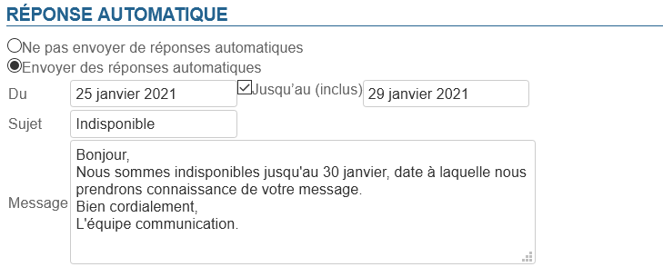
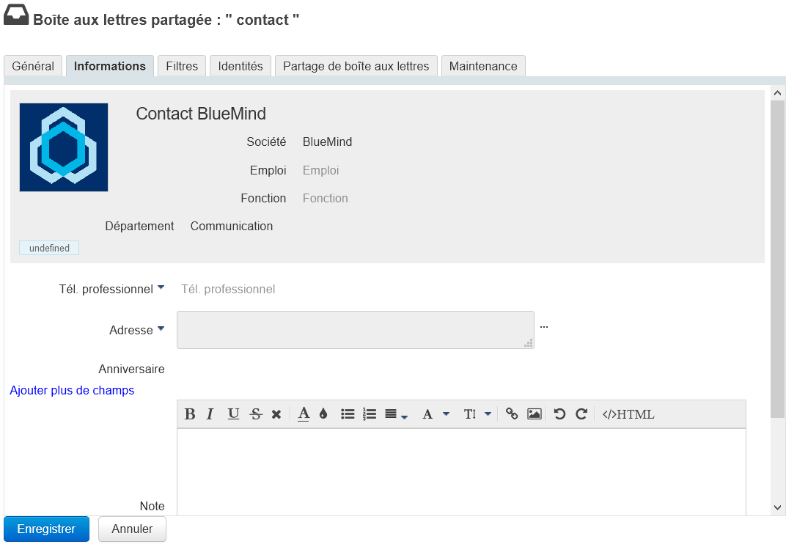
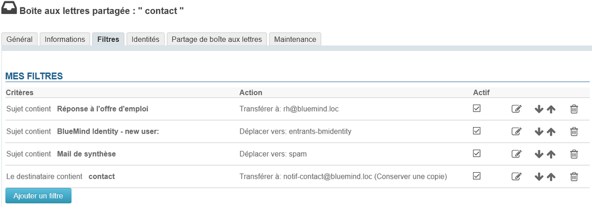
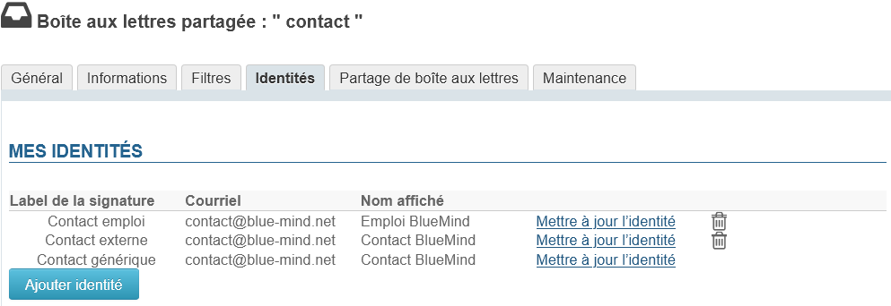

# Boites aux lettres partagées

## Présentation

Les boites aux lettres partagées, aussi nommées «boites de service» ou «boites fonctionnelles», sont des boites aux lettres qui ne sont pas nominatives : les utilisateurs y sont rattachés et partagent les messages qu'elles contiennent.
Les utilisateurs accèdent à la boite et l'utilisent selon les droits qui leur sont attribués :

- **lecture** : les utilisateurs peuvent consulter les e-mails ;
- **écriture** : les utilisateurs peuvent modifier (ajouter, supprimer, déplacer...) les e-mails et écrire au nom de la boîte partagée ;
- **gestion** : en plus du droit d'écriture, les utilisateurs ayant le droit de gestion peuvent gérer les droits sur la boite partagée.

Ces boites aux lettres sont alors disponibles pour chaque utilisateur sous une entrée d'arborescence du client de messagerie (par défaut : "Dossiers partagés").

**A partir de la version 4.5 de BlueMind, les utilisateurs partagent le statut de lecture des messages** : lorsqu'un des ayant droit consulte un message, celui-ci passe en "lu" pour tous les autres utilisateurs. Ainsi si un message est toujours indiqué "non lu", cela indique que personne n'en a encore pris connaissance, ou qu'un utilisateur l'a lu puis volontairement repassé en "non lu" afin qu'il soit traité ou consulté.
Pour les versions antérieures, ce comportement peut être mis en œuvre par les administrateurs en suivant le guide dédié de notre [Base de connaissance](/Base_de_connaissance/) : [Partager le statut de lecture des boîtes partagées](/Base_de_connaissance/Partager_le_statut_de_lecture_des_boîtes_partagées/).

*Pour plus de détails sur les principes de fonctionnement, consultez la page de documentation utilisateur * * [Les boites aux lettres partagées](/Guide_de_l_utilisateur/La_messagerie/Les_boites_aux_lettres_partagées/) *

## Création

- Depuis la page "Annuaires", cliquer sur "Créer une boite aux lettres partagée"
- Saisir un nom de boite aux lettres, une description (optionnel) et une adresse électronique

:::info

ATTENTION
Le nom de la boite ne sera pas modifiable par la suite
:::

:::info
Une boite aux lettres partagée peut être laissée sans adresse électronique. Dans ce cas, les utilisateurs pourront l'utiliser (en y déplaçant ou copiant des messages par exemple) mais elle ne pourra pas servir à recevoir ni envoyer de courrier.
:::

- Comme pour tout utilisateur ou groupe, on peut choisir de ne pas faire apparaître une boite partagée dans l'annuaire. Pour cela cocher la case "Masquer dans la liste d'adresses BlueMind".
- Valider avec le bouton "Créer" (ou touche &lt;Entrée>) pour procéder à une création rapide ou choisir de créer la boite et de se rendre à l'interface d'administration avec le bouton "Créer et éditer" (&lt;Ctrl-Entrée>).

## Administration

### Général

#### Boîte de messagerie

Cet onglet présente les paramètres principaux ainsi que le répondeur automatique.

- **Nom** : le nom de la boîte partagée est attribué lors de sa création, il ne peut pas être modifié
- **Délégation** : [l'unité d'organisation](/Guide_de_l_administrateur/Gestion_des_entites/Utilisateurs/L_administration_déléguée/) à laquelle la boîte appartient
- **Quota** : la taille maximale que la boîte peut atteindre
- **Routage du courrier** : le type (ou l'absence) de messagerie
- **Adresse électronique** : la boîte partagée peut posséder autant d'alias de messagerie que souhaité, sur l'un, l'autre ou tous les alias de domaines disponibles
- **Serveur de stockage** : [serveur par lequel la boîte est gérée](/Guide_d_installation/Installation/Installation_avec_répartition_des_données_sur_plusieurs_serveurs/)

#### Répondeur automatique

De même que pour une boîte d'utilisateur, lorsque la réponse automatique est activée et pour la période déterminée, un mail sera automatiquement envoyé à l'expéditeur lorsque la boîte recevra un message.

- Les dates de début et de fin ne sont pas obligatoires :
    - si aucune date de début n'est spécifiée, le répondeur s'active dès l'enregistrement des nouveaux paramètres
    - si aucune date de fin n'est spécifiée, le répondeur reste actif jusqu'à ce que l'utilisateur modifie ses paramètres et sélectionne "Ne pas envoyer de réponses automatiques"
- Lorsque l'utilisateur clique sur la zone de saisie d'une date, un calendrier d'aide au choix de la date s'affiche
- Le sujet est optionnel : s'il n'est pas rempli, un message avec un objet vide sera envoyé
- Le contenu du message est obligatoire, il apparaitra dans le corps du message envoyé.

:::info

Fréquence d'envoi

Un seul message d'absence est envoyé en réponse à une même personne (adresse mail) pour une période de 3 jours.

Si l'utilisateur désactive puis réactive son répondeur pendant cette période **sans modifier l'objet ou le contenu de son message**, les personnes ayant déjà reçu une réponse automatique n'en recevront pas une nouvelle, le décompte pour la période reprenant là où il s'était arrêté.

:::

### Informations

Cet onglet présente les informations qui seront affichées dans la fiche de l'annuaire pour la boîte partagée.

De même que pour les utilisateurs, l'administrateur peut saisir ici des informations telles que les numéros de téléphone et adresses postales ou affecter une image (avatar) qui sera réutilisée dans l'ensemble de l'application (dans [les contacts](https://forge.bluemind.net/confluence/display/DA/.Les+contacts+vBM-4.0) ou [le numéroteur](https://forge.bluemind.net/confluence/display/DA/.La+telephonie+vBM-4.0) par exemple).

:::info

Les données de contact correspondent à l'annuaire **interne** de BlueMind et sont accessibles à l'ensemble des utilisateurs de la solution. Pour cette raison, **l'administrateur est le seul à pouvoir modifier ces informations** : les utilisateurs, même ayant un droit de partage complet sur la boîte, ne le peuvent pas modifier.

:::

### Filtres

Cet onglet permet de créer et organiser des règles s'appliquant sur le courrier entrant.

Le fonctionnement est identique aux filtres utilisateurs. Vous pouvez consulter la page dédiée pour plus de détails sur leur gestion : [Les filtres de messages](/Guide_de_l_utilisateur/La_messagerie/Les_filtres_de_messages/).

### Identités

L'administrateur peut ici définir des identités qui pourront être récupérées par les utilisateurs ayant le droit d'écriture sur la boite : lorsque l'utilisateur choisit une de ces identités, les nom, label et signature sont récupérées. Ainsi les utilisateurs n'ont pas à re-saisir les informations eux-mêmes, évitant ainsi le risque d'erreur, et peuvent partager une même signature pour une même boîte, permettant une meilleure cohésion et une transparence avec les interlocuteurs.

Pour plus de détails, consulter la page du Guide de l'utilisateur : [Les identités](/Guide_de_l_utilisateur/La_messagerie/Les_identités/)

### Partages

Cet onglet permet de gérer les options de partage de la boite aux lettres avec les utilisateurs.

[Voir [Guide de l'utilisateur > La Messagerie > Les boites aux lettres partagées §3.Gestion des partages](/Guide_de_l_utilisateur/La_messagerie/Les_boites_aux_lettres_partagées/)]

### Maintenance

 La version 4.4 ajoute à l'administration des boîtes partagées les mêmes fonctionnalités de maintenance que pour les utilisateurs.

- **Consolider l'index de la boîte aux lettres** : cette opération complète l'indexation actuelle de la boîte en indexant les éléments manquants uniquement
- **Valider et réparer la boîte partagée** : cette opération regroupe un ensemble d'autres opérations qui vérifient et corrigent si besoin l'intégrité de la boîte et de ses données dans le système BlueMind : vérification de la boîte de messagerie dans Cyrus, de la hiérarchie de dossiers IMAP, filtres de messagerie, etc.

