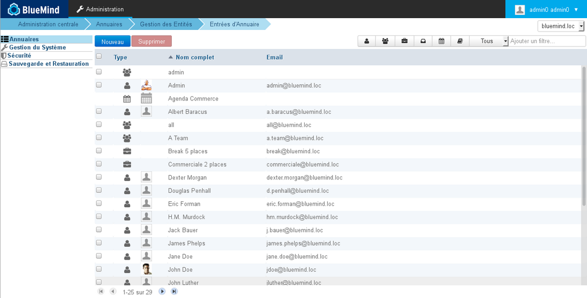
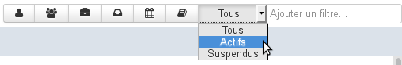

# Entrées d'annuaire

## Présentation

Cette page présente la liste des entrées présentes dans l'annuaire : utilisateurs (internes et externes), groupes, boîtes aux lettres partagées, ressources ainsi que les calendriers et carnets d'adresses de domaine.

## Tri des entrées

Par défaut, les entrées sont présentées triées sur l'identifiant par ordre alphabétique.

Une flèche indique la colonne et l'ordre du tri courant. Pour modifier ou inverser l'ordre de tri, cliquer sur l'entête de colonne souhaité.

## Filtrage des entrées

Les entrées affichées peuvent être filtrées à l'aide du formulaire présent en haut à droite de la liste des entrées :

BlueMind propose 3 types de filtres :

1. **Type**
Les 6 premiers boutons permettent d'afficher ou masquer un type d'entrées : utilisateurs, groupes, ressources, boites partagées, calendriers, carnets d'adresses.
Lorsqu'un bouton est activé, il apparaît grisé et les entrées correspondantes sont affichées. On peut ainsi faire apparaître un ou plusieurs types d'entrées en activant un ou plusieurs boutons, par exemple pour visualiser les calendriers et carnets de domaine :

Pour réinitialiser le filtre, remettre chaque bouton dans son état initial non grisé.

2. **Statut**
La liste déroulante suivante permet de filtrer les entrées selon leur statut, actif ou suspendu.
Pour réinitialiser le filtre, choisir l'option "Tous"

3. **Texte**
Le champs de saisie permet de filtrer les entrées sur une chaîne de caractères.
Taper le mot (partiel ou complet) et valider avec la touche &lt;Entrée>, toutes les entrées contenant ces caractères dans leur nom ou leur identifiant sont affichées.
Pour réinitialiser le filtre, vider le champs et valider avec la touche &lt;Entrée>.
NB : la recherche n'est pas sensible à la casse, elle ne tient pas compte des majuscules/minuscules.

Les filtres sont cumulatifs, ainsi on peut par exemple faire afficher les utilisateurs actifs contenant "do" dans leur nom et/ou leur identifiant :

