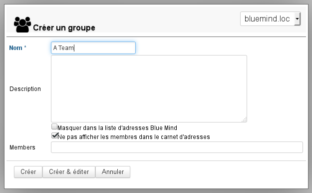
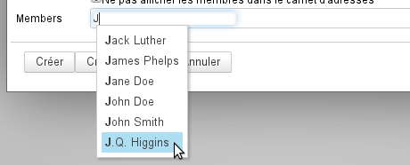
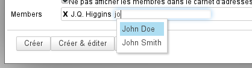
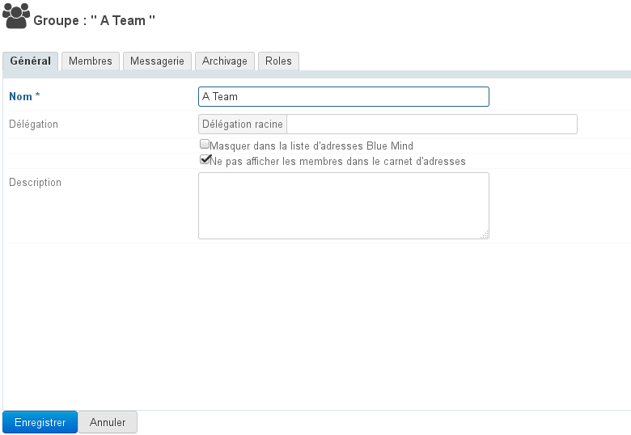
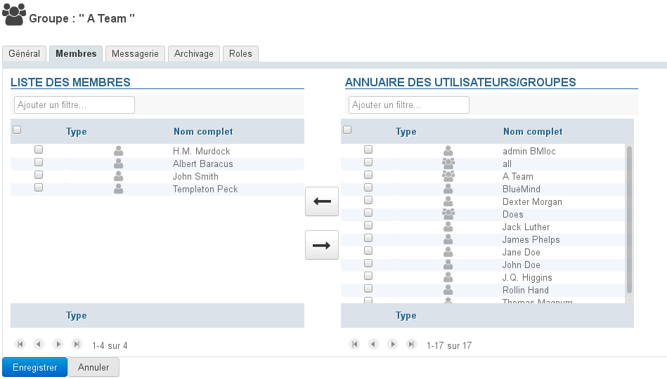
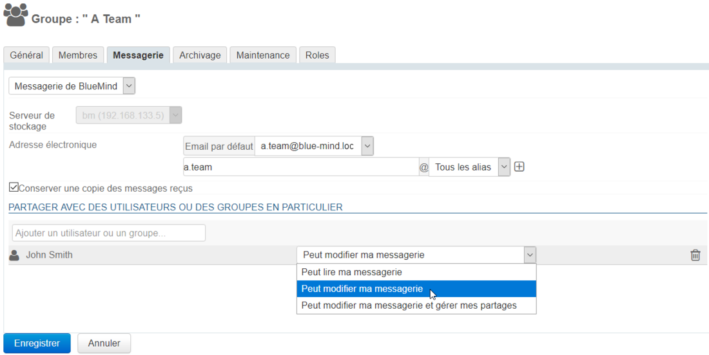
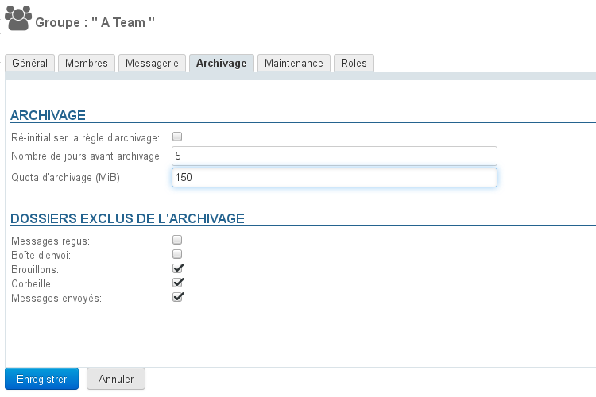
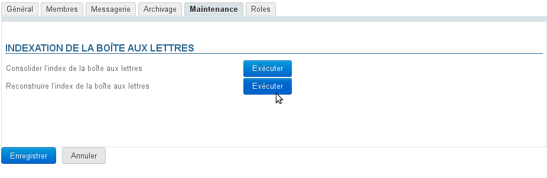
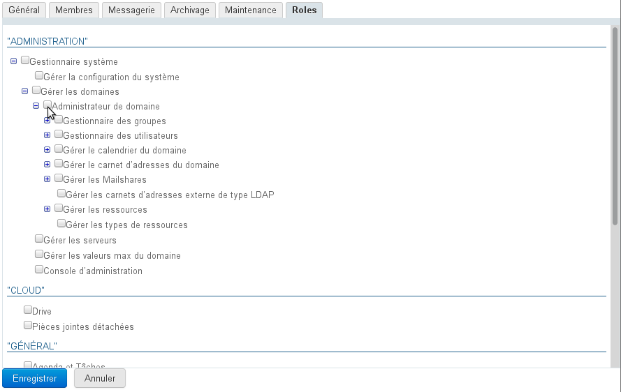

# Groupes

## Présentation

Les administrateurs peuvent créer des groupes d'utilisateurs qui, s'ils sont publics, sont utilisables pour :

- afficher les agendas d'un groupe de personne ;
- attribuer des droits à un groupe de personnes sur des agendas, ressources, boites partagées, boites aux lettres individuelles, carnets d'adresses, etc.
- définir d'autres groupes par inclusion d'un ou plusieurs groupes ;
- envoyer un e-mail à un groupe de personnes (si le groupe possède une adresse e-mail) : liste de diffusion interne.

## Création

Depuis l'interface d'administration, cliquer sur "Créer un groupe" sur la page d'accueil ou sur la page "Annuaires" :

Saisir le nom du groupe, un description (optionnelle) et les options souhaitées :

- Masquer dans la liste d'adresses BlueMind : le groupe existe mais n'est pas visible (ni dans les auto-complétions, ni dans la liste des contacts de l'annuaire ou groupes auxquels il appartient). Ce groupe peut être utilisé par les administrateurs ou par ceux qui en connaissent l'adresse.
- Ne pas afficher les membres dans le carnet d'adresse : même si le groupe est visible depuis l'annuaire, les utilisateurs ne peuvent pas voir quels membres il regroupe

Le groupe peut être laissé vide ou on peut dès cet écran ajouter les membres depuis le dernier champs du formulaire.
L’auto-complétion permet de trouver les membres dès le début de la saisie :

Pour ajouter plusieurs utilisateurs, continuer la saisie à droite de l'utilisateur précédemment sélectionné :

### Création rapide

Comme pour la Création d'un utilisateur, un groupe peut être créé en édition rapide en cliquant sur le bouton "Créer".
Il possède alors les informations saisies dans la popup et les propriétés par défaut suivantes :

- il n'a pas d'adresse mail
- l'archivage n'est pas activé

Le groupe pourra par la suite être complété et modifié via l'interface d'administration.

### Création et édition

Le bouton "Créer et éditer" (touches &lt;Ctrl-Entrée>) crée le groupe avec les mêmes propriétés qu'en création rapide puis redirige automatiquement vers l'interface d'administration du groupe afin d'effectuer un paramétrage plus complet du groupe.

## Édition et administration d'un groupe

Depuis la page Annuaires >> Entrées d'annuaires, filtrer les groupes en cliquant sur l'icône "groupe", puis sélectionner le groupe à éditer dans la liste.

### Général

L'onglet "Général" présente les informations et paramétrages de base du groupe : nom, délégation (en tant que membre seulement), description et options de visibilités pour le groupe lui-même et pour les membres.

### Membres

L'onglet "Membres" présente en 2 colonnes la gestion des membres du groupe : dans la colonne de gauche les membres déjà présents dans le groupe, dans la colonne de droite les autres utilisateurs et groupes présents dans l'annuaire.

- Sélectionner dans une colonne l'utilisateur ou le groupe souhaité puis cliquer sur une des flèches centrales pour le faire entrer ou sortir du groupe :

:::info

Groupes dans des groupes

Des groupes peuvent être inclus dans des groupes, cependant seuls les groupes ayant une adresse email seront pris en compte : si un groupe inclus n'a pas d'adresse email, ses membres ne recevront pas les messages envoyés au groupe parent.

:::

:::tip

Des utilisateurs externes peuvent être ajoutés aux groupes. Consultez la page dédiée pour en savoir plus : [Utilisateurs](/Guide_de_l_administrateur/Gestion_des_entites/Utilisateurs/) > [Utilisateurs externes](/Guide_de_l_administrateur/Gestion_des_entites/Utilisateurs/Utilisateurs_externes/)

:::

### Messagerie

L'onglet Messagerie permet de paramétrer les adresses et alias du groupe ainsi que la conservation des messages : le groupe possède alors une boite partagée lui permettant de consulter les messages reçus.

Lorsque la case "Conserver une copie des messages reçus" est activée, les messages sont conservés dans une boite de messagerie, ils peuvent ainsi être conservés et consultés.

Lorsque cette case est décochée, les nouveaux messages ne sont pas conservés.

:::tip

Lors de la désactivation de cette option, le contenu de la boîte n'est pas supprimé.

Si la case était activée pendant un temps avant d'être désactivée, la boîte partagée persiste et contient les emails reçus pendant la durée de l'activation.

:::

La boîte de messagerie du groupe peut être partagée indépendamment de l'appartenance au groupe grâce au [formulaire de partage](/Guide_de_l_utilisateur/Gestion_des_partages/) suivant. Les droits possibles sont les suivants :

- **Peut lire ma messagerie** : les utilisateurs peuvent consulter les e-mails
- **Peut modifier ma messagerie** : en plus du droit précédent, les utilisateurs peuvent modifier (ajouter, supprimer, déplacer...) les e-mails
- **Peut modifier ma messagerie et gérer mes partages** : en plus du droit précédent, les utilisateurs peuvent gérer les droits de partage

Dans l'arborescence de la messagerie, la boîte est placée avec les boites partagées et porte le nom du groupe précédé du symbole "_" (*underscore*).
Par exemple pour un groupe "contact" la boîte partagée sera nommée "_contact" dans l'arborescence.

:::info

Contrairement aux boites aux lettres partagées, la messagerie du groupe ne peut être utilisé pour créer une identité et écrire au nom du groupe.

:::

### Archivage

Lorsque qu'une [politique d'archivage globale](/Guide_de_l_administrateur/Configuration/Archivage/) est définie pour le domaine, les règles par défaut de celle-ci s'appliquent à tous les utilisateurs et groupes du domaine.

Il est cependant possible de surcharger les paramètres par défaut afin de définir un paramétrage par défaut pour un utilisateur ou un groupe d'utilisateur.

Par défaut, ce sont donc les paramètres de l'archivage du domaine qui apparaissent dans le formulaire, pour les personnaliser il suffit de saisir les nouvelles valeurs souhaitées :

- le nombre de jours souhaité, tous les messages antérieurs seront archivés.
- le quota d'espace disque alloué aux utilisateurs du groupe

:::info

le quota ne peut dépasser le quota maximum du domaine : si un nombre supérieur est entré, celui-ci sera ramené au quota maximum à l'enregistrement

:::

- cocher ou décocher les dossiers à ** **exclure** ** si besoin
- cliquer sur "Enregistrer" pour que les changements soient pris en compte.

La case "Ré-initialiser la règle d'archivage" permet de remettre les valeurs par défaut du domaine :

- cocher la case, le formulaire est alors grisé
- cliquer sur « Enregistrer »
- les données sont enregistrées : la fiche du groupe est fermée, vous pouvez la rouvrir pour contrôler que les données ont bien été réinitialisées.

:::info

L'unité MiB (MebiByte) est un multiple du byte (octet) à différencier du MB (megabyte, ou Mo méga-octet) : il représente 1024 kebibytes, lui-même représentant 1024 bytes (octets).

Ainsi 9 MiB sont équivalents à 9,43718 MB (Mo)

:::

### Maintenance

L'onglet Maintenance vous permet d'effectuer les opérations de maintenance concernant la boîte de messagerie du groupe : consolidation et reconstruction de la boîte.

### Rôles

L'onglet Rôles permet d'attribuer les applications auxquelles les membres du groupe ont accès :

Cela permet de ne donner accès à certaines fonctionnalités qu'à certains utilisateurs sans devoir faire une gestion individuelle fastidieuse. Une fois les rôles attribués aux groupes, on n'a ainsi plus à se soucier des droits individuels, il suffit d'intégrer un utilisateur dans un groupe pour qu'il ait accès aux applications dont il a besoin.

On pourra ainsi par exemple donner accès à la téléphonie à l'équipe commerciale seulement afin de faciliter ses échanges avec l'extérieur et réserver la messagerie instantanée aux équipes techniques afin de faciliter leurs échanges écrits.

## Suppression

Depuis la liste des entrées d'annuaires, cocher la case en début de ligne correspondant au groupe à supprimer puis cliquer sur "Supprimer" et confirmer la suppression.

 **La suppression est immédiate et définitive.** 

