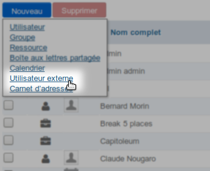
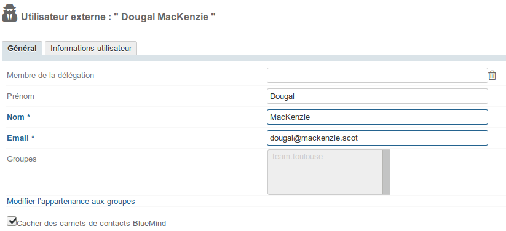
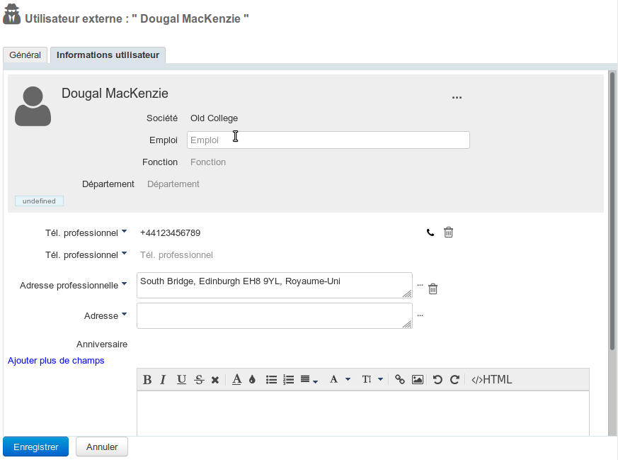
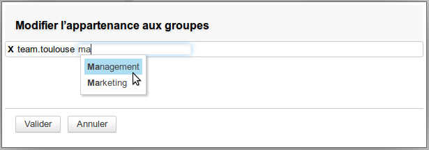
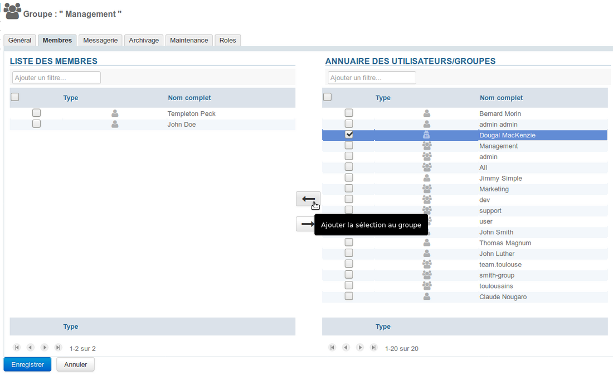
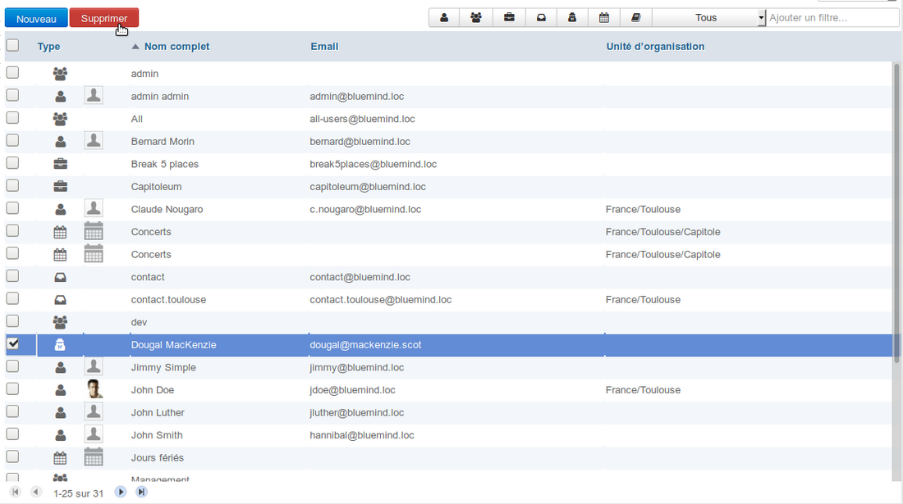

# Utilisateurs externes

## Présentation

Les utilisateurs externes sont des utilisateurs n'ayant pas de compte propre dans BlueMind au même titre que les utilisateurs classiques mais ayant une **adresse de messagerie externe** à BlueMind. ****Les utilisateurs de ce type peuvent être ajoutés aux groupes BlueMind afin de recevoir les messages qui leur sont adressés.****

Un utilisateur externe est identifié dans BlueMind par une icône particulière dédiée : 

## Création

À partir de BlueMind 3.5.10, vous trouverez dans les raccourcis de la page d'accueil de la gestion de l'annuaire mais aussi dans le menu de création des entités un nouveau type :

Cliquer sur le lien vous propose la fenêtre de création d'un utilisateur externe, aux propriétés réduites par rapport aux utilisateurs de BlueMind :

- **Membre de la délégation** : l'utilisateur peut être membre d'une unité d'organisation (voir [L'administration déléguée](/Guide_de_l_administrateur/Gestion_des_entites/Utilisateurs/L_administration_déléguée/))
- **Prénom** : -factultatif-
- **Nom** : champs obligatoire
- **Email** : champs obligatoire - doit contenir une adresse mail valide
- **Cacher des carnets de contacts BlueMind** : le contact pourra être membre d'un groupe mais n'apparaîtra pas dans l'annuaire - cette option est active par défaut, elle peut être désactivée/réactivée à la création mais aussi à tout moment par la suite

Une fois le formulaire rempli, cliquer sur :

- &lt;Créer> pour créer simplement et directement l'utilisateur
- &lt;Créer et éditer> pour créer l'utilisateur et accéder à la gestion de sa fiche complète

## Gestion

### L'utilisateur

L'onglet Général de la fiche d'un utilisateur permet de compléter/modifier les champs remplis lors de la création de l'utilisateur mais aussi de modifier les groupes auquel il appartient :

### La fiche contact

L'onglet « Informations utilisateur » permet de renseigner la fiche contact de l'utilisateur en vue de son partage dans l'annuaire :

### Ajout dans un groupe

L'utilisateur peut être rajouté dans un groupe de 2 façons :

1. depuis sa fiche de gestion, cliquer sur le lien "Modifier l'appartenance aux groupes" et saisissez les groupes souhaités :
2. depuis la fiche de gestion d'un groupe, recherchez l'utilisateur et ajoutez-le comme pour tout utilisateur :

:::info

L'ajout à un groupe est effectif immédiatement, l'utilisateur commence dès ce moment à recevoir les messages adressés au groupe (soit via l'adresse du groupe soit via l'ajout de son adresse à celle des autres membres si le groupe ne possède pas d'adresse propre).

:::

### Suppression

Pour supprimer un utilisateur externe :

- se rendre dans l'administration de l'annuaire BlueMind
- sélectionner l'utilisateur et cliquer sur "Supprimer" :

:::info

Retrait des groupes

L'utilisateur est supprimé automatiquement de tous les groupes auxquels il appartenait.

:::

