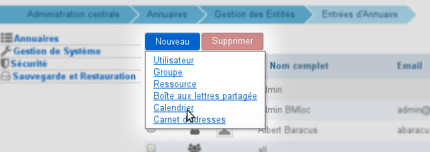
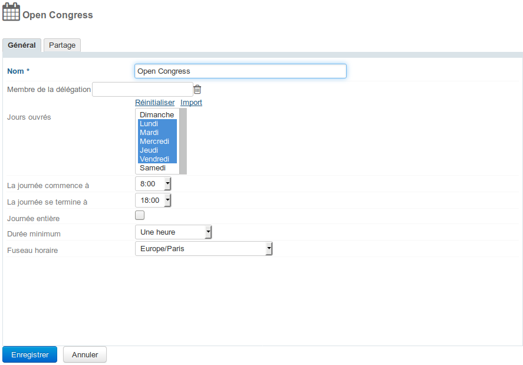
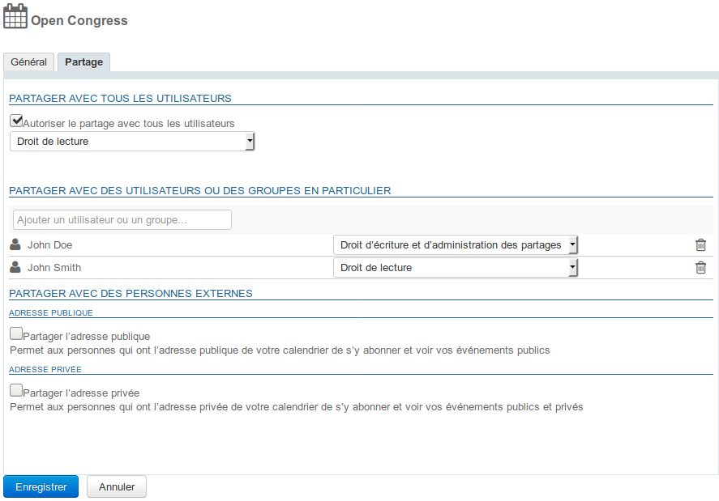
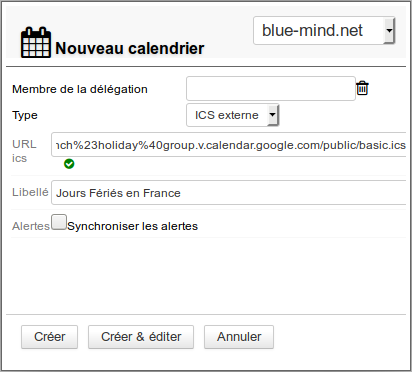

# Calendriers de domaines

## Présentation

Le calendrier de domaine est un calendrier commun aux utilisateurs. En plus de la simple consultation, l'administrateur peut déléguer les droits de modification ou de gestion des calendriers à des utilisateurs ou groupes.

Depuis BlueMind 3.5, les calendriers de domaines sont gérés comme des entités à part entière : ils s'administrent depuis la gestion des entrées d'annuaires, on peut les positionner en organisateur (si l'on possède les droits adéquats), on peut les alimenter par import ICS ou exporter leur contenu au format ICS et exporter une adresse privée ou publique pour un partage externe.

## Utilisation

Ces calendriers sont considérés comme des calendriers servant à l'information des utilisateurs, pour faire connaître par exemple les jours fériés, les jours de fermeture de l'entreprise, les événements commerciaux (salons, présentations...) ou municipaux (réunion du conseil, exposition, conseil d'école, etc.), les formations, les actions d'une équipe, etc.

 **Par conséquent, les calendriers de domaine ne peuvent pas  ** être positionnés en organisateurs de réunions ni y être invités** . On peut seulement créer des événements dans les calendriers.

 ** 

##### Cas d'usages

Les agendas de domaine pouvaient être utilisés dans 2 cas :

- **l'agenda d'information**, via lequel les utilisateurs peuvent consulter des informations.    **L'agenda de domaine est toujours le bon moyen de gérer ce type de d'agenda.** Par exemple un agenda marketing contenant les salons auxquels l'équipe commerciale participe, ou encore un agenda de mairie informant des réunions publiques et événements organisés.
- **l'agenda opérationnel**, servant à créer des événements pour des utilisateurs.    ** Il est préférable d'utiliser un agenda de [ressource](https://forge.bluemind.net/confluence/display/DA/.Les+ressources+vBM-4.0) pour permettre ce fonctionnement.** Par exemple sur un agenda des astreintes : on crée un événement hebdomadaire "astreinte week-end" et chaque semaine on y invite l'utilisateur concerné. Cela permet de centraliser l'information mais aussi aux utilisateurs d'accepter, refuser ou indiquer leur (in)disponibilité.

## Création

Pour créer un nouveau calendrier :

1. Depuis la page d'accueil de la gestion de l'annuaire, cliquer sur "Créer un calendrier"
2. ou depuis la liste des entrées d'annuaire utiliser le bouton Nouveau > Calendrier : 

- renseigner un nom et, s'il y a lieu, sélectionner un domaine : 
- cliquer sur «Créer» pour une création simple et directe du calendrier
- cliquer sur «Créer & éditer» pour créer le calendrier et accéder aux options de configuration, notamment aux options de partage.

## Configuration

### Options générales

Ce premier onglet de la gestion d'un calendrier de domaine permet de définir les caractéristiques du calendrier : jours ouvrés, heures de début et fin de journée de travail, durée minimum d'un rendez-vous, fuseau horaire.

### Partage

Par défaut, lors de sa création, un calendrier n'est partagé avec aucun utilisateur, ce qui signifie que les utilisateurs ne peuvent ni le consulter, ni y ajouter des rendez-vous.

Les droits peuvent être affectés :

- à l'ensemble des utilisateurs du domaine pour un agenda commun et public, pour les événements d'entreprise par exemple
- à certains utilisateurs, par exemple pour un agenda de direction
- à un groupe, pour un agenda de projet par exemple

Les droits qu'il est possible d'affecter sont :

- **Lecture** : peut consulter les rendez-vous
- **Écriture** : peut positionner des rendez-vous dans le calendrier et modifier les rendez-vous existant
- **Écriture et administration des partages** : peut, en plus du droit d'écriture, administrer les partages du calendrier

#### Partage public

En activant cette case, le partage paramétré est appliqué à l'ensemble des utilisateurs du domaine.

#### Partager avec des personnes ou des groupes en particulier

Cette section permet de choisir des personnes ou groupes à qui affecter des droits.

Commencer à saisir le nom de l'utilisateur ou du groupe dans le champs de saisie et valider avec la touche entrée ou en cliquant sur le nom proposé par l'autocomplétion.

Ainsi, pour un agenda d'entreprise par exemple, on pourra donner à tous les utilisateurs la possibilité de consulter et à la secrétaire de direction le droit de positionner des rendez-vous, afin qu'elle y fasse apparaître les événements et manifestations auxquels participe l'entreprise ou encore les jours de fermeture et congés obligatoires.

## Calendrier externe

Un calendrier de domaine peut être un calendrier externe synchronisé. Il se crée et s'administre de la même façon qu'un calendrier de domaine.

### Création

Lors de la création du calendrier (voir ci-dessus) :

- sélectionner « ICS externe » dans la liste déroulante puis coller l'url du calendrier externe dans le nouveau champs proposé :

- En quittant le champs (touche tab ou clic à l'extérieur) l'url est alors validée par BlueMind. **Tant que l'url est considérée comme invalide, le calendrier ne peut pas être créé.**
- Remplissez le nom si celui-ci n'est pas automatiquement trouvé ou si vous souhaitez le personnaliser
- Cliquer sur « Créer » pour une création simple avec les options par défaut (sans partage) ou « Créer & éditer » pour accéder aux options du calendrier, de partage notamment.

### Partage

Les règles de partage sont les mêmes pour un calendrier externe que pour un calendrier de domaine BlueMind à une exception près : de même que les [calendriers externes des utilisateurs](/Guide_de_l_utilisateur/L_agenda/Les_calendriers_externes/), les calendriers de domaines ne sont accessibles que pour consultation : les modifications ne seront pas répercutées et enregistrées sur le calendrier d'origine.

