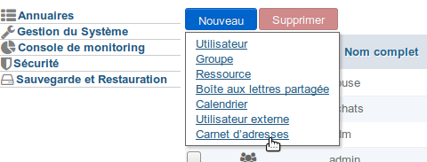
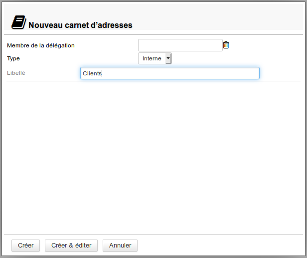
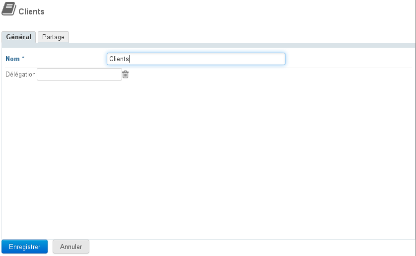
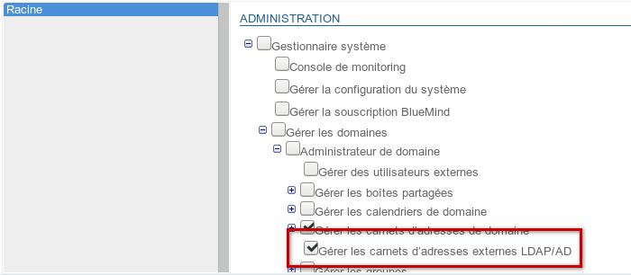
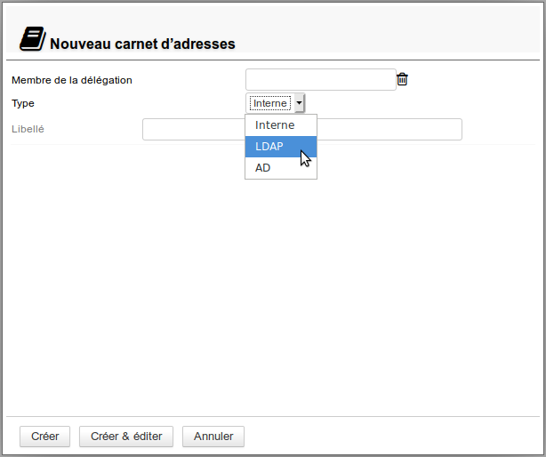
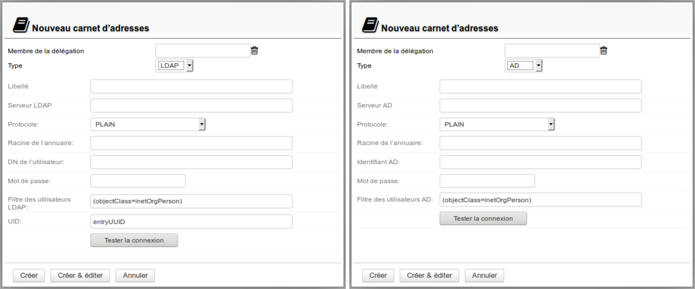
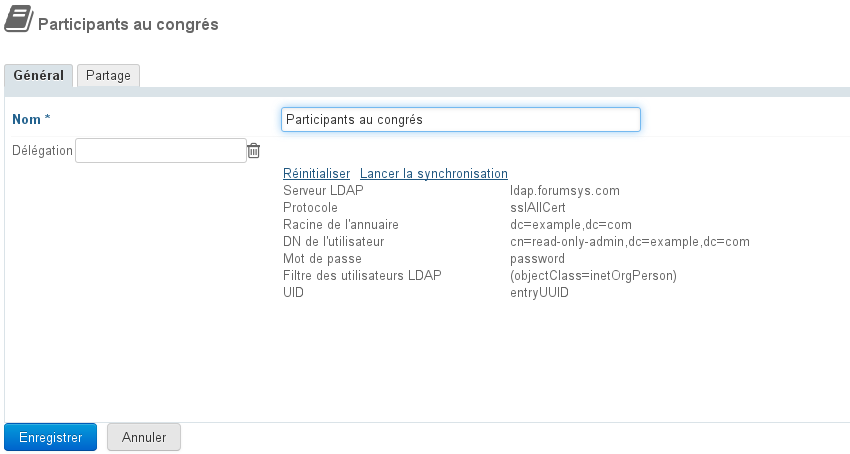
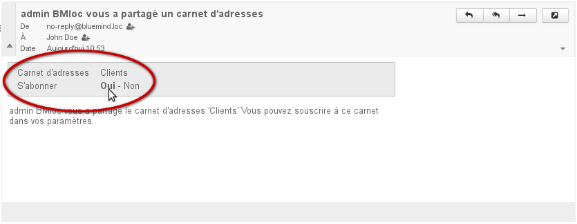
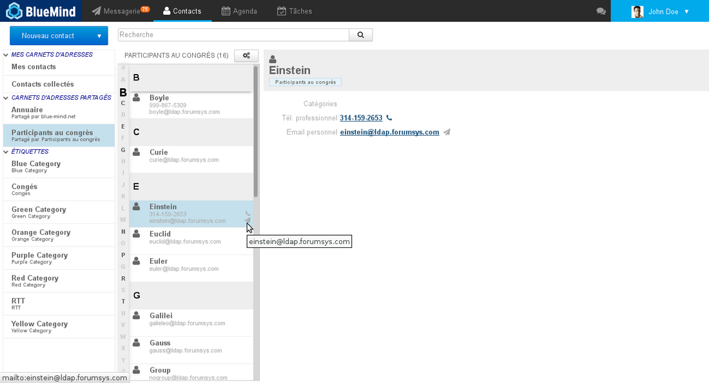

# Carnets d'adresses de domaines

## Présentation

Le carnet de domaine est un carnet d'adresses commun aux utilisateurs. En plus de la simple consultation, l'administrateur peut déléguer les droits de modification ou de gestion du carnet à des utilisateurs ou groupes.

Les carnets de domaines sont gérés comme des entités à part entière mais se comportent comme les carnets d'utilisateurs : selon les droits attribués on peut les consulter, créer et modifier des fiches, y importer des contacts ou encore exporter le carnet au format vCard.

## Carnet de domaine interne

### Création

Pour créer un nouveau carnet :

1. Depuis la page d'accueil de la gestion de l'annuaire, cliquer sur "Créer un carnet"ou depuis la liste des entrées d'annuaire utiliser le bouton Nouveau > Carnet d'adresses : 
2. laisser sélectionner le type de carnet "interne", renseigner un nom et, s'il y a lieu, une délégation : 
3. cliquer sur «Créer» pour une création simple et directe du carnetou cliquer sur «Créer & éditer» pour créer le carnet et accéder aux options de configuration, notamment aux options de partage.

### Configuration

L'onglet "Général" de la configuration d'un carnet de domaine permet de modifier son nom ou l'unité d'organisation (délégation) à laquelle il appartient :

Une fois le nom ou la délégation renseigné, cliquer sur «Enregistrer» pour valider les changements.

:::tip
L'astérisque indique que le champs est obligatoire, le nom ne peut être laissé vide.
:::

## Carnet d'adresses connecté à un annuaire externe

Il est possible de créer des carnets d'adresses de domaine synchronisés à des annuaires LDAP et AD. Cette fonctionnalité permet notamment la consultation d'annuaires de grande ampleur, en filtrant ou non les contacts présentés dans le carnet.

### Droit d'administration

L'administration des carnets d'adresses LDAP/AD est conditionnée par un rôle particulier qu'il convient de déléguer aux administrateurs souhaités :

Ce rôle est indépendant afin de pouvoir permettre à certains administrateurs de ne créer que de simples carnets de domaines.

:::info

Pour pouvoir créer des carnets, l'utilisateur doit posséder aussi le rôle "Gérer les carnets d'adresses de domaine"

:::

De même que les autres, ce rôle peut être délégué soit à un groupe (par exemple pour le donner à tous les administrateurs) soit individuellement à certains utilisateurs seulement.
Pour en savoir plus, consulter la page dédiée [L'administration déléguée](/Guide_de_l_administrateur/Gestion_des_entités/Utilisateurs/L_administration_déléguée/)

### Création

La création se fait de la même façon que pour la création d'un carnet simple :

1. Depuis la page d'accueil de la gestion de l'annuaire, cliquer sur "**Créer un carnet d'adresses du domaine**"ou depuis la liste des entrées d'annuaire utiliser le bouton **Nouveau > Carnet d'adresses** : 
2. **Sélectionner le type de carnet** :
3. Le formulaire dédié apparaît alors : 
4. **Remplir les informations de l'annuaire à connecter**, par exemple pour un carnet LDAP :

:::tip

À propos du champs UID

Ce champs peut contenir le nom d'un attribut LDAP qui respecte les conditions suivantes :

- valeur texte
- valeur unique
- valeur ne variant pas durant toute la vie de l'entrée LDAP correspondante - y compris en cas de déplacement dans l'arbre, renommage ou autre modification.

:::

5. **Cliquer sur «Créer»** pour une création simple et directe du carnetou cliquer sur «Créer & éditer» pour créer le carnet et accéder aux options de configuration, notamment celles de partage.

### Configuration

L'onglet « Général » des options de configuration d'un carnet permet de :

- Modifier son nom
- Ajouter, modifier ou retirer l'unité d'organisation (délégation) à laquelle il appartient
- Vérifier les informations de connexion à l'annuaire LDAP/AD
- Forcer une synchronisation ou réinitialiser les données

## Partage

Par défaut, lors de sa création, un carnet d'adresses de domaine n'est partagé avec aucun utilisateur.

Les droits peuvent être affectés :

- à l'ensemble des utilisateurs du domaine pour un carnet commun et public
- à certains utilisateurs, par exemple pour un carnet de contacts partagés entre le directeur, son adjoint et sa secrétaire
- à un groupe, par exemple un carnet de clients ou un carnet de prospects pour l'équipe commerciale

Les droits qu'il est possible d'affecter sont :

- Peut voir ce carnet d'adresses : peut consulter et exporter les fiches contacts
- Peut modifier les contacts de ce carnet d'adresses : peut créer, importer et modifier les contacts
- Peut modifier les contacts et gérer les partages du carnet d'adresses : peut, en plus du droit d'écriture, administrer les partages du carnet

:::info

Partage d'un carnet synchronisé à un annuraire LDAP : problème connu

Malgré la présence d'une option "peut modifier", les contacts des carnets d'adresses synchronisés à des annuaires LDAP ne pourront pas être modifiés par les utilisateurs, cette synchronisation étant de la consultation simple.

Les seuls droits pertinents sont "peut voir les contacts" et "peut gérer les partages".

:::

#### Partage public

En activant cette case, le partage paramétré est appliqué à l'ensemble des utilisateurs du domaine.

#### Partager avec des personnes ou des groupes en particulier

Cette section permet de choisir des personnes ou groupes à qui affecter des droits.

- Commencer à saisir le nom de l'utilisateur ou du groupe dans le champs de saisie
- valider avec la touche entrée ou en cliquant sur le nom proposé par l'autocomplétion
- la personne ou le groupe est ajouté à la liste, choisir le droit souhaité
- répéter l'opération pour ajouter plusieurs personnes ou groupes
- une fois les droits positionnés, cliquer sur "Enregistrer" pour valider

Ainsi, pour un carnet commercial par exemple, on pourra donner :

- au responsable le droit d'écriture et d'administration des partages afin qu'il puisse créer et modifier les fiches et éventuellement déléguer à l'un ou l'autre de ses collaborateurs le droit de mettre à jour lui aussi les contacts.
- à un collaborateur le droit de modifier les contacts (ainsi, de fait, que d'en ajouter ou supprimer)
- à toute l'équipe commerciale (un groupe) la possibilité de consulter les fiches clients

:::info

Pour que le carnet apparaisse dans son BlueMind, l'utilisateur ayant le droit de consultation doit y être abonné.

Cela peut se faire de 2 façons :

- via le message qu'il reçoit lorsque le carnet lui est partagé :

- via la gestion de ses abonnements dans les [préférences](/Guide_de_l_utilisateur/Les_contacts/Gestion_des_carnets_d_adresses/) :
 

:::

Le carnet est ensuite consultable dans l'application Contacts du ou des utilisateurs désignés :

