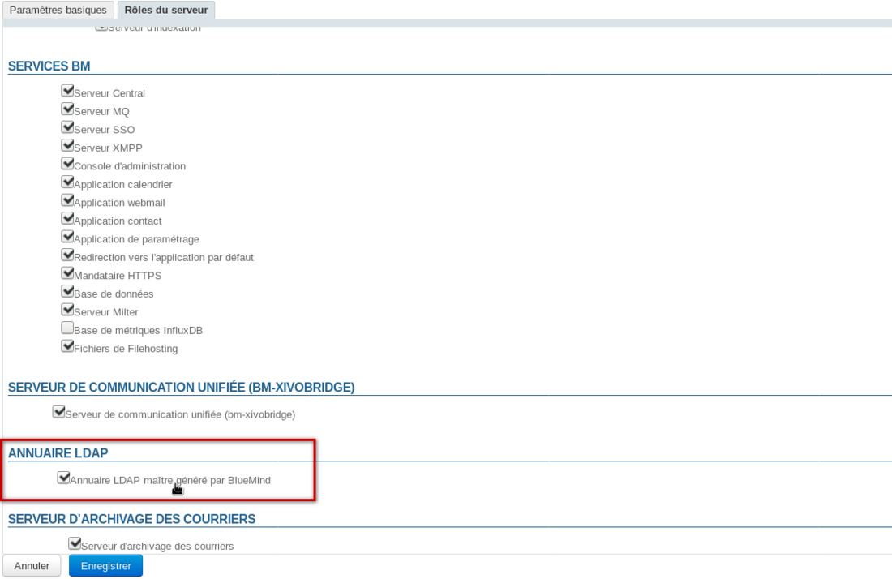
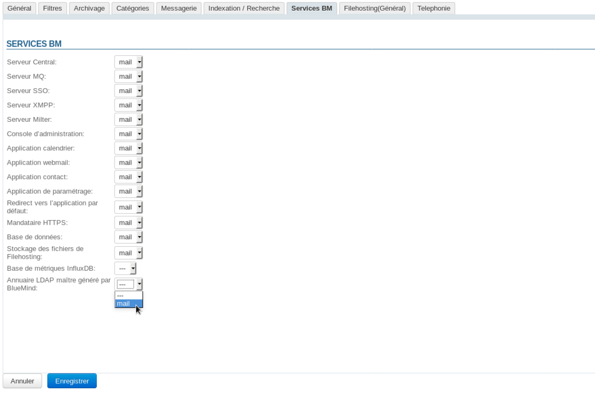

# Export LDAP


# Présentation

BlueMind permet d'exporter son annuaire au format LDAP afin d'être vu et consultable par d'autres applications comme un annuaire LDAP.


# Procédure

1 
installer les paquets nécessaires sur le serveur hébergeant BlueMind :


**
Ubuntu/Debian


**
RedHat/CentOS


**Ubuntu/Debian**

```
aptitude update
aptitude install bm-plugin-admin-console-ldap-export bm-plugin-core-ldap-export
```


**RedHat/CentOS**

```
yum update
yum install bm-plugin-admin-console-ldap-export bm-plugin-core-ldap-export
```


1 
Redémarrer BlueMind :


```
bmctl restart
```


1 
Sur le serveur sur lequel on souhaite faire tourner l'annuaire LDAP (cela peut-être le serveur BlueMind lui-même ou un serveur séparé), installer le paquet *bm-ldap-role* :


**
Ubuntu/Debian


**
RedHat/CentOS


**Ubuntu/Debian**

```
aptitude update
aptitude install bm-ldap-role
```


**RedHat/CentOS**

```
yum update
yum install bm-ldap-role
```


1 Attribuer le rôle au serveur. Pour cela :
  - connecté en tant que superadministrateur admin0, se rendre dans la console d'administration > Serveurs de l'application
  - s'il s'agit d'un serveur séparé et qu'il n'existe pas encore, l'ajouter au moyen du bouton Nouveau > Serveur 
  - sélectionner le serveur et se rendre dans l'onglet "Rôles du serveur"
  - dans la section "Annuaires", cocher «Annuaire LDAP maître généré par BlueMind»:
1 Valider en cliquant sur «Enregistrer»
1 Associer ensuite ce serveur au(x) domaine(s) souhaité(s).Pour cela, se rendre dans la partie Gestion du domaine > Domaines Supervisés et :
  - sélectionner le domaine à exporter au format LDAP
  - se rendre dans l'onglet "Services BM"
  - sélectionner le serveur pour le service de même libellé "Annuaire LDAP maître généré par BlueMind"  :
  - Valider en cliquant sur «Enregistrer»
Répéter l'opération pour chaque domaine souhaité.


 

Enregistrer

Enregistrer

Enregistrer

Enregistrer

