# Ressources


## Présentation

BlueMind permet de gérer, de même que les agendas individuels ou de groupes, les agendas de ressources (véhicules, salles, vidéo-projecteurs...).

L'administrateur peut définir de nouveaux types de ressources et déléguer la gestion des ressources à des utilisateurs.

Comme pour les agendas de personnes, la fonctionnalité disponible/occupé permet la recherche de disponibilités de ressources.


## Gestion des types de ressource

Dans la console d'administration, la page Annuaires > Gestion des entités > Types de ressources vous permet de visualiser et gérer les types de ressources disponibles.

 À partir de BlueMind 4.1, il est possible de définir des patrons de description d'événements. Lors de l'invitation d'une ressource de ce type à un événement, le patron sera automatiquement inséré dans la description de l'événement. Ces patrons peuvent contenir des variables et être définis dans plusieurs langues afin de s'adapter à la langue de l'organisateur de la réunion.

### Créer un nouveau type

Pour ajouter un type de ressource, cliquer sur le bouton «Nouveau» et remplir les informations :

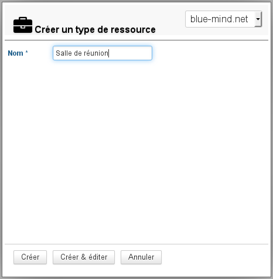

Cliquer ensuite sur «Créer» pour procéder à une création rapide ou sur «Créer et éditer» pour créer le type et accéder à plus d'options de personnalisation (voir rubrique "Éditer un type de ressource").

### Éditer un type de ressource

Pour éditer un type de ressource, cliquer sur la ligne correspondante dans la liste des types disponibles.

La page d'édition permet de modifier le libellé, ajouter une icône par défaut et modifier ou ajouter des propriétés personnalisées :

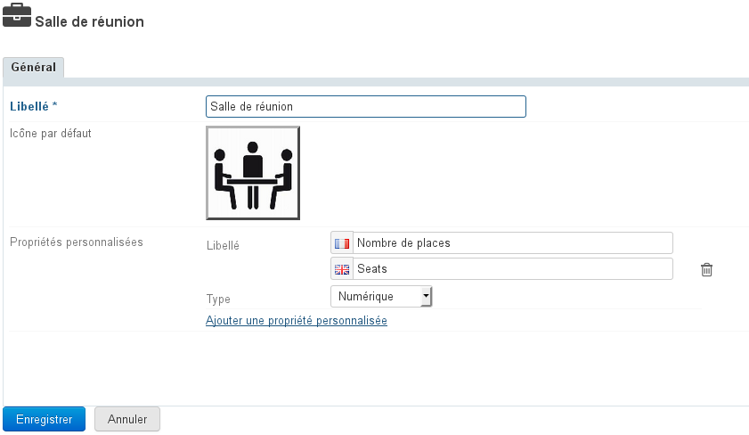

### Créer un patron de contenu

À partir de BlueMind 4.1 il est possible de définir un patron : ce texte sera automatiquement ajouté à la description d'une réunion lorsque la ressource y sera invitée.

Pour créer un patron :

- sélectionner la langue souhaitée
- remplir le champs de contenu
-  **Cliquer sur **   **  pour enregistrer les changements.** 


#### Patron multilingue

##### Ajout d'une langue

Pour créer d'autres langues :

- sélectionner la langue souhaitée dans la liste déroulante
- remplir le contenu de même qu'avec la première langue :
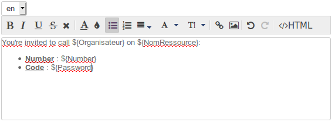


:::tip

Le contenu de la ou les précédentes langues est gardé en mémoire, vous pouvez basculer de l'une à l'autre et créer autant de patrons qu'il y a de langues disponibles dans l'interface.

:::

-  **Cliquer sur ** **  pour enregistrer les changements.** 


:::info

Lors de la création d'un événement, le contenu sera ajouté en fonction de la langue de l'organisateur.

:::

##### Suppression d'une langue

Pour supprimer le patron d'une langue :

- sélectionner la langue souhaitée dans la liste déroulante
- vider le champs de contenu (sélectionner le texte et le supprimer)
-  **Cliquer sur ** **  pour enregistrer les changements.** 


#### Utilisation de variables

Le patron peut contenir des variables, qui seront à renseigner dans la ressource de ce type puis remplacées automatiquement dans le patron par le système lors de la création de l'événement.

Comme indiqué dans l'aide en ligne au dessus du formulaire, 2 variables existent pour tous les types et toutes les ressources :

- ${NomRessource} : le nom de la ressource définie dans Entrée d'Annuaire (ne pas confondre avec le Libellé du type de ressource)
- ${Organisateur} : le nom de la personne créant l'évènement dans le Calendrier


D'autres variables peuvent être créées au moyen des * **Propriétés personnalisées** *.

Pour cela, cliquer sur le lien "Ajouter une propriété personnalisée" :

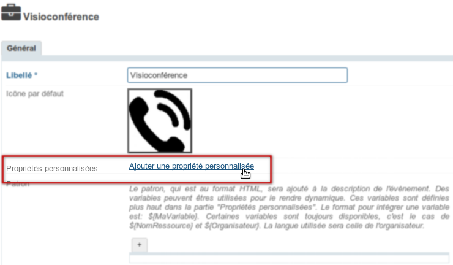

Remplir le libellé (en Français et en Anglais) et choisir le type de variable :

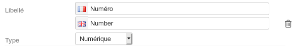

3 types de variables sont possibles :

- Numérique : contiendra obligatoirement un nombre
- Texte : contiendra une chaîne de caractère
- Case à cocher : dans ce contexte de patron de description d'événement, ce type n'a pas d'intérêt, nous déconseillons son utilisation


Pour insérer une variable dans la patron on utilisera ensuite la syntaxe `**${**libellé**}**`.

Soit par exemple le type de ressource ci-dessus en exemple : Visioconférence. Chaque ressource correspondra à un *pont de conférence* et aura donc 2 variables :

- Numéro : le numéro de téléphone
- Code confidentiel : le mot de passe permettant d'accéder au pont


On remplira comme patron :


```
-FR- <br/>
Vous êtes invité(e) à appeler ${Organisateur} sur ${NomRessource} au numéro suivant :
<ul>
<li>Numéro : ${Numéro}</li>
<li>Code confidentiel : ${Mot de passe}</li>
</ul>
```


Dans la fiche d'administration de la ressource, ces champs seront à remplir dans la section "Autre" :

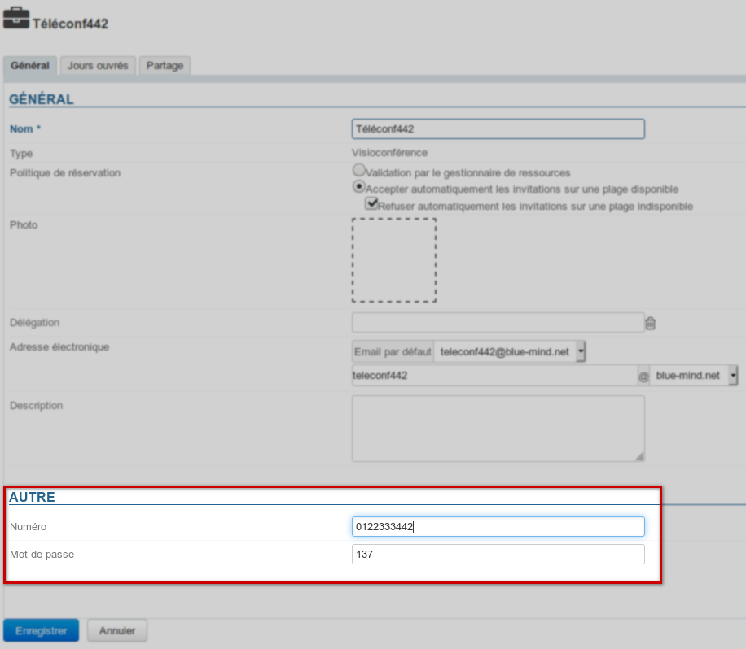

Enfin, lorsque cette ressource sera invitée à une réunion, la description de celle-ci sera complétée avec le patron et les valeurs de variables :

- dans l'événement d'agenda :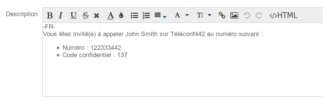
- dans l'email d'invitation, dans lequel la description est reprise :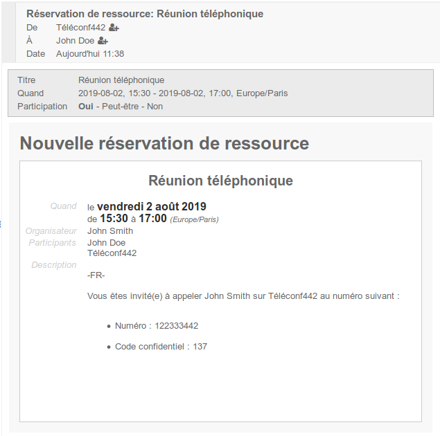


:::info

Patron multilingue

Dans le cas où plusieurs patrons sont paramétrés, correspondant à plusieurs langues, c'est le patron de la langue de l'organisateur qui est ajouté à la description de l'événement.

:::

## Gestion des ressources

### Créer une ressource

Depuis la page des entrées d'annuaires, cliquer sur le bouton «Nouveau» > «Ressource» et renseigner les informations concernant la ressource à créer :

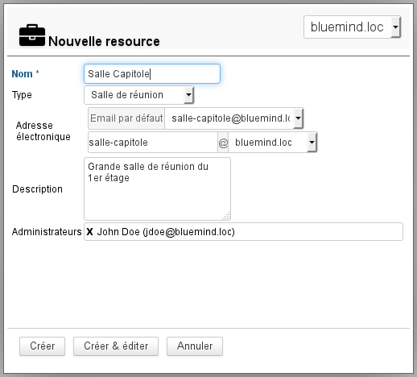

- Seuls le nom et l'adresse sont obligatoiresNB : l'adresse est automatiquement complétée lors de la saisie du nom, veuillez vous assurer avant de valider qu'elle ne contient pas de caractères spéciaux (majuscules, accents...)
- les administrateurs désignés ici se voient attribuer un droit de partage "Peut modifier mes rendez-vous et gérer mes partages".Celui-ci pourra être modifié par la suite et d'autres administrateurs pourront être désignés. Voir chapitre ci-après « [Partage d'une ressource](#Administrationdesressources-partage-ressource) »


Cliquer enfin sur «Créer» pour procéder à une création rapide ou sur «Créer et éditer» pour créer la ressource et accéder à sa fiche (voir chapitre ci-dessous « [Éditer une ressource](#Administrationdesressources-editer-ressource) »).

### Éditer une ressource

Pour éditer une ressource, cliquer sur la ligne correspondante dans la liste de ressources disponibles.

#### Général

##### Propriétés

La page d'édition permet de modifier les informations générales de la ressources (nom, photo, délégation, adresse de messagerie, description) :

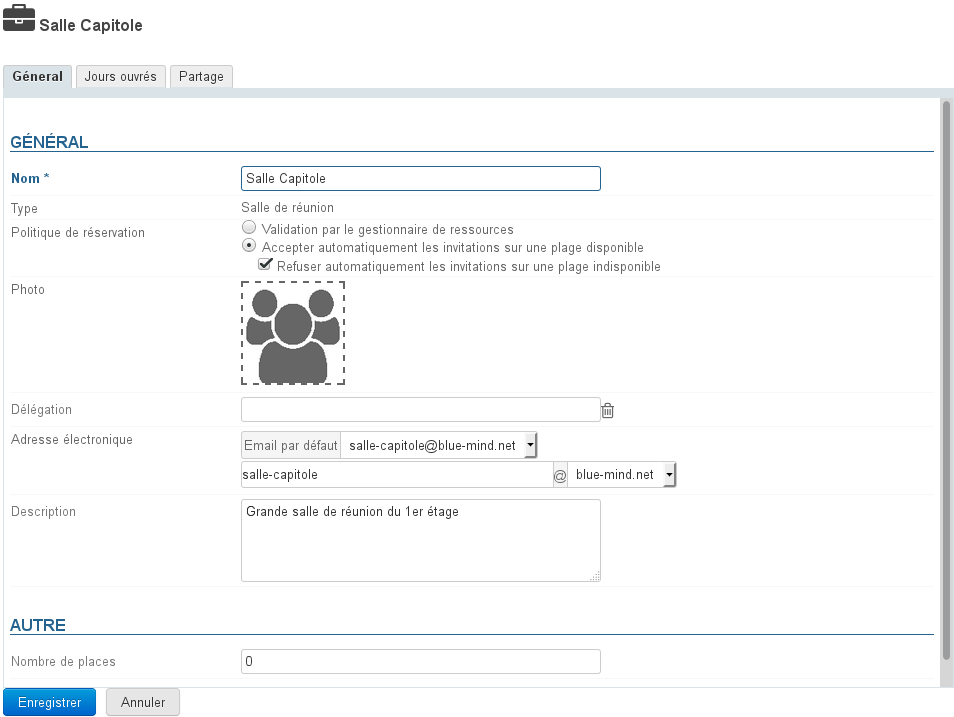


:::tip

Pour ajouter ou modifier la photo (avatar) de la ressource, cliquer dans le carré blanc ou sur la photo déjà en place.

:::

##### Politique de réservation

À partir de BlueMind 3.5.5, les administrateurs peuvent choisir de permettre ou d'empêcher les réservations multiples (*surbooking*) pour une ressource. Deux types de fonctionnement sont donc possibles :

- **Validation par le gestionnaire de ressources** : le statut de participation de la ressource reste en attente jusqu'à ce que le gestionnaire accepte ou refuse l'invitation.C'est l'ancien fonctionnement, qui reste actif pour les anciennes ressources et pour les ressources migrées depuis BlueMind 3.0 lors du changement de version.
- **Accepter automatiquement** : le gestionnaire de la ressource reçoit une demande mais la participation est automatiquement validée si la ressource est disponible sur le créneau demandé (plage horaire ouvrée et aucune autre réservation acceptée)**C'est désormais le fonctionnement par défaut lors de la création d'une nouvelle ressource.** 
    - **Refuser automatiquement** : le gestionnaire de la ressource reçoit une demande mais la participation est automatiquement refusée si la ressource n'est pas disponible sur le créneau demandé.**Le refus est indissociable de l'acceptation.** Cela permet d'accepter automatiquement les réservations sur un créneau disponible en laissant l'arbitrage au gestionnaire lorsque la ressource n'est pas disponible (organiser une réunion tardive, faire passer en priorité une 2ème demande plus importante, etc.)


:::info

La politique de réservation automatique ne peut s'appliquer qu'aux événements ponctuels : les événements récurrents restent soumis à la validation par un gestionnaire.

:::


:::tip

À noter que seuls les administrateurs ont accès à ce paramétrage, les gestionnaires de ressources restent des utilisateurs à qui l'on a donné le droit de modifier le calendrier de la ressource (accepter/refuser/modifier des rendez-vous).

:::

#### Horaires de disponibilités

Le nouvel onglet "Jours ouvrés" permet de définir des jours et horaires de disponibilités de la ressource, ainsi que la durée minimum pour laquelle elle peut être réservée (1h, 2h, demie-journée, journée) et son fuseau horaire :

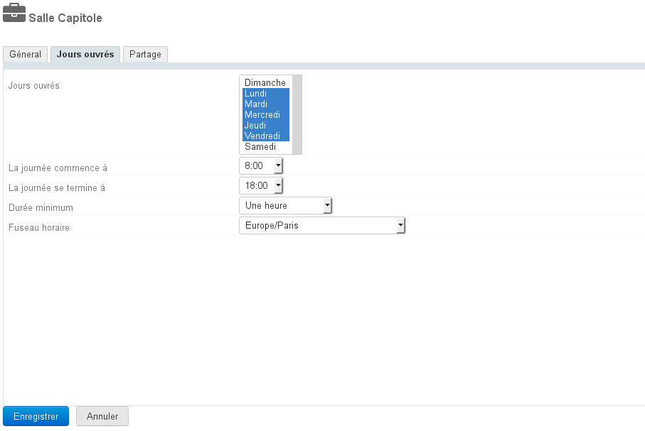


:::info

De même que pour inviter un utilisateur, ces informations permettront d'informer la personne souhaitant réserver la ressource mais n'empêcheront pas sa réservation en dehors des heures de disponibilités ou pour une durée plus courte.

:::

#### Partage d'une ressource

Par défaut, une ressource a pour partage public "Peut m'inviter à une réunion" : tous les utilisateurs du domaine peuvent ainsi effectuer une demande de réservation.

L'onglet « Partage » permet de modifier ce partage public et/ou donner des droits supplémentaires à des utilisateurs ou groupes (retirer ou désigner un nouvel administrateur par exemple, donner le droit de visualisation du calendrier à certains utilisateurs, etc.) :

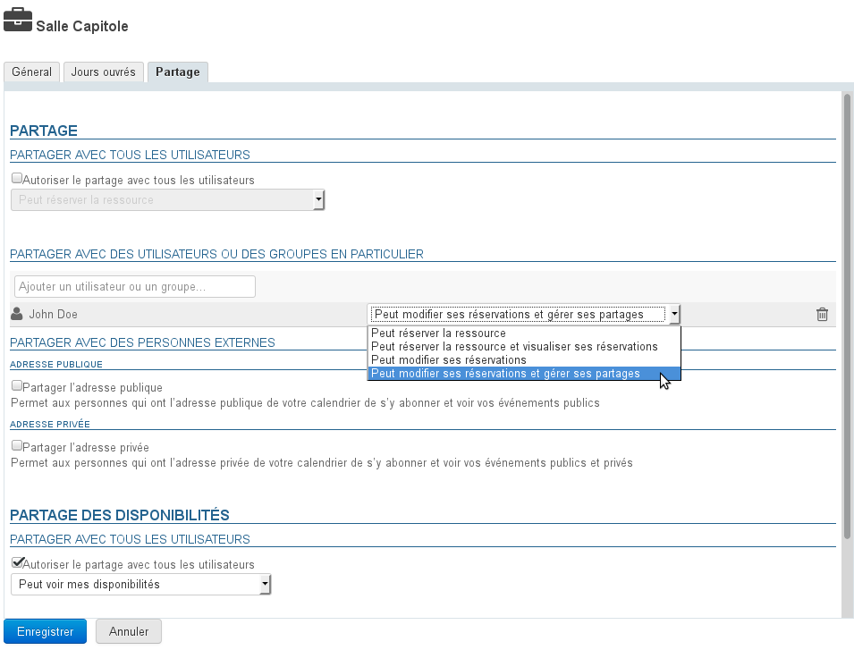

Les droits possibles sont :

- **Peut réserver la ressource** : l'utilisateur peut faire une demande de réservation en invitant la ressource
- **Peut réserver la ressource et visualiser ses réservations** : en plus du droit précédent, l'utilisateur peut voir le calendrier de la ressource et ainsi ses disponibilités
- **Peut modifier ses réservations** : l'utilisateur devient gestionnaire de la ressource, il reçoit les messages de demande de réservation, il peut accepter, refuser ou modifier les événements auxquels la ressource est invitée. Il peut aussi directement écrire dans le calendrier de la ressource afin d'y créer des rendez-vous.
- **Peut modifier ses réservations et gérer ses partages** : en plus du droit précédent, l'utilisateur accède à la gestion des partages de la ressource afin de modifier les droits


De même que pour les utilisateurs, cet onglet permet aussi de partager le calendrier avec l'extérieur et de gérer le partage des disponibilités.

Pour plus d'informations sur les partages voir la page dédiée : [Gestion des partages](/Guide_de_l_utilisateur/Gestion_des_partages/)

## Utilisation d'une ressource

Pour associer une ressource à un événement, il suffit lors de la création de l'événement de l'inviter en l'ajoutant à la liste des participants comme les autres utilisateurs.

Une fois l'événement créé avec envoi des invitations, les gestionnaires de la ressource (les utilisateurs ayant le droit de modifier les rendez-vous) peuvent accepter ou refuser la demande via leur agenda.

Pour en savoir plus sur l'utilisation des ressources, consulter la page dédiée du guide de l'utilisateur : [Les ressources](/Guide_de_l_utilisateur/Les_ressources/).


