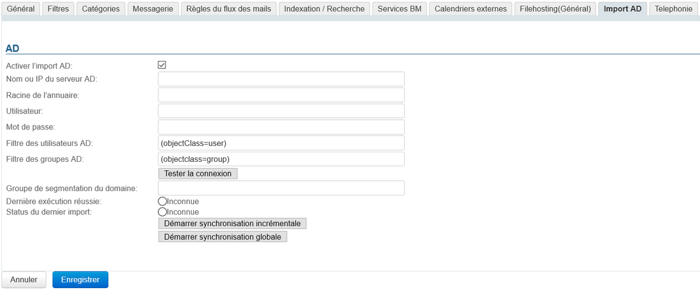
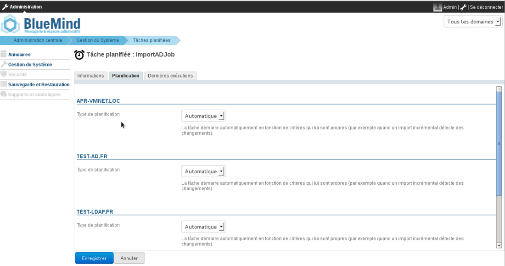
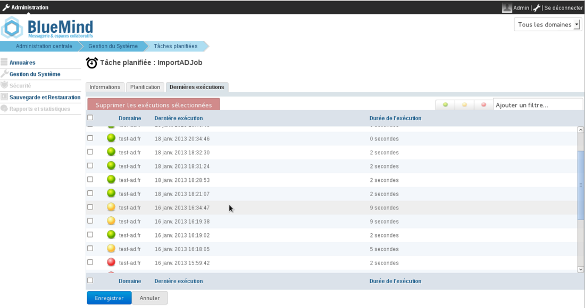

# Synchronisation Active Directory


## Présentation

La souscription professionnelle BlueMind permet d'accéder à des outils facilitant l'intégration de BlueMind dans le système d'informations.

Cette section décrit les fonctionnalités proposées par le module d'accès à un annuaire Active Directory.

** **Périmètre Active Directory** **

La console d'administration de BlueMind permet de créer et gérer des utilisateurs, groupes et autres entités directement dans BlueMind.

Cependant, dans un système d'informations, il existe souvent un annuaire centralisé, type LDAP ou Active Directory, sur lequel il est préférable de s'appuyer pour gérer de façon centralisée les utilisateurs et groupes. Dans ce cas, la gestion des utilisateurs peut être déléguée à un annuaire Active Directory et la création des comptes automatisée par synchronisation à intervalles réguliers.

La synchronisation Active Directory permet à Blue Mind :

- d'importer, à intervalles réguliers, sa base utilisateurs et groupes de l'annuaire, de façon transparente
- d'authentifier directement auprès de l'Active Directory les utilisateurs BlueMind.


Cet outil évite ainsi la gestion d'une base utilisateurs dans Blue Mind et les problèmes de multiplication de mots de passe. Le mot de passe est centralisé dans l'annuaire AD et n'est ni connu, ni importé par BlueMind.

** **Authentification sur l'Active Directory** **

Pour les utilisateurs importés depuis l'annuaire, l'authentification s'effectue auprès de cet annuaire, la base Blue Mind n'ayant pas les mots de passe de l'Active Directory.


## Principe de fonctionnement

BlueMind permet d'importer et d'utiliser les utilisateurs et les groupes depuis un système Active Directory.

L'import Active Directory est réalisé pour chaque domaine côté BlueMind de manière incrémentale.

Les mots de passe des utilisateurs importés sont validés directement auprès de l'Active Directory. BlueMind ne stocke aucun mot de passe.

Un nouvel utilisateur peut se connecter à un serveur BlueMind même s'il n'a pas encore été importé. Son compte BlueMind sera créé automatiquement si le processus d'authentification réussit.

Le provisioning (création ou modification) d'un utilisateur ou d'un groupe depuis l'Active Directory vers BlueMind a donc lieu :

- à de la configuration du serveur, lors de l'import initial
- régulièrement au cours d'une journée, via les tâches planifiées
- ou lorsqu'un utilisateur se connecte, automatiquement, à la volée.


## Installation

Afin d'accéder aux fonctionnalités de synchronisation avec un annuaire AD, il est nécessaire d'installer le plugin ad-import.

Pour cela, se connecter sur le serveur et taper la commande suivante pour lancer l'installation du plugin :
**Debian/Ubuntu**

```
sudo aptitude update
sudo aptitude install bm-plugin-admin-console-ad-import bm-plugin-core-ad-import
```

**RedHat/CentOS**

```
yum update
yum install bm-plugin-admin-console-ad-import bm-plugin-core-ad-import
```


Une fois l'installation terminée, redémarrer le composant *bm-core* à l'aide de la commande suivante :


```
bmctl restart
```


## Configuration

### Configuration de la connection Active Directory

- Se connecter sur le serveur BlueMind cible en tant qu'administrateur global admin0


- Se rendre dans Gestion du système > Domaines supervisés > choisir le domaine > onglet Import AD :




- Cocher la case "Activer l'import AD" (à partir de la version 4.3.0 de BlueMind)
- Remplir les informations demandées avec les paramètres Active Directory :

| Paramètres demandé | Valeur Active Directory |
| --- | --- |
| Nom d'utilisateur AD | Login utilisé pour effectuer des requêtes sur le serveur Active Directory
Il est possible d'utiliser n'importe quel compte utilisateur ayant les droits de parcours de l'arborescence Active Directory en mode lecture seule.
 | Un *mapping* (remplacement de caractères) est réalisé lors de l'import pour des raisons de compatibilité :
 | 
    - remplacement des lettre accentuées par la lettre non accentuée correspondante
    - passage en minuscule
    - remplacement des espaces par des '_'
 |
| Mot de passe de l'utilisateur AD | Mot de passe associé au compte renseigné dans le champ  | *AD user login* |
| Nom ou IP du serveur AD | Adresse IP ou FQDN du serveur Active Directory. Ce champ peut être vide s'il est possible de déterminer la localisation du serveur en utilisant l'enregistrement DNS de type SRV


```
\_ldap.\_tcp.dc.msdcs.domain
```

(cf. [cet article Technet](http://technet.microsoft.com/en-us/library/cc759550%28v=ws.10%29.aspx))
 |
| Racine de l'annuaire AD | Racine pour la recherche Active Directory. Si vide, les recherches sont effectuées en utilisant le DN racine. |  | Utilisé pour limiter la recherche à une sous-partie de l'arborescence Active Directory  |
| Filtre des utilisateurs AD | Filtre pour la recherche des entrées utilisateurs dans l'AD.
La [syntaxe](http://www.ietf.org/rfc/rfc2254.txt) des filtres LDAP peut être utilisée.
Par exemple pour afficher toutes les personnes ayant leur numéro de téléphone renseigné dans la base :
 | 

```
(&(objectclass=person)(telephoneNumber=\*))
```

 | *cf. [http://ldapbook.labs.libre-entreprise.org/book/html/ch03s02.html](http://ldapbook.labs.libre-entreprise.org/book/html/ch03s02.html) *
 | Ou encore tous les comptes qui ont le accountStatus "MAIL" et qui ne sont pas dans la branche MAILSHARE de l'annuaire :
 | 

```
(&(!(ou:dn:=MAILSHARE))(&(objectClass=posixAccount)(accountStatus=MAIL)))
```

 |
| Filtre des groupes AD | Filtre pour la recherche des entrées de type groupe dans l'AD.
La [syntaxe](http://www.ietf.org/rfc/rfc2254.txt) des filtres LDAP peut être utilisée.
Par exemple, pour n'afficher que les groupes des branches dont le dn contient cn=system ou cn=users :
 | 

```
(&(objectClass=group)(|(cn:dn:=System)(cn:dn:=Users)))
```

 | Ou encore les groupes ayant une description :
 | 

```
(&(objectCategory=group)(description=\*))
```

 | *cf. [https://social.technet.microsoft.com/wiki/contents/articles/5392.active-directory-ldap-syntax-filters.aspx#Examples](https://social.technet.microsoft.com/wiki/contents/articles/5392.active-directory-ldap-syntax-filters.aspx#Examples) *
 |
| Groupe de segmentation du domaine | Ce champ peut être vide.
 | Ce champ sera ignoré si la fonctionnalité de segmentation de domaine n'est pas configurée pour BlueMind.
 | Les mails destinés aux utilisateurs membres de ce groupe sont redirigés vers un autre serveur de messagerie du même domaine (configuré via la segmentation de domaine).
 |


### Configuration des rôles utilisateur

Lorsque BlueMind est configuré pour importer sa base utilisateur d'un Active Directory, BlueMind ne contrôle plus les règles de gestion des mots de passe. BlueMind ne peut pas écrire dans l'Active Directory et ne peut donc pas modifier le mot de passe Active Directory.

Pour cette raison, il est nécessaire d'enlever aux utilisateurs importés de l'Active Directory l'accès aux interfaces de modification de mot de passe (qui agit sur le mot de passe BlueMind uniquement).

Les interfaces de gestion des mots de passe sont accessibles via le rôle : Général → Modifier son mot de passe (voir  [Les rôles : droits d'accès et d'administration](/Guide_de_l_administrateur/Gestion_des_entités/Utilisateurs/Les_rôles_droits_d_accès_et_d_administration/))


:::info

Rôles et groupes

Sur un même domaine BlueMind, peuvent cohabiter des utilisateurs issus d'un Active Directory et des utilisateurs locaux à BlueMind. L'accès aux interfaces de modification de mot de passe doit donc dépendre du type d'utilisateur. Des groupes peuvent être utilisés pour attribuer des rôles différents à ses types d'utilisateurs différents.

Voir la documentation des [groupes et des rôles](/Guide_de_l_administrateur/Gestion_des_entités/Groupes/) (édition et administration d'un groupe → Rôles).

:::

Méthode de connexion

Le plugin BlueMind pour Active Directory n'impose aucune contrainte particulière ou aucun schéma particulier. Il suffit d'indiquer les informations suivantes :

- le nom d'hôte (ou l'adresse IP) du serveur Active Directory
- un couple "nom d'utilisateur" / "mot de passe" sur l'annuaire AD permettant d'opérer des connexions.


Par défaut, l'ensemble des utilisateurs et des groupes sont récupérés de l'Active Directory. Des filtres permettant d'interroger une partie de l'annuaire peuvent être configurés, en configurant les informations suivantes :

- la racine de l'annuaire
- les filtres à utiliser pour la synchronisation des utilisateurs et des groupes, permettant de restreindre les données importées.


Un dernier paramètre permet d'indiquer le groupe de segmentation du domaine.

L'outil permet de vérifier directement si l'annuaire est bien accessible et l'accès bien configuré.

## Fonctionnement de l'outil de synchronisation

### Comptes utilisateurs

Le plugin pour Active Directory fonctionne de 3 façons complémentaires :

- import global de l'ensemble des utilisateurs
- import incrémental
- import en temps réel à l'authentification


L'import global parcourt l'intégralité des utilisateurs et groupes de l'Active Directory (en tenant compte de la racine AD et des filtres) et les importe dans BlueMind. Ceux qui n'existent pas sont créés, ceux qui existaient déjà sont modifiés si nécessaire.

L'import incrémental fonctionne de la même façon, mais uniquement en parcourant les utilisateurs modifiés depuis le dernier import.

Enfin, l'import à l'authentification recherche l'utilisateur dans l'Active Directory lorsqu'il n'est pas connu dans BlueMind ; s'il le trouve, il l'importe et l'authentifie sur l'Active Directory pour lui donner accès immédiatement à BlueMind.

### État d'un compte

Les comptes importés d'un Active Directory respectant le filtre LDAP configuré sont automatiquement activés.

A l'inverse, ils peuvent être suspendus ou supprimés dans l'Active Directory afin que l'accès à la messagerie leur soit interdit. Un utilisateur supprimé dans l'Active Directory est simplement suspendu dans BlueMind.

### Synchronisation Active Directory planifiée

#### Import incrémental

A l'installation du plugin Active Directory, BlueMind crée une tâche planifiée dont le but sera de synchroniser à intervalles réguliers les bases utilisateurs et groupes auprès de l'Active Directory.

L'import incrémental ne traite que les données qui ont été créées, supprimées ou modifiées depuis le dernier import.

Comme indiqué la copie d'écran suivante, la tâche planifiée peut être :

- automatique : activée selon des critères propres aux imports déjà réalisés, à une fréquence maximale de 4h ;
- planifiée, selon un format de type cron, permettant ainsi n'importe quelle fréquence d'activation
- désactivée : dans ce cas, la tâche planifiée n'est pas exécutée.





Tâche planifiée de l'import Active Directory


#### Suivi des tâches planifiées

L'écran de suivi des [tâches planifiées](https://forge.bluemind.net/confluence/display/LATEST/Les+taches+planifiees) permet de vérifier la bonne exécution de celles-ci. La copie d'écran suivante montre ainsi les tâches de synchronisation réalisées, leur date d'exécution et le résultat de l'opération :



## Mapping Active Directory - BlueMind

### Attributs des utilisateurs


:::info

L'import AD BlueMind se base sur *member* et *memberOf* pour déterminer les appartenances et ne supporte donc pas la gestion du groupe primaire.

D'autre part, il semble [déconseillé](https://social.technet.microsoft.com/Forums/windows/en-US/c52d6e70-decd-46d4-9431-c4667256edad/what-is-a-primary-group-what-are-its-functoins) de modifier le groupe primaire des utilisateurs sauf pour un besoin particulier.

:::

| BlueMind | Attribut Active Directory | Note |
| --- | --- | --- |
| login | sAMAccountName | 


 |
| title* | personalTitle | Titre de civilité : Monsieur, Madame, Mademoiselle... |
| firstname | givenName | 


 |
| 
lastname
 | sn | 


 |
| jobtitle* | title | Titre professionnel : chef de service, DSI, etc. |
| description | description | 


 |
| mail | 
mail
 | 
otherMailbox
 | 
proxyAddresses
 | 
L'attribut Active Directory *mail * est défini comme adresse mail par défaut dans BlueMind.
Si ce champ est absent ou non renseigné, l'adresse BlueMind par défaut est définie par la première des valeurs trouvées dans les champs suivant (dans l'ordre) :

1. la première valeur du champ *otherMailbox *
2. la valeur du champ proxyAddresses :
    1. la première préfixée par "SMTP:"
    2. la première remontée parmi celles préfixées par "smtp:", si pas d'email préfixé par "SMTP:"
NB : seules les adresses préfixées par "SMTP:" ou "smtp:" sont prises en compte (syntaxe définie par [Microsoft](https://support.microsoft.com/en-us/help/3190357/how-the-proxyaddresses-attribute-is-populated-in-azure-ad))

 Si aucun de ces champs n'est renseigné alors l'utilisateur n'aura pas de messagerie dans BlueMind
 |
| street | streetAddress | 


 |
| zip | postalCode | 


 |
| town | l | 


 |
| country | co | 


 |
| state | st | 


 |
| Work phones | 
telephoneNumber
 | 
otherTelephone
 | 


 |
| Home phones | 
homePhone
 | 
otherHomePhone
 | 


 |
| Mobile phones | 
mobile
 | 
otherMobile
 | 


 |
| Fax | 
facsimileTelephoneNumber
 | 
otherFacsimileTelephoneNumber
 | 


 |
| Pager | 
pager
 | 
otherPager
 | 


 |
| memberOf | memberOf | Liste des groupes dont l'utilisateur est membre. L'utilisateur BlueMind n'est ajouté qu'aux groupes déjà importés |
| service | department | A partir de BlueMind v3.0 |
| photoID | thumbnailPhoto | Photo de l'utilisateur : le contenu de cet attribut est importé comme photo du compte correspondant |
| user.value.contactInfos.organizational.org.company | company | 


 |
| user.value.contactInfos.organizational.org.department | department | 


 |

### Attributs des groupes

| BlueMind | Attribut Active Directory | Note |
| --- | --- | --- |
| name | sAMAccountName | 


 |
| description | description | 


 |
| mail | mail | 


 |
| member | member | Seuls les groupes et utilisateurs synchronisés sont ajoutés aux membres du groupe BlueMind |

## Attribution des droits

À partir de BlueMind 3.5, [l'accès aux applications passe par la gestion des rôles](/Guide_de_l_administrateur/Gestion_des_entités/Utilisateurs/) qui sont attribués aux utilisateurs.

L'import AD ne gérant pas les rôles, les utilisateurs n'en ont donc aucun une fois qu'ils ont été importés et n'accèdent pas aux applications (webmail, contacts, calendrier).

La façon la plus simple et efficace de gérer cela est de passer par les groupes :

- dans l'AD, attribuer un groupe commun aux utilisateurs (ou plusieurs, si souhaité)
- lancer un 1er import : le(s) groupe(s) est importé dans BlueMind avec les utilisateurs
- se rendre dans l'administration et [affecter les rôles souhaités au groupe](/Guide_de_l_administrateur/Gestion_des_entités/Groupes/#Administrationdesgroupes-Gestiondesgroupes-Roles)


:::tip

Lors des imports et mises à jour suivants, les rôles seront conservés.

:::

Par la suite, pour les nouveaux utilisateurs, il suffira de les affecter à ce(s) groupe(s) afin de leur attribuer les rôles souhaités.

## Forcer ou corriger un UID

L'UID d'un utilisateur peut être renseigné ou corrigé dans la fiche d'administration de l'utilisateur dans BlueMind.

Pour cela, se rendre dans la console d'administration > Annuaires > Entrées d'annuaire > choisir la fiche de l'utilisateur > onglet Maintenance : renseigner le champ ExternalID avec l'UID de l'utilisateur dans l'AD puis enregistrer.


:::info

L'ExternalID doit être préfixé par "ad://".

Par exemple :


```
ad://5d6b50-399a6-1e6f2-d01267d1f-0fbecb
```


:::


