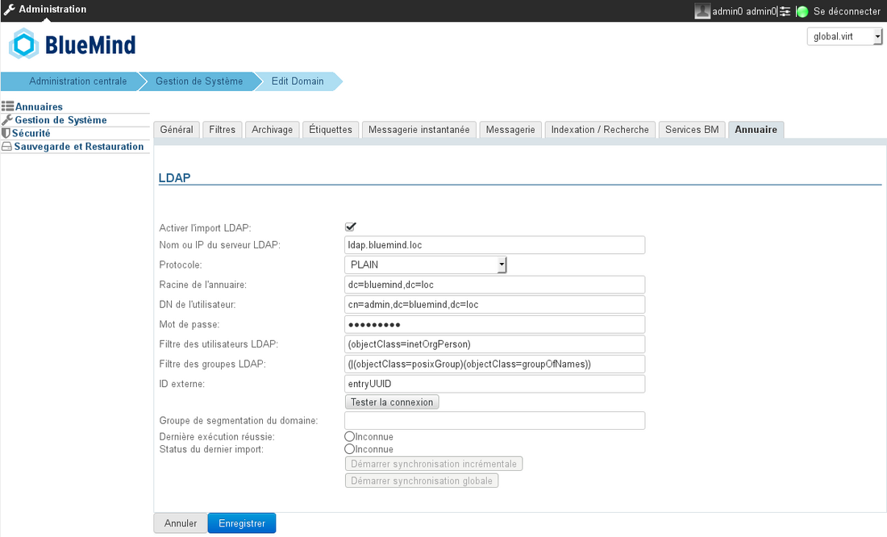
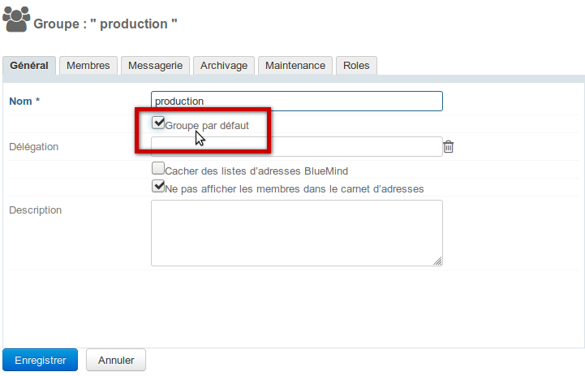

# Synchronisation LDAP


# Présentation

BlueMind permet d'importer les utilisateurs et groupes depuis un annuaire LDAP (par exemple OpenLDAP). L'import LDAP est incrémental (les nouvelles entrées sont ajoutées, les données modifiées sont prises en compte). L'import LDAP se configure et s'exécute par domaine.

Les mots de passe des utilisateurs importés sont alors validés auprès du serveur LDAP.

Un nouvel utilisateur peut se connecter à BlueMind même s'il n'a pas encore été importé. Son compte BlueMind sera créé à la volée si l'authentification aboutit.

Le peuplement des utilisateurs et groupes BlueMind à partir de l'annuaire  LDAP est donc fait :

- lors de l'installation et la configuration, lors de l'import initial,
- régulièrement de manière automatique via les tâches planifiées
- et lorsqu'un utilisateur se connecte, à la volée, lorsqu'il n'existe pas.

:::important

La synchronisation LDAP est conçue pour s'appuyer sur un schema d'annuaire de type InetOrgPerson.

:::


# Installation

Afin d'accéder aux fonctionnalités de synchronisation avec un annuaire ldap, il est nécessaire d'installer le plugin ldap-import.

Pour cela, se connecter sur le serveur et taper la commande suivante pour lancer l'installation du plugin :
**Debian/Ubuntu**

```
sudo aptitude update
sudo aptitude install bm-plugin-admin-console-ldap-import bm-plugin-core-ldap-import
```

**RedHat/CentOS**

```
yum update
yum install bm-plugin-admin-console-ldap-import bm-plugin-core-ldap-import
```


Une fois l'installation terminée, redémarrer le composant *bm-core* à l'aide de la commande suivante :


```
bmctl restart
```


# Configuration

Seul l'administrateur global peut configurer la synchronisation LDAP pour un domaine. Les administrateurs de domaine peuvent quant à eux voir les paramètres et lancer la tâche d'import.

- Se connecter en tant qu'administrateur global admin0@global.virt
- Aller dans le menu Gestion du système > Domaines supervisés et sélectionner le domaine à configurer
- Aller sur l'onglet "Annuaires"





   | Champ | Note |
| --- | --- |
| Nom ou IP du serveur LDAP | IP ou FQDN du serveur LDAP |
| Protocole | Choisir le protocole à utiliser:* PLAIN
* SSL
* SSL/accepter tous les certificats
* TLS
* TLS/accepter tous les certificats

Selon le choix, le port utilisé sera automatiquement :* PLAIN : 389
* SSL : 636
* TLS : 389
 |
| Racine de l'annuaire | Spécifier la racine LDAP |
| DN de l'utilisateur | DN de l'utilisateur root utilisé pour se connecter au serveur LDAP |
| Mot de passe | Mot de passe de l'utilisateur utilisé pour se connecter au serveur LDAP |
| Filtre des utilisateurs LDAP | Seuls les utilisateurs validés par ce filtre sont importés dans BlueMind |
| Filtre des groupes LDAP | Seuls les groupes validés par ce filtre sont importés dans BlueMind |
| ID externe | Attribut correspondant à un identifiant d'entrée LDAP invariant et unique. Utilisé pour faire le lien entre une entrée LDAP et une entrée BlueMind |
| Groupe de segmentation du domaine | Ce champ peut être vide.Ce champ sera ignoré si la fonctionnalité de segmentation de domaine n'est pas configurée pour BlueMind.Les mails destinés aux utilisateurs membres de ce groupe sont redirigés vers un autre serveur de messagerie du même domaine (configuré via la segmentation de domaine). |


# Mapping LDAP - BlueMind

## Attributs des utilisateurs


    | BlueMind | Attribut LDAP | Note |
| --- | --- | --- |
| login | uid | Un *mapping* (remplacement de caractères) est réalisé lors de l'import pour des raisons de compatibilité :* remplacement des lettre accentuées par la lettre non accentuée correspondante
* passage en minuscule
* remplacement des espaces par des '\_'
 |
| firstname | givenName |  |
| lastname | sn |  |
| description | description |  |
| mail | mailmailLocalAddressmailAlternateAddressgosaMailAlternateAddress | L'adresse mail par défaut de BlueMind est la première définie parmi les attributs LDAP *mail,* ou *mailLocalAddress* ou *mailAlternateAddress* ou *gosaMailAlternateAddress.*Les autres sont utilisées comme des adresses e-mail alias. Si aucun de ces champs n'est renseigné alors l'utilisateur n'aura pas de messagerie dans BlueMind |
| user mail quota | mailQuotaSizemailQuotagosaMailQuota | Doivent être exprimé en octets dans LDAP.Le premier de ces attributs LDAP trouvé est utilisé : mailQuotaSize > mailQuota > gosaMailQuota |
| work phones | telephoneNumber |  |
| home phones | homePhone |  |
| mobile phones | mobile |  |
| fax | facsimileTelephoneNumber |  |
| pager | pager |  |
| memberOf | memberOf | Liste des groupes dont l'utilisateur est membre. L'utilisateur BlueMind ne peut être ajouté qu'à des groupes LDAP déjà importés |
| photoID | jpegPhoto | Photo de l'utilisateur : le contenu de cet attribut est importé comme photo du compte correspondant |
| user.value.contactInfos.organizational.title | title |  |
| user.value.contactInfos.organizational.org.company | o |  |
| user.value.contactInfos.organizational.org.division | ou |  |
| user.value.contactInfos.organizational.org.department | departmentNumber |  |
| address.locality | l |  |
| address.postalCode | postalCode |  |
| address.countryName | st |  |
| address.streetAddress | postalAddress |  |
| address.postOfficeBox | postOfficeBox |  |


## Attributs des groupes


    | BlueMind | Attribut LDAP | Note |
| --- | --- | --- |
| name | cn |  |
| description | description |  |
| mail | mail |  |
| member | memberUid | Seuls les utilisateurs et groupes déjà importés dans BlueMind sont ajoutés aux membres du groupe |


# Attribution des droits

À partir de BlueMind 3.5, [l'accès aux applications passe par la gestion des rôles](/Guide_de_l_administrateur/Gestion_des_entités/Utilisateurs/) qui sont attribués aux utilisateurs. L'import LDAP ne gérant pas les rôles, les utilisateurs n'en ont donc aucun une fois qu'ils ont été importés et n'accèdent pas aux applications (webmail, contacts, calendrier).

La façon la plus simple et efficace de gérer cela est de passer par les groupes :

- dans le ldap, attribuer un groupe commun aux utilisateurs (ou plusieurs, si souhaité)
- lancer un 1er import : le(s) groupe(s) est importé dans BlueMind avec les utilisateurs
- se rendre dans l'administration et [affecter les rôles souhaités au groupe](/Guide_de_l_administrateur/Gestion_des_entités/Groupes/#Administrationdesgroupes-Gestiondesgroupes-Roles)

:::important

Lors des imports et mises à jour suivants, les rôles seront conservés.

:::

Par la suite, pour les nouveaux utilisateurs, il suffira de les affecter à ce(s) groupe(s) afin de leur attribuer les rôles souhaités.
:::important

Modification des rôles

Lors de sorties de nouvelles versions, BlueMind est régulièrement amené à apporter de nouveaux rôles au fur et à mesure de ses améliorations, notamment pour des fonctionnalités dont les utilisateurs bénéficiaient déjà.

Ainsi, par exemple, la version 3.5.9 de BlueMind permet à l'administrateur d'activer ou désactiver la possibilité pour ses utilisateurs de connecter Thunderbird via un nouveau rôle. Jusqu'à cette version tous les utilisateurs avaient cette possibilité là.

Afin de s'assurer que lors de la mise à jour le nouveau droit sera bien activé chez les utilisateurs déjà existant, il convient de désigner le ou les groupes dans lesquels on a placé les utilisateurs provenant du LDAP comme étant des groupes par défaut.

Pour cela, se rendre sur la fiche d'administration du groupe, cocher la case ad hoc et enregistrer la fiche :



:::

# Forcer ou corriger un UID

L'UID d'un utilisateur peut être renseigné ou corrigé dans la fiche d'administration de l'utilisateur dans BlueMind.

Pour cela, se rendre dans la console d'administration > Annuaires > Entrées d'annuaire > choisir la fiche de l'utilisateur > onglet Maintenance : renseigner le champ ExternalID avec l'UID de l'utilisateur dans le LDAP puis enregistrer.
:::important

L'ExternalID doit être préfixé de "ldap:"
Par exemple :


```
ldap://5d6b50-399a6-1e6f2-d01267d1f-0fbecb
```


:::


