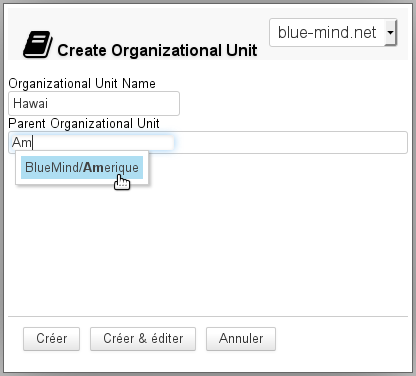
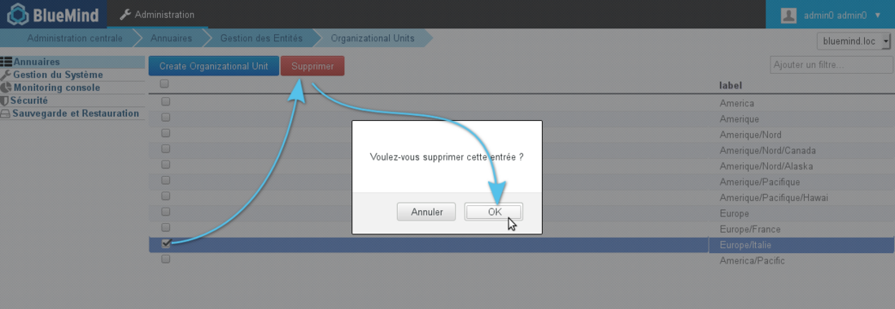
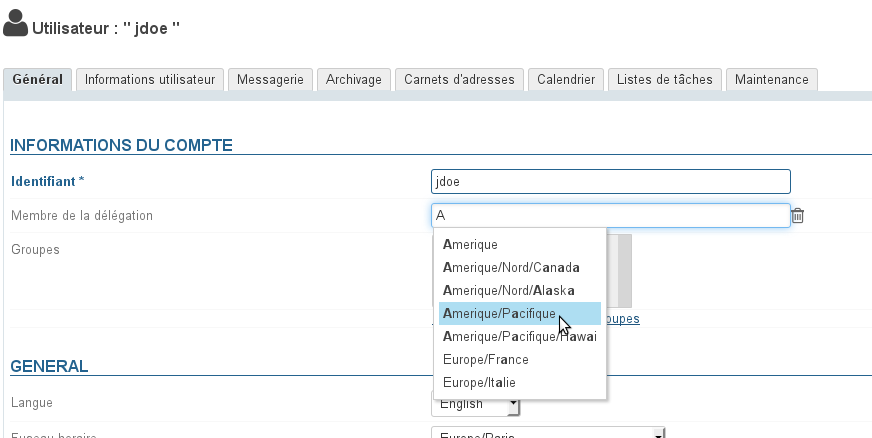
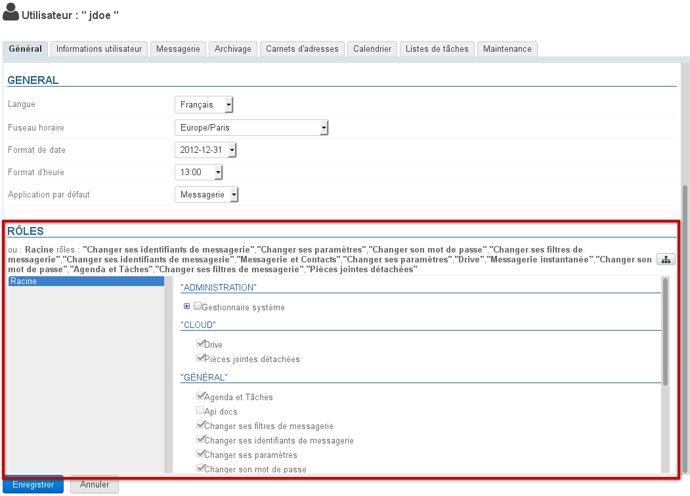
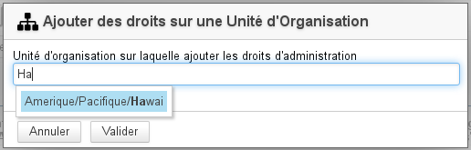
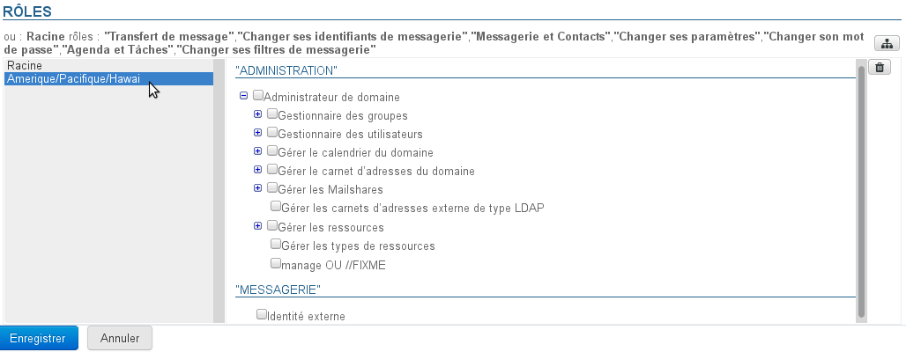
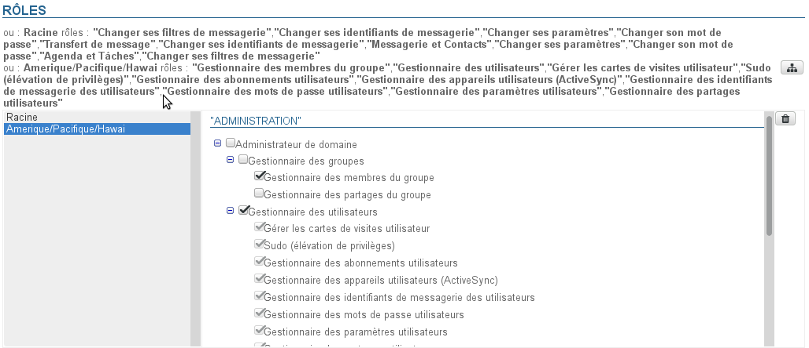
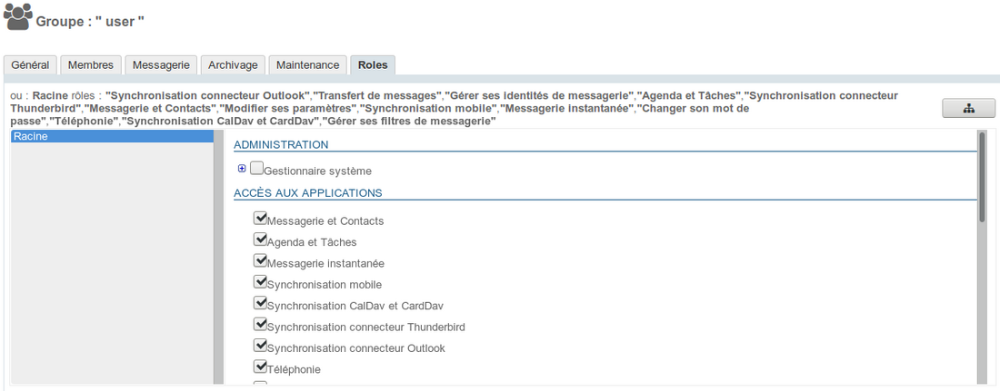

# L'administration déléguée

# Présentation

Dans le cas d'un BlueMind gérant une large population ou des utilisateurs répartis sur plusieurs sites, il peut être intéressant de définir des administrateurs qui auront droit de délégation sur un sous-ensemble de cette population.

Pour répondre à cette problématique, BlueMind intègre la fonctionnalité d'administration déléguée. Elle consiste à donner les droits d'administration partiels à des utilisateurs (qui deviennent alors administrateurs délégués). Ce droit d'administration déléguée peut être donné pour une cible d'utilisateurs définie selon le critère de délégation (type d'emploi, secteur d'activité, zone géographique...).

Ce droit peut par exemple être utilisé pour l'administration des membres d'agences régionales : l'administrateur principal du domaine désigne dans chaque agence un administrateur pour les utilisateurs de son agence. C'est alors lui qui pourra gérer pour ceux-ci les droits d'accès aux applications et fonctionnalités (telles que le détachement de pièces jointes par exemple), adapter les quotas de messagerie, remplir les informations de la fiche à destination de l'annuaire, effectuer les opérations de maintenance, etc.

# Les unités d'organisation

## Gestion des unités d'organisations

Il est possible de définir une arborescence de délégation et permettre ainsi différents niveaux d'administration déléguée.

Par exemple, il est possible de définir des délégations :

Par zones géographiques :

- Racine
  - Amérique
    - Amérique/Nord
      - Amérique/Nord/Canada
      - Amérique/Nord/Alaska
    - Amérique/Pacifique
      - Amérique/Pacifique/Hawaï

  - Europe
    - Europe/France
    - Europe/Italie
    - Europe/Royaume Uni
      - Europe/Royaume Uni/Angleterre
      - Europe/Royaume Uni/Écosse

Ou suivant la hiérarchie de l'entreprise :

- Racine
  - Informatique
    - Informatique/Technique
    - Informatique/Support
  - Administration
    - Administration/Responsables
    - Administration/Assistants
    - Administration/Commerce
      - Administration/Commerce/Vente
      - Administration/Commerce/Marketing
  - Production
    - Production/Management
    - Production/Technique

Dans ces deux exemples, des administrateurs et des populations cibles peuvent être définis pour chaque niveau de délégation.
:::important

Racine

L'unité « Racine » est mère de toutes les autres unités, il s'agit du domaine BlueMind, elle ne peut être supprimée et permet de donner des droits sur l'ensemble du domaine. Les utilisateurs sont tous par défaut membre de cette unité d'organisation.

De fait, l'unité Racine comporte des droits supplémentaires par rapport aux autres délégation, qui correspondent aux données ne pouvant être divisées et concernent le domaine dans son ensemble : configuration système, gestion des serveurs, applications attribuables aux utilisateurs, etc.
:::important

Accès à la console d'administration

La Racine comporte en particulier le droit « **Console d'administration** » qu'il convient d'activer pour un utilisateur dès lors que l'on souhaite lui donner des droits sur une unité d'organisation. **Cette activation n'est pas automatique.**

:::

:::

### Création

- Cliquer sur le bouton "Create Organizational Unit" afin d'accéder à la fenêtre de création d'une unité :
- Renseigner le nom de la future unité et, s'il y a lieu, un parent afin de créer une nouvelle branche de l'arborescence.
- Valider en cliquant sur le bouton « Créer »

### Suppression

Depuis la page de gestion des unités d'organisation :

- sélectionner la ou les unités souhaitées en cochant la case correspondante
- cliquer sur le bouton "Supprimer" en haut de liste
- valider la suppression

## Affecter une délégation à un membre

Par défaut, un utilisateur est toujours membre de l'unité d'organisation Racine. Pour qu'il soit membre d'une unité d'organisation fille, se rendre sur la fiche d'administration de l'utilisateur souhaité :

- 
dans l'onglet Général, renseigner le champ "Membre de la délégation" grâce à l'autocomplétion proposant les unités existantes :

- 
Enregistrer pour prendre en compte les modifications

:::important

Un utilisateur ne peut être membre que d'une seule délégation.

:::

# Déléguer les droits d'administration
:::important

Un administrateur ne peut affecter ou retirer que les rôles qu'il possède lui-même.

:::
:::important

Appartenance et administration

Un administrateur n'a pas besoin d'être membre d'une unité d'organisation pour l'administrer.

:::

## À un utilisateur

Pour affecter des droits d'administration à un utilisateur, se rendre dans l'onglet Général de la gestion de cet utilisateur. La gestion s'effectue alors dans la partie « Rôles » de l'onglet :

L'interface est distribuée comme suit :

- Partie haute : les droits affectés à l'utilisateur pour chaque unité d'organisation sont listés sous forme textuelle
- Partie gauche (fond gris) : la liste des unités d'organisation affectées.
- Partie droite : droits correspondant à l'unité actuellement sélectionnée dans la liste.Les droits grisés sont les droits hérités d'une unité parente ou d'un groupe, ils ne peuvent être supprimés pour cette unité seulement.

:::important

Quels sont les rôles et à quoi correspondent-il ?

 Pour plus d'information sur le détail des rôles disponibles, vous pouvez consulter la page dédiée : [Les rôles : droits d'accès et d'administration](/Guide_de_l_administrateur/Gestion_des_entités/Utilisateurs/Les_rôles_droits_d_accès_et_d_administration/)

:::

Pour ajouter des droits d'administration sur une unité d'organisation qui n'est pas encore présente :

1 Cliquer sur le bouton  à droite de la partie haute de la section et rechercher l'unité souhaitée grâce à l'autocomplétion :
1 sélectionner l'unité et valider
1 L'unité d'organisation est alors ajoutée à la liste des délégations :
1 Cochez les droits souhaités (ils s'ajoutent au fur et à mesure dans la partie haute) :
1 Si le rôle nécessite un accès à la console d'administration :
  2 cliquer sur Racine
  2 dans la partie droite, cocher le rôle "Console d'administration"
Pour plus d'information, [voir l'encadré en haut de page](#Ladministrationdeleguee-racine).1 
**Enregistrer pour prendre en compte les modifications**

## À un groupe

Pour affecter des droits à un groupe d'utilisateur, se rendre dans la fiche de gestion du groupe > onglet Roles :

La gestion des rôles s'effectue ensuite de la même façon que pour les utilisateurs - [voir le chapitre précédent](#Ladministrationdeleguee-delegation-role).

**Une fois les rôles définis sur la ou les délégations données, tous les utilisateurs membres du groupe en bénéficieront.**
:::important

Dans les fiches de gestion des utilisateurs, les rôles affectés via un groupe apparaissent ensuite cochés et grisés : il n'est pas possible de les décocher individuellement. Du moment qu'un utilisateur appartient à un groupe, il bénéficie obligatoirement de **tous** les rôles affectés à ce groupe.

:::
:::important

Quels sont les rôles et à quoi correspondent-il ?

 Pour plus d'information sur le détail des rôles disponibles, vous pouvez consulter la page dédiée : [Les rôles : droits d'accès et d'administration](/Guide_de_l_administrateur/Gestion_des_entités/Utilisateurs/Les_rôles_droits_d_accès_et_d_administration/)

:::

