# Utilisateurs


# Présentation

Les utilisateurs représentent les personnes physiques qui se connectent à Blue Mind. Ces utilisateurs ont accès aux différentes fonctionnalités de Blue Mind selon leur profil. 

Deux types d'utilisateur peuvent être créés dans Blue Mind, par l'attribution d'un profil à ces utilisateurs :

- user : accès aux modules Messagerie, Agenda, Contact et Paramètres utilisateur
- admin : accès du profil user ainsi qu'à la console d'administration.


Les rôles d'administration :

- **l'administrateur fonctionnel du domaine** (appelé généralement **administrateur de domaine**) est un utilisateur auquel a été donné le profil admin. Plusieurs utilisateurs peuvent avoir le rôle d'administrateur fonctionnel sur un même domaine.  L'administrateur fonctionnel gère les utilisateurs, groupes et ressources depuis la console d'administration de Blue Mind ainsi que le paramétrage du domaine et les objets partagés (boites, calendriers, carnets d'adresses). Il peut déléguer ses droits en créant d'autres administrateurs.
- **l'administrateur de la plate-forme ** (appelé également **administrateur global**) est unique pour une installation de Blue Mind. Il a pour identifiant admin0@global.virt et il est en charge de l'aspect technique de la plate-forme. Il n'a pas de compte utilisateur. Lorsqu'il se connecte à Blue Mind, il n'accède qu'à la console d'administration. Il s'occupe de l'installation et du paramétrage technique des domaines : adresses des serveurs, espaces disques, tâches planifiées particulières... Il a aussi accès aux mêmes fonctions de gestion que l'administrateur fonctionnel.


# Créer un utilisateur

Depuis la page d'accueil ou la page "Annuaires", cliquer sur "créer un utilisateur" et renseigner les informations du nouvel utilisateur dans la popup qui s'ouvre :

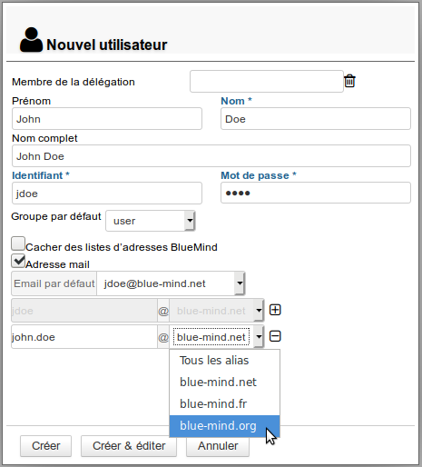
:::important

Le nom complet est renseigné automatiquement au cours de la frappe lors de la saisie des nom et prénom, il est généré automatiquement et ne peut être modifié.

:::
:::important

Seuls les champs suivis d'une étoile (Nom, Identifiant et Mot de passe) sont requis.

:::

Les comptes peuvent être créés avec ou sans adresse e-mail :

- Sans adresse mail, la partie "Messagerie" est désactivée et l'onglet "Messagerie" est inaccessible.
- En cochant "Adresse mail", le compte de messagerie est activé et une adresse par défaut non modifiable basée sur le login est automatiquement créée.Pour ajouter des alias, cliquer sur  en fin de ligne.
- Si l'installation comporte plusieurs alias de domaine, chaque adresse e-mail supplémentaire peut être déclarée sur un domaine particulier ou sur l'ensemble des alias.Il est possible dans BlueMind de créer autant d'alias que souhaité, sur autant d'alias de domaines que souhaité.


## Création rapide

Le bouton "Créer" permet une création rapide avec les informations saisies dans la popup et les options par défaut suivantes :

- localisation (fuseau horaire, format d'heure, etc.) du serveur
- serveur de stockage par défaut, sans quota d'espace disque
- pas de répondeur automatique ni de transfert des messages
- coordonnées vides
- le calendrier est partagé avec l'option "peut m'inviter à une réunion". Cela signifie que les autres utilisateurs du domaine ne peuvent pas consulter le calendrier de cet utilisateur mais peuvent tout de même l'inviter à un événement. 
- la boite mail n'est pas partagée
- l'archivage n'est pas activé


L'utilisateur pourra par la suite être modifié via l'interface d'administration.

## Création et édition

Le bouton "Créer et éditer" crée l'utilisateur avec les informations saisies dans la popup et les options par défaut puis redirige automatiquement vers l'interface d'édition de l'utilisateur.

# Éditer et administrer un utilisateur

Depuis la page d'accueil ou la page "Annuaires", se rendre sur la page "Entrées d'annuaires" et sélectionner dans la liste l'utilisateur souhaité.

Les informations sur les utilisateurs sont organisées par onglets, présentés ci-dessous :

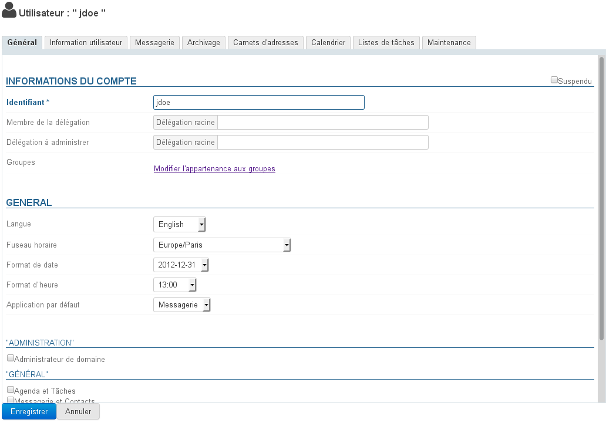

## Général

### Informations générales de l'utilisateur

L'onglet "Général" présente les informations principales de l'utilisateur : informations du compte, profil, groupe(s), mot de passe, paramétrage horaire...

Il permet en outre de définir l'utilisateur comme membre ou administrateur d'une [délégation](/Guide_de_l_administrateur/Gestion_des_entités/Utilisateurs/L_administration_déléguée/).
:::important

Appartenance aux groupes

En cliquant sur le lien «Modifier l'appartenance aux groupes», une popup permet de visualiser et modifier les groupes auxquels l'utilisateur appartient.

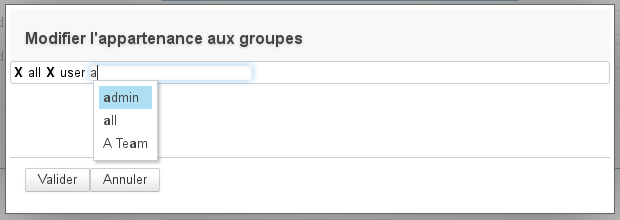

Pour supprimer un groupe, cliquez sur la croix correspondante ; pour en ajouter un placez-vous simplement dans le champs de saisie puis commencez à taper et valider un choix proposé par l'autocomplétion.

:::

### Les rôles : droits d'administration et d'accès aux fonctionnalités

Il est maintenant possible de gérer les droits accordés à un utilisateur ou à un administrateur de domaine. Il est ainsi possible d'autoriser de manière explicite la gestion :

- des utilisateurs
- des groupes
- des carnets d'adresses de domaine
- des calendriers de domaine
- des boites partagées
- des ressources
- du domaine (quota max, nombre d'utilisateur)
- ...


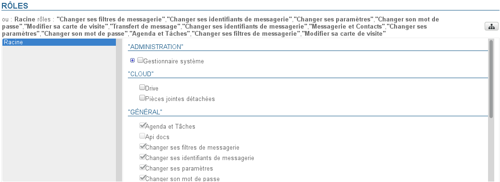
:::important

Droits de délégation

Un administrateur ne peut déléguer que les droits qu'il possède lui-même, exception faite de l'accès aux applications : même s'il n'a pas lui-même de messagerie ou d'accès à l'application Calendrier, par exemple, il peut activer "Messagerie et Contacts" ou "Agenda et Tâches" aux utilisateurs dont il a la gestion.

:::

La gestion des droits est organisée en plusieurs sections :

- **Administration** : permet de déléguer les droits d'administration sur les différentes entités
- **Cloud** : permet de donner l'accès aux fonctions de détachement et stockage des pièces jointes
- **Général** : permet de donner l'accès aux applications (webmail, agenda, etc.) et aux fonctionnalités principales (gestion des filtres personnels de messagerie, gestion de ses identités, transfert de messagerie, etc.)
- **Messagerie** : permet de donner accès aux fonctionnalités propres à la messagerie

:::important

Héritage des droits

Les droits affectés ne peuvent que **compléter** les droits hérités d'un groupe : les droits affectés à un groupe dont l'utilisateur fait partie ne peuvent pas être décochés dans la fiche de l'utilisateur.

Ainsi, des applications peuvent apparaître non cochées mais néanmoins accessibles à l'utilisateur : l'utilisateur appartient à un groupe dans lequel l'application est activée. Il convient donc dans ce cas de vérifier l'appartenance aux groupes de l'utilisateur (voir ci-dessus)

C'est aussi ce qui permet qu'un utilisateur nouvellement créé ait accès aux applications de base : lors de sa création un utilisateur appartient au groupe "user" qui, par défaut sur une installation vierge classique, possède les droits d'accès aux applications "Agenda et Tâches" et "Messagerie et Contacts".

:::

Pour plus de détails sur les rôles, vous pouvez consulter la page dédiée [Les rôles : droits d'accès et d'administration](/Guide_de_l_administrateur/Gestion_des_entités/Utilisateurs/Les_rôles_droits_d_accès_et_d_administration/) ainsi que la page dédiée à [L'administration déléguée.](/Guide_de_l_administrateur/Gestion_des_entités/Utilisateurs/L_administration_déléguée/)

## Information utilisateur

L'onglet "Information utilisateur" permet à l'administrateur d'enrichir la fiche contact d'un utilisateur.

L'administrateur peut saisir ici des informations telles que les numéros de téléphone et adresses postales ou affecter une photo qui sera réutilisée dans l'ensemble de l'application (dans [les contacts](/Guide_de_l_utilisateur/Les_contacts/) ou [le numéroteur](/Guide_de_l_utilisateur/La_téléphonie/) par exemple).

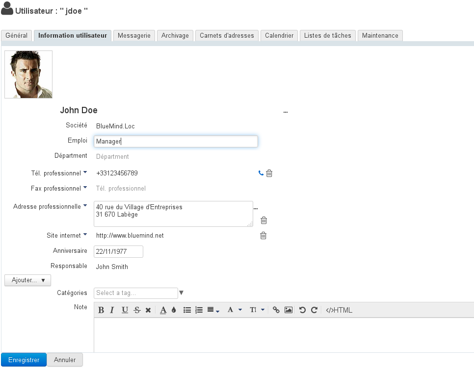

Les données de contact correspondent à l'annuaire interne de BlueMind et sont accessibles à l'ensemble des utilisateurs de la solution. Pour cette raison, **l'administrateur est le seul à pouvoir modifier ces informations.** L'utilisateur lui-même ne peut pas modifier ses propres informations.
:::important

Le rôle "Modifier ses informations" permet désormais à l'utilisateur de gérer les informations de sa fiche. Ces modifications ne peuvent à l'heure actuelle se faire que par script via la clef d'API de l'utilisateur, une interface de gestion via les paramètres sera prochainement disponible.

:::

## Messagerie

L'onglet "Messagerie" présente le paramétrage lié à la boite mail de l'utilisateur (espace, adresses, identités, partage, etc.) :

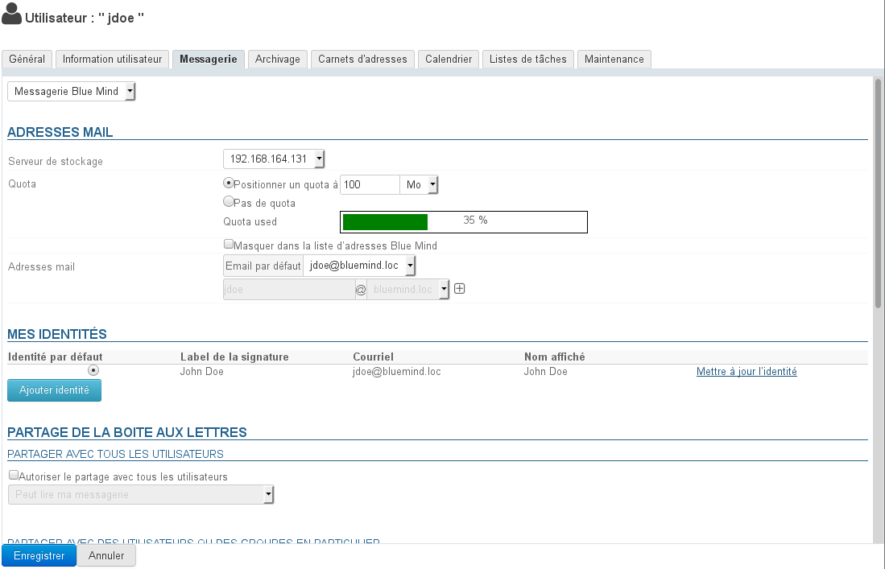

### Adresses mail

- **Serveur de stockage** : serveur par lequel cet utilisateur est géré
- 
**Quota d'espace disque** : taille maximale de stockage de la messagerie de l'utilisateur.
L'espace utilisé par l'utilisateur est désormais indiqué par la barre de progression « quota used » visible ci-dessus.
:::important

** **À propos des quotas** **

Lorsque le quota est activé, son pourcentage d'utilisation est affiché en permanence en bas du panneau de gauche de la messagerie webmail, le survol avec la souris permet d'afficher les informations détaillées :
 

Des codes couleurs permettent de visualiser le niveau du quota : le taux d'occupation est affiché en orange s'il atteint 75% du quota, en rouge foncé s'il atteint 85% et en rouge s'il atteint 100% :


Lorsqu'un quota est atteint, il bloque la réception de mails. Ces mails sont conservés par le serveur pendant quelques jours.
Les opérations d'envoi et même de suppression peuvent aussi être perturbées, le système ayant besoin d'effectuer des copies dans un répertoire temporaire et/ou dans la corbeille.
:::important

Quota et suppression

Pour supprimer des messages lorsque le quota est atteint, utilisez la fonction de suppression définitive (sans passer par la corbeille) en cliquant sur &lt;SHIFT+Suppr>.

:::

Un quota atteint peut être manuellement augmenté par l'administrateur, puis redescendu à tout moment vers le quota initial.

:::

- 
**Adresse mail principale** et alias : l'utilisateur peut posséder autant d'alias de messagerie que souhaité, sur l'un ou l'autre ou tous les alias de domaines disponibles.


### Mes identités

Les identités permettent à l'utilisateur d'écrire au nom d'un de ses alias ou boite partagée, ou encore de définir des signatures différentes qu'il choisira en fonction des messages qu'il écrira.

 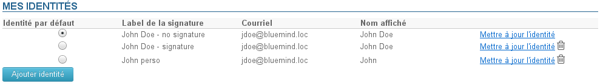 

Pour en savoir plus, consulter la page dédiée de la Documentation Utilisateur :  [Les identités](/Guide_de_l_utilisateur/La_messagerie/Les_identités/)

### Partage de la messagerie

La section de partage permet de définir un partage public (avec les membres de l'annuaire) ou personnalisé (avec certains utilisateurs ou groupes seulement) de la boite de messagerie de l'utilisateur.

Par défaut, lors de la création d'un utilisateur, aucun partage n'est activé.

Les droits de partage d'une boite de messagerie peuvent être définis :

- par un administrateur via l'interface décrite ici
- par un utilisateur, via l'application Paramètres : icône Paramètres > section Messagerie > onglet Gestion des partages.


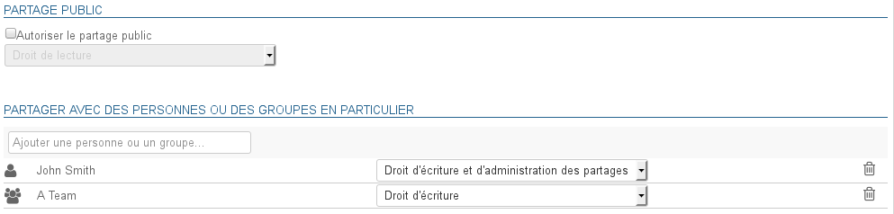

Pour en savoir plus sur le partage et les droits, consulter la page dédiée de la Documentation Utilisateur : [Préférences de messagerie | §5 - Gestion des partages](/Guide_de_l_utilisateur/La_messagerie/Préférences_de_messagerie/)

### Transfert automatique des messages

Depuis la version 3.0.31 de BlueMind, il est possible d'indiquer plusieurs adresses vers lesquelles transférer les messages.

:::important

L'autocomplétion recherche et propose les adresses dans tous les carnets de l'utilisateur (annuaire, carnets personnels, etc.)

:::

Il est possible de rajouter manuellement des adresses externes, qui ne seront pas ajoutées dans le carnet des adresses collectées lors des transferts.

### Répondeur automatique

Cette section permet d'activer ou désactiver le répondeur automatique de l'utilisateur.

Pour en savoir plus sur le paramétrage et les règles d'envoi, consulter la page dédiée de la Documentation Utilisateur : [Préférences de messagerie | §1 - Préférences générales](/Guide_de_l_utilisateur/La_messagerie/Préférences_de_messagerie/)

### Filtres de messages

Les filtres permettent d'appliquer des règles de tri et actions à effectuer automatiquement aux nouveaux messages entrant de l'utilisateur.


Pour en savoir plus sur le paramétrage et les règles d'envoi, consulter la page dédiée de la Documentation Utilisateur :   [Les filtres de messages](/Guide_de_l_utilisateur/La_messagerie/Les_filtres_de_messages/)

## Archivage

 L'archivage est désormais entièrement automatisé et géré de façon globale.

Voir la page dédiée [Archivage](/Guide_de_l_administrateur/Configuration/Archivage/)

## Carnets d'adresses

Cet onglet permet de gérer les abonnements de l'utilisateur aux carnets qui lui sont accessibles (ses carnets personnels ou des carnets qui lui sont partagés) ainsi que de gérer les partages de ses carnets avec d'autres utilisateurs ou groupes.

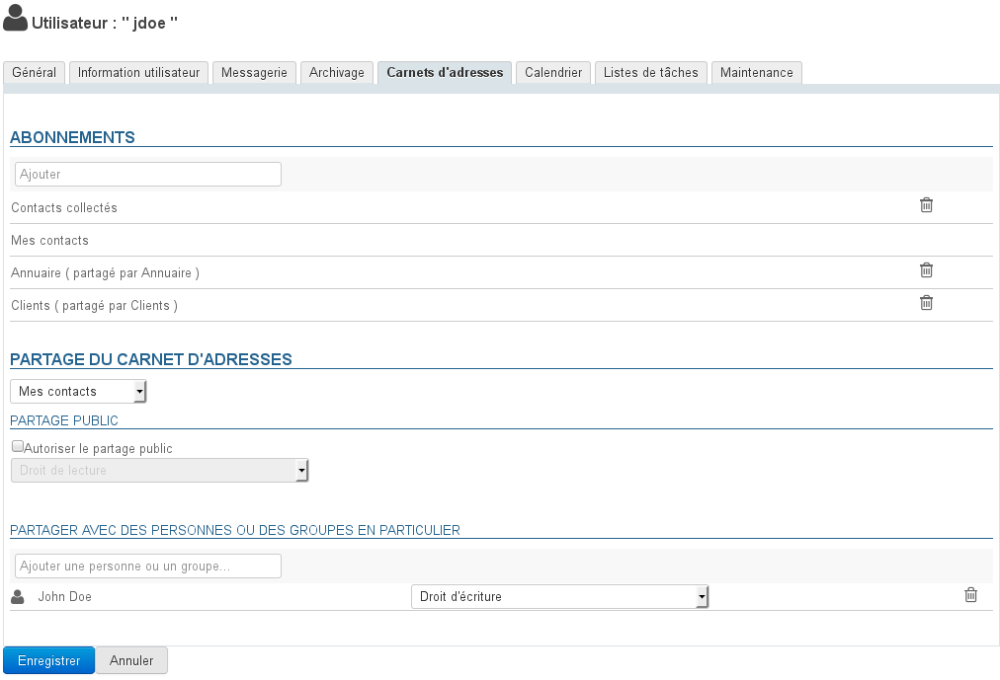

En revanche, il n'est pas possible pour l'administrateur de créer des carnets à l'utilisateur.

Pour en savoir plus, consulter la page dédiée de la Documentation Utilisateur [Préférences des contacts](/Guide_de_l_utilisateur/Les_contacts/Gestion_des_carnets_d_adresses/) ainsi que la page dédiée à la [Gestion des partages](/Guide_de_l_utilisateur/Gestion_des_partages/)

## Calendrier

L'onglet Calendrier permet d'accéder à tous les pramètres de réglage du calendrier de l'utilisateur (horaires, jours ouvrés, éléments affichés, etc.) ainsi qu'aux options de partage de son calendrier et d'abonnements aux calendriers (d'utilisateurs ou de domaines) qui lui sont partagés :

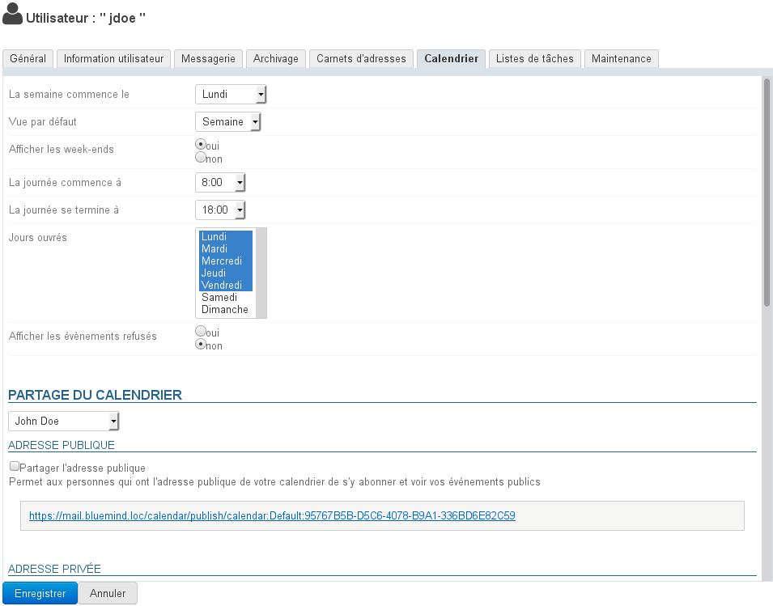
:::important

De même que pour les carnets d'adresses, l'administrateur ne peut créer de calendriers supplémentaires à l'utilisateur mais il peut en gérer les partages, tant avec les utilisateurs du domaine qu'avec les personnes extérieures à BlueMind :

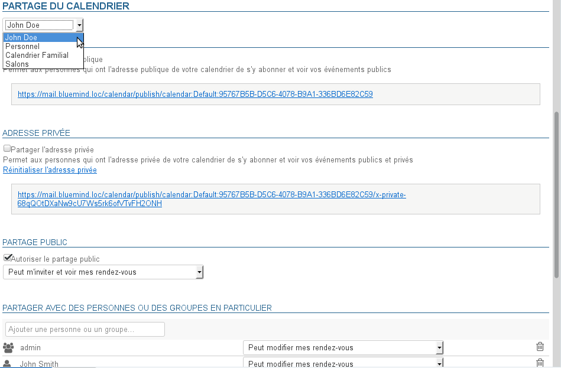

:::

## Listes de tâches

Cet onglet permet de gérer les partages des listes de tâches de l'utilisateur et ses abonnements aux listes qui lui sont partagées :

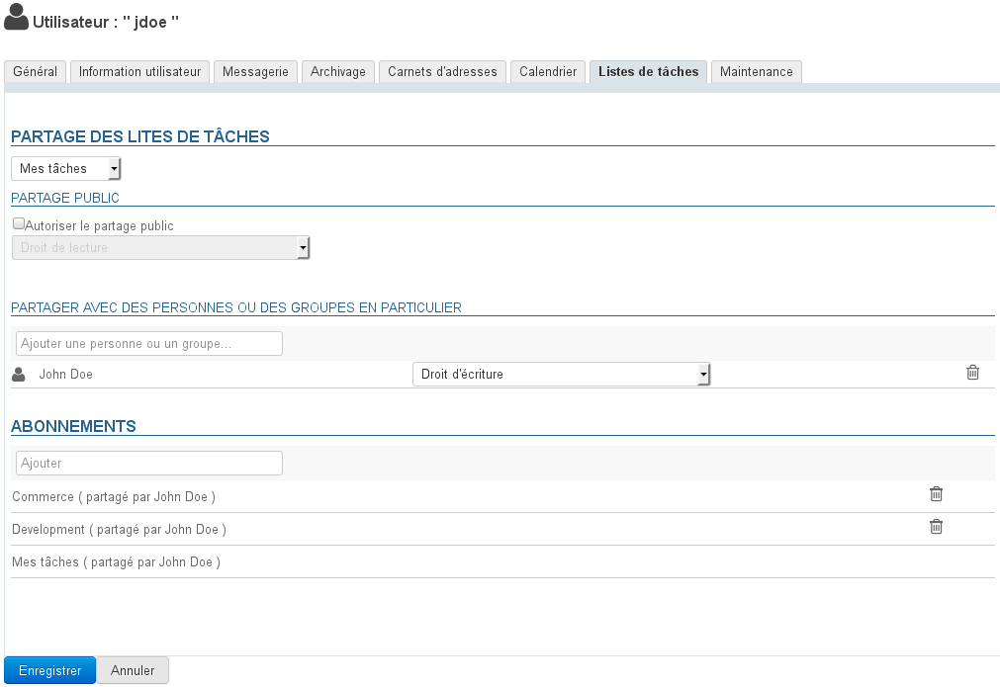

Pour en savoir plus, consulter la page dédiée de la Documentation Utilisateur [Les tâches](/Guide_de_l_utilisateur/Les_tâches/) ainsi que la page concernant la [Gestion des partages](/Guide_de_l_utilisateur/Gestion_des_partages/)

## Maintenance

Cet onglet donne accès à l'administrateur aux fonctions de maintenance et de préférences de l'utilisateur :

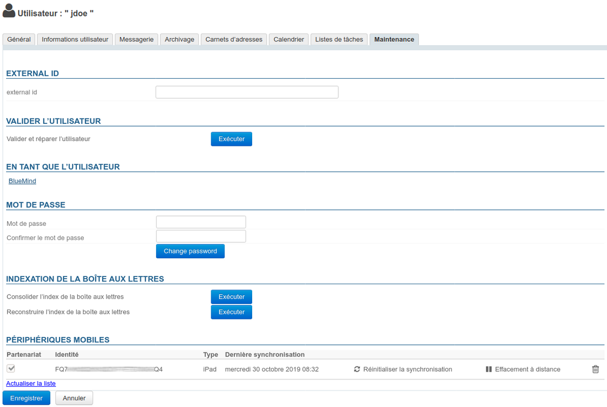

### External ID

Le champ situé dans cette section est renseigné dans le cas où l'utilisateur est synchronisé avec un compte [AD](/Guide_de_l_administrateur/Gestion_des_entités/Synchronisation_Active_Directory/) ou [LDAP](/Guide_de_l_administrateur/Gestion_des_entités/Synchronisation_LDAP/). Ce champ peut être renseigné ou modifié afin de forcer ou corriger l'UID de l'utilisateur correspondant dans l'annuaire AD ou LDAP.

### Valider l'utilisateur

Le bouton "Exécuter" de cette section permet de lancer une opération "Valider et réparer" sur le compte de l'utilisateur. Cela regroupe un ensemble d'opérations qui vérifient et corrigent si besoin l'intégrité de l'utilisateur et de ses données dans le système BlueMind : vérification de la boîte dans Cyrus, des containers d'agenda et carnets d'adresses, de la hiérarchie de dossiers IMAP, des abonnements, filtres de messagerie, etc.

Cette opération correspond à la commande [bm-cli](/Guide_de_l_administrateur/Administration_avancée/Client_CLI_pour_l_administration/) :


```
bm-cli maintenance repair user@domain.net
```


### En tant que l'utilisateur

Le lien de cette section est accessible par le superadministrateur admin0 ou un autre administrateur ayant [le rôle "Sudo (élévation de privilèges)"](/Guide_de_l_administrateur/Gestion_des_entités/Utilisateurs/Les_rôles_droits_d_accès_et_d_administration/). Le lien permet d'accéder au BlueMind de l'utilisateur, c'est-à-dire de se connecter à BlueMind à sa place, sans que celui-ci n'ait à donner son mot de passe.

### Mot de passe

L'administrateur peut dans cette section modifier/réinitialiser le mot de passe de connexion à BlueMind de l'utilisateur sans besoin de connaître son ancien mot de passe.

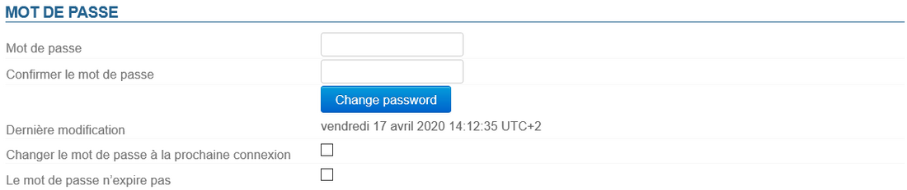

A partir de la version 4.3, une politique de gestion plus fine et d'expiration des mots de passe est mise en place.

Ainsi figure dans cette section la date de dernière modification (par l'utilisateur ou un administrateur) de mot de passe s'il y a lieu.
:::important

Cette information n'est pas rétroactive : les dates antérieures à la mise à jour du serveur en 4.3 n'apparaissent pas.

Pour les utilisateurs créés après le passage en 4.3 la date de modification peut correspondre à la date de création de l'utilisateur.

:::

L'administrateur dispose aussi de 2 options :

- **Changer le mot de passe à la prochaine connexion** : l'utilisateur se verra contraint de modifier son mot de passe la prochaine fois qu'il se connectera
- **Le mot de passe n'expire pas** : cette option permet d'exclure l'utilisateur de la politique d'[expiration des mots de passe du domaine](/Guide_de_l_administrateur/Configuration/Gestion_des_domaines/) si elle a été mise en place.


Pour activer une de ces options, cocher la case correspondante et cliquer sur le bouton "Enregistrer" en bas de page.
:::important

Connexion avec un AD ou LDAP

L'expiration ne peut pas être appliquée aux utilisateurs importés d'un annuaire AD ou LDAP.

:::

### Indexation de la boite aux lettres

Cette section permet de lancer l'opération de consolidation de l'index de la boite aux lettres de l'utilisateur : cette opération complète l'indexation actuelle de la boîte en indexant les éléments manquants uniquement


Pour lancer l'opération cliquer sur le bouton "**Exécuter**" en face de "**Consolider l'index de la boîte aux lettres**".

### Périphériques mobiles

Cette section permet de gérer les périphérique mobiles de l'utilisateur : autorisations, appareils synchronisés, réinitialisation, effacement de mobile.

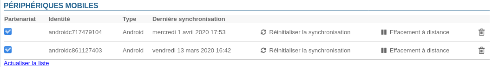

- **Partenariat** : cette case à cocher permet de suspendre et activer la synchronisation d'un périphérique sans avoir à le supprimer complètement
- **Identité** : indique le numéro de série sous lequel l'appareil s'est présenté
- **Type** : marque/OS de l'appareil
- **Dernière synchronisation** : date et heure de la dernière synchronisation de l'appareil avec le serveur
- **Réinitialiser la synchronisation** : réinitialise les informations de synchronisation de l'appareil. La prochaine synchronisation se fera de la même façon qu'un synchronisation initiale, l'appareil fera une synchronisation complète comme s'il n'avait jamais été connu du serveur.
- **Effacement à distance** : supprime toutes les données présentes sur le téléphone, qu'elles soient liées au compte BlueMind ou d'ordre privé (photos, SMS, ....).  **Cette opération est irréversible.**  *Voir paragraphe 4 de la page [Configuration du serveur EAS](/Guide_de_l_administrateur/BlueMind_et_mobilité/Configuration_du_serveur_EAS/) *
- **Icône poubelle** : permet de supprimer la synchronisation avec un périphérique.La suppression d'un smartphone de la liste a pour effet, lorsque les smartphones inconnus ne sont pas autorisés par défaut, de bloquer la synchronisation de ce smartphone sur BlueMind. L'option "Autoriser les périphériques inconnus" est un paramètre lié à une instance de BlueMind. Elle se modifie en tant qu'admin0, dans la section Gestion du Système > Configuration du Système > Serveur EAS.*Voir la page [Configuration du serveur EAS](/Guide_de_l_administrateur/BlueMind_et_mobilité/Configuration_du_serveur_EAS/) *


# Supprimer un utilisateur

## Suspendre

Un utilisateur peut-être suspendu. Cela permet d'interdire son accès et son utilisateur mais sans supprimer ses données. Il peut donc être réactivé par la suite, il retrouvera ainsi son compte tel qu'il était auparavant.

Pour suspendre un utilisateur :

- se rendre dans la gestion de l'utilisateur concerné : Annuaires > Entrées d'annuaires > choisir l'utilisateur.
- sur le premier onglet ("Général") cocher la case "Suspendu" à droite de la page puis cliquer sur "Enregistrer" pour prendre en compte la modification


## Supprimer

Pour supprimer totalement et définitivement un ou plusieurs utilisateurs du système, se rendre sur la page Annuaires > Entrées d'annuaires.

Dans la liste des utilisateurs, cocher la case au début de la ligne correspondant à l'utilisateur ou aux utilisateurs à supprimer puis cliquer sur le bouton "Supprimer". Une confirmation de suppression est demandée,  **une fois la confirmation donnée, les utilisateurs et l'ensemble de leurs données seront définitivement supprimés** .
:::important

Restauration d'un utilisateur

La restauration d'un utilisateur est possible dans BlueMind par la remontée d'une précédente sauvegarde. Voir la fonctionnalité de restauration d'une sauvegarde, qui permet de restaurer toutes les données d'un utilisateur ou une partie d'entre elles. Les données modifiées depuis la dernière sauvegarde ne sont donc pas récupérables.

:::

Voir aussi [Procédure de départ utilisateur et redirection de ses mails](/Guide_de_l_administrateur/Gestion_des_entités/Utilisateurs/Procédure_de_départ_utilisateur_et_redirection_de_ses_mails/)

# Sécurité du mot de passe

Afin de mettre en place une sécurité accrue dans les mots de passe des utilisateurs, vous pouvez installer le plugin «Password SizeStrength» afin de définir des règles strictes de validité pour un mot de passe.

## Installation

Le plugin s'installe simplement par l'installation de 2 paquets en ligne de commande, connecté en root sur le serveur :


```
aptitude install bm-plugin-core-password-sizestrength bm-plugin-admin-console-password-sizestrength
```


L'installation nécessite un redémarrage de BlueMind :


```
bmctl restart
```


## Configuration

A partir de la version 4.3, la configuration se fait dans la console d'administration > Configuration Système > onglet Mot de passe :


La prise en compte des modifications est immédiate et ne nécessite pas de redémarrage.
:::important

Les modifications ne sont pas rétroactives et ne concernent que les futurs changements de mot de passe : il ne sera pas demandé aux utilisateurs dont le mot de passe actuel ne respecte pas les règles de modifier celui-ci, il restera fonctionnel.

:::

#### Versions antérieures à 4.3

Dans les versions précédentes, le plugin se paramètre via le fichier `/etc/bm/password.ini` contenant à l'installation les valeurs par défaut ci-dessous :


```
length=10
capital=1
digit=1
lower=1
special=1
```


- `length` : nombre minimum de caractères que le mot de passe doit contenir
- `capital` : nombre minimal de lettres majuscules
- `digit` : nombre minimal de chiffres
- `lower` : nombre minimal de lettres minuscules
- 
`special` : nombre minimal de caractères spéciaux. Sont compris les caractères suivants :


```
!"#$%&'()*+,-./:;<=>?@[\]^\_`{|}~
```


:::important

Les administrateurs (administrateur global admin0 ou administrateurs de domaines) ne sont pas soumis à ces règles, ils restent libres dans le choix de leur mot de passe.

:::

Si les règles ne sont pas respectées lorsqu'un utilisateur essaie de modifier son mot de passe, une alerte s'affiche en haut de sa page :

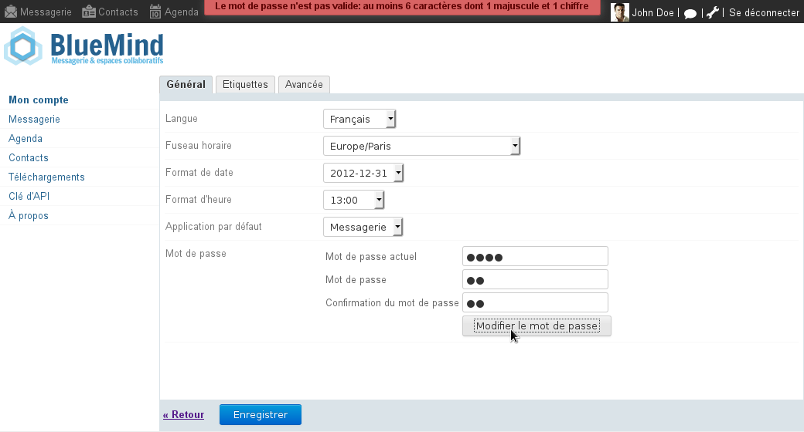


