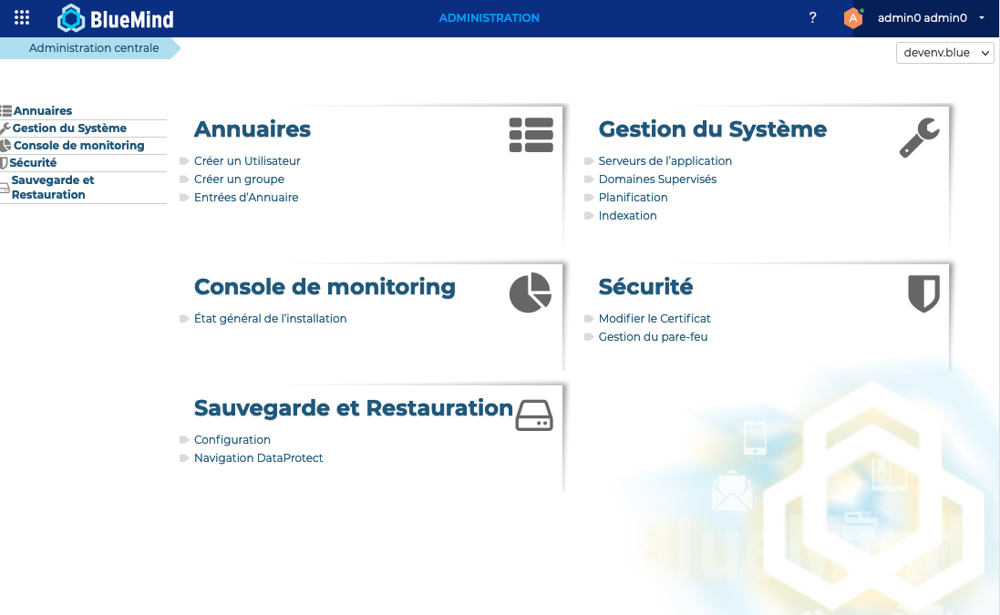

# La console d'administration

La console d'administration permet à l'administrateur global et aux administrateurs de domaines d'accéder aux fonctions de la configuration du système et de la gestion des serveurs, domaines, tâches planifiées et de la documentation.

La configuration d'un serveur BlueMind comprend des opérations propres à la plate-forme, qui touche à l'ensemble des domaines d'un serveur BlueMind et des opérations spécifiques à un domaine.

Dans la suite de cette documentation, seront utilisés les termes :

- d'administrateur de la plate-forme (ou super-utilisateur) pour les opérations qui touchent à l'ensemble de la plate-forme ; l'identifiant correspondant est *admin0@global.virt*.
- d'administrateur de domaine pour les opérations propres à un domaine.

Un administrateur de la plate-forme a le droit de réaliser l'ensemble des opérations des administrateurs de domaine.

:::info

URL externe globale et par domaine

L'adresse à laquelle accéder au serveur BlueMind est appelé url externe (ou external_url). A partir de la version 4.7, cette url externe peut être définie individuellement pour chaque domaine et aussi au niveau globalement au niveau du serveur (il s'agit alors de l'adresse par défaut des domaines, en l'absence de configuration spécifique).

Cette configuration est décrite dans la section [Configuration des url externes](./Configurer_le_systeme_et_les_serveurs/Configuration_des_url_externes.md)
 

 

 

